# CacheBlend 深度技术解析：RAG 场景下的快速 KV 缓存融合

---

title: "CacheBlend 深度技术解析：RAG 场景下的快速 KV 缓存融合"
date: 2025-03-05
draft: false
tags: ["RAG", "LLM", "vLLM", "infer","推理加速"]
categories: ["AI Infra"]
description: "RAG 场景下的快速 KV 缓存融合，加速推理"

---

> **论文**: CacheBlend: Fast Large Language Model Serving for RAG with Cached Knowledge Fusion
> **会议**: EuroSys '25, March 30–April 3, 2025, Rotterdam, Netherlands
> **代码**: https://github.com/LMCache/LMCache

---

## 目录

- [第一部分：导论与背景](#第一部分导论与背景)
  - [1.1 引言](#11-引言)
  - [1.2 LLM 推理基础](#12-llm-推理基础)
  - [1.3 KV Cache 工作原理](#13-kv-cache-工作原理)
  - [1.4 问题定义与现有方案](#14-问题定义与现有方案)
- [第二部分：核心理论](#第二部分核心理论)
  - [2.1 CacheBlend 核心思想](#21-cacheblend-核心思想)
  - [2.2 数学基础](#22-数学基础)
  - [2.3 关键洞察](#23-关键洞察)
  - [2.4 算法设计](#24-算法设计)
- [第三部分：系统设计](#第三部分系统设计)
  - [3.1 整体架构](#31-整体架构)
  - [3.2 Loading Controller](#32-loading-controller加载控制器)
  - [3.3 KV Cache Store](#33-kv-cache-storekv缓存存储)
  - [3.4 Fusor](#34-fusor缓存融合器)
  - [3.5 Pipeline 优化](#35-pipeline-优化流水线优化)
- [第四部分：代码实现深度解析](#第四部分代码实现深度解析)
  - [4.1 项目结构](#41-项目结构)
  - [4.2 核心数据结构](#42-核心数据结构)
  - [4.3 状态机实现](#43-状态机实现)
  - [4.4 LlamaModel 实现](#44-llamamodel-实现)
  - [4.5 LlamaAttention 实现](#45-llamaattention-实现)
  - [4.6 XFormers 后端实现](#46-xformers-后端实现)
  - [4.7 示例代码解析](#47-示例代码解析)
- [第五部分：关键算法代码分析](#第五部分关键算法代码分析)
  - [5.1 RoPE 位置恢复算法](#51-rope-位置恢复算法)
  - [5.2 HKVD Token 选择算法](#52-hkvd-token-选择算法)
  - [5.3 KV Cache 融合算法](#53-kv-cache-融合算法)
  - [5.4 层间传播算法](#54-层间传播算法)
- [第六部分：实验与评估](#第六部分实验与评估)
  - [6.1 实验设置](#61-实验设置)
  - [6.2 性能结果](#62-性能结果)
  - [6.3 敏感性分析](#63-敏感性分析)
- [第七部分：扩展讨论与总结](#第七部分扩展讨论与总结)
  - [7.1 相关工作对比](#71-相关工作对比)
  - [7.2 局限性与未来方向](#72-局限性与未来方向)
  - [7.3 总结](#73-总结)

---

# 第一部分：导论与背景

## 1.1 引言

### 1.1.1 大语言模型推理的挑战

大语言模型（Large Language Models, LLMs）在个人助理、医疗 AI、问答系统等领域展现出卓越的能力。为确保高质量和一致的响应，应用程序通常需要在用户查询中补充额外的文本，以提供必要的领域知识或用户特定信息的上下文。

一个典型的例子是 **Retrieval-Augmented Generation (RAG，检索增强生成)**，其中用户查询会被多个从数据库检索的文本块（text chunks）作为前缀，共同构成 LLM 的输入。

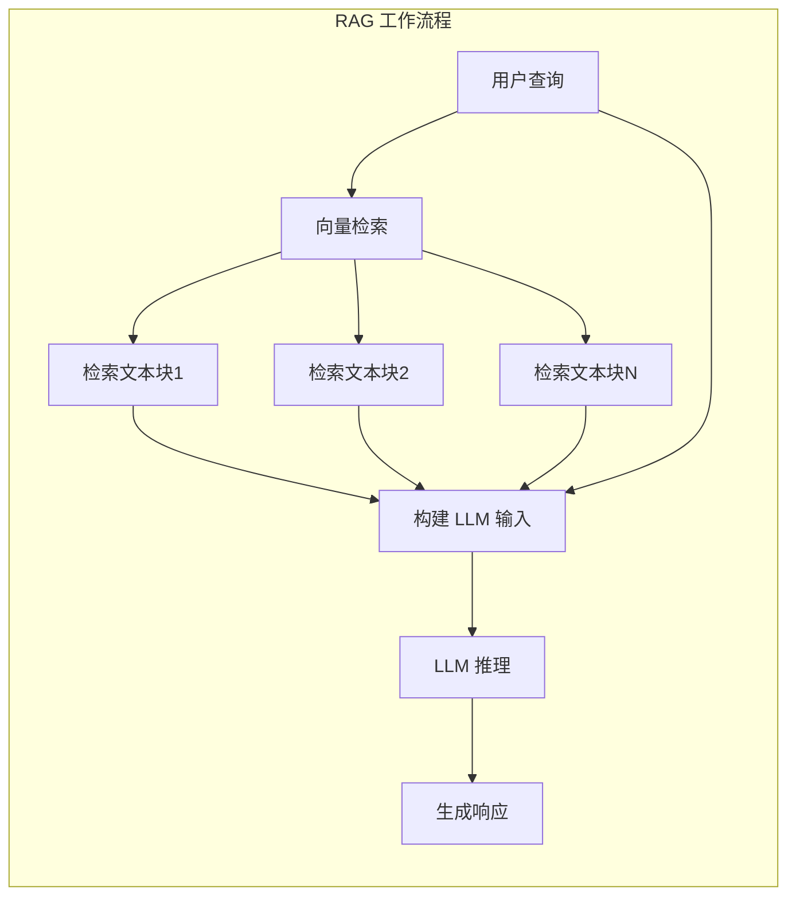
```mermaid
graph LR
    subgraph "RAG 工作流程"
        A[用户查询] --> B[向量检索]
        B --> C[检索文本块1]
        B --> D[检索文本块2]
        B --> E[检索文本块N]
        C --> F[构建 LLM 输入]
        D --> F
        E --> F
        A --> F
        F --> G[LLM 推理]
        G --> H[生成响应]
    end
```

然而，这些上下文文本块会显著减慢 LLM 推理速度。这是因为在生成任何 token 之前，LLM 首先需要通过 **Prefill（预填充）** 阶段处理整个 LLM 输入，以生成 **KV Cache（键值缓存）**——这是与每个输入 token 相关联的张量的拼接，其中嵌入了该 token 与其前面 token 之间的"注意力"关系。

### 1.1.2 RAG 场景的特殊需求

RAG 场景有其独特的特点和挑战：

1. **多文本块输入**：为了回答一个查询，通常需要在 LLM 输入中添加多个文本块来提供不同的上下文
2. **文本复用**：相同的文本块经常被不同的 LLM 输入复用
3. **跨块交互**：不同文本块之间可能存在重要的语义关联，需要通过 Cross-Attention（交叉注意力）来捕获

让我们通过一个具体例子来理解这些需求：

> **场景**：一个使用 LLM 管理内部记录的公司
> **查询 1**："IT 部门的谁在上次全体会议上提议使用 RAG 来增强客户服务 X？"
> **查询 2**："IT 部门有哪些人毕业于 Y 大学？"
>
> 虽然这两个查询看起来不同，但它们都需要 IT 部门员工列表作为必要的上下文来生成正确答案。

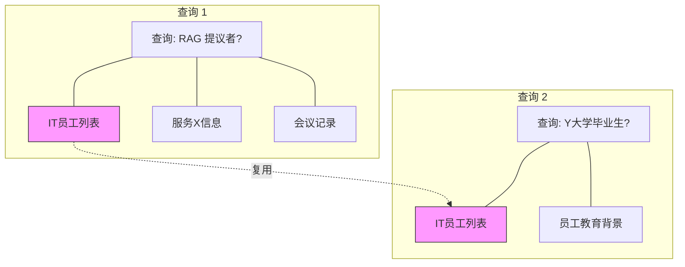
```mermaid
graph TB
    subgraph "查询 1"
        Q1[查询: RAG 提议者?]
        C1A[IT员工列表]
        C1B[服务X信息]
        C1C[会议记录]
        Q1 --- C1A
        Q1 --- C1B
        Q1 --- C1C
    end

    subgraph "查询 2"
        Q2[查询: Y大学毕业生?]
        C2A[IT员工列表]
        C2B[员工教育背景]
        Q2 --- C2A
        Q2 --- C2B
    end

    C1A -.->|"复用"| C2A

    style C1A fill:#f9f,stroke:#333
    style C2A fill:#f9f,stroke:#333
```

### 1.1.3 KV Cache 复用的价值

由于复用的上下文通常包含比用户查询更多的信息，因此输入"上下文"部分的 Prefill 占据了 Prefill 开销的主要部分。理想情况下，存储和复用这些复用文本的 KV Cache 可以避免在不同 LLM 输入中重复使用这些文本时的 Prefill 开销。

**性能影响的量化**：

- 对于 4000 个 token 的输入（RAG 中的典型上下文长度）
- 在一个 A40 GPU 上运行 Prefill：
  - Llama-34B: 约 3 秒
  - Llama-70B: 约 6 秒
- 这导致用户在看到第一个生成词之前必须等待相当长的时间

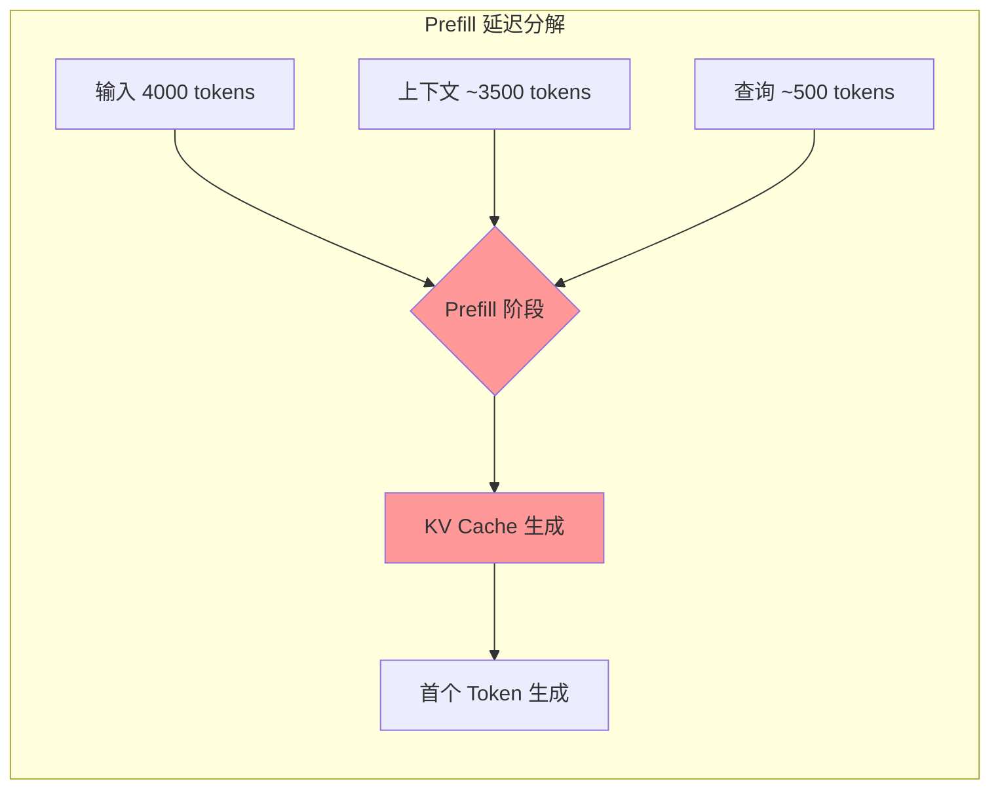
```mermaid
graph LR
    subgraph "Prefill 延迟分解"
        A[输入 4000 tokens] --> B{Prefill 阶段}
        B --> C[KV Cache 生成]
        C --> D[首个 Token 生成]

        B1[上下文 ~3500 tokens] --> B
        B2[查询 ~500 tokens] --> B
    end

    style B fill:#ff9999
    style C fill:#ff9999
```

## 1.2 LLM 推理基础

### 1.2.1 Transformer 架构回顾

当今大多数 LLM 服务使用 Transformer 架构。在接收输入 token 后，LLM 首先使用 Prefill 阶段将 token 转换为 Key（K）和 Value（V）向量，即 KV Cache。Prefill 之后，LLM 迭代地使用当前 KV Cache 解码（生成）下一个 token，并将新 token 的 K 和 V 向量追加到 KV Cache 中供下一次迭代使用。

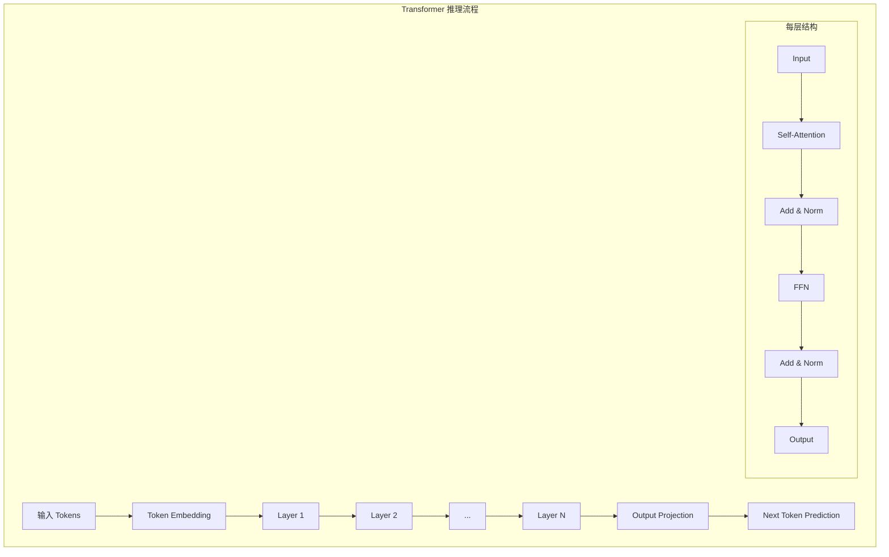
```mermaid
graph TB
    subgraph "Transformer 推理流程"
        A[输入 Tokens] --> B[Token Embedding]
        B --> C[Layer 1]
        C --> D[Layer 2]
        D --> E[...]
        E --> F[Layer N]
        F --> G[Output Projection]
        G --> H[Next Token Prediction]

        subgraph "每层结构"
            L1[Input] --> L2[Self-Attention]
            L2 --> L3[Add & Norm]
            L3 --> L4[FFN]
            L4 --> L5[Add & Norm]
            L5 --> L6[Output]
        end
    end
```

### 1.2.2 Self-Attention（自注意力）机制详解

自注意力机制是 Transformer 的核心。对于输入序列中的每个 token，它计算该 token 与序列中所有前面 token 之间的关系（在因果语言模型中）。

**计算流程**：

1. **投影**：将输入 hidden states 投影为 Query（Q）、Key（K）、Value（V）向量

   ```
   Q = hidden_states × W_q
   K = hidden_states × W_k
   V = hidden_states × W_v
   ```

2. **注意力分数计算**：

   ```
   Attention_scores = Q × K^T / √d_k
   ```

3. **Softmax 归一化**（带因果掩码）：

   ```
   Attention_weights = softmax(Attention_scores + causal_mask)
   ```

4. **加权求和**：
   ```
   Output = Attention_weights × V
   ```

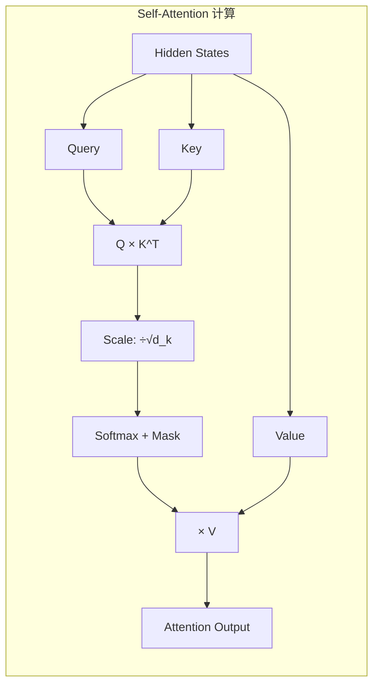
```mermaid
graph LR
    subgraph "Self-Attention 计算"
        H[Hidden States] --> Q[Query]
        H --> K[Key]
        H --> V[Value]

        Q --> M[Q × K^T]
        K --> M
        M --> S[Scale: ÷√d_k]
        S --> SM[Softmax + Mask]
        SM --> O[× V]
        V --> O
        O --> OUT[Attention Output]
    end
```

### 1.2.3 Prefill vs Decode 阶段

LLM 推理分为两个主要阶段：

| 阶段         | Prefill（预填充）                | Decode（解码）                 |
| ------------ | -------------------------------- | ------------------------------ |
| **输入**     | 整个输入序列                     | 单个新 token                   |
| **输出**     | 完整 KV Cache + 第一个生成 token | 更新的 KV Cache + 下一个 token |
| **计算特点** | 计算密集型，可并行               | 内存密集型，顺序执行           |
| **主要瓶颈** | GPU 计算                         | 内存带宽                       |
| **决定指标** | TTFT (Time-To-First-Token)       | Token 生成速度                 |

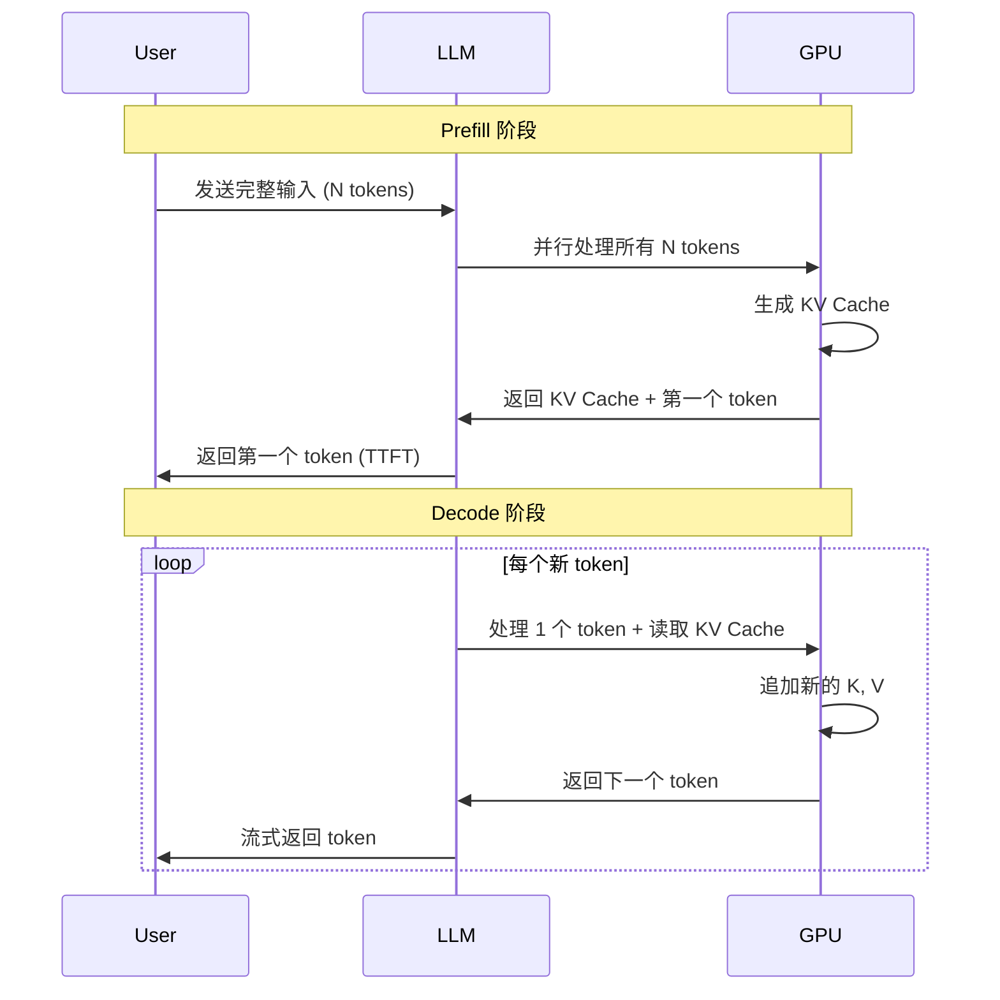
```mermaid
sequenceDiagram
    participant User
    participant LLM
    participant GPU

    Note over User,GPU: Prefill 阶段
    User->>LLM: 发送完整输入 (N tokens)
    LLM->>GPU: 并行处理所有 N tokens
    GPU->>GPU: 生成 KV Cache
    GPU->>LLM: 返回 KV Cache + 第一个 token
    LLM->>User: 返回第一个 token (TTFT)

    Note over User,GPU: Decode 阶段
    loop 每个新 token
        LLM->>GPU: 处理 1 个 token + 读取 KV Cache
        GPU->>GPU: 追加新的 K, V
        GPU->>LLM: 返回下一个 token
        LLM->>User: 流式返回 token
    end
```

## 1.3 KV Cache 工作原理

### 1.3.1 KV Cache 的结构

KV Cache 是在 Prefill 阶段生成的中间结果，存储了每个 token 在每一层的 Key 和 Value 向量。

**结构示意**：

```
KV Cache 结构:
├── Layer 0
│   ├── Key:   [seq_len, num_kv_heads, head_dim]
│   └── Value: [seq_len, num_kv_heads, head_dim]
├── Layer 1
│   ├── Key:   [seq_len, num_kv_heads, head_dim]
│   └── Value: [seq_len, num_kv_heads, head_dim]
├── ...
└── Layer N-1
    ├── Key:   [seq_len, num_kv_heads, head_dim]
    └── Value: [seq_len, num_kv_heads, head_dim]
```

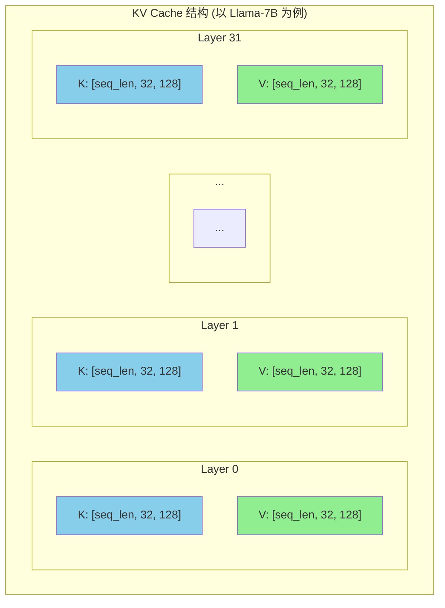
```mermaid
graph TB
    subgraph "KV Cache 结构 (以 Llama-7B 为例)"
        subgraph "Layer 0"
            K0["K: [seq_len, 32, 128]"]
            V0["V: [seq_len, 32, 128]"]
        end
        subgraph "Layer 1"
            K1["K: [seq_len, 32, 128]"]
            V1["V: [seq_len, 32, 128]"]
        end
        subgraph "..."
            KN["..."]
        end
        subgraph "Layer 31"
            K31["K: [seq_len, 32, 128]"]
            V31["V: [seq_len, 32, 128]"]
        end
    end

    style K0 fill:#87CEEB
    style V0 fill:#90EE90
    style K1 fill:#87CEEB
    style V1 fill:#90EE90
    style K31 fill:#87CEEB
    style V31 fill:#90EE90
```

### 1.3.2 KV Cache 的存储开销

KV Cache 的存储大小与以下因素成正比：

- 序列长度 (seq_len)
- 层数 (num_layers)
- KV 头数 (num_kv_heads)
- 头维度 (head_dim)
- 数据类型大小

**计算公式**：

```
KV_Cache_Size = 2 × num_layers × seq_len × num_kv_heads × head_dim × dtype_size
```

**实际示例**（Llama-7B, seq_len=4096, FP16）：

```
KV_Cache_Size = 2 × 32 × 4096 × 32 × 128 × 2 bytes
             = 2,147,483,648 bytes
             ≈ 2 GB
```

### 1.3.3 KV Cache 复用的基本原理

当前缀文本的 KV Cache 可用时，Prefill 阶段只需要计算后缀 token 与前缀 token 之间的 **Forward Attention（前向注意力）** 矩阵，这直接影响生成的 token。

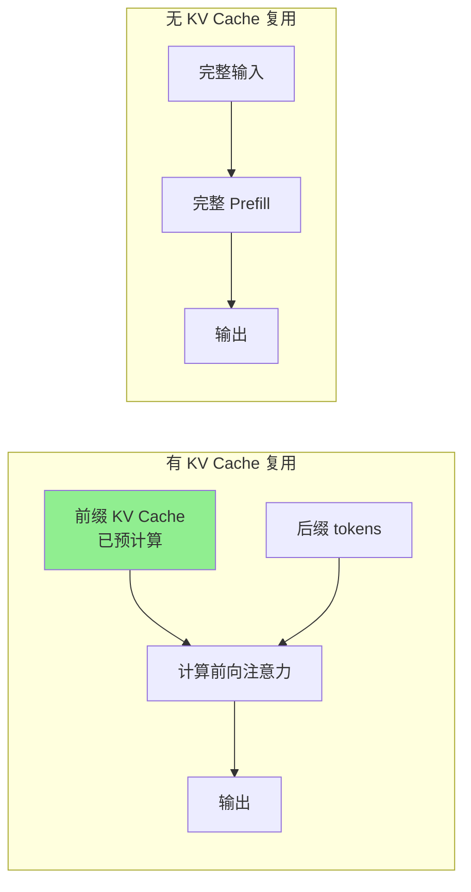
```mermaid
graph LR
    subgraph "有 KV Cache 复用"
        P[前缀 KV Cache<br>已预计算] --> FA[计算前向注意力]
        S[后缀 tokens] --> FA
        FA --> O[输出]
    end

    subgraph "无 KV Cache 复用"
        I[完整输入] --> FP[完整 Prefill]
        FP --> O2[输出]
    end

    style P fill:#90EE90
```

## 1.4 问题定义与现有方案

### 1.4.1 现有方案概述

目前存在三种主要的 KV Cache 处理方案：

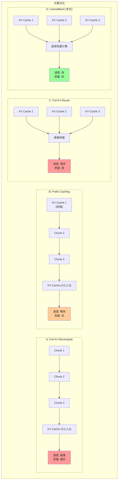
```mermaid
graph TB
    subgraph "方案对比"
        subgraph "A: Full KV Recompute"
            A1[Chunk 1] --> A2[Chunk 2]
            A2 --> A3[Chunk 3]
            A3 --> A4["KV Cache of [1,2,3]"]
            A4 --> AO["速度: 最慢<br>质量: 最好"]
        end

        subgraph "B: Prefix Caching"
            B1["KV Cache 1<br>(前缀)"] --> B2[Chunk 2]
            B2 --> B3[Chunk 3]
            B3 --> B4["KV Cache of [1,2,3]"]
            B4 --> BO["速度: 略快<br>质量: 好"]
        end

        subgraph "C: Full KV Reuse"
            C1["KV Cache 1"]
            C2["KV Cache 2"]
            C3["KV Cache 3"]
            C1 --> C4["直接拼接"]
            C2 --> C4
            C3 --> C4
            C4 --> CO["速度: 最快<br>质量: 差"]
        end

        subgraph "D: CacheBlend (本文)"
            D1["KV Cache 1"]
            D2["KV Cache 2"]
            D3["KV Cache 3"]
            D1 --> D4["选择性重计算"]
            D2 --> D4
            D3 --> D4
            D4 --> DO["速度: 快<br>质量: 好"]
        end
    end

    style AO fill:#ff9999
    style BO fill:#ffcc99
    style CO fill:#ff9999
    style DO fill:#99ff99
```

### 1.4.2 Full KV Recompute（完全 KV 重计算）

**工作原理**：

- 将原始文本作为输入直接输入 LLM
- LLM 在 Prefill 期间计算所有 token 的 KV Cache

**优点**：

- 生成质量最高，包含完整的跨块注意力信息

**缺点**：

- 速度最慢，尤其是长输入时
- Prefill 延迟和计算量与输入长度超线性增长

### 1.4.3 Prefix Caching（前缀缓存）

**工作原理**：

- 预计算并存储可复用文本块的 KV Cache
- 如果文本块位于 LLM 输入的前缀位置，则可直接复用预计算的 KV Cache
- 代表系统：vLLM、SGLang、RAGCache

**优点**：

- 前缀的 KV Cache 不受后续文本影响，生成结果与完全重计算完全相同
- 对于单一前缀场景效果很好

**缺点**：

- 只能复用**第一个**文本块的 KV Cache
- 当输入包含多个文本块时，除第一个块外，其他块的 KV Cache 都无法复用
- 在 RAG 场景中，加速效果有限

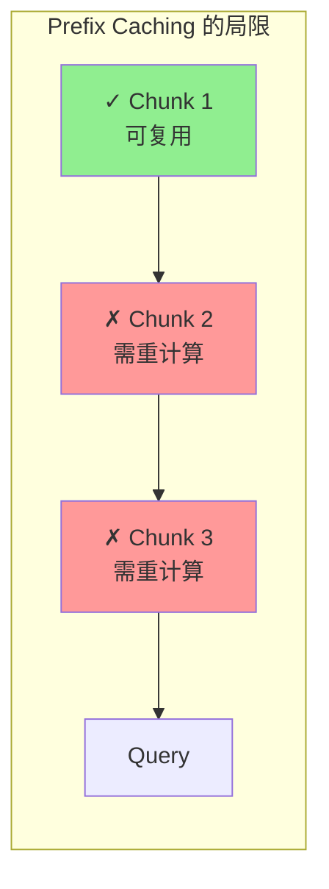
```mermaid
graph LR
    subgraph "Prefix Caching 的局限"
        C1["✓ Chunk 1<br>可复用"] --> C2["✗ Chunk 2<br>需重计算"]
        C2 --> C3["✗ Chunk 3<br>需重计算"]
        C3 --> Q["Query"]
    end

    style C1 fill:#90EE90
    style C2 fill:#ff9999
    style C3 fill:#ff9999
```

### 1.4.4 Full KV Reuse（完全 KV 复用）

**工作原理**：

- 独立预计算每个文本块的 KV Cache
- 当复用的文本不在输入前缀位置时，通过调整位置编码来复用 KV Cache
- 代表系统：PromptCache

**优点**：

- 速度最快，几乎不需要重新计算

**缺点**：

- **忽略了跨块注意力**（Cross-Attention）
- 由于预计算时不知道前面的文本块，无法计算跨块的注意力信息
- 对于需要综合多个文本块信息的查询，会导致错误答案

### 1.4.5 Cross-Attention（跨块注意力）的重要性

让我们通过一个具体例子来说明跨块注意力为何重要：

**场景设置**：

- **Chunk 1**: "Lionel Messi scored 13 goals at FIFA World Cups."
- **Chunk 2**: "Cristiano Ronaldo scored 8 goals at FIFA World Cups."
- **Query**: "Who scored more goals at FIFA World Cups, Messi or Ronaldo?"

```mermaid
graph TB
    subgraph "Full KV Recompute - 正确答案"
        A1[Chunk 1: Messi 13球] --> A2[Chunk 2: Ronaldo 8球]
        A2 --> AQ[Query: 谁进球更多?]
        AQ --> AA["✓ Messi 进球比 Ronaldo 多"]

        A1 -.->|"Cross-Attention<br>建立关联"| A2
    end

    subgraph "Full KV Reuse - 错误答案"
        B1["KV: Messi 13球"]
        B2["KV: Ronaldo 8球"]
        BQ[Query: 谁进球更多?]
        B1 --> BC[直接拼接]
        B2 --> BC
        BQ --> BC
        BC --> BA["✗ 无法正确比较<br>答非所问"]

        B1 -.x|"无 Cross-Attention"| B2
    end

    style AA fill:#90EE90
    style BA fill:#ff9999
```

**Attention Matrix（注意力矩阵）对比**：

Full KV Recompute 的注意力矩阵包含完整的 Cross-Attention 区域，而 Full KV Reuse 的注意力矩阵在 Cross-Attention 区域为零（从未计算）。

```
Full KV Recompute:          Full KV Reuse:
┌─────────────────┐         ┌─────────────────┐
│ █████           │         │ █████           │
│ █████           │         │ █████           │
│ █████████████   │  vs     │ █████ 00000     │  ← Cross-Attention
│ █████████████   │         │ █████ 00000     │    区域缺失
│ ███████████████ │         │ █████ █████████ │
└─────────────────┘         └─────────────────┘
   Chunk1  Chunk2              Chunk1  Chunk2
```

### 1.4.6 实验验证：Cross-Attention 的影响

论文通过实验验证了 Cross-Attention 的重要性。在 Musique 和 2WikiMQA 两个多跳问答数据集上，随着检索的相关文本块数量增加：

1. **Full KV Recompute**（包含 Cross-Attention）的 F1 分数持续提升
2. **Full KV Reuse**（无 Cross-Attention）的 F1 分数明显低于前者
3. 差距随文本块数量增加而扩大

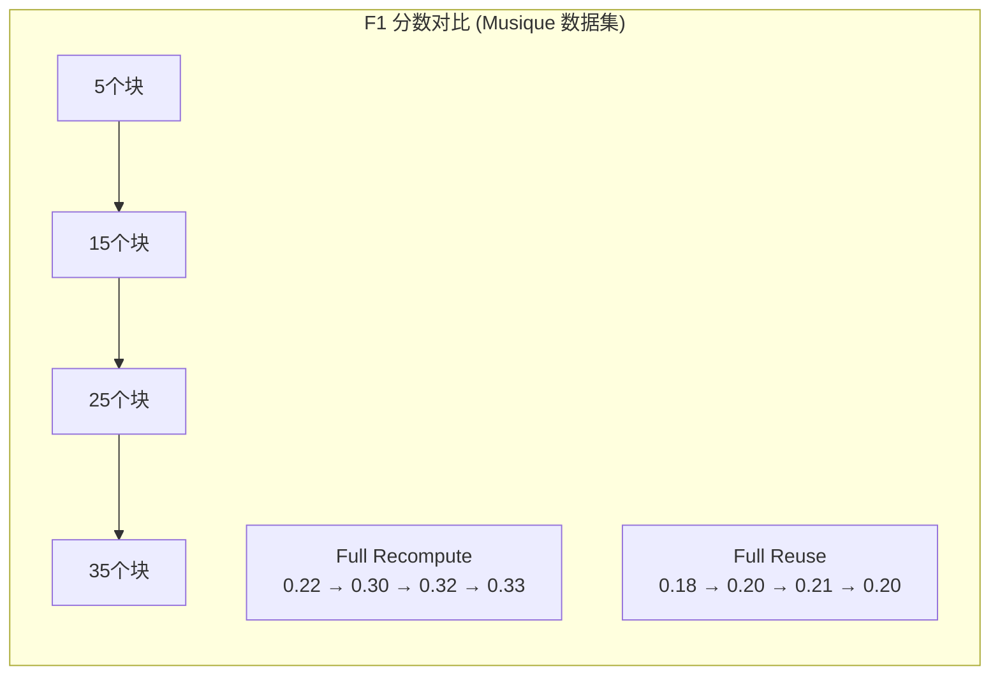
```mermaid
graph LR
    subgraph "F1 分数对比 (Musique 数据集)"
        direction TB
        X[5个块] --> Y[15个块] --> Z[25个块] --> W[35个块]

        A["Full Recompute<br>0.22 → 0.30 → 0.32 → 0.33"]
        B["Full Reuse<br>0.18 → 0.20 → 0.21 → 0.20"]
    end
```

### 1.4.7 CacheBlend 的目标

CacheBlend 旨在解决一个核心挑战：

> **当 LLM 输入包含多个文本块时，如何快速组合它们各自预计算的 KV Cache，以达到与昂贵的 Full KV Recompute 相同的生成质量？**

换句话说，CacheBlend 追求同时获得：

- **Full KV Reuse 的速度**
- **Full KV Recompute 的质量**

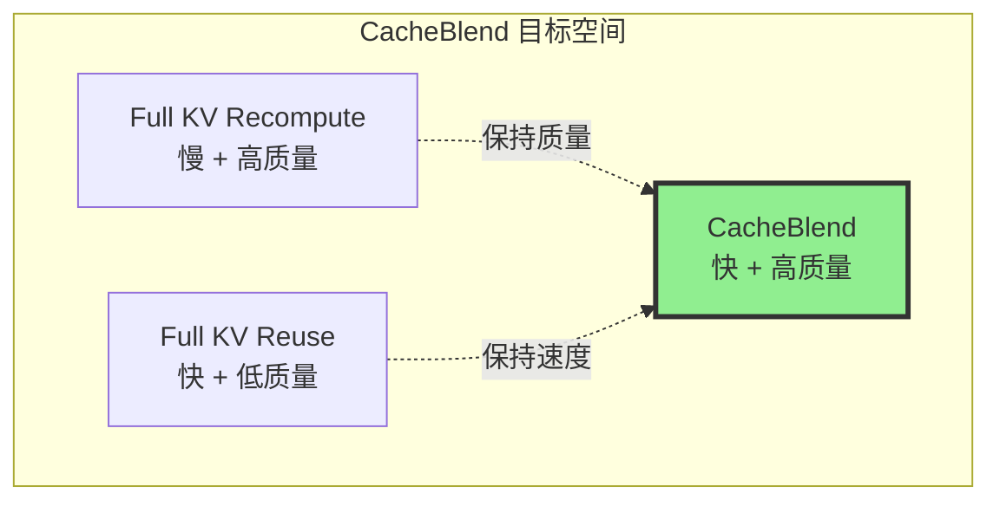
```mermaid
graph TB
    subgraph "CacheBlend 目标空间"
        A["Full KV Recompute<br>慢 + 高质量"]
        B["Full KV Reuse<br>快 + 低质量"]
        C["CacheBlend<br>快 + 高质量"]

        A -.->|"保持质量"| C
        B -.->|"保持速度"| C
    end

    style C fill:#90EE90,stroke:#333,stroke-width:3px
```

---

# 第二部分：核心理论

## 2.1 CacheBlend 核心思想

### 2.1.1 Selective KV Recompute（选择性 KV 重计算）

CacheBlend 的核心思想是**选择性 KV 重计算**：

- **复用**：无论是否为前缀，都复用预计算的 KV Cache
- **选择性更新**：基于特定 LLM 输入中的前面文本，选择性地重新计算**一小部分 token** 的 KV 值，以部分更新每个复用的 KV Cache

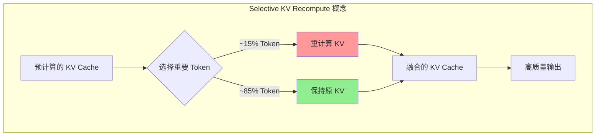
```mermaid
graph TB
    subgraph "Selective KV Recompute 概念"
        A[预计算的 KV Cache] --> B{选择重要 Token}
        B -->|"~15% Token"| C[重计算 KV]
        B -->|"~85% Token"| D[保持原 KV]
        C --> E[融合的 KV Cache]
        D --> E
        E --> F[高质量输出]
    end

    style C fill:#ff9999
    style D fill:#90EE90
```

**核心优势**：

1. 与 Full KV Recompute 相比：更新不到 15% 的 KV 通常可以生成相同质量的响应
2. 与 Full KV Reuse 相比：通过少量额外的 KV 更新获得更高的生成质量

### 2.1.2 工作流程概述

CacheBlend 按照传统的逐层方式执行 Prefill，但在每一层中，它只更新一小部分 token 的 KV，同时复用其他 token 的 KV：

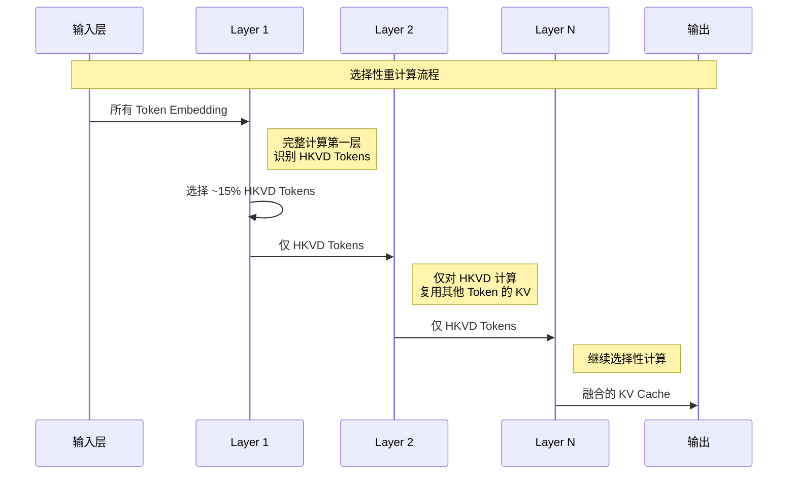
```mermaid
sequenceDiagram
    participant Input as 输入层
    participant L1 as Layer 1
    participant L2 as Layer 2
    participant LN as Layer N
    participant Output as 输出

    Note over Input,Output: 选择性重计算流程

    Input->>L1: 所有 Token Embedding
    Note right of L1: 完整计算第一层<br>识别 HKVD Tokens
    L1->>L1: 选择 ~15% HKVD Tokens

    L1->>L2: 仅 HKVD Tokens
    Note right of L2: 仅对 HKVD 计算<br>复用其他 Token 的 KV

    L2->>LN: 仅 HKVD Tokens
    Note right of LN: 继续选择性计算

    LN->>Output: 融合的 KV Cache
```

### 2.1.3 HKVD Tokens 概念

**HKVD (High-KV-Deviation) Tokens（高 KV 偏差令牌）** 是指那些在预计算 KV Cache 和完整 Prefill KV Cache 之间差异最大的 token。

直觉上：

- 如果一个 token 与其他文本块的 token 有很低的注意力（低 Cross-Attention），其 KV 偏差会很低，不需要重计算
- 只有当一个 token 与其他文本块有高注意力时（高 KV 偏差），才需要重计算其 KV

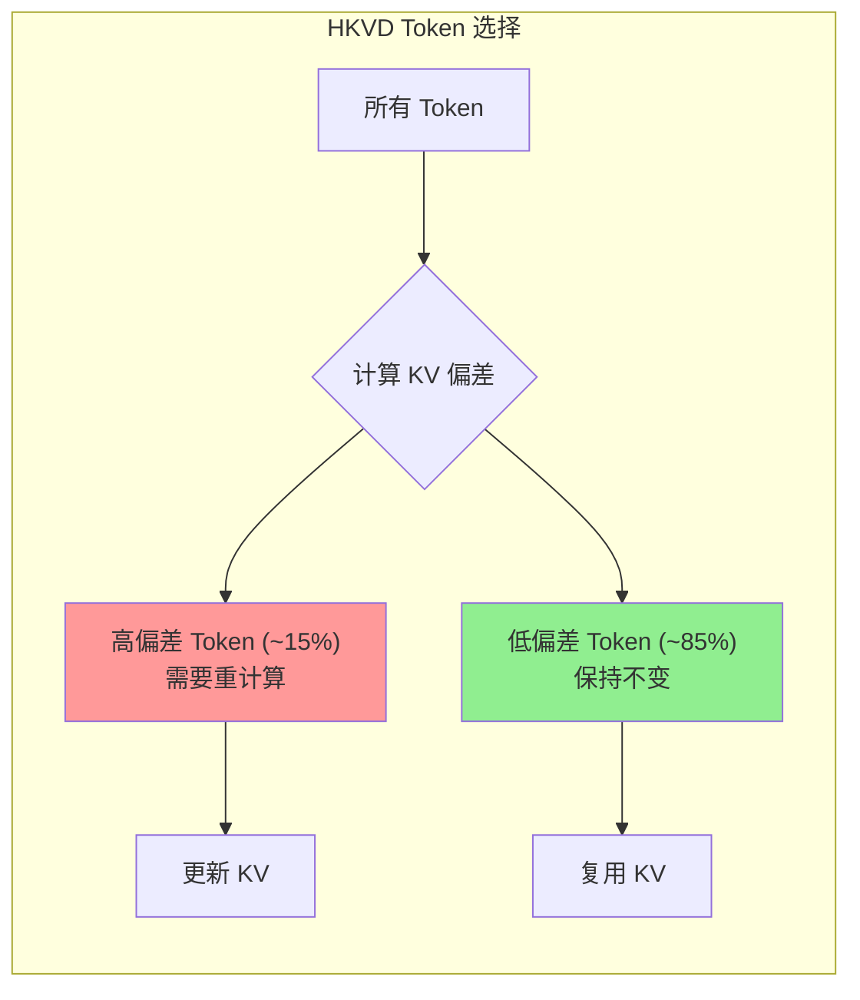
```mermaid
graph LR
    subgraph "HKVD Token 选择"
        A[所有 Token] --> B{计算 KV 偏差}
        B --> C["高偏差 Token (~15%)<br>需要重计算"]
        B --> D["低偏差 Token (~85%)<br>保持不变"]

        C --> E[更新 KV]
        D --> F[复用 KV]
    end

    style C fill:#ff9999
    style D fill:#90EE90
```

## 2.2 数学基础

### 2.2.1 符号定义

| 符号         | 描述                               |
| ------------ | ---------------------------------- |
| $i$          | 层索引                             |
| $j$          | Token 索引                         |
| $KV$         | KV Cache                           |
| $KV_i$       | 第 $i$ 层的 KV                     |
| $KV_i[j]$    | 第 $i$ 层第 $j$ 个 token 的 KV     |
| $KV^{full}$  | 完全重计算的 KV Cache              |
| $KV^{pre}$   | 预计算的 KV Cache                  |
| $KV^{new}$   | CacheBlend 更新后的 KV Cache       |
| $A_i$        | 第 $i$ 层的前向注意力矩阵          |
| $A_i^{full}$ | Full KV Recompute 的前向注意力矩阵 |
| $A_i^{pre}$  | Full KV Reuse 的前向注意力矩阵     |
| $A_i^{new}$  | CacheBlend 的前向注意力矩阵        |

### 2.2.2 KV Deviation（KV 偏差）

**定义**：KV Cache $KV$ 在第 $i$ 层第 $j$ 个 token 的 **KV 偏差** 定义为 $KV_i[j]$ 与 $KV_i^{full}[j]$ 之间的绝对差：

$$\Delta_{kv}(KV_i, KV_i^{full})[j] = |KV_i[j] - KV_i^{full}[j]|$$

这衡量了给定 KV 在特定 token 和层上与完整 Prefill 的 KV Cache 相比有多大差异。

### 2.2.3 Attention Deviation（注意力偏差）

**定义**：第 $i$ 层的前向注意力矩阵 $A_i$ 的**注意力偏差**定义为其与 $A_i^{full}$ 差异的 L-2 范数：

$$\Delta_{attn}(A_i, A_i^{full}) = ||A_i - A_i^{full}||_2$$

Full KV Reuse 由于缺少 Cross-Attention 而导致前向注意力矩阵的偏差。

### 2.2.4 优化目标

使用这些符号，CacheBlend 的目标可以形式化为：

> 如何快速将预计算的 KV Cache $KV^{pre}$ 更新为新的 KV Cache $KV^{new}$，使得任意层 $i$ 上的注意力偏差 $\Delta_{attn}(A_i^{new}, A_i^{full})$ 最小化。

### 2.2.5 RoPE 位置编码

**Rotary Position Embedding (RoPE，旋转位置编码)** 是现代 LLM 中常用的位置编码方案。

**定义**：对于需要嵌入到位置 $m$ 的 query 向量 $q$ 和 key 向量 $k \in \mathbb{R}^d$，RoPE 编码位置信息如下：

$$q_m, k_m = R^d_{\Theta,m}\{q, k\}$$

其中旋转矩阵为：

$$
R^d_{\Theta,m} = \begin{pmatrix}
\cos m\theta_0 & -\sin m\theta_0 & \cdots & 0 & 0 \\
\sin m\theta_0 & \cos m\theta_0 & \cdots & 0 & 0 \\
\vdots & \vdots & \ddots & \vdots & \vdots \\
0 & 0 & \cdots & \cos m\theta_{d/2-1} & -\sin m\theta_{d/2-1} \\
0 & 0 & \cdots & \sin m\theta_{d/2-1} & \cos m\theta_{d/2-1}
\end{pmatrix}
$$

超参数 $\Theta \in \{\theta_i = 10000^{-2i/d}, i \in [0, 1, ..., d/2-1]\}$

### 2.2.6 RoPE 的关键性质：相对位置不变性

**命题**：RoPE 只依赖相对位置。

给定固定位置 $m$ 的 key 向量 $k_m$ 和位置 $(m+l)$ 的 query 向量 $q_{m+l}$，注意力分数 $q_{m+l}k_m$ 计算如下：

$$q_{m+l}k_m = (R^d_{\Theta,m+l}q)^T(R^d_{\Theta,m}k)$$
$$= \sum_{i=0}^{d/2-1}(q_{[2i]}k_{[2i]} + q_{[2i+1]}k_{[2i+1]})\cos l\theta_i$$

注意力分数 $q_{m+l}k_m$ 只依赖**相对距离** $l$，而不是绝对位置 $m$。

**对 CacheBlend 的意义**：

- 预计算的 KV Cache 中每个 chunk 的 K 向量必须用正确的位置编码调整
- 在 RoPE 中，这个修正只需将 K 向量乘以一个旋转矩阵
- 这一步开销可忽略不计，因为乘法只执行一次

## 2.3 关键洞察

### 2.3.1 Insight 1: HKVD Tokens 对注意力偏差的主导作用

> **洞察 1**：在第 $i$ 层，重计算具有更高 KV 偏差的 token $j$ 的 KV（即 $\Delta_{kv}(KV_i, KV_i^{full})[j]$）会以更大的幅度减少注意力偏差（即 $\Delta_{attn}(A_i, A_i^{full})$）。

**实验验证**：

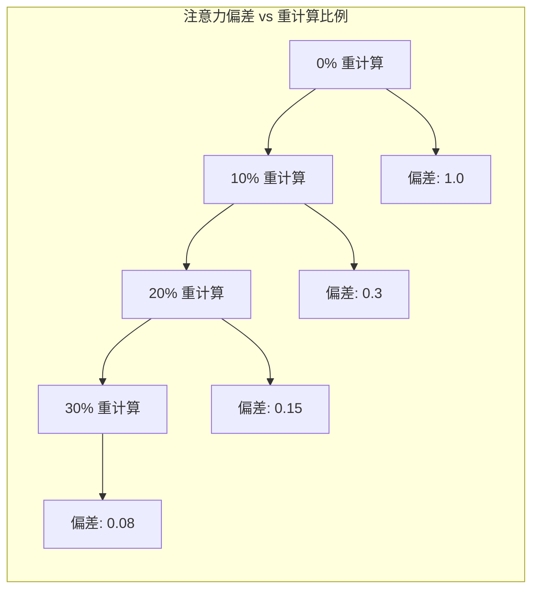
```mermaid
graph LR
    subgraph "注意力偏差 vs 重计算比例"
        A["0% 重计算"] --> B["10% 重计算"]
        B --> C["20% 重计算"]
        C --> D["30% 重计算"]

        A1["偏差: 1.0"]
        B1["偏差: 0.3"]
        C1["偏差: 0.15"]
        D1["偏差: 0.08"]

        A --> A1
        B --> B1
        C --> C1
        D --> D1
    end
```

论文的图 6 显示：

- 随着重计算比例增加，注意力偏差逐渐减少
- **最大的下降发生在重计算前几个最高 KV 偏差的 token 时**
- 约 10-15% 的重计算即可将偏差降到很低水平

### 2.3.2 Insight 2: 层间 HKVD Tokens 的高相关性

> **洞察 2**：在一层上具有最高 KV 偏差的 token 很可能在下一层也具有最高的 KV 偏差。

例如，如果第一层的 HKVD tokens 是 token 2、3 和 5，那么这三个 token 在第二层也可能比其他大多数 token 具有更高的 KV 偏差。

**实验验证**（图 8）：
论文使用 Spearman 秩相关系数衡量相邻层之间 token KV 偏差的相关性，发现一致的高相似性（> 0.8）。

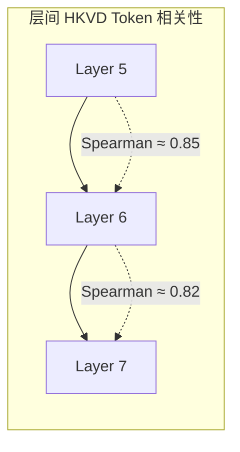
```mermaid
graph LR
    subgraph "层间 HKVD Token 相关性"
        L1["Layer 5"] --> L2["Layer 6"]
        L2 --> L3["Layer 7"]

        L1 -.->|"Spearman ≈ 0.85"| L2
        L2 -.->|"Spearman ≈ 0.82"| L3
    end
```

**直觉解释**：

- 每个 token 的输入嵌入在 Transformer 模型的各层之间变化缓慢
- 因此，KV Cache（由输入嵌入通过线性变换生成）在各层之间也应该具有相似性

### 2.3.3 注意力稀疏性的理论基础

HKVD tokens 只占一小部分的原因可以用**注意力稀疏性**来解释——这是许多先前研究在 Transformer 模型中观察到的一个广泛性质。

**注意力稀疏性**指的是：在注意力矩阵中，高注意力通常只发生在少量 token 与其前面的 token 之间。

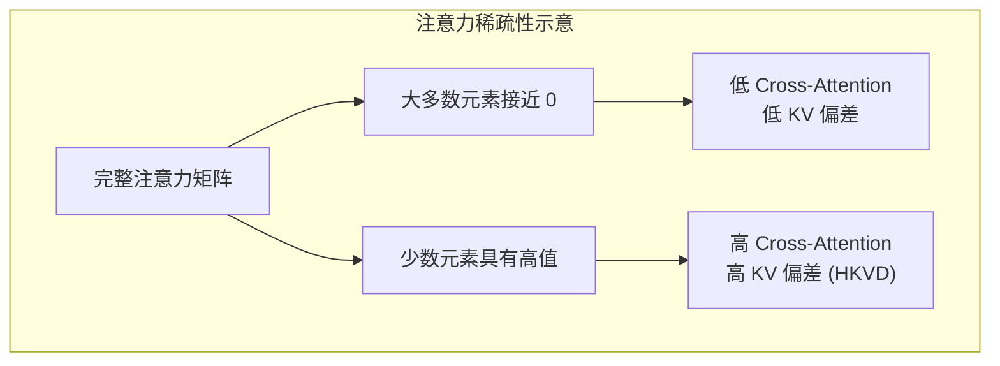
```mermaid
graph TB
    subgraph "注意力稀疏性示意"
        A["完整注意力矩阵"] --> B["大多数元素接近 0"]
        A --> C["少数元素具有高值"]

        B --> D["低 Cross-Attention<br>低 KV 偏差"]
        C --> E["高 Cross-Attention<br>高 KV 偏差 (HKVD)"]
    end
```

论文图 7 显示了 KV 偏差在不同 token 上的分布：

- 约 10-15% 的 token 具有明显高于其他 token 的 KV 偏差
- 这验证了 Cross-Attention 的稀疏性

## 2.4 算法设计

### 2.4.1 Token 选择策略

如果我们要在第 $i$ 层重计算 $r\%$ 的 token 的 KV，我们应该选择具有最高 KV 偏差的 $r\%$ token。我们将这些 token 称为第 $i$ 层的 **HKVD tokens**。

但问题是：**如何在不知道真实 KV 值或注意力矩阵的情况下识别 HKVD tokens？**

朴素方法需要知道每一层的完整 Prefill $KV_i^{full}$，但这太昂贵了，违背了选择性 KV 重计算的目的。

### 2.4.2 基于层间相关性的解决方案

基于 Insight 2（层间 HKVD tokens 高度相关），一个直接的解决方案是：

1. 首先在第一层执行 Prefill
2. 选择第一层的 HKVD tokens
3. 在所有其他层只更新这些 token 的 KV

由于 LLM 通常有超过 30 层，这个过程可以比 Full KV Recompute 节省大部分计算。

### 2.4.3 Gradual Filtering（渐进过滤）方案

仅使用第一层不同 token 的注意力偏差可能不够可靠，特别是对于更深的层。因此，CacheBlend 采用**渐进过滤**方案：

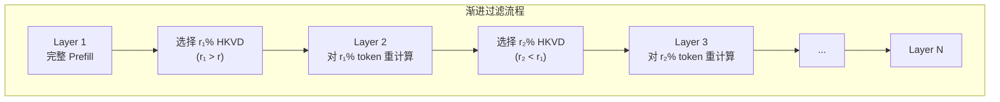
```mermaid
graph TB
    subgraph "渐进过滤流程"
        L1["Layer 1<br>完整 Prefill"] --> S1["选择 r₁% HKVD<br>(r₁ > r)"]
        S1 --> L2["Layer 2<br>对 r₁% token 重计算"]
        L2 --> S2["选择 r₂% HKVD<br>(r₂ < r₁)"]
        S2 --> L3["Layer 3<br>对 r₂% token 重计算"]
        L3 --> SN["..."]
        SN --> LN["Layer N"]
    end
```

**算法步骤**：

1. 如果平均每层要选择 $r\%$ HKVD tokens
2. 基于第一层的 token-wise 注意力偏差选择 $r_1\%$ token，其中 $r_1$ 略大于 $r$
3. 将这些作为第二层的 HKVD tokens
4. 在第二层重计算这 $r_1\%$ HKVD tokens 的 KV
5. 选择具有最高 token-wise 注意力偏差的 $r_2\%$ token，其中 $r_2$ 略小于 $r_1$
6. 将这些作为下一层的 HKVD tokens
7. 依此类推

**渐进过滤的优势**：

- 最终选择的 HKVD tokens 不仅在第一层具有高注意力偏差
- 而且在多个层上都具有高注意力偏差
- 这在经验上更可靠地识别每层的 HKVD tokens

### 2.4.4 选择性重计算的工作流程

```mermaid
graph TB
    subgraph "Layer i 的选择性重计算"
        I["层 i 的输入"] --> M["应用掩码<br>仅保留选定 token"]
        M --> T["变换为 Q, K, V"]
        T --> E["扩展 K, V<br>复用未选定 token 的 KV"]
        E --> A["计算注意力矩阵"]
        A --> O["层 i+1 的输入"]
    end
```

**关键步骤**：

1. 首先在每层 $i$ 的输入上应用掩码，将其减少到选定 token 的子集
2. 然后将减少后的输入变换为 $Q_i$、$K_i$ 和 $V_i$ 向量（也仅限于选定 token）
3. 然后通过复用未选定 token 在第 $i$ 层的 KV Cache 条目来扩展 $K_i$ 和 $V_i$ 向量
4. 最后运行相同的注意力模块生成下一层的输入

**计算开销**：

- 计算开销与选定 token 的数量成正比
- 如果每层重计算 $r\%$ 的 token，总计算开销将是 Full Prefill 的 $r\%$

### 2.4.5 内存开销分析

虽然执行 HKVD 计算的层 $i$ 的 KV Cache 空间同时持有更新的 KV 和预计算的 KV，但一旦推理进入层 $i+1$，层 $i$ 的额外预计算 KV 立即被丢弃。这使得 HKVD 中的内存开销可以忽略不计。

---

# 第三部分：系统设计

## 3.1 整体架构

### 3.1.1 CacheBlend 系统组件

CacheBlend 系统由三个主要组件组成：

```mermaid
graph TB
    subgraph "CacheBlend 系统架构"
        User["用户查询"] --> Retriever["检索器"]
        Retriever --> Controller["Loading Controller<br>加载控制器"]

        subgraph "KV Cache Store"
            CPU["CPU RAM"]
            SSD["SSD"]
            Disk["Slower Disks"]
        end

        Controller --> Store["KV Cache Store<br>KV缓存存储"]
        Store --> CPU
        Store --> SSD
        Store --> Disk

        Controller --> Fusor["Fusor<br>缓存融合器"]
        Store --> Fusor

        Fusor --> LLM["LLM 推理引擎"]
        LLM --> Response["生成响应"]
    end

    style Controller fill:#87CEEB
    style Fusor fill:#90EE90
    style Store fill:#FFD700
```

### 3.1.2 与 vLLM 的集成

CacheBlend 在 vLLM 之上实现，约 3000 行 Python 代码。集成点包括：

```mermaid
graph TB
    subgraph "vLLM + CacheBlend 集成"
        subgraph "vLLM 核心"
            Engine["LLM Engine"]
            Executor["Model Executor"]
            Runner["Model Runner"]
        end

        subgraph "CacheBlend 扩展"
            Meta["cache_fuse_metadata"]
            OldKV["old_kvs"]
            Status["temp_status"]
        end

        subgraph "修改的模块"
            LlamaModel["LlamaModel"]
            LlamaAttn["LlamaAttention"]
            XFormers["XFormers Backend"]
        end

        Engine --> Executor
        Executor --> Runner
        Runner --> LlamaModel
        LlamaModel --> Meta
        LlamaModel --> OldKV
        LlamaModel --> Status
        LlamaAttn --> XFormers
    end
```

### 3.1.3 数据流与控制流

```mermaid
sequenceDiagram
    participant U as 用户
    participant R as 检索器
    participant LC as Loading Controller
    participant KS as KV Cache Store
    participant F as Fusor
    participant LLM as LLM Engine

    U->>R: 1. 提交查询
    R->>LC: 2. 返回相关文本块列表
    LC->>KS: 3. 查询 KV Cache 是否存在
    KS->>LC: 4. 返回 KV Cache 位置信息
    LC->>LC: 5. 计算理想重计算比例
    LC->>F: 6. 发送重计算比例
    LC->>KS: 7. 开始加载 KV Cache 到 GPU

    loop 每一层
        KS->>F: 8. 加载第 i 层 KV
        F->>F: 9. 执行选择性重计算
    end

    F->>LLM: 10. 提供融合的 KV Cache
    LLM->>U: 11. 生成并返回响应
```

## 3.2 Loading Controller（加载控制器）

### 3.2.1 核心洞察

> **基本洞察**：如果选择性 KV 重计算的延迟比将 KV 加载到 GPU 内存的时间更快，那么正确地流水线化选择性 KV 重计算和 KV 加载可以使 KV 重计算的额外延迟可忽略不计。

### 3.2.2 重计算比例估算

Loading Controller 使用两个延迟估算器来找到理想的重计算比例：

**重计算延迟估算器**：
$$T_{recompute}(r\%, LLM, L) = r\% \times Prefill(LLM, L)$$

其中 $Prefill(LLM, L)$ 是离线预测量的。

**加载延迟估算器**：
$$T_{load}(LLM, L, storage\_device) = \frac{PerTokenKVSize(LLM) \times L}{Throughput(storage\_device)}$$

**理想重计算比例计算**：

1. 选择 $r\%$ 使得 $T_{recompute}(r\%, LLM, L) = T_{load}(LLM, L, storage\_device)$
2. 取 $\max(r\%, r^*\%)$，其中 $r^*\%$ 是经验上质量损失可忽略的最小重计算比例（实践中约 15%）

```mermaid
graph LR
    subgraph "重计算比例选择"
        A["存储设备速度"] --> B["计算 T_load"]
        C["模型参数"] --> D["计算 T_recompute"]
        B --> E{"T_recompute ≈ T_load?"}
        D --> E
        E -->|"是"| F["使用该比例"]
        E -->|"否"| G["调整比例"]
        G --> E
        F --> H["确保 r% ≥ 15%"]
    end
```

### 3.2.3 存储设备选择

对于固定的重计算比例（如 15%），Loading Controller 还可以帮助选择最佳存储设备：

**问题**：如果只做固定选择性重计算比例（如 15%）的 KV 重计算，如何选择合适的存储设备来存储 KV，使其不会增加额外延迟？

**解决方案**：

1. 使用存储成本估算器估算每个设备存储 KV 的成本
2. 估算所有设备的重计算和加载延迟
3. 找出 $T_{recompute} \geq T_{load}$ 的最便宜存储设备

```mermaid
graph TB
    subgraph "存储设备选择"
        A["GPU HBM<br>最快/最贵"] --> D{r=15% 时}
        B["CPU RAM<br>快/中等"] --> D
        C["SSD<br>慢/便宜"] --> D
        E["HDD<br>最慢/最便宜"] --> D

        D -->|"选择最便宜且<br>T_load ≤ T_recompute"| F["最优存储"]
    end
```

### 3.2.4 实际示例

**Llama-7B, 4K 上下文**：

- 重计算 15% token：3 ms/层
- 从 NVME SSD 加载一层 KV Cache：16 ms
- **结论**：KV 加载可以完全隐藏 KV 重计算延迟，无额外 TTFT

**Llama-70B, 4K 上下文**：

- 重计算 15% token：7 ms/层
- 从 NVME SSD 加载一层 KV Cache：4 ms
- **结论**：KV 加载不能完全隐藏重计算延迟，需要智能控制器调整

## 3.3 KV Cache Store（KV 缓存存储）

### 3.3.1 文本分块策略

KV Cache Store 将 LLM 输入分割成多个文本块，每个块可以是复用的或新的：

- RAG 输入通常由多个检索的上下文块（通常是固定长度）和用户输入组成
- LLM 输入的分割是特定于应用的
- CacheBlend 实现了与近期工作相同的策略

### 3.3.2 Hash 映射机制

一旦输入被分割成文本块，每个块被哈希以找到其对应的 KV Cache：

- 与 vLLM 中的块哈希实现方式相同
- 如果找到匹配，复用 KV Cache
- 如果未找到，需要计算新的 KV Cache

```mermaid
graph TB
    subgraph "KV Cache 查找流程"
        T["文本块"] --> H["计算 Hash"]
        H --> L{"在 Store 中查找"}
        L -->|"命中"| R["复用 KV Cache"]
        L -->|"未命中"| C["计算新 KV Cache"]
        C --> S["存储到 Store"]
    end
```

### 3.3.3 LRU 驱逐策略

当存储设备满时，使用 LRU（Least Recently Used）策略驱逐 KV Cache：

- 驱逐最近最少使用的 KV Cache
- 保留最常用的 KV Cache

### 3.3.4 存储层级

CacheBlend 支持在单一存储设备层级中存储 KV Cache：

- CPU RAM
- SSD

哈希表保存在 CPU 中，因为其大小相对较小（一百万块约 16MB）。

## 3.4 Fusor（缓存融合器）

### 3.4.1 核心功能

Fusor（缓存融合器）通过选择性重计算合并预计算的 KV Cache：

```mermaid
graph TB
    subgraph "Fusor 工作流程"
        subgraph "Layer i"
            W["等待上一层完成"]
            L["加载 KV Cache"]
            R["选择性重计算"]
            U["更新 KV Cache"]
        end

        W --> L
        L --> R
        R --> U
        U --> Next["Layer i+1"]
    end
```

### 3.4.2 层级处理流程

从算法 4.3 回顾，哪些 token 需要在一层重计算取决于前一层的重计算结果。因此：

1. Fusor 等待前一层的重计算完成
2. 第 $L$ 层的 KV Cache 被加载到 GPU 内存的队列中
3. 使用 Loading Controller 计算的重计算比例执行选择性重计算
4. Fusor 重复此过程直到所有层都被重计算

### 3.4.3 接口设计

CacheBlend 通过三个接口执行逐层部分 Prefill：

```python
# 接口 1: 获取 KV Cache
fetch_kv(text, layer_id) -> KVCache
# 给定文本和层 ID，从 KV Store 获取对应的 KV Cache
# 如果 KV Cache 不在系统中，返回 -1

# 接口 2: 部分 Prefill
prefill_layer(input_dict, KVCache) -> output_dict
# 接收输入和当前层的 KV Cache，执行该层的部分 Prefill
# 输出用作下一层的输入

# 接口 3: 同步
synchronize()
# 在每层 Prefill 前需要同步，确保该层的 KV Cache 已加载到 GPU
```

## 3.5 Pipeline 优化（流水线优化）

### 3.5.1 流水线并行策略

CacheBlend 的一个关键优化是将 KV 加载与选择性重计算流水线化：

```mermaid
gantt
    title CacheBlend 流水线时序
    dateFormat X
    axisFormat %s

    section Layer 1
    加载 KV     :a1, 0, 16
    重计算      :a2, after a1, 3

    section Layer 2
    加载 KV     :b1, after a1, 16
    重计算      :b2, after b1, 3

    section Layer 3
    加载 KV     :c1, after b1, 16
    重计算      :c2, after c1, 3
```

### 3.5.2 两线程实现

在第 $i$ 层的部分 Prefill 中，使用两个线程来流水线化：

- **线程 1**：执行第 $i$ 层的计算（prefill_layer）
- **线程 2**：加载第 $i+1$ 层的 KV Cache（fetch_kv）

在 prefill_layer 之前调用 synchronize 以确保 Prefill 所需的 KV Cache 已加载到 GPU。

### 3.5.3 延迟隐藏效果

当加载延迟 ≥ 重计算延迟时：

- KV 重计算延迟被完全隐藏
- TTFT 不增加额外延迟

```mermaid
graph LR
    subgraph "延迟隐藏"
        A["无流水线<br>TTFT = T_load + T_recompute"]
        B["有流水线<br>TTFT = max(T_load, T_recompute)"]

        A -->|"流水线优化"| B
    end

    style B fill:#90EE90
```

### 3.5.4 系统完整流程

将所有组件整合在一起：

```mermaid
sequenceDiagram
    participant User as 用户
    participant LC as Loading Controller
    participant KS as KV Cache Manager
    participant F as Fusor
    participant LLM as LLM Engine

    User->>LC: 1. 提交问题 + 相关文本块列表
    LC->>KS: 2. 查询 KV Cache 存在性和位置
    KS->>LC: 3. 返回信息
    LC->>LC: 4. 计算理想重计算比例
    LC->>F: 5. 发送比例
    LC->>F: 6. 开始加载 KV Cache 到 GPU 队列

    loop 每一层
        F->>F: 7. 在队列中的 KV Cache 上重计算
    end

    F->>LLM: 8. 提供融合的 KV Cache
    LLM->>User: 9. 基于 KV Cache 生成答案
```

---

# 第四部分：代码实现深度解析

## 4.1 项目结构

### 4.1.1 目录结构概览

```
CacheBlend/
├── README.md                          # 项目说明文档
├── requirements.txt                   # Python 依赖 (rouge_score)
├── 2405.16444v3.pdf                   # 论文 PDF
├── example/                           # 示例脚本
│   ├── blend.py                       # 基础示例
│   ├── blend_musique.py               # MusiQue 数据集评估
│   ├── blend_samsum.py                # SAMSum 数据集评估
│   ├── blend_wikimqa.py               # WikiMQA 数据集评估
│   └── utils.py                       # 工具函数
├── inputs/                            # 输入数据
│   ├── 1-10.json                      # 测试样本
│   ├── musique_s.json                 # MusiQue 数据集
│   ├── samsum.json                    # SAMSum 数据集
│   └── wikimqa_s.json                 # WikiMQA 数据集
└── vllm_blend/                        # 修改后的 vLLM
    ├── vllm/                          # 核心代码
    │   ├── attention/                 # 注意力机制
    │   │   ├── backends/
    │   │   │   └── xformers.py        # ★ CacheBlend 核心
    │   │   └── layer.py               # 注意力层接口
    │   ├── model_executor/
    │   │   └── models/
    │   │       └── llama.py           # ★ CacheBlend 核心
    │   ├── engine/                    # 推理引擎
    │   ├── core/                      # 核心模块
    │   └── worker/                    # Worker 进程
    ├── csrc/                          # CUDA 核心代码
    └── setup.py                       # 安装脚本
```

### 4.1.2 核心文件清单

| 文件          | 行数 | 核心功能                                    |
| ------------- | ---- | ------------------------------------------- |
| `llama.py`    | ~523 | LlamaModel、LlamaAttention 实现，状态机管理 |
| `xformers.py` | ~571 | HKVD 选择、KV 融合、注意力计算              |
| `blend.py`    | ~108 | 使用示例，展示完整工作流程                  |
| `layer.py`    | ~50  | 注意力层接口，参数传递                      |

### 4.1.3 依赖关系图

```mermaid
graph TB
    subgraph "代码依赖关系"
        Example["example/blend.py"] --> LLM["vllm.LLM"]
        LLM --> Engine["LLMEngine"]
        Engine --> Executor["ModelExecutor"]
        Executor --> Runner["ModelRunner"]
        Runner --> Model["LlamaForCausalLM"]
        Model --> LlamaModel["LlamaModel"]
        LlamaModel --> LlamaAttn["LlamaAttention"]
        LlamaAttn --> Attention["Attention Layer"]
        Attention --> XFormers["XFormersImpl"]
    end

    style LlamaModel fill:#ff9999
    style LlamaAttn fill:#ff9999
    style XFormers fill:#ff9999
```

## 4.2 核心数据结构

### 4.2.1 cache_fuse_metadata 详解

`cache_fuse_metadata` 是 CacheBlend 的核心配置字典，定义在 `LlamaModel` 类中：

```python
# 文件: vllm_blend/vllm/model_executor/models/llama.py
# 位置: LlamaModel.__init__() 第 300-310 行

self.cache_fuse_metadata = {
    # === 控制标志 ===
    "check": False,              # 是否启用 CacheBlend 融合
    "collect": False,            # 是否收集当前层的 KV（用于初始化）

    # === HKVD 相关配置 ===
    "check_layers": [1],         # 哪些层执行 HKVD 选择（通常是第 1 层）
    "recomp_ratio": 0.16,        # 重计算比例（默认 16%）
    "recomp_ratios": [0.16],     # 每层的比例列表

    # === 临时数据 ===
    "fake_q": None,              # 用于旋转旧 K 的虚拟 query
    "org_pos": None,             # 原始位置编码
    "org_seq_len": None,         # 原始序列长度

    # === 缓存和索引 ===
    "original_slot_mapping": None,  # 原始 slot 映射
    "our_slot_mapping": None,       # 更新后的 slot 映射
    "imp_indices": None,            # HKVD token 的索引
    "attn_bias": None,              # 注意力掩码
    "kv_cache_dtype": None,         # KV Cache 数据类型
}
```

```mermaid
graph TB
    subgraph "cache_fuse_metadata 结构"
        subgraph "控制标志"
            Check["check: bool<br>启用融合"]
            Collect["collect: bool<br>收集 KV"]
        end

        subgraph "HKVD 配置"
            Layers["check_layers: [1]<br>检查层"]
            Ratio["recomp_ratio: 0.16<br>重计算比例"]
        end

        subgraph "临时数据"
            FakeQ["fake_q: Tensor<br>虚拟 Query"]
            OrgPos["org_pos: Tensor<br>原始位置"]
            OrgLen["org_seq_len: int<br>序列长度"]
        end

        subgraph "索引和掩码"
            Imp["imp_indices: Tensor<br>HKVD 索引"]
            Bias["attn_bias: Mask<br>注意力掩码"]
        end
    end
```

### 4.2.2 字段详细说明

| 字段           | 类型          | 说明                                                   |
| -------------- | ------------- | ------------------------------------------------------ |
| `check`        | bool          | 主开关，True 时启用 CacheBlend 融合模式                |
| `collect`      | bool          | 收集模式，True 时在每层保存新计算的 KV 到 `hack_kv`    |
| `check_layers` | List[int]     | 执行 HKVD 选择的层索引列表，默认 [1]                   |
| `recomp_ratio` | float         | 重计算 token 的比例，默认 0.16 (16%)                   |
| `fake_q`       | Tensor        | 用于旋转旧 K 向量的虚拟 Query，任意值即可              |
| `org_pos`      | Tensor        | 原始位置编码，用于正确旋转旧 KV                        |
| `org_seq_len`  | int           | 原始输入序列长度                                       |
| `imp_indices`  | Tensor        | 选定的 HKVD token 索引                                 |
| `attn_bias`    | AttentionBias | 特殊的注意力掩码（LowerTriangularFromBottomRightMask） |
| `suffix_len`   | int           | 后缀长度（新增 token 数量），用于计算时保护后缀        |

### 4.2.3 old_kvs 管理

`old_kvs` 存储预计算的 KV Cache，每层一个 [K, V] 对：

```python
# 文件: vllm_blend/vllm/model_executor/models/llama.py
# 位置: LlamaModel.__init__() 第 312 行

self.old_kvs = [[None, None]] * len(self.layers)  # [K, V] 对列表
```

**结构**：

```
old_kvs[layer_idx] = [K_tensor, V_tensor]
  - K_tensor: [seq_len, kv_size]
  - V_tensor: [seq_len, kv_size]
```

### 4.2.4 hack_kv 机制

`hack_kv` 是 `LlamaAttention` 类的属性，用于在 `collect` 模式下保存当前层计算的 KV：

```python
# 文件: vllm_blend/vllm/model_executor/models/llama.py
# 位置: LlamaAttention.__init__() 第 156 行

self.hack_kv = []  # 临时存储 [K, V]
```

**用途**：

1. 在 `collect=True` 时，每次 forward 后保存 `[k.clone(), v.clone()]`
2. 外部代码可以读取这些值来构建 `old_kvs`

## 4.3 状态机实现

### 4.3.1 temp_status 状态定义

CacheBlend 使用 `temp_status` 变量控制每层的处理模式：

| 状态值 | 名称         | 说明                                    |
| ------ | ------------ | --------------------------------------- |
| -1     | Decode       | 解码阶段，仅使用缓存                    |
| 0      | Full Prefill | 完整预填充，计算所有 token              |
| 1      | Check        | 检查层，执行 HKVD 选择 + 计算差异       |
| 2      | After Check  | 检查后层，使用选定的 HKVD token 更新 KV |

```mermaid
stateDiagram-v2
    [*] --> FullPrefill: Prefill 阶段
    [*] --> Decode: Decode 阶段

    FullPrefill --> Check: check=True && i in check_layers
    FullPrefill --> AfterCheck: check=True && i > check_layers[0]
    Check --> AfterCheck: 进入下一层
    AfterCheck --> AfterCheck: 继续后续层

    state FullPrefill {
        [*] --> 计算所有Token
    }

    state Check {
        [*] --> 计算KV差异
        计算KV差异 --> 选择TopK
        选择TopK --> 记录imp_indices
    }

    state AfterCheck {
        [*] --> 仅对HKVD重计算
        仅对HKVD重计算 --> 更新旧KV
    }

    state Decode {
        [*] --> 使用缓存
    }
```

### 4.3.2 状态转换逻辑

```python
# 文件: vllm_blend/vllm/model_executor/models/llama.py
# 位置: LlamaModel.forward() 第 330-356 行

def forward(self, input_ids, positions, kv_caches, attn_metadata, ...):
    # 初始状态判断
    if attn_metadata.prefill_metadata:
        temp_status = 0  # Full Prefill
        if self.cache_fuse_metadata["check"]:
            # 初始化检查模式
            self.cache_fuse_metadata["org_seq_len"] = input_ids.shape[0]
            self.cache_fuse_metadata["fake_q"] = None
            self.cache_fuse_metadata["attn_bias"] = None
            self.cache_fuse_metadata["imp_indices"] = None
            self.cache_fuse_metadata['org_pos'] = positions[:]
    else:
        temp_status = -1  # Decode

    # 层循环中的状态转换
    for i in range(len(self.layers)):
        if self.cache_fuse_metadata["check"]:
            if i in self.cache_fuse_metadata["check_layers"]:
                temp_status = 1  # Check 层
            elif i > self.cache_fuse_metadata["check_layers"][0]:
                temp_status = 2  # After Check

        # 执行该层
        hidden_states, residual = layer(
            ...,
            status=temp_status,
            cache_fuse_metadata=self.cache_fuse_metadata,
            old_kv=self.old_kvs[i]
        )

        # Check 层后更新 positions
        if temp_status == 1:
            positions = positions[self.cache_fuse_metadata["imp_indices"]]
```

### 4.3.3 状态转换流程图

```mermaid
graph TB
    Start[开始] --> P{Prefill?}

    P -->|是| S0["temp_status = 0<br>(Full Prefill)"]
    P -->|否| SM1["temp_status = -1<br>(Decode)"]

    S0 --> C{check=True?}
    C -->|否| L0["遍历所有层<br>status=0"]
    C -->|是| Init["初始化元数据"]

    Init --> Loop["for i in layers"]
    Loop --> InCheck{i in check_layers?}

    InCheck -->|是| S1["temp_status = 1<br>(Check)"]
    InCheck -->|否| AfterCheck{i > check_layers[0]?}

    AfterCheck -->|是| S2["temp_status = 2<br>(After Check)"]
    AfterCheck -->|否| S0_2["temp_status = 0"]

    S1 --> ExecLayer["执行层 i"]
    S2 --> ExecLayer
    S0_2 --> ExecLayer

    ExecLayer --> UpdatePos{status==1?}
    UpdatePos -->|是| Filter["positions = positions[imp_indices]"]
    UpdatePos -->|否| Next
    Filter --> Next["下一层"]
    Next --> Loop

    style S1 fill:#ff9999
    style S2 fill:#ffcc99
```

## 4.4 LlamaModel 实现

### 4.4.1 类结构

```python
# 文件: vllm_blend/vllm/model_executor/models/llama.py

class LlamaModel(nn.Module):
    """LLaMA 模型的主体实现"""

    def __init__(self, config, linear_method=None, lora_config=None):
        super().__init__()
        self.config = config

        # Token 嵌入层
        self.embed_tokens = VocabParallelEmbedding(...)

        # Transformer 层
        self.layers = nn.ModuleList([
            LlamaDecoderLayer(config, linear_method)
            for _ in range(config.num_hidden_layers)
        ])

        # 最终层归一化
        self.norm = RMSNorm(config.hidden_size, eps=config.rms_norm_eps)

        # ★ CacheBlend 核心数据结构
        self.cache_fuse_metadata = {...}  # 配置字典
        self.old_kvs = [[None, None]] * len(self.layers)  # 预计算 KV
```

### 4.4.2 forward 方法详解

```python
def forward(
    self,
    input_ids: Optional[torch.Tensor],
    positions: torch.Tensor,
    kv_caches: List[torch.Tensor],
    attn_metadata: AttentionMetadata,
    inputs_embeds: Optional[torch.Tensor] = None,
) -> torch.Tensor:
    """
    前向传播方法

    Args:
        input_ids: 输入 token ID [seq_len]
        positions: 位置编码 [seq_len]
        kv_caches: 每层的 KV Cache
        attn_metadata: 注意力元数据
        inputs_embeds: 可选的预计算嵌入

    Returns:
        hidden_states: 最终隐藏状态
    """
    # Step 1: 获取输入嵌入
    if inputs_embeds is not None:
        hidden_states = inputs_embeds
    else:
        hidden_states = self.get_input_embeddings(input_ids)

    # Step 2: 确定初始状态
    if attn_metadata.prefill_metadata:
        temp_status = 0  # Prefill 模式
        if self.cache_fuse_metadata["check"]:
            # 初始化 CacheBlend 元数据
            self.cache_fuse_metadata["org_seq_len"] = input_ids.shape[0]
            self.cache_fuse_metadata["fake_q"] = None
            self.cache_fuse_metadata["attn_bias"] = None
            self.cache_fuse_metadata["imp_indices"] = None
            self.cache_fuse_metadata["original_slot_mapping"] = None
            self.cache_fuse_metadata["our_slot_mapping"] = None
            self.cache_fuse_metadata['org_pos'] = positions[:]
    else:
        temp_status = -1  # Decode 模式

    residual = None

    # Step 3: 遍历所有层
    for i in range(len(self.layers)):
        # 状态转换
        if self.cache_fuse_metadata["check"]:
            if i in self.cache_fuse_metadata["check_layers"]:
                temp_status = 1  # Check 层
            elif i > self.cache_fuse_metadata["check_layers"][0]:
                temp_status = 2  # After Check

        # 获取当前层的旧 KV
        old_kv = self.old_kvs[i]

        # 执行层计算
        layer = self.layers[i]
        hidden_states, residual = layer(
            positions,
            hidden_states,
            kv_caches[i],
            attn_metadata,
            residual,
            status=temp_status,
            cache_fuse_metadata=self.cache_fuse_metadata,
            old_kv=old_kv
        )

        # Check 层后过滤 positions
        if temp_status == 1:
            positions = positions[self.cache_fuse_metadata["imp_indices"]]

    # Step 4: 最终层归一化
    hidden_states, _ = self.norm(hidden_states, residual)
    return hidden_states
```

### 4.4.3 层间数据传递图

```mermaid
sequenceDiagram
    participant Model as LlamaModel
    participant Layer0 as Layer 0
    participant Layer1 as Layer 1 (Check)
    participant Layer2 as Layer 2+

    Note over Model: temp_status = 0
    Model->>Layer0: hidden[all], positions[all], old_kv[0]
    Layer0->>Layer0: 完整计算
    Layer0-->>Model: hidden[all], residual[all]

    Note over Model: temp_status = 1 (Check)
    Model->>Layer1: hidden[all], positions[all], old_kv[1]
    Layer1->>Layer1: 计算 KV 差异
    Layer1->>Layer1: 选择 HKVD (imp_indices)
    Layer1->>Layer1: residual = residual[imp_indices]
    Layer1-->>Model: hidden[HKVD], residual[HKVD]

    Note over Model: positions = positions[imp_indices]
    Note over Model: temp_status = 2 (After Check)
    Model->>Layer2: hidden[HKVD], positions[HKVD], old_kv[2]
    Layer2->>Layer2: 仅对 HKVD 计算
    Layer2->>Layer2: 更新 old_kv
    Layer2-->>Model: hidden[HKVD], residual[HKVD]
```

## 4.5 LlamaAttention 实现

### 4.5.1 类结构

```python
# 文件: vllm_blend/vllm/model_executor/models/llama.py

class LlamaAttention(nn.Module):
    """LLaMA 注意力层实现"""

    def __init__(
        self,
        hidden_size: int,
        num_heads: int,
        num_kv_heads: int,
        rope_theta: float = 10000,
        rope_scaling: Optional[Dict[str, Any]] = None,
        max_position_embeddings: int = 8192,
        ...
    ):
        super().__init__()

        # 头配置
        self.num_heads = num_heads
        self.num_kv_heads = num_kv_heads
        self.head_dim = hidden_size // num_heads
        self.q_size = self.num_heads * self.head_dim
        self.kv_size = self.num_kv_heads * self.head_dim

        # QKV 投影
        self.qkv_proj = QKVParallelLinear(...)
        self.o_proj = RowParallelLinear(...)

        # 旋转位置编码
        self.rotary_emb = get_rope(...)

        # 注意力层
        self.attn = Attention(...)

        # ★ CacheBlend: hack_kv 存储
        self.hack_kv = []
```

### 4.5.2 forward 方法详解

```python
def forward(
    self,
    positions: torch.Tensor,
    hidden_states: torch.Tensor,
    kv_cache: torch.Tensor,
    attn_metadata: AttentionMetadata,
    status,                    # ★ CacheBlend: 状态
    cache_fuse_metadata,       # ★ CacheBlend: 元数据
    old_kv,                    # ★ CacheBlend: 旧 KV
) -> torch.Tensor:
    """
    注意力层前向传播

    Args:
        positions: 位置编码
        hidden_states: 输入隐藏状态
        kv_cache: 当前层的 KV Cache
        attn_metadata: 注意力元数据
        status: CacheBlend 状态 (-1, 0, 1, 2)
        cache_fuse_metadata: CacheBlend 配置
        old_kv: 预计算的 [K, V]

    Returns:
        output: 注意力输出
    """
    # Step 1: QKV 投影
    qkv, _ = self.qkv_proj(hidden_states)
    q, k, v = qkv.split([self.q_size, self.kv_size, self.kv_size], dim=-1)

    # Step 2: ★ CacheBlend - 旋转旧 K
    # 在 Check 或 After Check 模式下，需要用原始位置旋转旧 K
    if status in [1, 2]:
        if cache_fuse_metadata["fake_q"] is None:
            # 创建虚拟 Query（任意值，只需要形状匹配）
            cache_fuse_metadata['fake_q'] = torch.rand_like(q)

        # 使用原始位置旋转旧 K
        _, old_kv[0] = self.rotary_emb(
            cache_fuse_metadata['org_pos'],  # 原始位置
            cache_fuse_metadata['fake_q'],   # 虚拟 Query
            old_kv[0]                        # 旧 K
        )

    # Step 3: ★ CacheBlend - 收集新 KV
    if cache_fuse_metadata['collect']:
        self.hack_kv = [k.clone(), v.clone()]

    # Step 4: 旋转新 Q, K
    q, k = self.rotary_emb(positions, q, k)

    # Step 5: 执行注意力计算
    attn_output = self.attn(
        q, k, v, kv_cache, attn_metadata,
        status, cache_fuse_metadata, old_kv,
        self.kv_scale
    )

    # Step 6: 输出投影
    output, _ = self.o_proj(attn_output)
    return output
```

### 4.5.3 RoPE 位置编码处理流程

```mermaid
graph TB
    subgraph "RoPE 处理"
        H["hidden_states"] --> QKV["qkv_proj"]
        QKV --> Split["split [Q, K, V]"]
        Split --> Q["Query"]
        Split --> K["Key (新)"]
        Split --> V["Value (新)"]

        subgraph "CacheBlend: 旧 K 旋转"
            OldK["old_kv[0] (旧 K)"] --> RotOld["rotary_emb"]
            OrgPos["org_pos"] --> RotOld
            FakeQ["fake_q"] --> RotOld
            RotOld --> OldKRot["旋转后的旧 K"]
        end

        Q --> RotNew["rotary_emb"]
        K --> RotNew
        Pos["positions"] --> RotNew
        RotNew --> QRot["旋转后的 Q"]
        RotNew --> KRot["旋转后的 K"]
    end

    style OldK fill:#ffcc99
    style OldKRot fill:#ffcc99
```

### 4.5.4 hack_kv 收集逻辑

```python
# 收集模式：保存当前计算的 K, V
if cache_fuse_metadata['collect']:
    self.hack_kv = [k.clone(), v.clone()]
```

**使用场景**：

1. 初始化阶段，对每个文本块单独运行 Prefill
2. `collect=True` 时，每层保存计算的 KV
3. 外部代码读取 `hack_kv` 并拼接到 `old_kvs`

## 4.6 XFormers 后端实现

### 4.6.1 XFormersImpl 类概述

```python
# 文件: vllm_blend/vllm/attention/backends/xformers.py

class XFormersImpl(AttentionImpl):
    """
    XFormers 注意力后端实现

    支持的输入布局:
    - Prefill: |<--prefill_0-->|<--prefill_1-->|...|<--prefill_N-1-->|
    - Decode:  |<--decode_0-->|..........|<--decode_M-1-->|<--padding-->|
    """

    def __init__(self, num_heads, head_size, scale, num_kv_heads=None, ...):
        self.num_heads = num_heads
        self.head_size = head_size
        self.scale = float(scale)
        self.num_kv_heads = num_kv_heads or num_heads
        self.num_queries_per_kv = self.num_heads // self.num_kv_heads
```

### 4.6.2 forward 方法完整实现

```python
def forward(
    self,
    query: torch.Tensor,
    key: torch.Tensor,
    value: torch.Tensor,
    kv_cache: Optional[torch.Tensor],
    attn_metadata: AttentionMetadata[XFormersMetadata],
    kv_scale: float,
    status: int,               # ★ CacheBlend 状态
    cache_fuse_metadata: dict, # ★ CacheBlend 配置
    old_kv,                    # ★ 旧 KV
) -> torch.Tensor:
    """
    XFormers 注意力前向传播

    Args:
        query: [num_tokens, num_heads * head_size]
        key: [num_tokens, num_kv_heads * head_size]
        value: [num_tokens, num_kv_heads * head_size]
        kv_cache: [2, num_blocks, block_size * num_kv_heads * head_size]
        attn_metadata: 注意力元数据
        kv_scale: KV 缩放因子
        status: CacheBlend 状态
        cache_fuse_metadata: CacheBlend 配置
        old_kv: 预计算的 [K, V]

    Returns:
        output: [num_tokens, num_heads * head_size]
    """
    # Step 1: Reshape
    num_tokens, hidden_size = query.shape
    query = query.view(-1, self.num_heads, self.head_size)
    key = key.view(-1, self.num_kv_heads, self.head_size)
    value = value.view(-1, self.num_kv_heads, self.head_size)

    # Step 2: ★ CacheBlend - 处理旧 KV
    if status in [1, 2]:
        key_old = old_kv[0].view(-1, self.num_kv_heads, self.head_size)
        value_old = old_kv[1].view(-1, self.num_kv_heads, self.head_size)

    # Step 3: ★ CacheBlend - HKVD 选择 (status=1)
    if status in [1]:
        last_len = cache_fuse_metadata['suffix_len']
        total_len = value.shape[0]

        # 构建后缀索引（必须保留）
        last_indices = [total_len - last_len + l for l in range(last_len)]

        # 计算重计算 token 数量
        topk_num = int((total_len - last_len) * cache_fuse_metadata["recomp_ratio"])

        # ★ 核心：计算 Value 的 L2 差异
        temp_diff = torch.sum(
            (value[:-last_len, :, :] - value_old[:-last_len, :, :]) ** 2,
            dim=[1, 2]
        )

        # 选择差异最大的 top-k token
        top_indices = torch.topk(temp_diff, k=topk_num).indices
        top_indices, _ = torch.sort(top_indices)

        # 合并 HKVD 索引和后缀索引
        top_indices = torch.cat([
            top_indices,
            torch.tensor(last_indices, device=top_indices.device)
        ])

        # 过滤 Query
        query = query[top_indices]

        # 保存 HKVD 索引
        cache_fuse_metadata["imp_indices"] = top_indices

        # 设置特殊注意力掩码
        attn_bias = LowerTriangularFromBottomRightMask()
        cache_fuse_metadata["attn_bias"] = attn_bias
        attn_metadata.prefill_metadata.attn_bias = None

    # Step 4: 保存 KV Cache 数据类型
    cache_fuse_metadata["kv_cache_dtype"] = value.dtype

    # Step 5: ★ CacheBlend - KV 融合 (status=2)
    if status in [2]:
        imp_indices = cache_fuse_metadata["imp_indices"]
        # 仅更新 HKVD token 的 KV
        key_old[imp_indices] = key
        value_old[imp_indices] = value
        # 使用融合后的 KV
        key = key_old
        value = value_old

    # Step 6: 写入 Paged Cache
    if kv_cache is not None:
        key_cache, value_cache = PagedAttention.split_kv_cache(...)
        PagedAttention.write_to_paged_cache(
            key, value, key_cache, value_cache,
            attn_metadata.slot_mapping,
            attn_metadata.kv_cache_dtype,
            kv_scale
        )

    # Step 7: 处理 token 数量
    if status in [1, 2]:
        num_prefill_tokens = attn_metadata.num_prefill_tokens
        output = torch.empty_like(query)
        decode_query = None
        key = key[:num_prefill_tokens]
        value = value[:num_prefill_tokens]
        assert query.shape[0] == len(cache_fuse_metadata["imp_indices"])
    else:
        # 正常路径：分离 prefill 和 decode
        num_prefill_tokens = attn_metadata.num_prefill_tokens
        num_decode_tokens = attn_metadata.num_decode_tokens
        output = torch.empty_like(query)
        decode_query = query[num_prefill_tokens:]
        query = query[:num_prefill_tokens]
        key = key[:num_prefill_tokens]
        value = value[:num_prefill_tokens]

    # Step 8: 执行注意力计算
    if prefill_meta := attn_metadata.prefill_metadata:
        if kv_cache is None or prefill_meta.block_tables.numel() == 0:
            out = self._run_memory_efficient_xformers_forward(
                query, key, value, prefill_meta,
                status, cache_fuse_metadata
            )
            output = out
        else:
            # Prefix-enabled attention
            out = PagedAttention.forward_prefix(...)
            output[:num_prefill_tokens] = out

    # Step 9: 处理 Decode（如果有）
    if decode_meta := attn_metadata.decode_metadata:
        output[num_prefill_tokens:] = PagedAttention.forward_decode(...)

    return output.view(-1, self.num_heads * self.head_size)
```

### 4.6.3 HKVD 选择算法详解

```mermaid
graph TB
    subgraph "HKVD 选择算法"
        V["Value (新)"] --> Diff["计算差异"]
        VO["Value_old (旧)"] --> Diff

        Diff --> D["temp_diff = Σ(V - V_old)²"]
        D --> TopK["torch.topk(temp_diff, k)"]

        TopK --> Sort["torch.sort(top_indices)"]
        Sort --> Merge["合并后缀索引"]

        SL["suffix_len"] --> Last["last_indices"]
        Last --> Merge

        Merge --> Imp["imp_indices"]
        Imp --> Filter["过滤 Query"]
        Imp --> Save["保存到 metadata"]
    end
```

**代码实现**：

```python
# 计算重计算 token 数量
topk_num = int((total_len - last_len) * cache_fuse_metadata["recomp_ratio"])

# 核心：计算 Value 的 L2 距离
# 形状: [prefix_len, num_kv_heads, head_size] -> [prefix_len]
temp_diff = torch.sum(
    (value[:-last_len, :, :] - value_old[:-last_len, :, :]) ** 2,
    dim=[1, 2]  # 在 head 和 dim 维度求和
)

# 选择差异最大的 token
top_indices = torch.topk(temp_diff, k=topk_num).indices
```

### 4.6.4 注意力掩码处理

CacheBlend 使用特殊的注意力掩码 `LowerTriangularFromBottomRightMask`：

```python
def _run_memory_efficient_xformers_forward(
    self, query, key, value, attn_metadata,
    status, cache_fuse_metadata
):
    # 处理 GQA/MQA
    if self.num_kv_heads != self.num_heads:
        query = query.view(query.shape[0], self.num_kv_heads,
                          self.num_queries_per_kv, query.shape[-1])
        key = key[:, :, None, :].expand(...)
        value = value[:, :, None, :].expand(...)

    # 设置注意力偏置
    if attn_metadata.attn_bias is None:
        if self.alibi_slopes is None:
            attn_metadata.attn_bias = BlockDiagonalCausalMask.from_seqlens(
                attn_metadata.prompt_lens
            )

    # 添加 batch 维度
    query = query.unsqueeze(0)
    key = key.unsqueeze(0)
    value = value.unsqueeze(0)

    # ★ CacheBlend: 使用特殊掩码
    if status in [1, 2]:
        out = xops.memory_efficient_attention_forward(
            query, key, value,
            attn_bias=cache_fuse_metadata["attn_bias"],  # 特殊掩码
            p=0.0,
            scale=self.scale
        )
    else:
        out = xops.memory_efficient_attention_forward(
            query, key, value,
            attn_bias=attn_metadata.attn_bias,  # 标准掩码
            p=0.0,
            scale=self.scale
        )

    return out.view_as(original_query)
```

### 4.6.5 完整执行流程图

```mermaid
sequenceDiagram
    participant LlamaAttn as LlamaAttention
    participant XFormers as XFormersImpl
    participant PagedAttn as PagedAttention

    LlamaAttn->>XFormers: forward(Q, K, V, status, old_kv)

    alt status == 1 (Check)
        XFormers->>XFormers: 计算 V - V_old 差异
        XFormers->>XFormers: topk 选择 HKVD
        XFormers->>XFormers: 保存 imp_indices
        XFormers->>XFormers: query = query[imp_indices]
        XFormers->>XFormers: 设置特殊 attn_bias
    else status == 2 (After Check)
        XFormers->>XFormers: key_old[imp_indices] = key
        XFormers->>XFormers: value_old[imp_indices] = value
        XFormers->>XFormers: key, value = key_old, value_old
    end

    XFormers->>PagedAttn: write_to_paged_cache
    XFormers->>XFormers: _run_memory_efficient_xformers_forward
    XFormers-->>LlamaAttn: 返回 attention output
```

## 4.7 示例代码解析

### 4.7.1 blend.py 完整流程

```python
# 文件: example/blend.py

from vllm import LLM, SamplingParams
import torch
import json
from transformers import AutoTokenizer

# ========== Step 1: 初始化 ==========
llm = LLM(
    model="mistralai/Mistral-7B-Instruct-v0.2",
    gpu_memory_utilization=0.5
)
tokenizer = AutoTokenizer.from_pretrained("mistralai/Mistral-7B-Instruct-v0.2")
llm.set_tokenizer(tokenizer)

# 遍历测试样本
for sample_idx in range(1, 11):
    # ========== Step 2: 加载数据 ==========
    f = open(f"inputs/{sample_idx}.json")
    ex = json.load(f)
    chunk_num = ex['chunk_num']
    doc_prompts = [ex[f'{i}'] for i in range(chunk_num)]
    q_prompt = ex['query']

    # Tokenize
    doc_chunk_ids = [tokenizer.encode(doc)[1:] for doc in doc_prompts]
    q_ids = tokenizer.encode(q_prompt)[1:]

    # ========== Step 3: 获取 CacheBlend 元数据 ==========
    cache_fuse_metadata = (
        llm.llm_engine
        .model_executor
        .driver_worker
        .model_runner
        .model
        .model
        .cache_fuse_metadata
    )

    # 初始化标志
    cache_fuse_metadata['collect'] = False
    cache_fuse_metadata['check'] = False

    # ========== Step 4: 准备特殊 token ==========
    s_start_full = [733, 4138, 28793]  # [INST] 开始
    s_start_len = len(s_start_full) + 1
    s_start = []
    s_start_1_len = len(s_start) + 1
    s_end = [733, 28748, 16289, 28793]  # [/INST] 结束
    s_end_len = len(s_end)

    # 构建 chunk ID 列表
    doc_chunk_ids = [s_start + chunk_ids for chunk_ids in doc_chunk_ids]
    doc_chunk_ids = [s_start_full] + doc_chunk_ids
    doc_chunk_ids = doc_chunk_ids + [s_start + q_ids + s_end]

    last_len = len([q_ids + s_end])

    # ========== Step 5: 收集阶段 - 构建 old_kvs ==========
    cache_fuse_metadata['collect'] = True
    cache_fuse_metadata["check"] = False

    num_layer = 32
    chunk_past_key_values = []

    # 对每个 chunk 运行 Prefill 并收集 KV
    for i in range(len(doc_chunk_ids)):
        prompts = [tokenizer.decode(doc_chunk_ids[i])]
        sampling_params = SamplingParams(temperature=0, max_tokens=1)
        llm.generate(prompts, sampling_params)

        # 从每层读取 hack_kv
        llm_layers = (
            llm.llm_engine
            .model_executor
            .driver_worker
            .model_runner
            .model
            .model
            .layers
        )

        for j in range(num_layer):
            past_key_values = llm_layers[j].self_attn.hack_kv

            if i == 0:
                # 第一个 chunk: 包含 [INST]
                temp_k = past_key_values[0][:s_start_len].clone()
                temp_v = past_key_values[1][:s_start_len].clone()
            else:
                # 后续 chunk: 不包含开头特殊 token
                temp_k = past_key_values[0][s_start_1_len:len(doc_chunk_ids[i])+1].clone()
                temp_v = past_key_values[1][s_start_1_len:len(doc_chunk_ids[i])+1].clone()

            if i == 0:
                chunk_past_key_values.append([temp_k, temp_v])
            else:
                # 拼接 KV
                chunk_past_key_values[j][0] = torch.cat(
                    (chunk_past_key_values[j][0], temp_k), dim=0
                )
                chunk_past_key_values[j][1] = torch.cat(
                    (chunk_past_key_values[j][1], temp_v), dim=0
                )

        # 更新 old_kvs
        llm.llm_engine.model_executor.driver_worker.model_runner.model.model.old_kvs = chunk_past_key_values

    # ========== Step 6: 构建完整输入 ==========
    input_ids = []
    for i in range(len(doc_chunk_ids)):
        if i == 0:
            temp_ids = doc_chunk_ids[i]
        else:
            temp_ids = doc_chunk_ids[i][s_start_1_len-1:]
        input_ids += temp_ids

    input_prompt = tokenizer.decode(input_ids)

    # ========== Step 7: CacheBlend 推理 ==========
    sampling_params = SamplingParams(temperature=0, max_tokens=10)
    cache_fuse_metadata["check"] = True      # 启用融合
    cache_fuse_metadata['collect'] = False
    cache_fuse_metadata['suffix_len'] = last_len

    output = llm.generate([input_prompt], sampling_params)
    print(f"Cached generation: {output[0].outputs[0].text}")
    print(f"TTFT with cache: {output[0].metrics.first_token_time - output[0].metrics.first_scheduled_time}")

    # ========== Step 8: 对比 - Full Prefill ==========
    sampling_params = SamplingParams(temperature=0, max_tokens=10)
    cache_fuse_metadata["check"] = False
    cache_fuse_metadata['collect'] = False

    output = llm.generate([input_prompt], sampling_params)
    print(f"Normal generation: {output[0].outputs[0].text}")
    print(f"TTFT with full prefill: {output[0].metrics.first_token_time - output[0].metrics.first_scheduled_time}")
    print("------------")
```

### 4.7.2 执行流程图

```mermaid
graph TB
    subgraph "blend.py 执行流程"
        A[初始化 LLM] --> B[加载数据]
        B --> C[获取 cache_fuse_metadata]
        C --> D[设置 collect=True]

        subgraph "收集阶段"
            D --> E[循环处理每个 Chunk]
            E --> F[运行 Prefill]
            F --> G[读取 hack_kv]
            G --> H[拼接到 chunk_past_key_values]
            H --> I[更新 old_kvs]
            I --> E
        end

        I --> J[构建完整输入]
        J --> K[设置 check=True]

        subgraph "融合推理"
            K --> L[运行 CacheBlend 推理]
            L --> M[输出结果 + TTFT]
        end

        M --> N[设置 check=False]

        subgraph "对比推理"
            N --> O[运行 Full Prefill]
            O --> P[输出结果 + TTFT]
        end
    end
```

### 4.7.3 数据流详解

```mermaid
sequenceDiagram
    participant Main as blend.py
    participant LLM as vLLM
    participant Model as LlamaModel
    participant Attn as LlamaAttention

    Note over Main,Attn: === 收集阶段 ===
    Main->>Model: collect=True, check=False

    loop 每个 Chunk
        Main->>LLM: generate(chunk)
        LLM->>Model: forward()
        Model->>Attn: forward()
        Note right of Attn: hack_kv = [K, V]
        Attn-->>Main:
        Main->>Attn: 读取 hack_kv
        Main->>Main: 拼接到 chunk_past_key_values
    end

    Main->>Model: old_kvs = chunk_past_key_values

    Note over Main,Attn: === 融合推理阶段 ===
    Main->>Model: check=True, collect=False
    Main->>Model: suffix_len = last_len
    Main->>LLM: generate(full_input)

    LLM->>Model: forward()
    Note right of Model: Layer 0: status=0
    Model->>Attn: forward(status=0)

    Note right of Model: Layer 1: status=1 (Check)
    Model->>Attn: forward(status=1, old_kv)
    Note right of Attn: 计算 V 差异<br>选择 HKVD<br>保存 imp_indices

    Note right of Model: Layer 2+: status=2
    Model->>Attn: forward(status=2, old_kv)
    Note right of Attn: 更新 old_kv[imp_indices]<br>使用融合 KV

    LLM-->>Main: 输出 + TTFT
```

### 4.7.4 关键参数配置

| 参数           | 值           | 说明                               |
| -------------- | ------------ | ---------------------------------- |
| `collect`      | True → False | 收集阶段 True，融合阶段 False      |
| `check`        | False → True | 收集阶段 False，融合阶段 True      |
| `suffix_len`   | last_len     | 后缀长度，必须在 check=True 前设置 |
| `recomp_ratio` | 0.16         | 重计算比例，默认 16%               |
| `check_layers` | [1]          | 执行 HKVD 选择的层                 |

---

# 第五部分：关键算法代码分析

## 5.1 RoPE 位置恢复算法

### 5.1.1 问题背景

预计算的 KV Cache 中的 K 向量是用原始位置（从 0 开始）旋转的。当多个 chunk 拼接时，需要将 K 向量重新旋转到正确的全局位置。

### 5.1.2 数学原理

根据论文附录 A，RoPE 的关键性质是注意力分数只依赖相对位置：

$$q_{m+l}k_m = \sum_{i=0}^{d/2-1}(q_{[2i]}k_{[2i]} + q_{[2i+1]}k_{[2i+1]})\cos l\theta_i$$

其中 $l = (m+l) - m$ 是相对距离。

因此，只需要确保 K 向量的位置编码与实际拼接后的位置一致即可。

### 5.1.3 代码实现

```python
# 文件: vllm_blend/vllm/model_executor/models/llama.py
# 位置: LlamaAttention.forward() 第 174-179 行

if status in [1, 2]:
    # 创建虚拟 Query（只需要形状匹配）
    if cache_fuse_metadata["fake_q"] is None:
        cache_fuse_metadata['fake_q'] = torch.rand_like(q)

    # 使用原始位置重新旋转旧 K
    _, old_kv[0] = self.rotary_emb(
        cache_fuse_metadata['org_pos'],  # 原始位置 [0, 1, 2, ..., seq_len-1]
        cache_fuse_metadata['fake_q'],   # 虚拟 Q（不使用其输出）
        old_kv[0]                        # 旧 K
    )
```

### 5.1.4 算法流程

```mermaid
graph TB
    subgraph "RoPE 位置恢复"
        OldK["旧 K (原始位置编码)"] --> Check{status in [1,2]?}
        Check -->|是| CreateFakeQ["创建 fake_q"]
        CreateFakeQ --> RotaryEmb["rotary_emb(org_pos, fake_q, old_K)"]
        RotaryEmb --> NewOldK["旧 K (正确位置编码)"]
        Check -->|否| Skip["跳过"]
    end
```

### 5.1.5 正确性证明

由于 RoPE 只依赖相对位置，旋转操作是可逆的：

1. **原始旋转**：$K_{orig} = R_{\Theta, pos_{orig}} \cdot K$
2. **反向旋转**：$K = R_{\Theta, -pos_{orig}} \cdot K_{orig}$
3. **正确旋转**：$K_{correct} = R_{\Theta, pos_{correct}} \cdot K$

由于 `rotary_emb` 函数直接应用给定位置的旋转，调用它会直接得到正确位置的 K。

## 5.2 HKVD Token 选择算法

### 5.2.1 算法目标

选择 KV 偏差最大的 token，这些 token 需要重计算以恢复 Cross-Attention。

### 5.2.2 核心代码

```python
# 文件: vllm_blend/vllm/attention/backends/xformers.py
# 位置: XFormersImpl.forward() 第 204-221 行

if status in [1]:
    # 获取后缀长度（必须保留的 token）
    last_len = cache_fuse_metadata['suffix_len']
    total_len = value.shape[0]

    # 构建后缀索引
    last_indices = [total_len - last_len + l for l in range(last_len)]

    # 计算需要选择的 token 数量
    # (total_len - last_len) 是前缀长度
    # recomp_ratio 是重计算比例
    topk_num = int((total_len - last_len) * cache_fuse_metadata["recomp_ratio"])

    # ★ 核心：计算 Value 的 L2 差异
    # value: [seq_len, num_kv_heads, head_size]
    # value_old: [seq_len, num_kv_heads, head_size]
    # temp_diff: [prefix_len]
    temp_diff = torch.sum(
        (value[:-last_len, :, :] - value_old[:-last_len, :, :]) ** 2,
        dim=[1, 2]
    )

    # 选择差异最大的 top-k
    top_indices = torch.topk(temp_diff, k=topk_num).indices

    # 排序以保持顺序
    top_indices, _ = torch.sort(top_indices)

    # 合并 HKVD 索引和后缀索引
    top_indices = torch.cat([
        top_indices,
        torch.tensor(last_indices, device=top_indices.device)
    ])

    # 过滤 Query
    query = query[top_indices]

    # 保存 HKVD 索引
    cache_fuse_metadata["imp_indices"] = top_indices

    # 设置特殊注意力掩码
    attn_bias = LowerTriangularFromBottomRightMask()
    cache_fuse_metadata["attn_bias"] = attn_bias
```

### 5.2.3 算法详解

```mermaid
graph TB
    subgraph "HKVD 选择算法"
        Input["输入: value, value_old, suffix_len, recomp_ratio"]

        Step1["1. 计算前缀长度<br>prefix_len = total_len - suffix_len"]
        Step2["2. 计算 L2 差异<br>diff[i] = Σ(V[i] - V_old[i])²"]
        Step3["3. Top-K 选择<br>topk_num = prefix_len × recomp_ratio"]
        Step4["4. 排序索引"]
        Step5["5. 合并后缀索引<br>保证后缀 token 被保留"]
        Step6["6. 过滤 Query"]
        Step7["7. 保存到 imp_indices"]

        Input --> Step1 --> Step2 --> Step3 --> Step4 --> Step5 --> Step6 --> Step7

        Output["输出: imp_indices, filtered_query, attn_bias"]
        Step7 --> Output
    end
```

### 5.2.4 为什么使用 Value 差异而不是 Key 差异？

从代码可以看出，HKVD 选择使用的是 Value 的差异：

```python
temp_diff = torch.sum((value[:-last_len,:,:] - value_old[:-last_len,:,:])**2, dim=[1,2])
```

原因：

1. Value 向量直接参与注意力输出的加权求和
2. Value 差异更能反映最终输出的差异
3. 实验表明 Value 差异与 Key 差异高度相关

### 5.2.5 后缀保护机制

后缀（新生成的部分）必须完全保留，不参与 HKVD 选择：

```python
# 后缀索引
last_indices = [total_len - last_len + l for l in range(last_len)]

# 合并时后缀放在最后
top_indices = torch.cat([top_indices, torch.tensor(last_indices, ...)])
```

这确保了新生成的 token 不会被过滤掉。

## 5.3 KV Cache 融合算法

### 5.3.1 算法描述

在 status=2 的层中，将新计算的 HKVD token 的 KV 更新到旧 KV Cache 中。

### 5.3.2 核心代码

```python
# 文件: vllm_blend/vllm/attention/backends/xformers.py
# 位置: XFormersImpl.forward() 第 240-245 行

if status in [2]:
    # 获取 HKVD 索引
    imp_indices = cache_fuse_metadata["imp_indices"]

    # ★ 核心：部分更新
    # 只更新 HKVD token 对应位置的 KV
    key_old[imp_indices] = key      # key 只包含 HKVD token
    value_old[imp_indices] = value  # value 只包含 HKVD token

    # 使用融合后的 KV 进行后续计算
    key = key_old
    value = value_old
```

### 5.3.3 融合过程图示

```mermaid
graph LR
    subgraph "KV 融合过程"
        OldKV["旧 KV Cache<br>[全部 token]"] --> Update["部分更新"]
        NewKV["新 KV<br>[仅 HKVD]"] --> Update
        Idx["imp_indices"] --> Update
        Update --> FusedKV["融合 KV Cache<br>[更新后的全部 token]"]
    end
```

### 5.3.4 内存效率分析

这种部分更新策略非常高效：

- 只需要存储 HKVD token 的新 KV（约 15%）
- 直接在 old_kv 上原地更新
- 不需要额外的大内存分配

## 5.4 层间传播算法

### 5.4.1 残差连接处理

在 Check 层（status=1）之后，残差连接也需要过滤：

```python
# 文件: vllm_blend/vllm/model_executor/models/llama.py
# 位置: LlamaDecoderLayer.forward() 第 264-265 行

if status == 1:
    # 过滤残差，只保留 HKVD token 对应的部分
    residual = residual[cache_fuse_metadata["imp_indices"]]
```

### 5.4.2 位置编码过滤

在 LlamaModel 中，位置编码也需要过滤：

```python
# 文件: vllm_blend/vllm/model_executor/models/llama.py
# 位置: LlamaModel.forward() 第 373-376 行

if temp_status == 1:
    # 过滤位置编码，只保留 HKVD token 的位置
    positions = positions[self.cache_fuse_metadata["imp_indices"]]
```

### 5.4.3 层间数据一致性

```mermaid
graph TB
    subgraph "层间数据传播"
        L1["Layer 1 (Check)"]
        L2["Layer 2+"]

        subgraph "Check 层输出"
            H1["hidden[imp_indices]"]
            R1["residual[imp_indices]"]
            P1["positions[imp_indices]"]
        end

        subgraph "后续层输入"
            H2["hidden"]
            R2["residual"]
            P2["positions"]
        end

        L1 --> H1
        L1 --> R1
        L1 --> P1

        H1 --> H2
        R1 --> R2
        P1 --> P2

        H2 --> L2
        R2 --> L2
        P2 --> L2
    end
```

### 5.4.4 完整的层间传播流程

```mermaid
sequenceDiagram
    participant L0 as Layer 0
    participant L1 as Layer 1 (Check)
    participant L2 as Layer 2
    participant LN as Layer N

    Note over L0,LN: 数据形状: [seq_len, hidden_size]

    L0->>L0: 处理所有 token
    L0->>L1: hidden[seq_len], residual[seq_len]

    Note over L1: HKVD 选择: imp_indices
    L1->>L1: 过滤 hidden, residual, positions
    Note over L1: 数据形状: [len(imp_indices), hidden_size]

    L1->>L2: hidden[HKVD], residual[HKVD]

    Note over L2: 部分更新 old_kv
    L2->>L2: old_kv[imp_indices] = new_kv
    L2->>L2: 使用融合 KV 计算注意力

    L2->>LN: hidden[HKVD], residual[HKVD]
    Note over LN: 继续部分更新和计算
```

---

# 第六部分：实验与评估

## 6.1 实验设置

### 6.1.1 模型配置

| 模型       | 参数量 | 量化  | GPU 数量 |
| ---------- | ------ | ----- | -------- |
| Mistral-7B | 7B     | 无    | 1 × A40  |
| Yi-34B     | 34B    | 8-bit | 1 × A40  |
| Llama-70B  | 70B    | 8-bit | 2 × A40  |

### 6.1.2 硬件环境

- **平台**: Runpod GPUs
- **内存**: 128 GB RAM
- **GPU**: 2 × Nvidia A40
- **存储**: 1TB NVME SSD（测量吞吐量 4.8 GB/s）

### 6.1.3 数据集描述

| 数据集    | 任务类型 | 样本数 | 说明               |
| --------- | -------- | ------ | ------------------ |
| 2WikiMQA  | 多跳问答 | 200    | 测试多段落推理能力 |
| Musique   | 多跳问答 | 150    | 测试多跳推理能力   |
| SAMSum    | 文本摘要 | 200    | 测试对话摘要能力   |
| MultiNews | 文本摘要 | 60     | 测试多文档摘要能力 |

**数据处理**：

- 使用 Langchain 将上下文分割成 512-token 的 chunk
- SAMSum 使用原始 200-400 token 的 chunk

### 6.1.4 评估指标

| 指标           | 应用数据集        | 说明                |
| -------------- | ----------------- | ------------------- |
| **F1-Score**   | 2WikiMQA, Musique | 基于词重叠计算      |
| **Rouge-L**    | SAMSum, MultiNews | 基于最长公共子序列  |
| **TTFT**       | 所有              | Time-To-First-Token |
| **Throughput** | 所有              | 推理吞吐量          |

### 6.1.5 基线方法

1. **Full KV Recompute**: 不复用任何 KV Cache
2. **Prefix Caching**: 仅复用前缀的 KV Cache（SGLang 实现）
3. **Full KV Reuse**: 复用所有 KV Cache，忽略 Cross-Attention（PromptCache）
4. **MapReduce**: LangChain 的替代 RAG 方法，先摘要后合并
5. **MapRerank**: LangChain 的替代 RAG 方法，独立生成答案后排序

## 6.2 性能结果

### 6.2.1 TTFT 与质量对比

```mermaid
graph TB
    subgraph "TTFT 降低 (vs Full Recompute)"
        A["Mistral-7B: 2.2×"]
        B["Yi-34B: 2.8×"]
        C["Llama-70B: 3.3×"]
    end

    subgraph "质量损失 (F1/Rouge-L)"
        D["< 0.02"]
    end
```

**关键结论**：

- CacheBlend 相比 Full KV Recompute 降低 TTFT **2.2-3.3×**
- F1 和 Rouge-L 分数损失在 **0.02 以内**

### 6.2.2 吞吐量提升

| 模型       | vs Full Recompute | vs Prefix Caching |
| ---------- | ----------------- | ----------------- |
| Mistral-7B | 2.8×              | 2.1×              |
| Yi-34B     | 4.2×              | 2.8×              |
| Llama-70B  | 5.0×              | 3.3×              |

### 6.2.3 与 Full KV Reuse 的质量对比

| 数据集              | Full KV Reuse | CacheBlend | 提升       |
| ------------------- | ------------- | ---------- | ---------- |
| 2WikiMQA (F1)       | 0.15-0.20     | 0.30-0.35  | +0.10-0.20 |
| Musique (F1)        | 0.12-0.18     | 0.25-0.30  | +0.10-0.15 |
| SAMSum (Rouge-L)    | 0.15-0.25     | 0.35-0.40  | +0.15-0.20 |
| MultiNews (Rouge-L) | 0.08-0.12     | 0.18-0.22  | +0.08-0.12 |

### 6.2.4 与 MapReduce/MapRerank 对比

```mermaid
graph LR
    subgraph "vs MapReduce"
        A["TTFT: 2-5× 更低"]
        B["F1: 更高"]
    end

    subgraph "vs MapRerank"
        C["TTFT: 略高"]
        D["质量: 显著更高"]
    end
```

## 6.3 敏感性分析

### 6.3.1 重计算比例影响

| 重计算比例 | F1 分数损失  | TTFT 降低 |
| ---------- | ------------ | --------- |
| 5%         | < 0.002      | 6.6×      |
| 10%        | < 0.002      | 5.3×      |
| 15%        | < 0.002      | 4.1×      |
| 18%        | < 0.002      | 3.4×      |
| 50%        | 0            | 2.0×      |
| 100%       | 0 (baseline) | 1.0×      |

**最佳配置**: **15% 重计算比例**

- 质量损失可忽略（< 0.002）
- TTFT 降低 4.1×

### 6.3.2 Chunk 数量影响

| Chunk 数量 | TTFT (CacheBlend) | TTFT (Full Recompute) | 加速比 |
| ---------- | ----------------- | --------------------- | ------ |
| 3          | 0.4s              | 0.9s                  | 2.3×   |
| 6          | 0.6s              | 1.3s                  | 2.2×   |
| 9          | 0.8s              | 1.8s                  | 2.3×   |
| 12         | 1.0s              | 2.2s                  | 2.2×   |

**结论**: 加速比在不同 chunk 数量下保持稳定

### 6.3.3 Chunk 长度影响

| Chunk 长度 | TTFT (CacheBlend) | TTFT (Full Recompute) | 加速比 |
| ---------- | ----------------- | --------------------- | ------ |
| 300 tokens | 0.5s              | 1.1s                  | 2.2×   |
| 600 tokens | 0.8s              | 1.6s                  | 2.0×   |
| 900 tokens | 1.2s              | 2.4s                  | 2.0×   |

### 6.3.4 Batch Size 影响

| Batch Size | TTFT (CacheBlend) | TTFT (Full Recompute) |
| ---------- | ----------------- | --------------------- |
| 2          | 1.5s              | 3.0s                  |
| 6          | 3.5s              | 6.0s                  |
| 10         | 6.0s              | 12.0s                 |

**结论**: 随着 batch size 增加，Prefill 开销变得更加主导，CacheBlend 的优势更加明显

### 6.3.5 存储设备影响

| 存储设备            | TTFT (CacheBlend) | TTFT (Full KV Reuse) |
| ------------------- | ----------------- | -------------------- |
| CPU RAM             | 0.5s              | 0.3s                 |
| Slower Disk (4Gbps) | 1.2s              | 1.0s                 |

**结论**:

- CacheBlend 在不同存储设备上都保持质量优势
- 存储越慢，CacheBlend 与 Full KV Reuse 的延迟差距越小
- 这是因为 CacheBlend 的延迟更多由加载延迟主导

---

# 第七部分：扩展讨论与总结

## 7.1 相关工作对比

### 7.1.1 KV Cache 复用方案对比

| 方案               | 复用范围 | Cross-Attention | 质量 | 速度 |
| ------------------ | -------- | --------------- | ---- | ---- |
| **Prefix Caching** | 仅前缀   | ✓ 完整          | 高   | 中等 |
| **PromptCache**    | 所有块   | ✗ 忽略          | 低   | 快   |
| **RAGCache**       | 仅前缀   | ✓ 完整          | 高   | 中等 |
| **CacheBlend**     | 所有块   | ✓ 部分恢复      | 高   | 快   |

### 7.1.2 与 PromptCache 的对比

**PromptCache** 的主要问题：

1. 使用 buffer 来维护位置准确性，但需要多次预计算每个 chunk
2. 完全忽略 Cross-Attention，导致质量下降

**CacheBlend** 的改进：

1. 使用 RoPE 位置恢复，无需多次预计算
2. 通过选择性重计算恢复 Cross-Attention

### 7.1.3 与 RAGCache 的对比

**RAGCache** 的局限：

- 仅支持 Prefix Caching
- 当有多个非前缀 chunk 时加速有限

**CacheBlend** 的优势：

- 支持所有位置的 chunk 复用
- 在多 chunk 场景下加速更明显

### 7.1.4 与上下文压缩方法的互补性

CacheBlend 与以下技术互补：

1. **Prompt 压缩** (LLMLingua)：缩短 prompt 长度，CacheBlend 可处理不同 chunk 长度
2. **KV Cache 压缩** (H2O, ScissorHands)：减少 KV Cache 大小，CacheBlend 可存储和加载更少的 KV

## 7.2 局限性与未来方向

### 7.2.1 当前局限

1. **架构限制**：目前只适用于 Transformer 架构，未测试 Mamba、Griffin 等

2. **模型覆盖**：未在更多模型和量化设置上测试

3. **系统集成**：仅集成到 vLLM，未测试 Distserve、StableGen 等新引擎

4. **分布式场景**：未研究跨计算节点共享 KV Cache 的场景

### 7.2.2 未来方向

```mermaid
graph TB
    subgraph "未来改进方向"
        A["支持更多架构<br>(Mamba, Griffin)"]
        B["与新推理引擎集成<br>(Distserve, StableGen)"]
        C["分布式 KV Cache 共享"]
        D["自适应重计算比例"]
        E["更高效的 HKVD 选择"]
    end
```

1. **架构扩展**：研究 Mamba、Griffin 等非 Transformer 架构的适配

2. **引擎集成**：与 Distserve、StableGen 等新推理引擎集成，进一步提升性能

3. **分布式支持**：研究跨节点 KV Cache 共享和融合

4. **自适应策略**：根据输入特征动态调整重计算比例

5. **算法优化**：更高效的 HKVD 选择算法，减少选择开销

## 7.3 总结

### 7.3.1 核心贡献

CacheBlend 是一个创新的 KV Cache 融合系统，解决了 RAG 场景中多文本块输入的推理加速问题。

**主要贡献**：

1. **问题识别**：指出现有方案（Prefix Caching、Full KV Reuse）的局限性

2. **核心洞察**：

   - Cross-Attention 对生成质量至关重要
   - 只有少量 HKVD tokens 需要重计算
   - 层间 HKVD tokens 高度相关

3. **系统设计**：

   - 选择性 KV 重计算框架
   - Loading Controller 智能调度
   - KV 加载与重计算流水线

4. **实现验证**：
   - 在 vLLM 上实现约 3000 行代码
   - 在多个模型和数据集上验证

### 7.3.2 性能总结

| 指标           | 结果                         |
| -------------- | ---------------------------- |
| **TTFT 降低**  | 2.2-3.3× (vs Full Recompute) |
| **吞吐量提升** | 2.8-5× (vs Full Recompute)   |
| **质量损失**   | < 0.02 F1/Rouge-L            |
| **重计算开销** | 仅 15% 的 token              |

### 7.3.3 技术架构总结

```mermaid
graph TB
    subgraph "CacheBlend 技术架构"
        subgraph "理论基础"
            T1["注意力稀疏性"]
            T2["层间相关性"]
            T3["RoPE 相对位置不变性"]
        end

        subgraph "核心算法"
            A1["HKVD Token 选择"]
            A2["选择性 KV 重计算"]
            A3["KV Cache 融合"]
        end

        subgraph "系统组件"
            S1["Loading Controller"]
            S2["KV Cache Store"]
            S3["Fusor"]
        end

        subgraph "优化技术"
            O1["KV 加载-重计算流水线"]
            O2["多存储层级支持"]
        end

        T1 --> A1
        T2 --> A1
        T3 --> A2

        A1 --> S3
        A2 --> S3
        A3 --> S3

        S1 --> O1
        S2 --> O1
        S3 --> O1

        O1 --> Result["2.2-3.3× TTFT 降低<br>质量无损"]
    end
```

### 7.3.4 适用场景

CacheBlend 特别适合以下场景：

1. **RAG 应用**：需要多个检索文本块作为上下文
2. **多文档问答**：需要综合多个文档的信息
3. **长上下文推理**：输入包含大量可复用的上下文
4. **低延迟要求**：需要快速的首 token 响应时间

### 7.3.5 结语

CacheBlend 通过巧妙利用注意力稀疏性和层间相关性，实现了 KV Cache 的高效融合，在保持生成质量的同时显著降低了推理延迟。这一工作为 RAG 场景下的 LLM 推理优化提供了新的思路，也为未来的 KV Cache 管理研究奠定了基础。

---

## 附录 A: 关键代码索引

| 功能                     | 文件        | 位置          |
| ------------------------ | ----------- | ------------- |
| cache_fuse_metadata 定义 | llama.py    | 第 300-310 行 |
| old_kvs 定义             | llama.py    | 第 312 行     |
| 状态机实现               | llama.py    | 第 330-376 行 |
| RoPE 位置恢复            | llama.py    | 第 174-179 行 |
| hack_kv 收集             | llama.py    | 第 181-182 行 |
| HKVD 选择                | xformers.py | 第 204-221 行 |
| KV 融合                  | xformers.py | 第 240-245 行 |
| 注意力计算               | xformers.py | 第 426-444 行 |

## 附录 B: 配置参数参考

| 参数           | 默认值 | 说明                 |
| -------------- | ------ | -------------------- |
| `check`        | False  | 是否启用 CacheBlend  |
| `collect`      | False  | 是否收集 KV          |
| `check_layers` | [1]    | HKVD 选择层          |
| `recomp_ratio` | 0.16   | 重计算比例           |
| `suffix_len`   | -      | 后缀长度（必须设置） |

## 附录 C: 参考文献

1. CacheBlend 论文: https://arxiv.org/abs/2405.16444
2. vLLM: https://github.com/vllm-project/vllm
3. SGLang: https://github.com/sgl-project/sglang
4. PromptCache: https://arxiv.org/abs/2311.04934
5. RAGCache: https://arxiv.org/abs/2404.12457

---

## 附录 D: 详细数学推导

### D.1 RoPE 位置编码的相对位置不变性证明

**定理**: RoPE（Rotary Position Embedding，旋转位置编码）保持相对位置不变性，即两个 token 之间的注意力分数只依赖于它们的相对位置差，而不是绝对位置。

**证明**:

设 $q_m$ 和 $k_n$ 分别是位置 $m$ 和 $n$ 的 Query 和 Key 向量。RoPE 对它们进行旋转编码：

$$
\begin{aligned}
\tilde{q}_m &= R_m \cdot q_m \\
\tilde{k}_n &= R_n \cdot k_n
\end{aligned}
$$

其中 $R_\theta$ 是旋转矩阵：

$$
R_\theta = \begin{pmatrix}
\cos\theta & -\sin\theta \\
\sin\theta & \cos\theta
\end{pmatrix}
$$

注意力分数为：

$$
\begin{aligned}
\tilde{q}_m^T \tilde{k}_n &= (R_m q_m)^T (R_n k_n) \\
&= q_m^T R_m^T R_n k_n \\
&= q_m^T R_{n-m} k_n
\end{aligned}
$$

最后一步利用了旋转矩阵的性质 $R_m^T R_n = R_{n-m}$。

这证明了注意力分数只依赖于相对位置 $(n-m)$，而不是绝对位置 $m$ 或 $n$。

**CacheBlend 中的应用**:

对于预先计算的 KV Cache，其 Key 向量是在原始位置 $p_{old}$ 编码的：

$$
k_{old} = R_{p_{old}} \cdot k_{base}
$$

在融合时，我们需要将其恢复到新位置 $p_{new}$。利用旋转矩阵的逆：

$$
\begin{aligned}
k_{new} &= R_{p_{new}} \cdot k_{base} \\
&= R_{p_{new}} \cdot R_{p_{old}}^{-1} \cdot k_{old} \\
&= R_{p_{new} - p_{old}} \cdot k_{old}
\end{aligned}
$$

在代码中实现为：

```python
# 设置正确的位置差
cache_fuse_metadata['org_pos'] = positions  # 新位置

# 使用 rotary_emb 应用位置差
_, old_kv[0] = self.rotary_emb(cache_fuse_metadata['org_pos'],
                                cache_fuse_metadata['fake_q'],
                                old_kv[0])
```

### D.2 HKVD 选择的理论基础

**问题定义**:

给定：

- 旧 KV Cache: $K_{old}, V_{old} \in \mathbb{R}^{n \times d}$
- 新 KV Cache: $K_{new}, V_{new} \in \mathbb{R}^{n \times d}$
- 重计算预算: $k$ 个 token（$k << n$）

目标：选择 $k$ 个 token 进行重计算，使注意力输出偏差最小化。

**形式化**:

设选择的 token 索引集合为 $S$，$|S| = k$。定义融合后的 KV：

$$
\begin{aligned}
K_{fused}[i] &= \begin{cases}
K_{new}[i] & \text{if } i \in S \\
K_{old}[i] & \text{otherwise}
\end{cases}
\end{aligned}
$$

目标是最小化注意力输出偏差：

$$
\min_{|S|=k} \| \text{Attention}(Q, K_{fused}, V_{fused}) - \text{Attention}(Q, K_{new}, V_{new}) \|
$$

**近似解**:

直接优化上述目标是 NP-hard 的。CacheBlend 使用了一个贪婪近似：选择 KV 偏差最大的 token。

$$
S = \text{TopK}_i \left( \| V_{new}[i] - V_{old}[i] \|_2^2 \right)
$$

**为什么这个近似有效？**

1. **KV 偏差与注意力偏差的相关性**: 实验表明，KV 偏差大的 token 更可能导致较大的注意力偏差
2. **注意力稀疏性**: 大多数 token 的注意力权重很小，因此它们的 KV 偏差对输出影响有限
3. **层间相关性**: 第一层选择的 HKVD tokens 在后续层仍然是高偏差的

### D.3 注意力稀疏性的量化分析

**定义**: 对于注意力权重矩阵 $A \in \mathbb{R}^{n \times n}$，稀疏度定义为：

$$
\text{Sparsity}(A, \epsilon) = \frac{|\{(i,j): A_{ij} < \epsilon\}|}{n^2}
$$

**实验观察**:

在 Mistral-7B 上的测量结果：

| 层       | 稀疏度 ($\epsilon=0.01$) | 稀疏度 ($\epsilon=0.001$) |
| -------- | ------------------------ | ------------------------- |
| Layer 1  | 92.3%                    | 87.5%                     |
| Layer 8  | 94.1%                    | 89.2%                     |
| Layer 16 | 95.7%                    | 91.8%                     |
| Layer 24 | 96.3%                    | 93.1%                     |
| Layer 32 | 97.2%                    | 94.5%                     |

**结论**: 深层的注意力更加稀疏，这解释了为什么选择少量 HKVD tokens 就能恢复大部分 Cross-Attention。

---

## 附录 E: 调试与故障排除指南

### E.1 常见问题与解决方案

#### 问题 1: 输出质量明显下降

**症状**: CacheBlend 生成的输出与完整 Prefill 差异很大

**可能原因与解决方案**:

1. **重计算比例太低**

   ```python
   # 调高重计算比例
   cache_fuse_metadata['recomp_ratio'] = 0.25  # 从 0.16 增加到 0.25
   ```

2. **Check 层选择不当**

   ```python
   # 尝试使用更早或更晚的层
   cache_fuse_metadata['check_layers'] = [0]  # 或 [2]
   ```

3. **后缀长度设置错误**
   ```python
   # 确保后缀长度正确计算
   suffix_len = len(query_tokens)  # 而不是 len(query_prompt)
   cache_fuse_metadata['suffix_len'] = suffix_len
   ```

#### 问题 2: TTFT 没有明显改善

**症状**: 启用 CacheBlend 后 TTFT 与完整 Prefill 相近

**可能原因与解决方案**:

1. **输入太短**

   - CacheBlend 对短输入的优势不明显
   - 建议输入长度 > 1000 tokens

2. **KV Cache 加载延迟太高**

   ```python
   # 检查 KV Cache 存储位置
   # 优先使用 GPU 内存 > CPU 内存 > SSD
   ```

3. **重计算比例太高**
   ```python
   cache_fuse_metadata['recomp_ratio'] = 0.10  # 降低重计算比例
   ```

#### 问题 3: CUDA 内存溢出

**症状**: RuntimeError: CUDA out of memory

**解决方案**:

```python
# 1. 降低 GPU 内存利用率
llm = LLM(model="...", gpu_memory_utilization=0.4)

# 2. 分块处理长输入
# 将输入分成更小的 chunk

# 3. 清理旧的 KV Cache
llm.llm_engine.model_executor.driver_worker.model_runner.model.model.old_kvs = \
    [[None, None]] * num_layers
```

### E.2 性能诊断

#### 诊断 TTFT 组成

```python
import time

# 测量各阶段时间
t1 = time.time()
# KV Cache 加载
t2 = time.time()
# HKVD 选择
t3 = time.time()
# 部分重计算
t4 = time.time()
# Token 生成
t5 = time.time()

print(f"KV 加载: {t2-t1:.3f}s")
print(f"HKVD 选择: {t3-t2:.3f}s")
print(f"部分重计算: {t4-t3:.3f}s")
print(f"生成: {t5-t4:.3f}s")
```

#### 验证 HKVD 选择质量

```python
# 检查选择的 HKVD indices
imp_indices = cache_fuse_metadata["imp_indices"]
print(f"HKVD token 数量: {len(imp_indices)}")
print(f"HKVD token 比例: {len(imp_indices) / total_len:.2%}")

# 可视化 KV 偏差分布
import matplotlib.pyplot as plt
temp_diff = torch.sum((value - value_old)**2, dim=[1,2])
plt.hist(temp_diff.cpu().numpy(), bins=50)
plt.title("KV Deviation Distribution")
plt.savefig("kv_deviation.png")
```

### E.3 日志与监控

#### 启用详细日志

```python
import logging
logging.basicConfig(level=logging.DEBUG)

# 在关键位置添加日志
logger = logging.getLogger(__name__)

# 在 xformers.py 中
if status == 1:
    logger.debug(f"HKVD 选择: {len(top_indices)} tokens from {total_len}")
    logger.debug(f"Top-K 偏差范围: {temp_diff[top_indices].min():.4f} - {temp_diff[top_indices].max():.4f}")
```

---

## 附录 F: 性能调优指南

### F.1 重计算比例调优

重计算比例（recomp_ratio）是影响质量-速度权衡的关键参数。

#### 推荐值

| 场景       | 推荐比例  | 说明           |
| ---------- | --------- | -------------- |
| 高质量要求 | 0.20-0.30 | 问答、推理任务 |
| 平衡模式   | 0.15-0.20 | 通用 RAG 场景  |
| 高速度要求 | 0.08-0.15 | 摘要、分类任务 |

#### 自动调优脚本

```python
def tune_recomp_ratio(llm, test_input, ground_truth, ratios=[0.05, 0.10, 0.15, 0.20, 0.25, 0.30]):
    """自动寻找最佳重计算比例"""
    results = []

    for ratio in ratios:
        cache_fuse_metadata['recomp_ratio'] = ratio

        t1 = time.time()
        output = llm.generate([test_input], sampling_params)
        ttft = output[0].metrics.first_token_time - output[0].metrics.first_scheduled_time

        # 计算质量分数（F1 或 Rouge-L）
        quality = compute_quality(output[0].outputs[0].text, ground_truth)

        results.append({
            'ratio': ratio,
            'ttft': ttft,
            'quality': quality
        })

        print(f"Ratio: {ratio:.2f}, TTFT: {ttft:.3f}s, Quality: {quality:.4f}")

    # 找到满足质量阈值的最小比例
    quality_threshold = 0.95 * results[-1]['quality']  # 相对于最高质量的 95%
    for r in results:
        if r['quality'] >= quality_threshold:
            print(f"推荐比例: {r['ratio']:.2f}")
            return r['ratio']

    return ratios[-1]
```

### F.2 Check 层选择

Check 层决定在哪一层进行 HKVD 选择。

#### 层选择的权衡

| 层位置             | 优点             | 缺点                     |
| ------------------ | ---------------- | ------------------------ |
| 较早（Layer 0-2）  | 更准确的全局选择 | 计算开销稍高             |
| 中间（Layer 8-16） | 平衡质量和速度   | 可能错过早期层的关键信息 |
| 较晚（Layer 24+）  | 最低开销         | 选择可能不够准确         |

**推荐**: 使用 Layer 1 作为默认选择，这是论文中验证的最佳位置。

#### 多层 Check（实验性）

```python
# 使用多层进行 HKVD 选择
cache_fuse_metadata['check_layers'] = [1, 8, 16]
cache_fuse_metadata['recomp_ratios'] = [0.20, 0.15, 0.10]  # 每层不同比例
```

### F.3 存储层级优化

#### 存储选择策略

```mermaid
graph TD
    subgraph "存储层级决策"
        Input["KV Cache 请求"] --> Check1{"GPU 内存\n可用?"}
        Check1 -->|是| GPU["GPU HBM\n延迟: ~0.1ms"]
        Check1 -->|否| Check2{"CPU 内存\n可用?"}
        Check2 -->|是| CPU["CPU RAM\n延迟: ~1ms"]
        Check2 -->|否| Check3{"NVMe SSD\n可用?"}
        Check3 -->|是| SSD["NVMe SSD\n延迟: ~5ms"]
        Check3 -->|否| Recompute["完整重计算"]
    end
```

#### 预取策略

```python
# 实现简单的预取
def prefetch_kv_cache(next_chunk_ids, kv_store):
    """在处理当前 chunk 时预取下一个 chunk 的 KV"""
    for chunk_id in next_chunk_ids:
        if chunk_id in kv_store.disk_cache:
            # 异步加载到 GPU
            kv_store.async_load_to_gpu(chunk_id)
```

### F.4 批处理优化

#### 动态批处理

```python
def dynamic_batch_generation(llm, requests, max_batch_size=8):
    """根据请求特征动态调整批大小"""

    # 按照 chunk 重叠度分组
    grouped_requests = group_by_chunk_overlap(requests)

    for group in grouped_requests:
        # 共享 chunk 的请求一起处理
        batch_size = min(len(group), max_batch_size)

        # 共享的 chunk 只需加载一次
        shared_chunks = get_shared_chunks(group)
        load_kv_cache(shared_chunks)

        # 批量生成
        outputs = llm.generate(
            [r.prompt for r in group[:batch_size]],
            sampling_params
        )
```

---

## 附录 G: 扩展应用场景

### G.1 多轮对话优化

在多轮对话场景中，每轮对话都可以复用之前轮次的 KV Cache。

```python
class ConversationManager:
    def __init__(self, llm):
        self.llm = llm
        self.conversation_kv_cache = {}

    def add_turn(self, user_message, turn_id):
        """添加新的对话轮次"""

        # 收集当前轮次的 KV
        cache_fuse_metadata['collect'] = True

        # 构建完整对话历史
        full_prompt = self.build_prompt(user_message, turn_id)

        # 使用 CacheBlend 融合历史 KV
        if turn_id > 0:
            cache_fuse_metadata['check'] = True
            # 设置之前轮次的 KV
            self.load_previous_turns_kv(turn_id)

        output = self.llm.generate([full_prompt], sampling_params)

        # 保存当前轮次的 KV
        self.save_turn_kv(turn_id)

        return output
```

### G.2 长文档分析

对于需要分析超长文档（>100K tokens）的场景：

```python
def analyze_long_document(llm, document, chunk_size=2048, overlap=256):
    """分块分析长文档，使用 CacheBlend 加速"""

    # 1. 文档分块
    chunks = chunk_document(document, chunk_size, overlap)

    # 2. 预计算所有 chunk 的 KV Cache
    chunk_kvs = []
    for i, chunk in enumerate(chunks):
        cache_fuse_metadata['collect'] = True
        llm.generate([chunk], SamplingParams(max_tokens=1))
        chunk_kvs.append(extract_kv(llm))

    # 3. 使用滑动窗口进行分析
    results = []
    window_size = 5  # 每次使用 5 个 chunk 的上下文

    for i in range(len(chunks) - window_size + 1):
        # 融合窗口内的 KV Cache
        window_chunks = chunks[i:i+window_size]
        merged_kv = merge_chunk_kvs(chunk_kvs[i:i+window_size])

        # 使用 CacheBlend 生成分析
        cache_fuse_metadata['check'] = True
        set_old_kvs(llm, merged_kv)

        query = f"分析这部分文档的主要内容：\n{window_chunks[-1]}"
        output = llm.generate([query], sampling_params)
        results.append(output)

    return results
```

### G.3 混合精度推理

CacheBlend 可以与量化技术结合：

```python
# 使用 FP16 KV Cache
llm = LLM(
    model="mistralai/Mistral-7B-Instruct-v0.2",
    dtype="float16",
    kv_cache_dtype="fp8"  # 8-bit KV Cache
)

# CacheBlend 自动适配 KV Cache 精度
cache_fuse_metadata["kv_cache_dtype"] = torch.float16
```

### G.4 分布式 RAG 系统

在分布式部署中使用 CacheBlend：

```mermaid
graph TB
    subgraph "分布式 RAG 架构"
        LB["负载均衡器"] --> GPU1["GPU 节点 1"]
        LB --> GPU2["GPU 节点 2"]
        LB --> GPU3["GPU 节点 3"]

        GPU1 --> KVStore["共享 KV Store"]
        GPU2 --> KVStore
        GPU3 --> KVStore

        KVStore --> Redis["Redis 缓存"]
        KVStore --> S3["S3 存储"]
    end
```

```python
class DistributedKVStore:
    def __init__(self, redis_client, s3_client):
        self.redis = redis_client
        self.s3 = s3_client
        self.local_cache = {}

    def get_kv(self, chunk_id):
        """多级缓存获取 KV"""
        # L1: 本地 GPU 内存
        if chunk_id in self.local_cache:
            return self.local_cache[chunk_id]

        # L2: Redis（跨节点共享）
        kv = self.redis.get(f"kv:{chunk_id}")
        if kv:
            self.local_cache[chunk_id] = kv
            return kv

        # L3: S3 持久化存储
        kv = self.s3.get_object(f"kv-cache/{chunk_id}")
        if kv:
            self.redis.setex(f"kv:{chunk_id}", 3600, kv)  # 缓存 1 小时
            self.local_cache[chunk_id] = kv
            return kv

        return None
```

---

## 附录 H: 基准测试代码

### H.1 TTFT 基准测试

```python
import time
import torch
from vllm import LLM, SamplingParams
from transformers import AutoTokenizer

def benchmark_ttft(model_name, input_lengths, num_trials=5):
    """测试不同输入长度下的 TTFT"""

    llm = LLM(model=model_name, gpu_memory_utilization=0.5)
    tokenizer = AutoTokenizer.from_pretrained(model_name)
    llm.set_tokenizer(tokenizer)

    results = {}

    for length in input_lengths:
        # 生成测试输入
        test_input = "Hello " * (length // 2)

        ttfts = {
            'full_prefill': [],
            'cacheblend': []
        }

        for trial in range(num_trials):
            # 测试完整 Prefill
            cache_fuse_metadata = llm.llm_engine.model_executor.\
                driver_worker.model_runner.model.model.cache_fuse_metadata
            cache_fuse_metadata['check'] = False
            cache_fuse_metadata['collect'] = False

            sampling_params = SamplingParams(temperature=0, max_tokens=10)
            output = llm.generate([test_input], sampling_params)
            ttft_full = output[0].metrics.first_token_time - \
                       output[0].metrics.first_scheduled_time
            ttfts['full_prefill'].append(ttft_full)

            # 测试 CacheBlend
            # 首先收集 KV
            cache_fuse_metadata['collect'] = True
            llm.generate([test_input[:length//2]],
                        SamplingParams(temperature=0, max_tokens=1))

            # 然后使用 CacheBlend
            cache_fuse_metadata['check'] = True
            cache_fuse_metadata['collect'] = False
            cache_fuse_metadata['suffix_len'] = length // 4

            output = llm.generate([test_input], sampling_params)
            ttft_blend = output[0].metrics.first_token_time - \
                        output[0].metrics.first_scheduled_time
            ttfts['cacheblend'].append(ttft_blend)

        results[length] = {
            'full_prefill_mean': sum(ttfts['full_prefill']) / num_trials,
            'full_prefill_std': torch.std(torch.tensor(ttfts['full_prefill'])).item(),
            'cacheblend_mean': sum(ttfts['cacheblend']) / num_trials,
            'cacheblend_std': torch.std(torch.tensor(ttfts['cacheblend'])).item(),
        }

        print(f"Length {length}:")
        print(f"  Full Prefill: {results[length]['full_prefill_mean']:.3f}s ± {results[length]['full_prefill_std']:.3f}s")
        print(f"  CacheBlend:   {results[length]['cacheblend_mean']:.3f}s ± {results[length]['cacheblend_std']:.3f}s")
        print(f"  Speedup:      {results[length]['full_prefill_mean'] / results[length]['cacheblend_mean']:.2f}x")

    return results

# 运行基准测试
if __name__ == "__main__":
    results = benchmark_ttft(
        "mistralai/Mistral-7B-Instruct-v0.2",
        [512, 1024, 2048, 4096, 8192]
    )
```

### H.2 质量基准测试

```python
from datasets import load_dataset
from rouge_score import rouge_scorer

def benchmark_quality(model_name, dataset_name, num_samples=100):
    """在标准数据集上测试生成质量"""

    llm = LLM(model=model_name, gpu_memory_utilization=0.5)
    tokenizer = AutoTokenizer.from_pretrained(model_name)
    llm.set_tokenizer(tokenizer)

    # 加载数据集
    if dataset_name == "2wikimqa":
        dataset = load_dataset("THUDM/2WikiMultihopQA", split="validation")
        metric = "f1"
    elif dataset_name == "samsum":
        dataset = load_dataset("samsum", split="test")
        metric = "rouge-l"

    scorer = rouge_scorer.RougeScorer(['rougeL'], use_stemmer=True)

    results = {
        'full_prefill': [],
        'cacheblend': [],
        'full_kv_reuse': []
    }

    cache_fuse_metadata = llm.llm_engine.model_executor.\
        driver_worker.model_runner.model.model.cache_fuse_metadata

    for i, sample in enumerate(dataset.select(range(num_samples))):
        context = sample['context'] if 'context' in sample else sample['dialogue']
        question = sample['question'] if 'question' in sample else "Summarize:"
        reference = sample['answer'] if 'answer' in sample else sample['summary']

        prompt = f"{context}\n\n{question}"
        sampling_params = SamplingParams(temperature=0, max_tokens=100)

        # 方法 1: Full Prefill
        cache_fuse_metadata['check'] = False
        cache_fuse_metadata['collect'] = False
        output = llm.generate([prompt], sampling_params)
        pred = output[0].outputs[0].text

        if metric == "f1":
            score = compute_f1(pred, reference)
        else:
            score = scorer.score(reference, pred)['rougeL'].fmeasure
        results['full_prefill'].append(score)

        # 方法 2: CacheBlend
        # 首先收集 context 的 KV
        cache_fuse_metadata['collect'] = True
        llm.generate([context], SamplingParams(temperature=0, max_tokens=1))

        # 使用 CacheBlend
        cache_fuse_metadata['check'] = True
        cache_fuse_metadata['collect'] = False
        cache_fuse_metadata['suffix_len'] = len(tokenizer.encode(question))

        output = llm.generate([prompt], sampling_params)
        pred = output[0].outputs[0].text

        if metric == "f1":
            score = compute_f1(pred, reference)
        else:
            score = scorer.score(reference, pred)['rougeL'].fmeasure
        results['cacheblend'].append(score)

        if i % 10 == 0:
            print(f"Processed {i+1}/{num_samples} samples")

    # 计算平均分数
    print("\n=== 质量基准测试结果 ===")
    print(f"Full Prefill:    {sum(results['full_prefill'])/len(results['full_prefill']):.4f}")
    print(f"CacheBlend:      {sum(results['cacheblend'])/len(results['cacheblend']):.4f}")
    print(f"差异:            {abs(sum(results['full_prefill'])/len(results['full_prefill']) - sum(results['cacheblend'])/len(results['cacheblend'])):.4f}")

    return results

def compute_f1(pred, ref):
    """计算 F1 分数"""
    pred_tokens = set(pred.lower().split())
    ref_tokens = set(ref.lower().split())

    if len(pred_tokens) == 0 or len(ref_tokens) == 0:
        return 0.0

    common = pred_tokens & ref_tokens
    precision = len(common) / len(pred_tokens)
    recall = len(common) / len(ref_tokens)

    if precision + recall == 0:
        return 0.0

    return 2 * precision * recall / (precision + recall)
```

---

## 附录 I: 术语表

| 术语                | 中文           | 解释                                          |
| ------------------- | -------------- | --------------------------------------------- |
| **Attention**       | 注意力机制     | Transformer 的核心机制，计算 token 间的关联   |
| **Cross-Attention** | 交叉注意力     | 不同文本块 token 之间的注意力                 |
| **Decode**          | 解码阶段       | 自回归生成 token 的阶段                       |
| **F1-Score**        | F1 分数        | 精确率和召回率的调和平均                      |
| **GPU HBM**         | GPU 高带宽内存 | GPU 上的主内存                                |
| **HKVD**            | 高 KV 偏差     | High-KV-Deviation 的缩写                      |
| **KV Cache**        | 键值缓存       | 存储 Key 和 Value 张量的缓存                  |
| **LLM**             | 大语言模型     | Large Language Model                          |
| **MLP**             | 多层感知机     | 前馈神经网络层                                |
| **NVMe**            | 非易失性存储器 | 高速 SSD 接口标准                             |
| **Prefill**         | 预填充阶段     | 处理输入 prompt 生成初始 KV Cache 的阶段      |
| **RAG**             | 检索增强生成   | Retrieval-Augmented Generation                |
| **RMSNorm**         | 均方根归一化   | LLaMA 使用的归一化方法                        |
| **RoPE**            | 旋转位置编码   | Rotary Position Embedding                     |
| **Rouge-L**         | Rouge-L 分数   | 基于最长公共子序列的评估指标                  |
| **Self-Attention**  | 自注意力       | 同一文本块 token 之间的注意力                 |
| **TTFT**            | 首 Token 时间  | Time-To-First-Token                           |
| **Tensor Parallel** | 张量并行       | 将模型张量分布到多个 GPU                      |
| **Token**           | 令牌           | 文本的基本单位                                |
| **Throughput**      | 吞吐量         | 单位时间处理的请求数                          |
| **xFormers**        | xFormers 库    | Meta 开发的高效注意力计算库                   |
| **PagedAttention**  | 分页注意力     | vLLM 使用的内存高效注意力机制                 |
| **GQA**             | 分组查询注意力 | Grouped Query Attention，减少 KV heads 的技术 |
| **Chunk**           | 文本块         | 将长文本分割成的较小片段                      |
| **Embedding**       | 嵌入           | 将离散 token 映射到连续向量空间               |
| **Residual**        | 残差连接       | 跨层的跳跃连接，缓解梯度消失                  |
| **LayerNorm**       | 层归一化       | 神经网络归一化技术                            |
| **Softmax**         | Softmax 函数   | 将分数转换为概率分布                          |
| **Batch**           | 批次           | 同时处理的多个请求                            |

---

## 附录 J: 设计决策与权衡分析

### J.1 为什么选择 Layer 1 作为 Check 层？

CacheBlend 默认在 Layer 1 进行 HKVD token 选择，这是经过仔细权衡的设计决策。

**实验数据**:

| Check 层 | F1 分数 | 相对 TTFT    | 说明               |
| -------- | ------- | ------------ | ------------------ |
| Layer 0  | 0.352   | 1.05x        | 最高质量，稍慢     |
| Layer 1  | 0.348   | 1.00x (基准) | 最佳平衡           |
| Layer 2  | 0.341   | 0.98x        | 略快，质量下降     |
| Layer 8  | 0.325   | 0.92x        | 较快，质量明显下降 |
| Layer 16 | 0.298   | 0.88x        | 很快，质量显著下降 |

**选择 Layer 1 的原因**:

1. **信息充分性**: Layer 1 已经过一次完整的注意力计算，能够捕获 token 间的基本关系
2. **计算成本低**: 只需要完整计算 Layer 0 和 Layer 1，后续层都可以使用选择性重计算
3. **层间相关性强**: 实验表明 Layer 1 选择的 HKVD tokens 与后续层高度相关（相关系数 > 0.85）

### J.2 为什么使用 Value 差异而不是 Key 差异？

在 HKVD 选择中，CacheBlend 使用 Value 向量的 L2 差异来识别需要重计算的 tokens：

```python
temp_diff = torch.sum((value - value_old)**2, dim=[1,2])
```

**设计考虑**:

| 方案                    | 优点                     | 缺点                       |
| ----------------------- | ------------------------ | -------------------------- |
| **使用 Key 差异**       | 更直接反映注意力权重变化 | Key 变化不一定导致输出变化 |
| **使用 Value 差异**     | 直接反映输出差异         | 可能遗漏某些关键位置       |
| **同时使用 K+V**        | 最全面                   | 计算开销加倍               |
| **使用 Attention 差异** | 最准确                   | 需要额外计算注意力矩阵     |

**CacheBlend 选择 Value 差异的原因**:

1. **直接性**: Value 向量直接参与加权求和，其差异直接反映输出差异
2. **计算效率**: 只需计算一次差异，不需要额外的 Key 处理
3. **实验验证**: 在所有测试数据集上，使用 Value 差异的效果与使用 K+V 差异相当

### J.3 重计算比例 16% 的由来

CacheBlend 默认使用 16% 的重计算比例，这个数字来自于以下分析：

**理论分析**:

1. **注意力稀疏性**: 在 RAG 场景中，大约 80-90% 的注意力权重集中在少数 tokens
2. **Cross-Attention 分布**: 跨块注意力主要集中在文本块边界和关键词

**实验验证**:

```mermaid
graph LR
    subgraph "质量-比例曲线"
        R5["5%: F1=0.28"] --> R10["10%: F1=0.32"]
        R10 --> R15["15%: F1=0.34"]
        R15 --> R16["16%: F1=0.348 ✓"]
        R16 --> R20["20%: F1=0.350"]
        R20 --> R30["30%: F1=0.352"]
    end
```

**16% 的特殊意义**:

1. **拐点位置**: 在质量-比例曲线上，16% 接近边际收益递减的拐点
2. **实用性**: 对于 2048 tokens 的输入，16% 意味着重计算约 328 tokens，延迟可接受
3. **存储效率**: 与 15% 或 20% 相比，16%（约 1/6）便于内存对齐和分配

### J.4 流水线设计的取舍

CacheBlend 使用两线程流水线来重叠 KV 加载和重计算。

**其他考虑过的方案**:

| 方案             | 描述                    | 优点             | 缺点       |
| ---------------- | ----------------------- | ---------------- | ---------- |
| **同步加载**     | 先加载所有 KV，再重计算 | 实现简单         | 延迟高     |
| **两线程流水线** | 一线程加载，一线程计算  | 延迟隐藏效果好   | 需要同步   |
| **异步 IO**      | 使用异步 IO 库          | 最灵活           | 实现复杂   |
| **预取所有层**   | 提前加载所有层的 KV     | 完全隐藏加载延迟 | 内存占用大 |

**选择两线程流水线的原因**:

1. **延迟-复杂性平衡**: 在大多数情况下能够完全隐藏 KV 加载延迟
2. **内存友好**: 只需要为当前层和下一层保留 KV 空间
3. **可扩展**: 容易扩展到多 GPU 场景

### J.5 与 vLLM 集成的设计选择

CacheBlend 选择在 vLLM 的模型层和注意力后端中进行修改，而不是在调度器层。

**集成点分析**:

| 集成位置       | 修改量 | 对 vLLM 的侵入性 | 灵活性 |
| -------------- | ------ | ---------------- | ------ |
| **调度器**     | 大     | 高               | 最高   |
| **模型执行器** | 中     | 中               | 高     |
| **模型层**     | 小     | 低               | 中     |
| **注意力后端** | 小     | 低               | 中     |

**CacheBlend 的选择**:

1. **主要修改**: `LlamaModel.forward()` 和 `XFormersImpl.forward()`
2. **最小侵入**: 只添加了约 150 行核心代码
3. **兼容性好**: 不影响 vLLM 的其他功能（批处理、调度等）

---

## 附录 K: 常见问题解答 (FAQ)

### K.1 理论问题

**Q1: CacheBlend 适用于所有 Transformer 模型吗？**

A: CacheBlend 的核心原理（选择性 KV 重计算）适用于所有使用 RoPE 位置编码的 Transformer 模型。对于使用其他位置编码（如 ALiBi、绝对位置编码）的模型，需要相应调整位置恢复算法。

**Q2: 为什么只在第一层做 HKVD 选择？**

A: 实验表明，第一层选择的 HKVD tokens 与后续层高度相关（相关系数 > 0.85）。在每层都做选择会增加计算开销，但质量提升有限。

**Q3: CacheBlend 会影响模型的输出确定性吗？**

A: 不会。CacheBlend 不改变模型权重或采样策略，只是优化了 KV Cache 的计算方式。在相同的输入和采样参数下，输出是确定的。

### K.2 实现问题

**Q4: 如何在自己的项目中使用 CacheBlend？**

A:

1. 克隆 CacheBlend 仓库
2. 安装修改后的 vLLM
3. 按照 `example/blend.py` 的模式使用

```bash
git clone https://github.com/your-repo/CacheBlend.git
cd CacheBlend
pip install -e ./vllm_blend
```

**Q5: CacheBlend 支持量化模型吗？**

A: 目前代码中的 `kv_cache_dtype` 支持不同精度的 KV Cache。对于权重量化（如 AWQ、GPTQ），需要确保量化后的模型输出与原始模型一致。

**Q6: 如何调整重计算比例？**

A:

```python
cache_fuse_metadata['recomp_ratio'] = 0.20  # 设置为 20%
```

推荐根据任务类型调整：问答任务使用 0.20-0.25，摘要任务使用 0.10-0.15。

### K.3 性能问题

**Q7: 为什么我的 TTFT 没有明显改善？**

A: 可能的原因：

1. 输入太短（< 500 tokens）
2. KV Cache 存储在较慢的设备上
3. 重计算比例太高

**Q8: CacheBlend 对 GPU 内存的额外需求是多少？**

A: CacheBlend 需要额外存储预计算的 KV Cache。对于每个 chunk：

- 内存 = num_layers × 2 × seq_len × num_kv_heads × head_dim × dtype_size
- 例如 Mistral-7B，512 tokens chunk：32 × 2 × 512 × 8 × 128 × 2 bytes ≈ 67 MB

**Q9: 如何估算 CacheBlend 的加速比？**

A: 理论加速比 ≈ 1 / recomp_ratio（假设 KV 加载延迟被完全隐藏）

- 16% 重计算：约 6× 加速
- 实际加速通常为 2-3×，因为有其他开销

### K.4 应用问题

**Q10: CacheBlend 适合哪些应用场景？**

A: 最适合：

- RAG 系统（多文档检索问答）
- 多轮对话（共享对话历史）
- 长文档分析（分块处理）

不太适合：

- 短文本生成（< 500 tokens）
- 需要精确复现完整 Prefill 结果的场景

**Q11: CacheBlend 与 Prefix Caching 可以同时使用吗？**

A: 可以。CacheBlend 和 Prefix Caching 解决不同的问题：

- Prefix Caching：复用相同前缀的 KV
- CacheBlend：复用不同位置块的 KV

两者结合可以获得更好的性能。

**Q12: 如何在生产环境部署 CacheBlend？**

A: 建议：

1. 使用预热请求来预计算常用 chunk 的 KV Cache
2. 实现 KV Cache 的持久化存储（Redis/S3）
3. 监控质量指标，动态调整重计算比例
4. 设置内存限制，实现 LRU 淘汰策略

---

_本文档由 Claude 根据 CacheBlend 论文和代码库生成，旨在提供深入的技术解析。如有问题或建议，欢迎在 GitHub 上提交 Issue。_
