---

title: "UCM（统一缓存管理）深度原理解析"
date: 2025-12-05
draft: false
tags: ["存储加速", "LLM", "vLLM", "infer","推理加速"]
categories: ["AI Infra"]
description: "小白也能看懂的 UCM（统一缓存管理）深度原理解析"

---

## 目录

- [第一部分：概述与背景](#第一部分概述与背景)
  - [第1章：项目概述](#第1章项目概述)
  - [第2章：vLLM基础与KV Cache原理](#第2章vllm基础与kv-cache原理)
- [第二部分：核心架构](#第二部分核心架构)
  - [第3章：UCM整体架构](#第3章ucm整体架构)
  - [第4章：存储抽象层设计](#第4章存储抽象层设计)
- [第三部分：存储后端实现](#第三部分存储后端实现)
  - [第5章：存储后端详解](#第5章存储后端详解)
  - [第6章：C++底层实现](#第6章c底层实现)
- [第四部分：稀疏注意力算法](#第四部分稀疏注意力算法)
  - [第7章：稀疏注意力基础](#第7章稀疏注意力基础)
  - [第8章：ESA算法](#第8章esa算法)
  - [第9章：GSA算法](#第9章gsa算法)
  - [第10章：GSA On-Device](#第10章gsa-on-device)
  - [第11章：KVStar与其他算法](#第11章kvstar与其他算法)
- [第五部分：vLLM集成](#第五部分vllm集成)
  - [第12章：集成架构](#第12章集成架构)
  - [第13章：Monkey Patching机制](#第13章monkey-patching机制)
- [第六部分：工程实践](#第六部分工程实践)
  - [第14章：部署与运维](#第14章部署与运维)
  - [第15章：测试与基准](#第15章测试与基准)
- [第七部分：深度剖析](#第七部分深度剖析)
  - [第16章：设计决策分析](#第16章设计决策分析)

---

# 第一部分：概述与背景

---

# 第1章：项目概述

## 1.1 UCM项目简介

### 1.1.1 什么是UCM

UCM（Unified Cache Management，统一缓存管理）是一个专门为大语言模型（LLM）推理优化设计的KV缓存管理框架。它的核心原理是**持久化LLM的KV Cache，并通过多种检索机制替代冗余计算**，从而在各种推理场景下实现3-10倍的延迟降低。

UCM不仅仅是一个简单的缓存系统，它是一套完整的解决方案，包括：

1. **前缀缓存（Prefix Caching）**：复用相同前缀的KV Cache
2. **稀疏注意力（Sparse Attention）**：选择性地保留重要的KV块
3. **PD分离（Prefill-Decode Disaggregation）**：基于存算分离架构的异构资源管理
4. **多存储后端支持**：从本地文件系统到分布式存储的统一抽象

### 1.1.2 UCM的定位

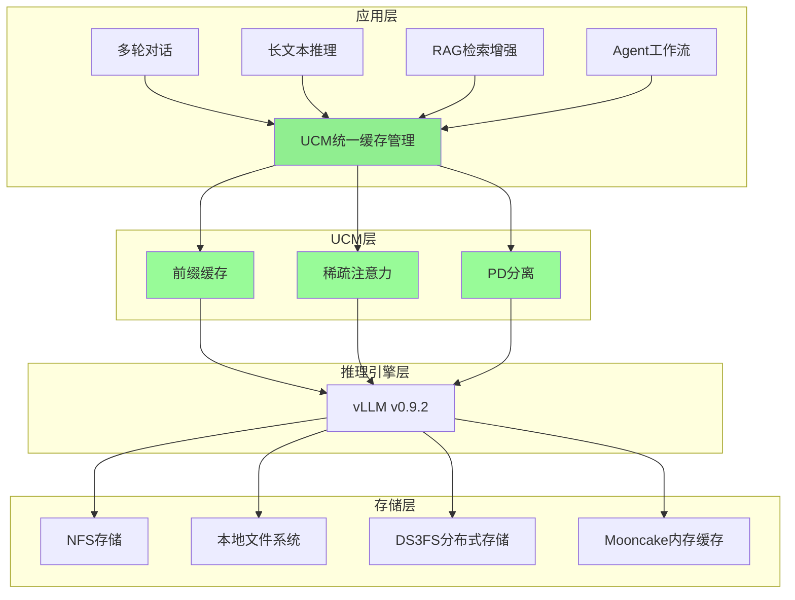

UCM的设计理念是**作为vLLM的插件式扩展**，通过Monkey Patching机制无缝集成到vLLM的推理流程中，无需修改vLLM的核心代码。这种设计使得UCM可以：

- 快速跟进vLLM的版本更新
- 独立开发和测试新的缓存策略
- 灵活选择不同的存储后端
- 支持多种硬件平台（NVIDIA GPU、华为Ascend、MACA等）

### 1.1.3 版本与兼容性

| 组件 | 版本要求 |
|------|---------|
| UCM | v0.2.0 |
| vLLM | v0.9.2 |
| Python | >= 3.10 |
| PyTorch | >= 2.0 |
| CUDA | >= 11.8（NVIDIA平台）|
| CANN | >= 8.0（Ascend平台）|

## 1.2 为什么需要统一缓存管理

### 1.2.1 LLM推理的内存困境

大语言模型推理面临着严峻的内存挑战。以LLaMA-70B模型为例，在处理长序列时的内存占用：

```
模型参数: 70B × 2 bytes (FP16) = 140 GB
KV Cache计算（假设32K序列长度）:
- 每层KV大小: 2 × 32K × 8192 × 2 bytes = 1 GB
- 总KV大小: 80层 × 1 GB = 80 GB

单个请求总内存: 140 + 80 = 220 GB
```

更关键的是，KV Cache的大小随序列长度**线性增长**：

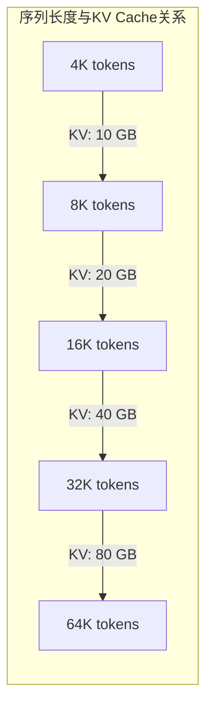

这意味着：
1. **单卡内存限制**：即使是80GB的A100，也只能处理有限的并发请求
2. **批处理受限**：KV Cache占用大量显存，压缩了batch size
3. **长序列困难**：128K甚至更长的上下文窗口难以支持

### 1.2.2 传统缓存方案的局限

传统的KV Cache优化方案主要有以下几种：

**方案一：vLLM的PagedAttention**

vLLM通过PagedAttention将KV Cache分块管理，解决了内存碎片问题：

```python
# vLLM的Block结构
class Block:
    block_id: int           # 块编号
    block_size: int         # 块大小（tokens数）
    ref_count: int          # 引用计数
    physical_block: int     # 物理块位置
```

但PagedAttention有其局限：
- 仍然将所有KV保留在GPU内存中
- 不支持跨请求的KV复用（除了自动前缀缓存）
- 无法处理超长序列

**方案二：前缀缓存（Automatic Prefix Caching）**

vLLM v0.5+支持自动前缀缓存，可以复用相同前缀的KV：

```
请求1: [System Prompt][User Query 1]
请求2: [System Prompt][User Query 2]
         ↑
      可复用部分
```

局限性：
- 仅支持连续前缀匹配
- KV必须完全相同才能复用
- 不支持部分匹配或相似匹配

**方案三：KV Cache压缩**

通过量化或蒸馏减少KV Cache的存储空间：

```
FP16 KV → INT8 KV：压缩50%
FP16 KV → INT4 KV：压缩75%
```

局限性：
- 精度损失
- 需要额外的量化/反量化开销
- 不同模型效果差异大

### 1.2.3 UCM的解决方案

UCM采用**多层次、多策略**的统一方案：

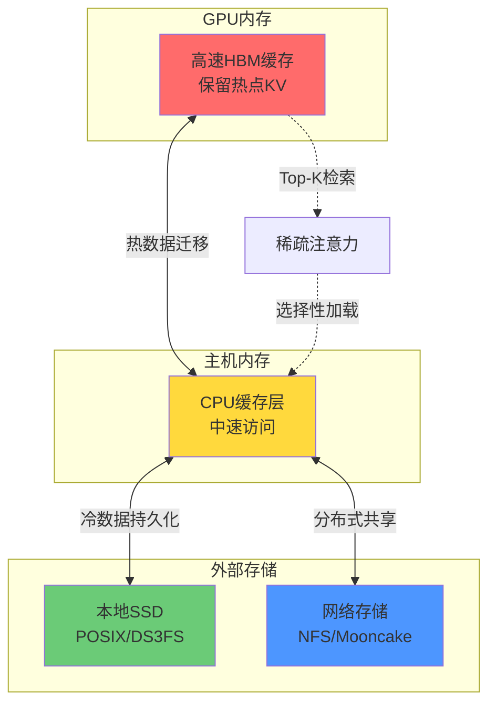

UCM的核心创新：

1. **存储分层**：GPU/CPU/外部存储的多级缓存架构
2. **内容寻址**：基于MD5哈希的块标识，支持跨请求复用
3. **稀疏检索**：智能选择重要的KV块，减少内存和计算
4. **异步传输**：加载/保存与计算重叠，隐藏I/O延迟

## 1.3 LLM推理中的KV Cache挑战

### 1.3.1 Transformer注意力机制回顾

标准的多头注意力（Multi-Head Attention, MHA）计算：

$$
\text{Attention}(Q, K, V) = \text{softmax}\left(\frac{QK^T}{\sqrt{d_k}}\right)V
$$

其中：
- $Q$: Query矩阵，形状 $[batch, seq\_len, num\_heads, head\_dim]$
- $K$: Key矩阵，形状 $[batch, context\_len, num\_heads, head\_dim]$
- $V$: Value矩阵，形状 $[batch, context\_len, num\_heads, head\_dim]$

在自回归生成过程中，每生成一个新token，都需要：

1. **计算新的Q、K、V**：对新token进行投影
2. **拼接历史KV**：将新的K、V添加到已有的KV Cache
3. **计算注意力**：新Q与所有K计算注意力权重，加权求和V

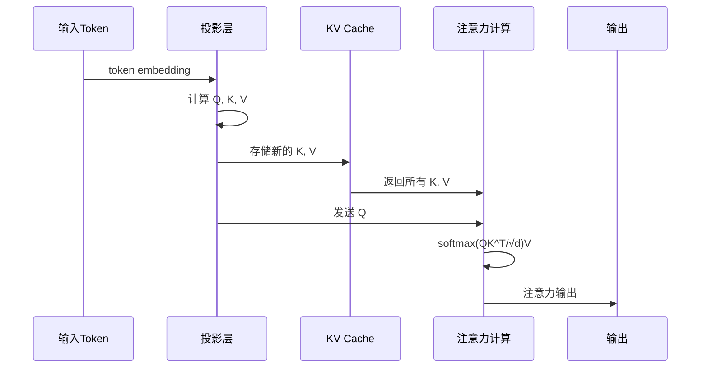

### 1.3.2 KV Cache的增长规律

**单层KV Cache大小计算**：

```
单层KV大小 = 2 × seq_len × num_kv_heads × head_dim × dtype_size
```

对于LLaMA-70B（使用GQA，8个KV头）：

```
单层KV = 2 × seq_len × 8 × 128 × 2 bytes
       = 4096 × seq_len bytes
       ≈ 4 KB × seq_len

80层总计 = 80 × 4 KB × seq_len
        = 320 KB × seq_len

32K序列 = 320 KB × 32K = 10 GB
128K序列 = 320 KB × 128K = 40 GB
```

**内存占用可视化**：

```
序列长度    单请求KV     32并发KV
─────────────────────────────────────
4K          1.25 GB      40 GB
8K          2.5 GB       80 GB
16K         5 GB         160 GB
32K         10 GB        320 GB
64K         20 GB        640 GB
128K        40 GB        1.28 TB
```

### 1.3.3 KV Cache的访问模式

自回归生成的KV Cache访问具有明显的特征：

**时间特性**：
- **预填充阶段（Prefill）**：一次性计算所有prompt tokens的KV
- **解码阶段（Decode）**：逐token生成，每次只计算1个新KV

**空间特性**：
- **全量访问**：每次解码需要访问所有历史KV
- **局部性弱**：长距离依赖，无法简单丢弃旧KV

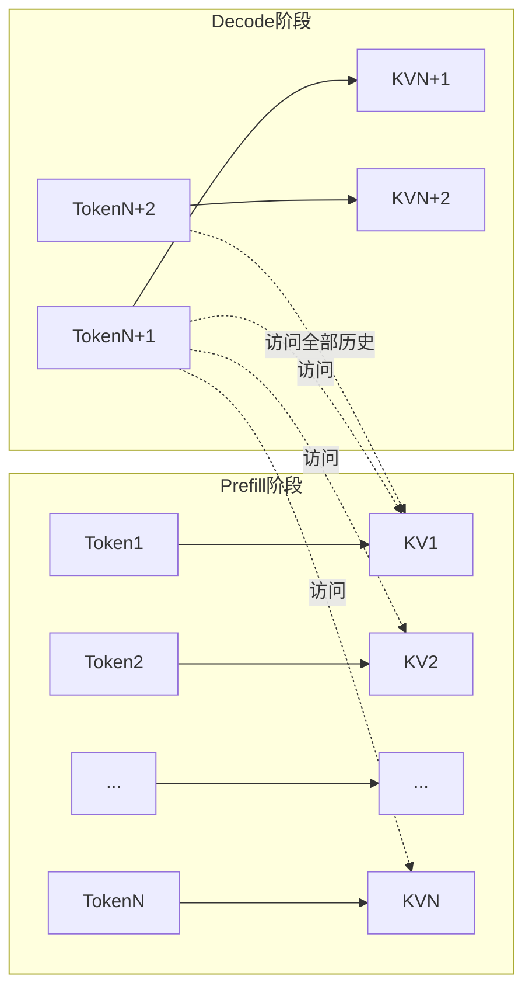

### 1.3.4 稀疏性的发现

尽管注意力机制理论上需要访问所有历史KV，但实际研究发现：

1. **注意力权重稀疏**：大部分注意力集中在少数token上
2. **局部性存在**：临近的token通常更重要
3. **锚点token**：某些特殊位置（如开头、分隔符）总是被关注

```
注意力权重分布示例（简化）:
───────────────────────────────────────────────────────
Token位置:  1    2    3   ...  100  ...  500  ...  1000
权重:      0.3  0.1  0.05 ... 0.02 ... 0.001 ... 0.4
           ↑                                      ↑
        开头锚点                               当前局部
───────────────────────────────────────────────────────
```

这种稀疏性为UCM的稀疏注意力算法提供了理论基础：
- **只保留重要的KV块**：通过Top-K选择
- **动态检索**：根据当前Query选择相关的历史KV
- **分层存储**：热点KV在GPU，冷KV在外部存储

## 1.4 项目愿景与设计目标

### 1.4.1 愿景

UCM的愿景是成为**LLM推理的KV Cache基础设施**，实现：

> "任何模型、任何场景、任何规模，都能高效利用KV Cache"

### 1.4.2 设计目标

**目标一：高性能**
- 3-10倍推理延迟降低
- 支持超长上下文（128K+）
- 高吞吐量批处理

**目标二：易用性**
- 与vLLM无缝集成
- 配置驱动，无需代码修改
- 完善的监控和调试支持

**目标三：可扩展性**
- 插件式算法架构
- 多存储后端支持
- 多硬件平台支持

**目标四：生产就绪**
- 稳定可靠
- 完善的测试覆盖
- 详细的文档

### 1.4.3 设计原则

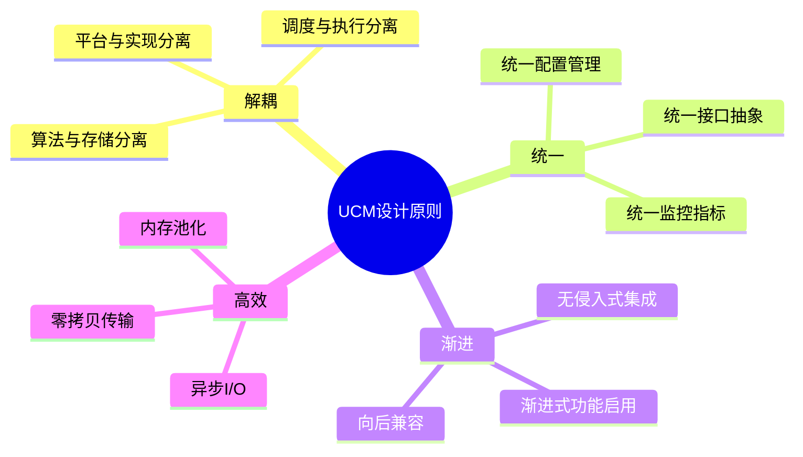

## 1.5 与业界方案的对比

### 1.5.1 方案对比矩阵

| 特性 | vLLM原生 | SGLang | FlashInfer | UCM |
|------|---------|--------|------------|-----|
| 前缀缓存 | ✓（自动） | ✓（RadixTree） | ✓ | ✓（增强） |
| 稀疏注意力 | ✗ | 部分支持 | ✓ | ✓（多算法） |
| 外部存储 | ✗ | ✗ | ✗ | ✓ |
| 多平台 | ✓ | 部分 | 部分 | ✓ |
| PD分离 | 部分 | ✓ | ✗ | ✓ |
| 无需训练 | N/A | ✓ | ✓ | ✓ |

### 1.5.2 UCM的独特优势

**优势一：多层次缓存架构**

```
其他方案:
┌─────────────────┐
│   GPU Memory    │  ← 所有KV都在这里
└─────────────────┘

UCM:
┌─────────────────┐
│   GPU HBM       │  ← 热点KV
├─────────────────┤
│   CPU Memory    │  ← 中温KV
├─────────────────┤
│   External SSD  │  ← 冷KV
├─────────────────┤
│   Network NFS   │  ← 持久化KV
└─────────────────┘
```

**优势二：统一的稀疏注意力框架**

UCM提供6种稀疏注意力算法，可根据场景选择：

| 算法 | 适用场景 | 特点 |
|------|---------|------|
| ESA | 长提示多轮对话 | 块表示稳定，精度高 |
| GSA | 解码阶段优化 | 全局Top-K，灵活 |
| GSA On-Device | 实时推理 | 零CPU开销，低延迟 |
| KVStar | 超长序列 | 维度剪枝，高效检索 |
| Blend | 缓存空间受限 | 选择性重计算 |
| ReRoPE | 位置编码优化 | Block-wise RoPE |

**优势三：生产级工程质量**

- 完整的C++底层实现，性能优化
- 多平台支持（CUDA、Ascend、MACA、MUSA）
- 完善的监控指标和可观测性
- 详细的文档和示例

### 1.5.3 典型应用场景

**场景一：多轮对话**

```
对话轮次: 10轮，每轮500 tokens
传统方案: 每轮重新计算所有KV
UCM方案: 复用历史对话的KV Cache

性能对比:
- 传统: 平均延迟 2s
- UCM(PC): 平均延迟 0.5s（4x提升）
```

**场景二：长文档问答**

```
文档长度: 100K tokens
传统方案: GPU OOM 或 极慢
UCM方案: 稀疏注意力 + 外部存储

性能对比:
- 传统: 不可行/延迟 30s
- UCM(GSA): 延迟 5s（6x提升）
```

**场景三：RAG检索增强**

```
知识库: 多个文档块
传统方案: 每个块独立处理
UCM方案: Blend缓存混合

性能对比:
- 传统: 重复计算公共部分
- UCM(Blend): 跳过80%已缓存计算
```

---

# 第2章：vLLM基础与KV Cache原理

## 2.1 vLLM架构概述

### 2.1.1 vLLM简介

vLLM（Virtual Large Language Model）是一个高性能的LLM推理和服务引擎。它的核心创新是**PagedAttention**，通过将KV Cache分页管理，解决了传统推理框架的内存碎片问题。

vLLM的主要特性：
- **高吞吐量**：通过连续批处理实现高效的GPU利用
- **低延迟**：优化的内存管理减少等待时间
- **灵活部署**：支持多种模型和硬件配置

### 2.1.2 vLLM架构图

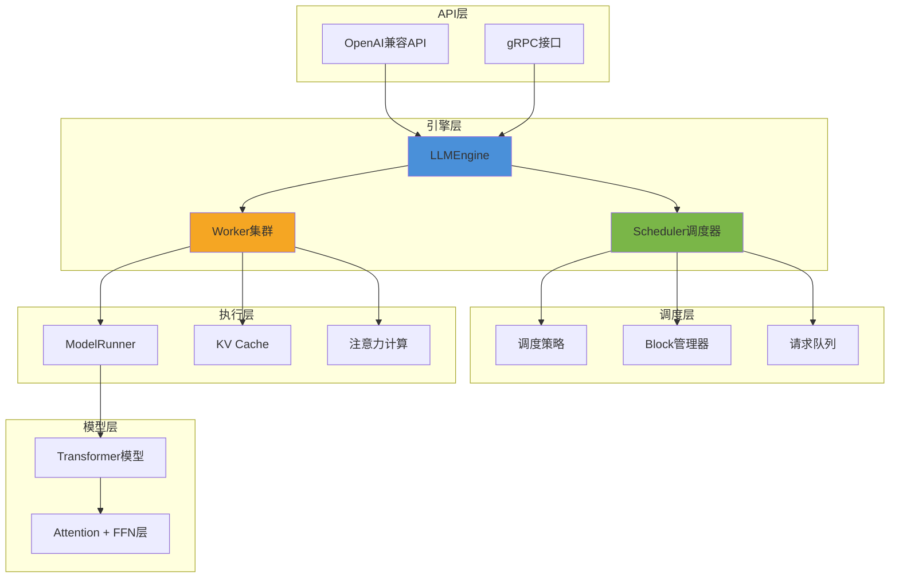

### 2.1.3 核心组件详解

**LLMEngine**

LLMEngine是vLLM的核心引擎，负责协调所有组件：

```python
class LLMEngine:
    def __init__(self, ...):
        self.scheduler = Scheduler(...)      # 调度器
        self.model_executor = ModelExecutor(...)  # 执行器
        self.tokenizer = Tokenizer(...)      # 分词器

    def add_request(self, request_id, prompt, ...):
        """添加推理请求"""
        pass

    def step(self):
        """执行一步推理"""
        # 1. 调度器选择要处理的请求
        scheduler_outputs = self.scheduler.schedule()

        # 2. 执行模型前向传播
        outputs = self.model_executor.execute(scheduler_outputs)

        # 3. 处理输出，更新状态
        return self._process_outputs(outputs)
```

**Scheduler调度器**

调度器负责决定每一步处理哪些请求：

```python
class Scheduler:
    def __init__(self, ...):
        self.running: List[SequenceGroup] = []    # 正在运行的请求
        self.waiting: deque[SequenceGroup] = deque()  # 等待中的请求
        self.swapped: List[SequenceGroup] = []    # 被换出的请求
        self.block_manager = BlockManager(...)    # 块管理器

    def schedule(self) -> SchedulerOutputs:
        """调度决策"""
        # 1. 检查running请求是否可以继续
        running_queue = self._schedule_running()

        # 2. 尝试恢复swapped请求
        swapped_in = self._schedule_swapped()

        # 3. 尝试调度waiting请求
        prefills = self._schedule_prefills()

        return SchedulerOutputs(running_queue, swapped_in, prefills)
```

**ModelRunner模型执行器**

ModelRunner在GPU上执行实际的模型计算：

```python
class ModelRunner:
    def __init__(self, ...):
        self.model = load_model(...)
        self.kv_cache = KVCache(...)

    def execute_model(self, scheduler_output):
        """执行模型前向传播"""
        # 1. 准备输入
        input_ids, positions = self._prepare_inputs(scheduler_output)

        # 2. 前向传播
        with set_forward_context(self.attn_metadata):
            hidden_states = self.model.forward(input_ids, positions)

        # 3. 采样输出token
        next_tokens = self.sampler(hidden_states)

        return next_tokens
```

### 2.1.4 vLLM的请求生命周期

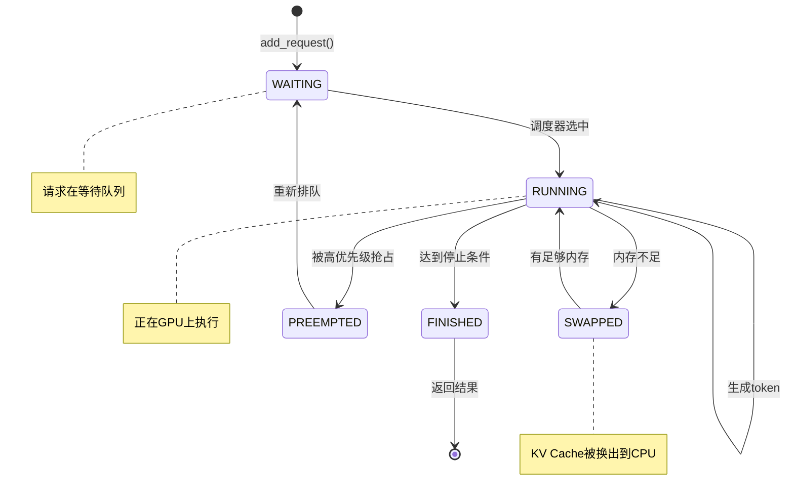

## 2.2 PagedAttention原理详解

### 2.2.1 传统注意力的内存问题

在传统的Transformer推理中，KV Cache需要连续的内存空间：

```
传统KV Cache分配:
├────────────────────────────────────────────────┤
│              Request 1 KV Cache                │
├────────────────────────────────────────────────┤
│     碎片     │       Request 2 KV Cache        │
├──────────────┼─────────────────────────────────┤
│    碎片      │  碎片  │  Request 3 KV Cache     │
├──────────────┴────────┴────────────────────────┤

问题:
1. 内存碎片：不同长度请求导致碎片
2. 预分配：需要按最大长度预分配
3. 浪费严重：实际使用远小于预分配
```

### 2.2.2 PagedAttention的核心思想

PagedAttention借鉴了操作系统的虚拟内存分页机制：

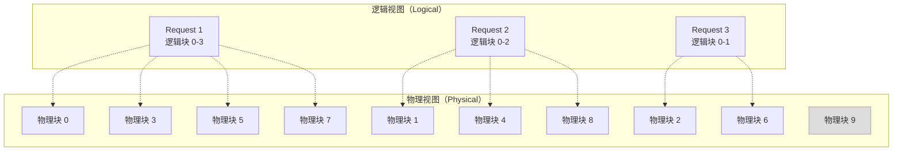

**关键概念**：

1. **逻辑块（Logical Block）**：每个请求看到的连续块序列
2. **物理块（Physical Block）**：GPU内存中的实际存储位置
3. **块表（Block Table）**：逻辑块到物理块的映射

### 2.2.3 Block的数据结构

```python
# 单个Block的内存布局
class KVCacheBlock:
    """
    KV Cache Block 内存布局:

    K Cache:
    ┌─────────────────────────────────────────┐
    │ Token 0: [head0][head1]...[headN-1]     │
    │ Token 1: [head0][head1]...[headN-1]     │
    │ ...                                     │
    │ Token B-1: [head0][head1]...[headN-1]   │
    └─────────────────────────────────────────┘

    V Cache: 相同布局

    其中:
    - B = block_size (例如16 tokens)
    - N = num_kv_heads (例如8)
    - 每个head的维度 = head_dim (例如128)
    """

    def __init__(self, block_size, num_kv_heads, head_dim, dtype):
        self.block_size = block_size
        self.num_kv_heads = num_kv_heads
        self.head_dim = head_dim

        # K和V各占用的字节数
        single_size = block_size * num_kv_heads * head_dim * dtype.itemsize
        self.k_cache = torch.empty(single_size, dtype=dtype)
        self.v_cache = torch.empty(single_size, dtype=dtype)
```

**Block大小的选择**：

```
Block Size选择权衡:

小Block Size (如8):
+ 更细粒度的内存管理
+ 更少的内存浪费
- 更多的块表开销
- 更多的随机访问

大Block Size (如64):
+ 更好的内存访问局部性
+ 更少的块表开销
- 更多的内存浪费
- 粒度较粗

vLLM默认: 16 tokens/block
UCM推荐: 16-128 tokens/block（根据场景）
```

### 2.2.4 BlockManager块管理器

BlockManager负责管理物理块的分配和回收：

```python
class BlockManager:
    def __init__(self, num_gpu_blocks, num_cpu_blocks, block_size):
        # GPU块池
        self.gpu_allocator = BlockAllocator(
            device="cuda",
            num_blocks=num_gpu_blocks,
            block_size=block_size
        )

        # CPU块池（用于swap）
        self.cpu_allocator = BlockAllocator(
            device="cpu",
            num_blocks=num_cpu_blocks,
            block_size=block_size
        )

        # 每个sequence的块表
        self.block_tables: Dict[int, BlockTable] = {}

    def allocate(self, seq_id: int, num_blocks: int) -> List[int]:
        """分配指定数量的物理块"""
        blocks = self.gpu_allocator.allocate(num_blocks)
        self.block_tables[seq_id].extend(blocks)
        return blocks

    def free(self, seq_id: int):
        """释放sequence的所有块"""
        blocks = self.block_tables.pop(seq_id)
        self.gpu_allocator.free(blocks)

    def swap_out(self, seq_id: int) -> Dict[int, int]:
        """将GPU块换出到CPU"""
        gpu_blocks = self.block_tables[seq_id]
        cpu_blocks = self.cpu_allocator.allocate(len(gpu_blocks))

        # 建立映射关系
        mapping = dict(zip(gpu_blocks, cpu_blocks))

        # 异步复制数据
        self._copy_blocks(gpu_blocks, cpu_blocks, "cuda", "cpu")

        # 释放GPU块
        self.gpu_allocator.free(gpu_blocks)
        self.block_tables[seq_id] = cpu_blocks

        return mapping
```

### 2.2.5 PagedAttention的注意力计算

PagedAttention修改了注意力计算的方式，支持非连续的KV Cache：

```python
def paged_attention(
    query: torch.Tensor,          # [num_tokens, num_heads, head_dim]
    key_cache: torch.Tensor,      # [num_blocks, block_size, num_kv_heads, head_dim]
    value_cache: torch.Tensor,    # [num_blocks, block_size, num_kv_heads, head_dim]
    block_tables: torch.Tensor,   # [num_seqs, max_num_blocks]
    context_lens: torch.Tensor,   # [num_seqs]
    scale: float,
):
    """
    Paged Attention前向传播

    核心思路:
    1. 根据block_table找到每个序列的物理块
    2. 从非连续的物理块中gather KV
    3. 计算注意力权重和输出
    """
    # CUDA kernel实现，高效处理非连续访问
    output = torch.ops.vllm.paged_attention(
        query, key_cache, value_cache,
        block_tables, context_lens, scale
    )
    return output
```

**CUDA Kernel优化**：

vLLM使用专门的CUDA kernel优化PagedAttention：

```cuda
// 简化的PagedAttention kernel伪代码
__global__ void paged_attention_kernel(
    float* __restrict__ output,
    const float* __restrict__ query,
    const float* __restrict__ key_cache,
    const float* __restrict__ value_cache,
    const int* __restrict__ block_table,
    ...
) {
    int seq_idx = blockIdx.x;
    int head_idx = blockIdx.y;
    int tid = threadIdx.x;

    // 1. 加载query到shared memory
    __shared__ float q_smem[HEAD_DIM];
    load_query(q_smem, query, seq_idx, head_idx);

    // 2. 遍历所有块，计算注意力
    float max_score = -INFINITY;
    float sum_exp = 0.0f;
    float acc[HEAD_DIM] = {0};

    for (int block_idx = 0; block_idx < num_blocks; block_idx++) {
        // 从block_table获取物理块位置
        int physical_block = block_table[seq_idx * max_blocks + block_idx];

        // 加载K块
        float* k_block = key_cache + physical_block * block_stride;

        // 计算QK
        for (int tok = 0; tok < BLOCK_SIZE; tok++) {
            float score = dot_product(q_smem, k_block + tok * head_stride);
            score = score * scale;

            // Online softmax
            float old_max = max_score;
            max_score = max(max_score, score);
            sum_exp = sum_exp * exp(old_max - max_score) + exp(score - max_score);

            // 累积value
            float* v_block = value_cache + physical_block * block_stride;
            for (int d = 0; d < HEAD_DIM; d++) {
                acc[d] += exp(score - max_score) * v_block[tok * head_stride + d];
            }
        }
    }

    // 3. 写回输出
    for (int d = 0; d < HEAD_DIM; d++) {
        output[seq_idx * num_heads * HEAD_DIM + head_idx * HEAD_DIM + d] =
            acc[d] / sum_exp;
    }
}
```

## 2.3 KV Cache的内存管理

### 2.3.1 内存布局

vLLM将所有KV Cache统一管理在预分配的张量中：

```python
class KVCache:
    def __init__(self, num_layers, num_blocks, block_size,
                 num_kv_heads, head_dim, dtype, device):
        # 形状: [num_layers, 2, num_blocks, block_size, num_kv_heads, head_dim]
        # 2 表示 K 和 V
        self.cache = torch.empty(
            (num_layers, 2, num_blocks, block_size, num_kv_heads, head_dim),
            dtype=dtype,
            device=device
        )

    def get_layer_cache(self, layer_idx):
        """获取某一层的KV Cache"""
        k_cache = self.cache[layer_idx, 0]  # [num_blocks, block_size, heads, dim]
        v_cache = self.cache[layer_idx, 1]
        return k_cache, v_cache
```

**内存布局可视化**：

```
KV Cache张量布局:
┌─────────────────────────────────────────────────────────┐
│ Layer 0                                                 │
│ ├── K: [Block0][Block1][Block2]...[BlockN-1]           │
│ └── V: [Block0][Block1][Block2]...[BlockN-1]           │
├─────────────────────────────────────────────────────────┤
│ Layer 1                                                 │
│ ├── K: [Block0][Block1][Block2]...[BlockN-1]           │
│ └── V: [Block0][Block1][Block2]...[BlockN-1]           │
├─────────────────────────────────────────────────────────┤
│ ...                                                     │
├─────────────────────────────────────────────────────────┤
│ Layer L-1                                               │
│ ├── K: ...                                              │
│ └── V: ...                                              │
└─────────────────────────────────────────────────────────┘
```

### 2.3.2 Copy-on-Write优化

对于前缀缓存等共享场景，vLLM使用Copy-on-Write（CoW）机制：

```python
class CopyOnWriteBlock:
    """
    Copy-on-Write块管理

    场景: 多个请求共享相同的前缀
    - 请求A: [System Prompt][Query A]
    - 请求B: [System Prompt][Query B]

    共享System Prompt的KV块，当任一方需要修改时才复制
    """

    def __init__(self):
        self.ref_count = 1  # 引用计数
        self.is_cow = False  # 是否为CoW块

    def acquire(self):
        """增加引用"""
        self.ref_count += 1

    def release(self) -> bool:
        """释放引用，返回是否可以释放物理块"""
        self.ref_count -= 1
        return self.ref_count == 0

    def copy_on_write(self, allocator) -> 'CopyOnWriteBlock':
        """写时复制"""
        if self.ref_count == 1:
            # 独占，无需复制
            return self

        # 分配新块并复制数据
        new_block = allocator.allocate(1)[0]
        copy_data(self, new_block)

        # 减少原块引用
        self.release()

        return new_block
```

### 2.3.3 内存碎片处理

vLLM的内存管理策略减少了碎片，但UCM进一步优化：

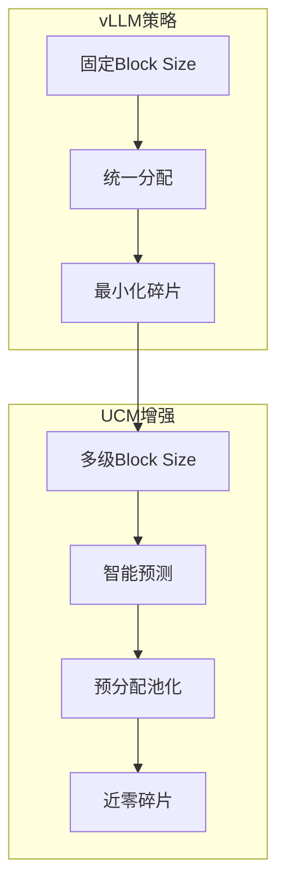

## 2.4 Block的概念与组织

### 2.4.1 Block在UCM中的扩展

UCM在vLLM Block概念基础上增加了**内容寻址**能力：

```python
# UCM的Block标识
class UCMBlock:
    def __init__(self):
        # vLLM的物理块ID
        self.vllm_block_id: int = -1

        # UCM的内容哈希（MD5）
        self.content_hash: bytes = b""

        # 块内的token IDs
        self.token_ids: List[int] = []

        # 是否在外部存储中存在
        self.in_external_storage: bool = False

    def compute_hash(self, parent_hash: bytes, token_ids: List[int]) -> bytes:
        """
        计算块的内容哈希

        哈希链:
        Block0: hash(seed, tokens[0:16])
        Block1: hash(Block0_hash, tokens[16:32])
        Block2: hash(Block1_hash, tokens[32:48])
        ...
        """
        import hashlib
        content = parent_hash + bytes(token_ids)
        return hashlib.md5(content).digest()
```

### 2.4.2 Block哈希链

UCM使用链式哈希确保块的唯一性和可验证性：

```mermaid
graph LR
    subgraph "哈希链结构"
        Seed[种子哈希<br/>hash(meta)] --> B0[Block 0<br/>hash(seed, tok0-15)]
        B0 --> B1[Block 1<br/>hash(B0, tok16-31)]
        B1 --> B2[Block 2<br/>hash(B1, tok32-47)]
        B2 --> B3[Block 3<br/>hash(B2, tok48-63)]
    end
```

**哈希计算的代码实现**：

```python
class RequestHasher:
    """UCM请求哈希器"""

    def __init__(self, vllm_config, rank_id):
        # 元数据作为种子
        model = vllm_config.model
        world_size = vllm_config.tensor_parallel_size
        dtype = str(vllm_config.dtype)

        meta = f"{model}:{world_size}:{dtype}:{rank_id}"
        self.meta_bytes = meta.encode("utf-8")

    def compute_block_hashes(self, token_ids: List[int],
                             block_size: int) -> List[bytes]:
        """计算所有完整块的哈希"""
        import hashlib

        # 种子哈希
        parent_hash = hashlib.md5(
            b"UCMHASHSEED" + self.meta_bytes
        ).digest()

        block_hashes = []
        for start in range(0, len(token_ids), block_size):
            end = start + block_size
            if end > len(token_ids):
                break  # 只处理完整块

            block_tokens = token_ids[start:end]
            content = parent_hash + bytes(block_tokens)
            block_hash = hashlib.md5(content).digest()

            block_hashes.append(block_hash)
            parent_hash = block_hash  # 链式传递

        return block_hashes
```

### 2.4.3 Block生命周期

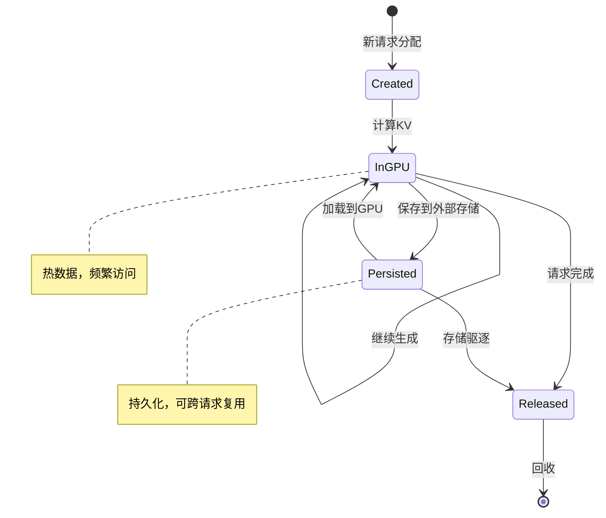

## 2.5 前缀缓存机制

### 2.5.1 vLLM自动前缀缓存

vLLM v0.5+支持自动前缀缓存（Automatic Prefix Caching, APC）：

```python
class AutomaticPrefixCaching:
    """
    vLLM的自动前缀缓存实现

    核心思路:
    1. 使用Radix Tree存储已计算的前缀
    2. 新请求匹配最长公共前缀
    3. 只计算未命中的部分
    """

    def __init__(self):
        self.radix_tree = RadixTree()

    def match_prefix(self, token_ids: List[int]) -> Tuple[int, List[int]]:
        """
        查找最长匹配前缀

        Returns:
            matched_len: 匹配的token数
            block_ids: 可复用的物理块ID
        """
        node = self.radix_tree.root
        matched_len = 0
        block_ids = []

        for i in range(0, len(token_ids), self.block_size):
            block_tokens = tuple(token_ids[i:i+self.block_size])

            if block_tokens in node.children:
                node = node.children[block_tokens]
                matched_len += self.block_size
                block_ids.append(node.block_id)
            else:
                break

        return matched_len, block_ids
```

### 2.5.2 UCM的增强前缀缓存

UCM在vLLM APC基础上增加了：

1. **外部存储持久化**：前缀可以保存到磁盘/NFS
2. **跨实例共享**：多个vLLM实例共享前缀缓存
3. **LRU驱逐策略**：智能管理缓存空间

```python
class UCMPrefixCache:
    """UCM增强的前缀缓存"""

    def __init__(self, store: UcmKVStoreBaseV1):
        self.store = store  # 外部存储后端
        self.local_cache = {}  # 本地内存缓存

    def lookup(self, block_hashes: List[bytes]) -> List[bool]:
        """
        查询块是否存在

        先查本地缓存，再查外部存储
        """
        results = []
        external_queries = []

        for i, hash_ in enumerate(block_hashes):
            if hash_ in self.local_cache:
                results.append(True)
            else:
                results.append(None)  # 待查询
                external_queries.append((i, hash_))

        # 批量查询外部存储
        if external_queries:
            hashes = [h for _, h in external_queries]
            external_results = self.store.lookup(hashes)

            for (i, _), exists in zip(external_queries, external_results):
                results[i] = exists

        return results

    def load_blocks(self, block_hashes: List[bytes],
                   dst_blocks: List[int]) -> Task:
        """从外部存储加载块到GPU"""
        return self.store.load_data(
            block_ids=block_hashes,
            shard_index=[0] * len(block_hashes),
            dst_addr=self._compute_addresses(dst_blocks)
        )
```

### 2.5.3 前缀缓存性能分析

```
场景: 多轮对话，固定System Prompt
System Prompt: 500 tokens
用户轮次: 每轮平均100 tokens

传统方案（无缓存）:
  轮次1: 计算 500 tokens
  轮次2: 计算 600 tokens（重复500）
  轮次3: 计算 700 tokens（重复500）
  ...
  总计算: 500 + 600 + 700 + ... + 1400 = 9500 tokens

UCM前缀缓存:
  轮次1: 计算 500 tokens，缓存
  轮次2: 复用 500 + 计算 100 = 100 tokens
  轮次3: 复用 500 + 计算 100 = 100 tokens
  ...
  总计算: 500 + 100 × 9 = 1400 tokens

加速比: 9500 / 1400 ≈ 6.8x
```

## 2.6 vLLM的扩展点与接口设计

### 2.6.1 KVConnector接口

vLLM v0.9+引入了KVConnector接口，用于自定义KV Cache管理：

```python
class KVConnectorBase_V1(ABC):
    """vLLM的KV连接器基类"""

    class KVConnectorRole(Enum):
        SCHEDULER = 0  # 调度器进程
        WORKER = 1     # 执行器进程

    def __init__(self, vllm_config, role):
        self.vllm_config = vllm_config
        self.role = role

    # === 调度器端方法 ===

    @abstractmethod
    def get_num_new_matched_tokens(
        self,
        request: Request,
        num_computed_tokens: int
    ) -> Tuple[int, bool]:
        """查询外部存储中有多少token可以复用"""
        pass

    @abstractmethod
    def build_connector_meta(
        self,
        scheduler_output: SchedulerOutput
    ) -> KVConnectorMetadata:
        """构建调度器到Worker的元数据"""
        pass

    # === Worker端方法 ===

    @abstractmethod
    def register_kv_caches(self, kv_caches: Dict[str, torch.Tensor]):
        """注册KV Cache张量"""
        pass

    @abstractmethod
    def start_load_kv(self, forward_context: ForwardContext):
        """开始异步加载KV"""
        pass

    @abstractmethod
    def wait_for_save(self):
        """等待保存完成"""
        pass
```

### 2.6.2 扩展点分布

```mermaid
graph TB
    subgraph "Scheduler扩展点"
        S1[get_num_new_matched_tokens<br/>查询外部命中]
        S2[build_connector_meta<br/>构建元数据]
        S3[update_state_after_alloc<br/>分配后更新]
    end

    subgraph "Worker扩展点"
        W1[register_kv_caches<br/>注册KV缓存]
        W2[start_load_kv<br/>启动加载]
        W3[wait_for_layer_load<br/>层级等待]
        W4[save_kv_layer<br/>保存KV层]
        W5[wait_for_save<br/>等待保存]
    end

    subgraph "Attention层扩展点"
        A1[attention_begin<br/>注意力开始前]
        A2[attention_finished<br/>注意力完成后]
    end

    S1 --> S2 --> S3
    W1 --> W2 --> W3 --> W4 --> W5
    A1 --> A2
```

### 2.6.3 UCM如何利用扩展点

UCM通过实现KVConnector接口和额外的Sparse接口，完成集成：

```python
class UCMConnector(KVConnectorBase_V1):
    """UCM的主连接器"""

    def __init__(self, vllm_config, role):
        super().__init__(vllm_config, role)

        # 初始化存储后端
        self.store = self._init_store()

        # 初始化哈希器
        self.hasher = RequestHasher(vllm_config, self.rank)

        # 请求元数据
        self.request_metas: Dict[str, RequestMeta] = {}

    def get_num_new_matched_tokens(self, request, num_computed_tokens):
        # 1. 计算块哈希
        block_hashes = self.hasher.compute_block_hashes(
            request.prompt_token_ids,
            self.block_size
        )

        # 2. 查询外部存储
        lookup_results = self.store.lookup(block_hashes)

        # 3. 统计连续命中
        hit_blocks = 0
        for exists in lookup_results:
            if not exists:
                break
            hit_blocks += 1

        return hit_blocks * self.block_size, False

    def start_load_kv(self, forward_context):
        # 获取需要加载的块
        meta = self._get_connector_metadata()

        for req_id, dispatch_meta in meta.request_meta.items():
            ucm_block_ids, vllm_block_ids = dispatch_meta.load_block_ids

            if ucm_block_ids:
                # 计算目标地址
                addrs = self._compute_addresses(vllm_block_ids)

                # 异步加载
                task = self.store.load_data(ucm_block_ids, [0]*len(ucm_block_ids), addrs)
                self.pending_loads[req_id] = task
```

## 2.7 为什么UCM选择集成vLLM

### 2.7.1 vLLM的优势

1. **广泛使用**：工业界最流行的LLM推理框架
2. **PagedAttention**：优秀的内存管理基础
3. **良好的扩展性**：KVConnector等接口设计
4. **活跃的社区**：持续更新和优化

### 2.7.2 集成策略选择

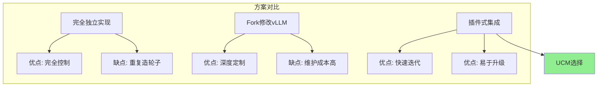

### 2.7.3 Monkey Patching的权衡

UCM使用Monkey Patching而非直接修改vLLM代码：

**优点**：
- 无需维护vLLM fork
- 可以快速跟进vLLM版本
- 用户无需替换vLLM

**缺点**：
- 依赖vLLM内部实现细节
- 版本升级可能需要适配
- 调试相对困难

**UCM的解决策略**：
- 详细的版本兼容性矩阵
- 完善的测试覆盖
- 清晰的补丁文档

---

# 第二部分：核心架构

---

# 第3章：UCM整体架构

## 3.1 模块化设计理念

### 3.1.1 设计哲学

UCM采用**分层解耦**的模块化设计，核心原则：

1. **关注点分离**：每个模块专注于单一职责
2. **接口抽象**：模块间通过抽象接口通信
3. **可插拔**：算法和存储后端可独立替换
4. **渐进增强**：功能可按需启用

### 3.1.2 架构全景图

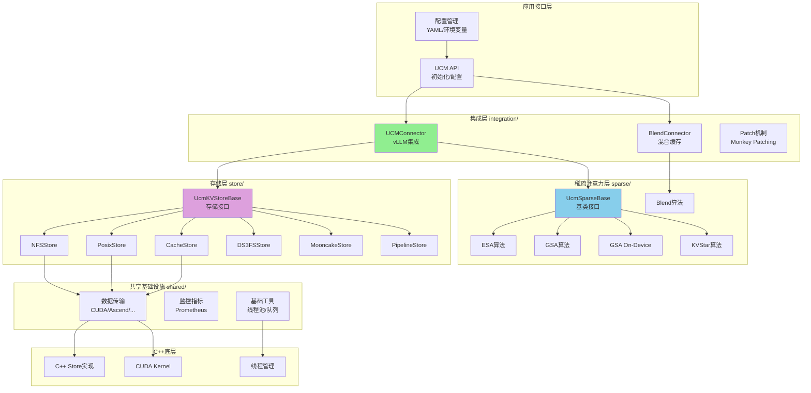

## 3.2 核心模块划分

### 3.2.1 目录结构

```
ucm/
├── __init__.py              # 包初始化
├── logger.py                # 日志配置
├── utils.py                 # 通用工具函数
├── CMakeLists.txt          # C++构建配置
│
├── integration/             # vLLM集成层
│   └── vllm/
│       ├── ucm_connector.py    # 主连接器(939行)
│       ├── blend_connector.py  # 混合缓存连接器(509行)
│       └── patch/              # vLLM补丁
│           ├── apply_patch.py
│           └── patch_funcs/
│               └── v092/
│                   ├── vllm_patch.py        # CUDA补丁
│                   ├── vllm_ascend_patch.py # Ascend补丁
│                   └── vllm_rerope_patch.py # ReRoPE补丁
│
├── store/                   # 存储后端层
│   ├── ucmstore.py          # V0接口
│   ├── ucmstore_v1.py       # V1接口
│   ├── factory.py           # 存储工厂
│   ├── factory_v1.py        # V1工厂
│   ├── nfsstore/            # NFS存储
│   ├── posix/               # POSIX存储
│   ├── cache/               # 高速缓存
│   ├── ds3fs/               # DS3FS存储
│   ├── mooncakestore/       # Mooncake存储
│   ├── pipeline/            # 流水线存储
│   ├── pcstore/             # 前缀缓存存储
│   └── detail/              # 共享实现细节
│
├── sparse/                  # 稀疏注意力层
│   ├── base.py              # 基类(245行)
│   ├── state.py             # 状态管理
│   ├── factory.py           # 算法工厂
│   ├── utils.py             # 工具函数
│   ├── esa/                 # ESA算法
│   ├── gsa/                 # GSA算法
│   ├── gsa_on_device/       # GSA On-Device
│   ├── kvstar/              # KVStar算法
│   ├── blend/               # Blend算法
│   └── rerope/              # ReRoPE
│
├── shared/                  # 共享基础设施
│   ├── metrics/             # 监控指标
│   ├── trans/               # 数据传输
│   │   ├── cuda/            # CUDA实现
│   │   ├── ascend/          # Ascend实现
│   │   ├── maca/            # MACA实现
│   │   └── simu/            # 模拟实现
│   ├── infra/               # 基础设施
│   │   ├── thread/          # 线程池
│   │   └── template/        # 模板类
│   └── vendor/              # 第三方依赖
│
└── pd/                      # PD分离
    └── toy_proxy_server.py  # 示例代理服务器
```

### 3.2.2 integration模块详解

**职责**：与vLLM集成的桥梁

```python
# integration/vllm/ucm_connector.py 核心结构

class UCMConnectorMetadata(KVConnectorMetadata):
    """调度器到Worker的元数据传递"""
    request_meta: Dict[str, RequestDispatchMeta]

class UCMDirectConnector(KVConnectorBase_V1):
    """直接连接器实现"""

    def __init__(self, vllm_config, role):
        # 存储后端初始化
        self.store = self._init_store()

        # 请求哈希器
        self.hasher = RequestHasher(vllm_config, self.rank)

        # KV Cache指针
        self.k_base_ptrs: np.ndarray = None
        self.v_base_ptrs: np.ndarray = None

    # 实现KVConnector接口的所有方法...

class UCMConnector:
    """工厂类，根据配置选择具体实现"""

    @classmethod
    def create(cls, vllm_config, role) -> KVConnectorBase_V1:
        config = vllm_config.kv_transfer_config.kv_connector_extra_config

        if "blend" in config:
            return UCMBlendConnector(vllm_config, role)
        else:
            return UCMDirectConnector(vllm_config, role)
```

### 3.2.3 store模块详解

**职责**：外部存储的统一抽象

```python
# store/ucmstore_v1.py 核心接口

class Task(ABC):
    """异步任务句柄"""
    pass

class UcmKVStoreBaseV1(ABC):
    """存储后端抽象基类"""

    @abstractmethod
    def cc_store(self) -> int:
        """返回C++底层指针"""

    @abstractmethod
    def lookup(self, block_ids: List[bytes]) -> List[bool]:
        """查询块是否存在"""

    @abstractmethod
    def prefetch(self, block_ids: List[bytes]) -> None:
        """预取块到缓存"""

    @abstractmethod
    def load(self, block_ids, shard_index, dst_tensor) -> Task:
        """加载KV到设备张量"""

    @abstractmethod
    def dump(self, block_ids, shard_index, src_tensor) -> Task:
        """保存KV到存储"""

    @abstractmethod
    def load_data(self, block_ids, shard_index, dst_addr) -> Task:
        """低级加载到设备地址"""

    @abstractmethod
    def dump_data(self, block_ids, shard_index, src_addr) -> Task:
        """低级保存从设备地址"""

    @abstractmethod
    def wait(self, task: Task) -> None:
        """阻塞等待任务完成"""

    @abstractmethod
    def check(self, task: Task) -> bool:
        """非阻塞检查任务状态"""
```

### 3.2.4 sparse模块详解

**职责**：稀疏注意力算法框架

```python
# sparse/base.py 核心接口

class UcmSparseRole(Enum):
    SCHEDULER = 0  # 调度器进程
    WORKER = 1     # Worker进程

class UcmSparseMetadata(ABC):
    """Scheduler到Worker的稀疏元数据"""
    pass

class UcmSparseBase(ABC):
    """稀疏注意力基类"""

    def __init__(self, vllm_config, role):
        self._vllm_config = vllm_config
        self._role = role

    # === Worker端方法 ===

    def bind_sparse_metadata(self, metadata: UcmSparseMetadata):
        """绑定从Scheduler传来的元数据"""

    def register_kv_caches(self, kv_caches: Dict[str, torch.Tensor]):
        """注册KV Cache张量"""

    def execute_begin(self, scheduler_output):
        """模型执行开始前"""

    def execute_finished(self, logits_indices) -> torch.Tensor:
        """模型执行完成后"""

    def attention_begin(self, query, key, value, layer_name, ...):
        """注意力计算开始前"""

    def attention_finished(self, query, key, value, attn_output, ...):
        """注意力计算完成后"""

    # === Scheduler端方法 ===

    @abstractmethod
    def request_begin(self, request_id, prompt_token_ids):
        """请求开始"""

    def estimate_num_slots_sparsed(self, request) -> int:
        """估计稀疏后需要的槽位数"""

    def build_sparse_meta(self, scheduler_output, ...) -> UcmSparseMetadata:
        """构建稀疏元数据"""
```

## 3.3 数据流与控制流

### 3.3.1 请求处理数据流

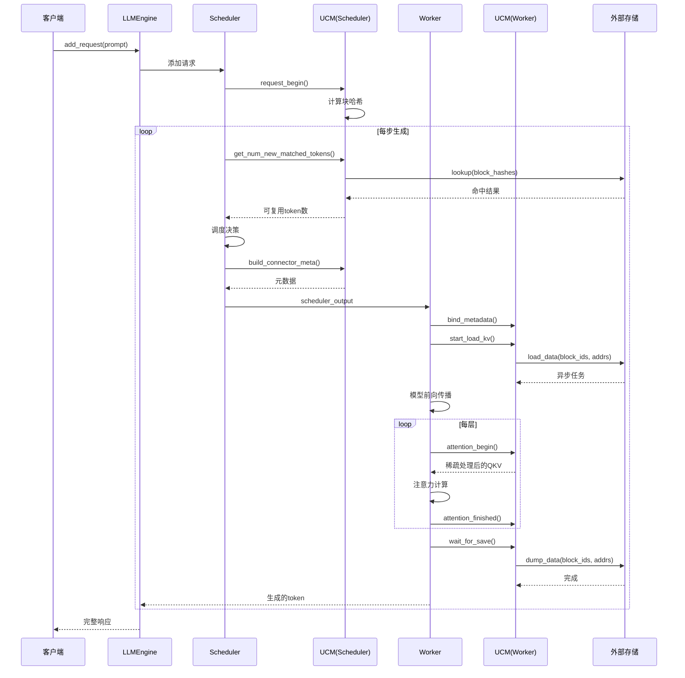

### 3.3.2 控制流详解

**Scheduler控制流**：

```python
class Scheduler:
    def schedule(self) -> SchedulerOutputs:
        # 1. 处理running请求
        for seq_group in self.running:
            # UCM: 查询外部命中
            if has_kv_connector():
                external_tokens = connector.get_num_new_matched_tokens(
                    seq_group.request,
                    seq_group.num_computed_tokens
                )
                # 更新可跳过的计算量

        # 2. 调度新请求
        scheduled = self._schedule_prefills()

        # 3. 构建输出
        scheduler_output = SchedulerOutput(...)

        # UCM: 附加连接器元数据
        if has_kv_connector():
            scheduler_output.kv_connector_metadata = \
                connector.build_connector_meta(scheduler_output)

        # UCM: 附加稀疏元数据
        if has_ucm_sparse():
            scheduler_output.sparse_metadata = \
                sparse.build_sparse_meta(scheduler_output, ...)

        return scheduler_output
```

**Worker控制流**：

```python
class ModelRunner:
    def execute_model(self, scheduler_output):
        # 1. 绑定元数据
        if has_kv_connector():
            connector.bind_connector_metadata(
                scheduler_output.kv_connector_metadata
            )

        if has_ucm_sparse():
            sparse.bind_sparse_metadata(
                scheduler_output.sparse_metadata
            )

        # 2. 开始异步加载
        if has_kv_connector():
            connector.start_load_kv(self.forward_context)

        # UCM: 执行开始钩子
        if has_ucm_sparse():
            sparse.execute_begin(scheduler_output)

        # 3. 模型前向传播
        with set_forward_context(self.attn_metadata):
            hidden_states = self.model.forward(input_ids, positions)

        # UCM: 执行完成钩子
        if has_ucm_sparse():
            logits_indices = sparse.execute_finished(logits_indices)

        # 4. 等待保存完成
        if has_kv_connector():
            connector.wait_for_save()

        return ModelOutput(...)
```

### 3.3.3 异步I/O时序

```mermaid
gantt
    title UCM异步I/O时序
    dateFormat X
    axisFormat %s

    section Scheduler
    调度决策        :s1, 0, 1
    构建元数据      :s2, after s1, 1

    section 数据传输
    发送到Worker    :t1, after s2, 1

    section Worker
    绑定元数据      :w1, after t1, 1
    启动异步加载    :w2, after w1, 1

    section I/O
    DMA传输(背景)   :io1, after w2, 8

    section 计算
    模型前向传播    :c1, after w2, 6

    section 同步
    等待加载完成    :sync1, after c1, 2
    保存KV Cache    :save1, after sync1, 3
```

## 3.4 配置管理系统

### 3.4.1 配置结构

UCM使用YAML配置文件：

```yaml
# ucm_config.yaml

# 连接器配置
ucm_connectors:
  - ucm_connector_name: "UcmNfsStore"
    ucm_connector_config:
      storage_backends: "/mnt/nfs/kv_cache"
      io_direct: false
      stream_number: 32
      buffer_number: 512
      block_size: 16

# 稀疏注意力配置
ucm_sparse_config:
  ESA:
    init_window_sz: 1
    sparse_ratio: 0.3
    retrieval_stride: 16
  # 或者
  GSA:
    topk_ratio: 0.3
    init_window_size: 2
    local_window_size: 4
  # 或者
  GSAOnDevice:
    hash_bits: 256
    topk_tokens: 1024

# 监控配置
metrics_config_path: "/etc/ucm/metrics.yaml"

# 优化选项
load_only_first_rank: false
enable_prefix_cache: true
```

### 3.4.2 配置加载流程

```python
class UCMConfig:
    """UCM配置管理"""

    @classmethod
    def from_yaml(cls, path: str) -> 'UCMConfig':
        """从YAML文件加载配置"""
        with open(path) as f:
            raw = yaml.safe_load(f)

        return cls(
            connectors=cls._parse_connectors(raw.get('ucm_connectors', [])),
            sparse_config=cls._parse_sparse(raw.get('ucm_sparse_config', {})),
            metrics_path=raw.get('metrics_config_path'),
            load_only_first_rank=raw.get('load_only_first_rank', False),
        )

    @classmethod
    def from_vllm_config(cls, vllm_config) -> 'UCMConfig':
        """从vLLM配置提取UCM配置"""
        extra_config = vllm_config.kv_transfer_config.kv_connector_extra_config

        if 'ucm_config_path' in extra_config:
            return cls.from_yaml(extra_config['ucm_config_path'])
        else:
            return cls._parse_inline(extra_config)
```

### 3.4.3 环境变量支持

```bash
# 平台选择
export PLATFORM=cuda  # cuda, ascend, musa, maca

# 稀疏模块编译
export ENABLE_SPARSE=true

# 调试选项
export UCM_LOG_LEVEL=DEBUG
export UCM_METRICS_ENABLE=true

# 存储配置覆盖
export UCM_STORAGE_PATH=/mnt/nfs/kv_cache
export UCM_BLOCK_SIZE=32
```

## 3.5 日志与可观测性

### 3.5.1 日志系统

```python
# ucm/logger.py

import logging
from logging.handlers import RotatingFileHandler

def init_logger(name: str = "ucm",
                level: str = "INFO",
                log_file: str = None) -> logging.Logger:
    """初始化UCM日志器"""

    logger = logging.getLogger(name)
    logger.setLevel(getattr(logging, level.upper()))

    # 控制台处理器
    console_handler = logging.StreamHandler()
    console_handler.setFormatter(logging.Formatter(
        '[%(asctime)s] [%(levelname)s] [%(name)s] %(message)s'
    ))
    logger.addHandler(console_handler)

    # 文件处理器（可选）
    if log_file:
        file_handler = RotatingFileHandler(
            log_file, maxBytes=100*1024*1024, backupCount=5
        )
        file_handler.setFormatter(logging.Formatter(
            '[%(asctime)s] [%(levelname)s] [%(name)s] '
            '[%(filename)s:%(lineno)d] %(message)s'
        ))
        logger.addHandler(file_handler)

    return logger

# 全局日志器
ucm_logger = init_logger()
```

### 3.5.2 监控指标

UCM导出Prometheus格式的指标：

```python
# shared/metrics/observability.py

from prometheus_client import Counter, Histogram, Gauge

class UCMMetrics:
    """UCM监控指标"""

    # 请求计数
    requests_total = Counter(
        'ucm_requests_total',
        'Total number of requests',
        ['status']  # success, error
    )

    # 缓存命中率
    cache_hit_rate = Gauge(
        'ucm_cache_hit_rate',
        'Cache hit rate',
        ['cache_type']  # prefix, block
    )

    # I/O延迟
    io_latency = Histogram(
        'ucm_io_latency_seconds',
        'I/O operation latency',
        ['operation'],  # load, dump
        buckets=[.001, .005, .01, .05, .1, .5, 1.0]
    )

    # 吞吐量
    io_throughput = Gauge(
        'ucm_io_throughput_gbps',
        'I/O throughput in GB/s',
        ['operation']
    )

    # 内存使用
    memory_usage = Gauge(
        'ucm_memory_usage_bytes',
        'Memory usage',
        ['location']  # gpu, cpu, external
    )

    @classmethod
    def record_load(cls, duration: float, size: int):
        """记录加载操作"""
        cls.io_latency.labels(operation='load').observe(duration)
        cls.io_throughput.labels(operation='load').set(
            size / duration / 1e9  # GB/s
        )

    @classmethod
    def record_hit_rate(cls, hits: int, total: int, cache_type: str):
        """记录命中率"""
        rate = hits / total if total > 0 else 0
        cls.cache_hit_rate.labels(cache_type=cache_type).set(rate)
```

### 3.5.3 监控仪表板配置

```yaml
# metrics/metrics_configs.yaml

prometheus:
  scrape_interval: 15s
  metrics_path: /metrics
  port: 9090

grafana:
  dashboards:
    - name: UCM Overview
      panels:
        - title: Cache Hit Rate
          type: gauge
          query: ucm_cache_hit_rate

        - title: I/O Throughput
          type: timeseries
          query: ucm_io_throughput_gbps

        - title: Request Latency (p99)
          type: timeseries
          query: histogram_quantile(0.99, ucm_io_latency_seconds_bucket)

        - title: Memory Distribution
          type: piechart
          query: ucm_memory_usage_bytes
```

---

# 第4章：存储抽象层设计

## 4.1 UcmKVStoreBase接口设计

### 4.1.1 接口设计原则

UCM存储接口的设计遵循以下原则：

1. **最小接口**：只定义必要的操作
2. **异步优先**：所有I/O操作返回Task句柄
3. **低级控制**：支持直接地址操作
4. **平台无关**：不暴露具体的硬件细节

### 4.1.2 接口层次

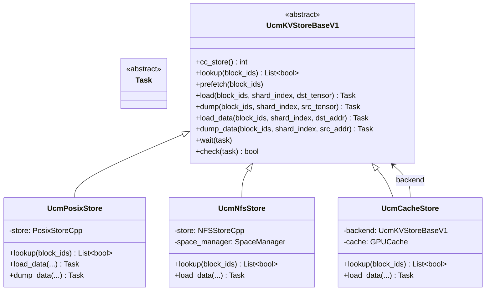

### 4.1.3 核心方法详解

**lookup - 块存在性查询**

```python
@abstractmethod
def lookup(self, block_ids: List[bytes]) -> List[bool]:
    """
    查询块是否存在于存储中

    设计要点:
    1. 批量操作：一次查询多个块
    2. 快速返回：只检查元数据，不读取数据
    3. 顺序保持：返回结果与输入顺序一致

    使用场景:
    - Scheduler查询外部命中
    - 判断是否需要计算

    Args:
        block_ids: MD5哈希的块ID列表，每个16字节

    Returns:
        布尔列表，True表示块存在
    """
    pass
```

**load_data / dump_data - 低级数据传输**

```python
@abstractmethod
def load_data(
    self,
    block_ids: List[bytes],
    shard_index: List[int],
    dst_addr: List[List[int]] | np.ndarray,
) -> Task:
    """
    从存储加载数据到设备地址

    设计要点:
    1. 直接地址：使用设备指针，避免中间拷贝
    2. 分片支持：shard_index用于张量并行
    3. 异步操作：返回Task句柄

    内存布局:
    dst_addr[i][j] = 第i个块在第j层的目标地址

    Args:
        block_ids: 块哈希列表
        shard_index: 每个块的分片索引
        dst_addr: 目标设备地址矩阵

    Returns:
        异步任务句柄
    """
    pass
```

### 4.1.4 Task异步模型

```python
class Task(ABC):
    """
    异步任务抽象

    生命周期:
    1. 创建：由load_data/dump_data返回
    2. 进行中：I/O在后台执行
    3. 完成：check()返回True或wait()返回

    使用模式:

    # 模式1：阻塞等待
    task = store.load_data(...)
    store.wait(task)  # 阻塞直到完成

    # 模式2：轮询
    task = store.load_data(...)
    while not store.check(task):
        do_other_work()

    # 模式3：批量等待
    tasks = [store.load_data(...) for _ in range(N)]
    for task in tasks:
        store.wait(task)
    """
    pass

# 具体实现示例
class TaskImpl:
    def __init__(self, task_id: int, store_ref):
        self.task_id = task_id
        self.store_ref = store_ref
        self._completed = False

    @property
    def completed(self) -> bool:
        if not self._completed:
            self._completed = self.store_ref.check(self.task_id)
        return self._completed
```

## 4.2 V0 vs V1接口演进

### 4.2.1 V0接口（旧版）

```python
# store/ucmstore.py - V0接口（保留兼容）

class UcmKVStoreBase(ABC):
    """V0存储接口 - 简化版"""

    @abstractmethod
    def create(self, block_ids: List[bytes]) -> List[int]:
        """在存储中预留块空间"""

    @abstractmethod
    def lookup(self, block_ids: List[bytes]) -> List[bool]:
        """查询块存在"""

    @abstractmethod
    def prefetch(self, block_ids: List[bytes]):
        """预取"""

    @abstractmethod
    def load(self, block_ids, offset, dst_tensor) -> Task:
        """加载到张量"""

    @abstractmethod
    def dump(self, block_ids, offset, src_tensor) -> Task:
        """保存从张量"""

    @abstractmethod
    def commit(self, block_ids, is_success: bool):
        """提交或回滚"""
```

### 4.2.2 V1接口（当前版本）

V1接口相比V0的改进：

| 特性 | V0 | V1 |
|------|----|----|
| 地址操作 | 张量级别 | 指针级别 |
| 分片支持 | 无 | shard_index |
| 预留空间 | 显式create | 隐式按需 |
| 提交机制 | 显式commit | 自动 |
| C++指针 | 无 | cc_store() |

### 4.2.3 迁移路径

```python
# V0到V1的适配器
class V0ToV1Adapter(UcmKVStoreBaseV1):
    """将V0接口适配为V1接口"""

    def __init__(self, v0_store: UcmKVStoreBase):
        self.v0_store = v0_store

    def cc_store(self) -> int:
        return 0  # V0不支持

    def lookup(self, block_ids):
        return self.v0_store.lookup(block_ids)

    def load_data(self, block_ids, shard_index, dst_addr):
        # 将地址转换为张量
        tensors = self._addrs_to_tensors(dst_addr)
        return self.v0_store.load(block_ids, [0]*len(block_ids), tensors)
```

## 4.3 工厂模式与存储注册

### 4.3.1 存储工厂

```python
# store/factory_v1.py

class UcmConnectorFactoryV1:
    """V1存储连接器工厂"""

    _registry: Dict[str, Tuple[str, str]] = {}  # name -> (module_path, class_name)

    @classmethod
    def register_connector(cls, name: str, module_path: str, class_name: str):
        """注册存储连接器"""
        cls._registry[name] = (module_path, class_name)

    @classmethod
    def create_connector(
        cls,
        connector_name: str,
        config: Dict[str, object]
    ) -> UcmKVStoreBaseV1:
        """创建存储连接器实例"""
        if connector_name not in cls._registry:
            raise ValueError(f"Unknown connector: {connector_name}")

        module_path, class_name = cls._registry[connector_name]

        # 延迟导入模块
        module = importlib.import_module(module_path)
        connector_cls = getattr(module, class_name)

        return connector_cls(config)

# 注册默认存储
UcmConnectorFactoryV1.register_connector(
    "UcmNfsStore",
    "ucm.store.nfsstore.nfsstore_connector",
    "UcmNfsStore"
)

UcmConnectorFactoryV1.register_connector(
    "UcmPcStore",
    "ucm.store.pcstore.pcstore_connector_v1",
    "UcmPcStore"
)

UcmConnectorFactoryV1.register_connector(
    "UcmMooncakeStore",
    "ucm.store.mooncakestore.mooncake_connector",
    "UcmMooncakeStore"
)
```

### 4.3.2 存储选择逻辑

```python
def select_storage(config: Dict) -> UcmKVStoreBaseV1:
    """根据配置选择最合适的存储后端"""

    connectors = config.get('ucm_connectors', [])

    if not connectors:
        raise ValueError("No storage connector configured")

    # 支持多个连接器时的选择逻辑
    for conn_config in connectors:
        name = conn_config['ucm_connector_name']
        params = conn_config['ucm_connector_config']

        # 检查存储路径是否可用
        storage_path = params.get('storage_backends', '')
        if _is_path_available(storage_path):
            return UcmConnectorFactoryV1.create_connector(name, params)

    # 回退到第一个可用的
    first = connectors[0]
    return UcmConnectorFactoryV1.create_connector(
        first['ucm_connector_name'],
        first['ucm_connector_config']
    )
```

## 4.4 异步任务模型详解

### 4.4.1 任务管理器

```cpp
// store/detail/task/task_manager.h

class TaskManager {
public:
    // 提交任务
    Status Submit(Task&& task, size_t& taskId) {
        std::lock_guard<std::mutex> lock(mutex_);

        size_t id = nextTaskId_++;
        tasks_[id] = std::move(task);
        taskId = id;

        // 分配到执行队列
        queues_[id % queues_.size()]->Push(id);

        return Status::OK();
    }

    // 检查任务状态
    Status Check(size_t taskId, bool& finished) {
        std::lock_guard<std::mutex> lock(mutex_);

        auto it = tasks_.find(taskId);
        if (it == tasks_.end()) {
            finished = true;  // 已完成并被回收
            return Status::OK();
        }

        finished = it->second.IsCompleted();
        return Status::OK();
    }

    // 等待任务完成
    Status Wait(size_t taskId) {
        auto startTime = std::chrono::steady_clock::now();

        while (true) {
            bool finished;
            Check(taskId, finished);

            if (finished) {
                // 清理任务
                std::lock_guard<std::mutex> lock(mutex_);
                tasks_.erase(taskId);
                return Status::OK();
            }

            // 超时检查
            auto elapsed = std::chrono::steady_clock::now() - startTime;
            if (elapsed > std::chrono::milliseconds(timeoutMs_)) {
                return Status::Timeout();
            }

            std::this_thread::yield();
        }
    }

private:
    std::unordered_map<size_t, Task> tasks_;
    std::vector<std::unique_ptr<TaskQueue>> queues_;
    std::atomic<size_t> nextTaskId_{0};
    std::mutex mutex_;
    size_t timeoutMs_;
};
```

### 4.4.2 异步执行流程

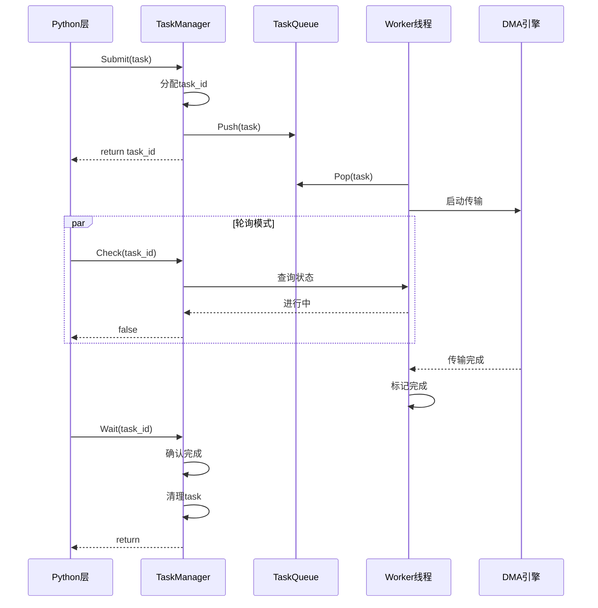

## 4.5 块哈希与内容寻址

### 4.5.1 哈希算法选择

UCM选择MD5作为块哈希算法：

**为什么是MD5？**

| 考虑因素 | MD5 | SHA-256 | xxHash |
|---------|-----|---------|--------|
| 速度 | 快 | 较慢 | 最快 |
| 输出大小 | 16字节 | 32字节 | 8字节 |
| 碰撞概率 | 极低* | 更低 | 较低 |
| 广泛支持 | 是 | 是 | 需要库 |

*注：对于KV Cache块的碰撞概率极低，因为输入是有意义的token序列

```python
import hashlib

def compute_block_hash(parent_hash: bytes, token_ids: List[int]) -> bytes:
    """
    计算块哈希

    选择MD5的理由:
    1. 16字节输出足够用作块ID
    2. 计算速度快
    3. Python标准库支持
    4. 碰撞概率对此场景可接受
    """
    content = parent_hash + bytes(token_ids)
    return hashlib.md5(content).digest()
```

### 4.5.2 哈希链设计

```
哈希链结构:

Seed = MD5("UCMHASHSEED" + model + ":" + world_size + ":" + dtype + ":" + rank)

Block[0] = MD5(Seed + token_ids[0:block_size])
Block[1] = MD5(Block[0] + token_ids[block_size:2*block_size])
Block[2] = MD5(Block[1] + token_ids[2*block_size:3*block_size])
...

优点:
1. 链式依赖：后续块依赖前驱，保证顺序一致性
2. 模型隔离：不同模型/配置产生不同的Seed
3. 增量计算：新块只需计算自己的哈希
```

### 4.5.3 块ID的存储格式

```python
class BlockId:
    """块ID的存储和操作"""

    SIZE = 16  # MD5输出16字节

    def __init__(self, hash_bytes: bytes):
        assert len(hash_bytes) == self.SIZE
        self.bytes = hash_bytes

    def to_hex(self) -> str:
        """转换为32字符十六进制字符串"""
        return self.bytes.hex()

    @classmethod
    def from_hex(cls, hex_str: str) -> 'BlockId':
        """从十六进制字符串创建"""
        return cls(bytes.fromhex(hex_str))

    def __hash__(self) -> int:
        """支持作为字典键"""
        return hash(self.bytes)

    def __eq__(self, other) -> bool:
        return self.bytes == other.bytes
```

### 4.5.4 内容寻址的优势

**优势一：跨请求复用**

```
请求A: "你好，今天天气怎么样？"
请求B: "你好，明天天气如何？"

块划分（假设block_size=8）:
请求A: [你好，今天天] [气怎么样？]
请求B: [你好，明天天] [气如何？]

如果系统提示相同:
系统提示: [欢迎使用AI] [助手，请问] [有什么可以] [帮助您的？]
           ↑─────────────────可复用──────────────────↑
```

**优势二：分布式共享**

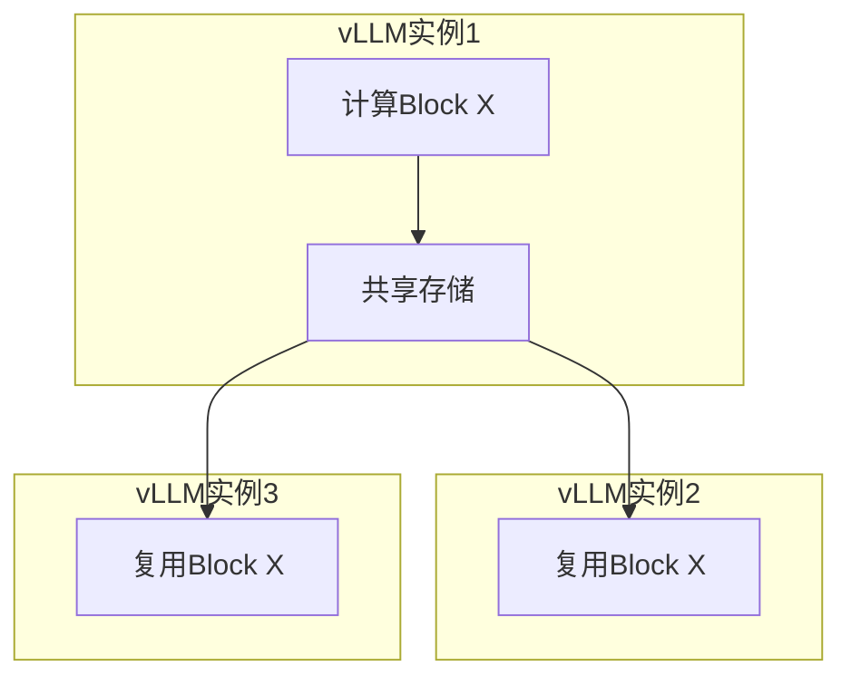

**优势三：版本无关**

只要token序列相同，无论何时计算，哈希值都相同，实现了真正的内容寻址。

---

*（由于文档篇幅限制，以下章节将在后续部分继续...）*

---

# 第三部分：存储后端实现

---

# 第5章：存储后端详解

## 5.1 POSIX Store：本地文件系统

### 5.1.1 设计概述

PosixStore是UCM最基础的存储后端，直接使用POSIX文件系统API：

```python
# store/posix/connector.py

class UcmPosixStore(UcmKVStoreBaseV1):
    """
    基于POSIX的本地文件系统存储

    特点:
    - 零依赖：只需要本地文件系统
    - 低延迟：直接I/O，无网络开销
    - 简单可靠：适合单机场景

    文件布局:
    storage_path/
    ├── blocks/
    │   ├── 00/  # 按哈希前2字符分桶
    │   │   ├── 00a1b2c3...ef.bin
    │   │   └── 00d4e5f6...ab.bin
    │   ├── 01/
    │   └── ...
    └── meta/
        └── index.db  # 块索引（可选）
    """

    def __init__(self, config: Dict):
        self.storage_path = config['storage_backends']
        self.block_size = config.get('block_size', 16)
        self.io_direct = config.get('io_direct', False)
        self.device_id = config.get('device', 0)

        # 初始化C++存储
        self.store = self._init_cpp_store()

    def _init_cpp_store(self):
        """初始化C++底层存储"""
        from ucm.store.posix.cc import PosixStore

        cfg = PosixStoreConfig()
        cfg.storagePath = self.storage_path
        cfg.blockSize = self.block_size
        cfg.ioDirect = self.io_direct
        cfg.deviceId = self.device_id

        store = PosixStore()
        store.Setup(cfg)
        return store
```

### 5.1.2 块文件格式

```
块文件格式 (.bin):

┌────────────────────────────────────────────┐
│ Header (64 bytes)                          │
│ ├── magic: "UCMB" (4 bytes)               │
│ ├── version: uint32 (4 bytes)             │
│ ├── block_hash: bytes[16]                  │
│ ├── num_layers: uint32 (4 bytes)          │
│ ├── block_size: uint32 (4 bytes)          │
│ ├── dtype: uint32 (4 bytes)               │
│ └── reserved: bytes[28]                    │
├────────────────────────────────────────────┤
│ Layer 0 K Cache                            │
│ [block_size × num_kv_heads × head_dim]     │
├────────────────────────────────────────────┤
│ Layer 0 V Cache                            │
│ [block_size × num_kv_heads × head_dim]     │
├────────────────────────────────────────────┤
│ Layer 1 K Cache                            │
├────────────────────────────────────────────┤
│ Layer 1 V Cache                            │
├────────────────────────────────────────────┤
│ ...                                        │
├────────────────────────────────────────────┤
│ Layer N-1 K Cache                          │
├────────────────────────────────────────────┤
│ Layer N-1 V Cache                          │
└────────────────────────────────────────────┘
```

### 5.1.3 直接I/O优化

```cpp
// store/posix/cc/posix_file.cpp

class PosixFile {
public:
    Status OpenDirect(const std::string& path, int flags) {
        // 使用O_DIRECT绕过页缓存
        int fd = open(path.c_str(), flags | O_DIRECT);
        if (fd < 0) {
            return Status::IOError(strerror(errno));
        }
        fd_ = fd;
        return Status::OK();
    }

    Status ReadAligned(void* buffer, size_t size, off64_t offset) {
        // O_DIRECT要求对齐
        // 缓冲区地址必须512字节对齐
        // 读取大小必须是512的倍数
        assert(reinterpret_cast<uintptr_t>(buffer) % 512 == 0);
        assert(size % 512 == 0);
        assert(offset % 512 == 0);

        ssize_t ret = pread(fd_, buffer, size, offset);
        if (ret != static_cast<ssize_t>(size)) {
            return Status::IOError("Short read");
        }
        return Status::OK();
    }

private:
    int fd_ = -1;
};
```

## 5.2 NFS Store：网络文件系统

### 5.2.1 NFS Store架构

```mermaid
graph TB
    subgraph "NFS Store架构"
        Connector[NFSStoreConnector<br/>Python层]

        subgraph "C++层"
            SpaceMgr[SpaceManager<br/>空间管理]
            TransMgr[TransManager<br/>传输管理]
            HotMgr[HotnessManager<br/>热度追踪]
        end

        subgraph "存储层"
            Local[本地SSD]
            NFS[NFS挂载点]
        end
    end

    Connector --> SpaceMgr
    Connector --> TransMgr

    SpaceMgr --> Local
    SpaceMgr --> NFS

    TransMgr --> HotMgr
    HotMgr --> SpaceMgr
```

### 5.2.2 空间管理

```cpp
// store/nfsstore/cc/domain/space/space_manager.h

class SpaceManager {
public:
    // 块分配
    std::vector<BlockInfo> Allocate(const std::vector<BlockId>& blockIds) {
        std::vector<BlockInfo> result;

        for (const auto& id : blockIds) {
            // 1. 检查是否已存在
            if (auto info = Lookup(id)) {
                result.push_back(*info);
                continue;
            }

            // 2. 分配新空间
            BlockInfo info;
            info.id = id;
            info.path = ComputePath(id);
            info.offset = 0;
            info.size = blockDataSize_;

            // 3. 确保目录存在
            EnsureDirectory(info.path);

            // 4. 记录元数据
            Register(info);
            result.push_back(info);
        }

        return result;
    }

    // 块查找
    std::vector<bool> Lookup(const std::vector<BlockId>& blockIds) {
        std::vector<bool> exists;

        for (const auto& id : blockIds) {
            // 检查本地索引
            if (index_.contains(id)) {
                exists.push_back(true);
            } else {
                // 检查文件系统
                std::string path = ComputePath(id);
                exists.push_back(FileExists(path));
            }
        }

        return exists;
    }

private:
    std::string ComputePath(const BlockId& id) {
        // 按哈希前缀分桶
        std::string hex = id.ToHex();
        return basePath_ + "/" + hex.substr(0, 2) + "/" + hex + ".bin";
    }

    std::unordered_map<BlockId, BlockInfo> index_;
    std::string basePath_;
    size_t blockDataSize_;
};
```

### 5.2.3 多路径支持

```python
# NFS Store支持多个存储后端

config = {
    "storage_backends": "/mnt/nfs1:/mnt/nfs2:/mnt/ssd_cache",
    # 冒号分隔的多个路径

    "storage_policy": "tiered",  # tiered | round_robin | random
}

# 分层策略:
# /mnt/ssd_cache: 热数据，最快访问
# /mnt/nfs1:      温数据，中速访问
# /mnt/nfs2:      冷数据，备份存储
```

## 5.3 Cache Store：高速缓存层

### 5.3.1 Cache Store设计

CacheStore作为其他存储的前置缓存层：

```python
# store/cache/connector.py

class UcmCacheStore(UcmKVStoreBaseV1):
    """
    高速缓存层

    架构:
    ┌─────────────────────────────┐
    │    GPU/CPU 高速缓存          │
    │    (CacheStore)              │
    └──────────────┬──────────────┘
                   │ 未命中时
                   ▼
    ┌─────────────────────────────┐
    │    后端存储                  │
    │    (POSIX/NFS/DS3FS)        │
    └─────────────────────────────┘
    """

    def __init__(self, config: Dict):
        # 后端存储
        backend_config = config['backend']
        self.backend = UcmConnectorFactoryV1.create_connector(
            backend_config['name'],
            backend_config['config']
        )

        # 缓存配置
        self.cache_size = config.get('cache_size', 1 << 30)  # 1GB
        self.device_id = config.get('device', 0)

        # C++缓存实现
        self.cache = self._init_cache()

    def lookup(self, block_ids: List[bytes]) -> List[bool]:
        # 先查缓存
        cache_results = self.cache.Lookup(block_ids)

        # 缓存未命中的查后端
        backend_queries = [
            bid for bid, hit in zip(block_ids, cache_results) if not hit
        ]

        if backend_queries:
            backend_results = self.backend.lookup(backend_queries)
            # 合并结果
            ...

        return results

    def load_data(self, block_ids, shard_index, dst_addr):
        # 分离缓存命中和未命中
        cache_hits = []
        backend_loads = []

        for i, bid in enumerate(block_ids):
            if self.cache.Contains(bid):
                cache_hits.append((i, bid))
            else:
                backend_loads.append((i, bid))

        # 从缓存加载
        if cache_hits:
            cache_task = self.cache.Load(
                [bid for _, bid in cache_hits],
                [dst_addr[i] for i, _ in cache_hits]
            )

        # 从后端加载并填充缓存
        if backend_loads:
            # 加载到临时缓冲
            temp_addrs = self._alloc_temp_buffer(len(backend_loads))
            backend_task = self.backend.load_data(
                [bid for _, bid in backend_loads],
                [shard_index[i] for i, _ in backend_loads],
                temp_addrs
            )

            # 等待并填充缓存
            self.backend.wait(backend_task)
            self.cache.Insert(
                [bid for _, bid in backend_loads],
                temp_addrs
            )

            # 复制到目标
            self._copy_to_dst(temp_addrs,
                             [dst_addr[i] for i, _ in backend_loads])

        return CompositeTask([cache_task, backend_task])
```

### 5.3.2 缓存驱逐策略

```cpp
// store/cache/cc/eviction_policy.h

class LRUEvictionPolicy {
public:
    void Touch(const BlockId& id) {
        std::lock_guard<std::mutex> lock(mutex_);

        // 移动到队尾（最近使用）
        auto it = position_.find(id);
        if (it != position_.end()) {
            lru_queue_.splice(lru_queue_.end(), lru_queue_, it->second);
        }
    }

    std::vector<BlockId> Evict(size_t count) {
        std::lock_guard<std::mutex> lock(mutex_);

        std::vector<BlockId> evicted;
        for (size_t i = 0; i < count && !lru_queue_.empty(); ++i) {
            BlockId id = lru_queue_.front();
            lru_queue_.pop_front();
            position_.erase(id);
            evicted.push_back(id);
        }

        return evicted;
    }

private:
    std::list<BlockId> lru_queue_;
    std::unordered_map<BlockId, std::list<BlockId>::iterator> position_;
    std::mutex mutex_;
};
```

## 5.4 DS3FS Store：分布式文件系统

### 5.4.1 DS3FS概述

DS3FS是一个高性能分布式文件系统，专为AI工作负载优化：

```python
# store/ds3fs/connector.py

class UcmDs3fsStore(UcmKVStoreBaseV1):
    """
    DS3FS分布式存储

    特点:
    - 高吞吐: 聚合带宽可达TB/s级别
    - 低延迟: 优化的网络栈
    - 高可用: 多副本冗余

    配置:
    - ior_entries: I/O请求条目数
    - ior_depth: I/O请求深度
    - numa_id: NUMA节点绑定
    """

    def __init__(self, config: Dict):
        self.mount_point = config['storage_backends']
        self.ior_entries = config.get('ior_entries', 1024)
        self.ior_depth = config.get('ior_depth', 32)
        self.numa_id = config.get('numa_id', 0)

        # 初始化DS3FS客户端
        self.client = self._init_client()
```

### 5.4.2 I/O优化

```cpp
// DS3FS的io_uring集成

class DS3FSIOEngine {
public:
    Status AsyncRead(const std::vector<IORequest>& requests) {
        // 使用io_uring批量提交
        for (const auto& req : requests) {
            struct io_uring_sqe* sqe = io_uring_get_sqe(&ring_);
            io_uring_prep_read(sqe, req.fd, req.buffer, req.size, req.offset);
            io_uring_sqe_set_data(sqe, req.user_data);
        }

        // 提交所有请求
        io_uring_submit(&ring_);

        return Status::OK();
    }

    Status Wait(size_t count) {
        struct io_uring_cqe* cqe;

        for (size_t i = 0; i < count; ++i) {
            int ret = io_uring_wait_cqe(&ring_, &cqe);
            if (ret < 0) {
                return Status::IOError("io_uring wait failed");
            }

            // 处理完成
            void* user_data = io_uring_cqe_get_data(cqe);
            // ...

            io_uring_cqe_seen(&ring_, cqe);
        }

        return Status::OK();
    }

private:
    struct io_uring ring_;
};
```

## 5.5 Mooncake Store：分布式内存缓存

### 5.5.1 Mooncake概述

Mooncake是一个专为LLM推理设计的分布式内存缓存系统：

```python
# store/mooncakestore/mooncake_connector.py

class UcmMooncakeStore(UcmKVStoreBaseV1):
    """
    Mooncake分布式内存缓存

    架构:
    ┌─────────────────────────────────────────┐
    │           Metadata Server               │
    │         (块位置索引)                     │
    └─────────────────┬───────────────────────┘
                      │
        ┌─────────────┼─────────────┐
        ▼             ▼             ▼
    ┌───────┐    ┌───────┐    ┌───────┐
    │Node 1 │    │Node 2 │    │Node 3 │
    │Memory │    │Memory │    │Memory │
    └───────┘    └───────┘    └───────┘

    特点:
    - 全内存: 极低延迟（<1ms）
    - 分布式: 聚合多节点内存
    - 一致性: 元数据服务器协调
    """

    def __init__(self, config: Dict):
        self.local_hostname = config['local_hostname']
        self.metadata_server = config['metadata_server']
        self.global_segment_size = config.get('global_segment_size', 3.125 * 1024**3)
        self.local_buffer_size = config.get('local_buffer_size', 1024**3)
        self.protocol = config.get('protocol', 'tcp')

        # 异步事件循环
        self.loop = asyncio.new_event_loop()
        self.thread = threading.Thread(target=self._run_event_loop, daemon=True)
        self.thread.start()

        # 初始化Mooncake客户端
        self.store = self._init_store()
```

### 5.5.2 数据序列化

```python
# 使用safetensors进行高效序列化

from safetensors.torch import save as safetensors_save
from safetensors.torch import load as safetensors_load

class MooncakeSerializer:
    """Mooncake数据序列化器"""

    @staticmethod
    def serialize(tensor: torch.Tensor) -> bytes:
        """序列化张量"""
        return safetensors_save({"tensor": tensor})

    @staticmethod
    def deserialize(data: bytes) -> torch.Tensor:
        """反序列化张量"""
        loaded = safetensors_load(data)
        return loaded["tensor"]
```

## 5.6 Pipeline Store：多级缓存流水线

### 5.6.1 流水线架构

```python
# store/pipeline/connector.py

class UcmPipelineStore(UcmKVStoreBaseV1):
    """
    多级缓存流水线

    支持的流水线配置:
    - "Cache|Posix": 缓存 + 本地文件系统
    - "Cache|Ds3fs": 缓存 + DS3FS
    - "Cache|Nfs":   缓存 + NFS

    数据流:

    读取路径:
    Cache(L1) → 后端存储(L2) → 返回
         ↑          │
         └──────────┘
        回填缓存

    写入路径:
    写入 → Cache(L1) → 异步刷新 → 后端存储(L2)
    """

    def __init__(self, config: Dict):
        pipeline_spec = config['pipeline']  # "Cache|Posix"
        stages = pipeline_spec.split('|')

        self.stages = []
        prev_store = None

        # 从后往前构建（后端到前端）
        for stage_name in reversed(stages):
            stage_config = config.get(stage_name.lower(), {})

            if stage_name == 'Cache':
                stage_config['backend'] = prev_store
                store = UcmCacheStore(stage_config)
            else:
                store = UcmConnectorFactoryV1.create_connector(
                    f"Ucm{stage_name}Store",
                    stage_config
                )

            self.stages.insert(0, store)
            prev_store = store

    def lookup(self, block_ids):
        # 从L1开始查找
        return self.stages[0].lookup(block_ids)

    def load_data(self, block_ids, shard_index, dst_addr):
        # L1加载（会自动从L2回填）
        return self.stages[0].load_data(block_ids, shard_index, dst_addr)
```

## 5.7 PC Store：前缀缓存专用存储

### 5.7.1 PC Store设计

```python
# store/pcstore/pcstore_connector_v1.py

class UcmPcStore(UcmKVStoreBaseV1):
    """
    前缀缓存专用存储

    特点:
    - 连续块优化: 相邻块放在一起
    - 批量操作: 优化前缀的整体加载
    - 元数据索引: 快速前缀匹配
    """

    def __init__(self, config: Dict):
        self.storage_path = config['storage_backends']
        self.unique_id = config.get('unique_id', str(uuid.uuid4()))

        # 流和缓冲区配置
        self.stream_number = config.get('stream_number', 8)
        self.buffer_number = config.get('buffer_number', 4096)
        self.scatter_gather = config.get('scatter_gather_enable', True)

        # 初始化底层存储
        self.store = self._init_store()

    def load_prefix(self, prefix_hashes: List[bytes],
                   dst_addrs: List[np.ndarray]) -> Task:
        """
        批量加载前缀块

        优化:
        - 合并连续块的I/O
        - 使用scatter-gather减少拷贝
        """
        if self.scatter_gather:
            # 使用分散-聚集
            return self._load_scatter_gather(prefix_hashes, dst_addrs)
        else:
            # 逐块加载
            return self._load_sequential(prefix_hashes, dst_addrs)
```

## 5.8 存储选型与性能对比

### 5.8.1 性能对比表

| 存储后端 | 延迟 (读) | 延迟 (写) | 吞吐量 | 适用场景 |
|---------|----------|----------|-------|---------|
| PosixStore | 0.1-1ms | 0.5-5ms | 1-5 GB/s | 单机开发/测试 |
| CacheStore | <0.1ms | <0.1ms | 10+ GB/s | 热点加速 |
| NFSStore | 1-10ms | 5-50ms | 100MB-1GB/s | 多机共享 |
| DS3FSStore | 0.5-5ms | 1-10ms | 1-10 GB/s | 大规模分布式 |
| MooncakeStore | <0.5ms | <1ms | 5-20 GB/s | 低延迟分布式 |
| PipelineStore | 取决于L1 | 取决于配置 | 组合 | 多级缓存 |

### 5.8.2 选型指南

```mermaid
flowchart TD
    Start[开始选型] --> Q1{单机还是多机?}

    Q1 -->|单机| Q2{需要持久化?}
    Q2 -->|是| POSIX[PosixStore]
    Q2 -->|否| CACHE[CacheStore]

    Q1 -->|多机| Q3{延迟要求?}
    Q3 -->|<1ms| MOON[MooncakeStore]
    Q3 -->|1-10ms| Q4{规模?}

    Q4 -->|<10节点| NFS[NFSStore]
    Q4 -->|>10节点| DS3FS[DS3FSStore]

    Q3 -->|不敏感| NFS

    POSIX --> Q5{需要加速?}
    NFS --> Q5
    DS3FS --> Q5

    Q5 -->|是| PIPE[PipelineStore<br/>Cache + 后端]
    Q5 -->|否| END[完成]

    CACHE --> END
    MOON --> END
    PIPE --> END
```

---

# 第6章：C++底层实现

UCM 的高性能核心依赖于精心设计的 C++ 底层实现。本章将深入剖析 UCM 的 C++ 代码架构，包括存储接口设计、数据传输层、CUDA Kernel 优化、多平台支持、任务管理系统、线程池与并发控制、Lock-Free 数据结构以及 Python 绑定机制。

## 6.1 存储接口的 C++ 设计

### 6.1.1 StoreV1 接口定义

UCM 的 C++ 层定义了统一的存储接口 `StoreV1`，所有存储后端都必须实现这个接口：

```cpp
// ucm/store/*/cc/ucmstore_v1.h (概念性定义)
namespace UC {

class StoreV1 {
public:
    virtual ~StoreV1() = default;

    // 返回存储后端的描述信息
    virtual std::string Readme() const = 0;

    // 查询块是否存在
    virtual Expected<std::vector<uint8_t>> Lookup(
        const Detail::BlockId* blocks,
        size_t num
    ) = 0;

    // 预取块到高速缓存
    virtual void Prefetch(
        const Detail::BlockId* blocks,
        size_t num
    ) = 0;

    // 从存储加载数据到设备
    virtual Expected<Detail::TaskHandle> Load(Detail::TaskDesc task) = 0;

    // 从设备保存数据到存储
    virtual Expected<Detail::TaskHandle> Dump(Detail::TaskDesc task) = 0;

    // 检查任务是否完成
    virtual Expected<bool> Check(Detail::TaskHandle taskId) = 0;

    // 等待任务完成
    virtual Status Wait(Detail::TaskHandle taskId) = 0;
};

}  // namespace UC
```

### 6.1.2 PosixStore 实现示例

以 PosixStore 为例，展示具体的存储后端实现：

```cpp
// ucm/store/posix/cc/posix_store.h
namespace UC::PosixStore {

class PosixStoreImpl;  // 前向声明，使用 Pimpl 模式

class PosixStore : public StoreV1 {
public:
    ~PosixStore() override;

    // 初始化存储后端
    Status Setup(const Config& config);

    // StoreV1 接口实现
    std::string Readme() const override;
    Expected<std::vector<uint8_t>> Lookup(
        const Detail::BlockId* blocks,
        size_t num
    ) override;
    void Prefetch(const Detail::BlockId* blocks, size_t num) override;
    Expected<Detail::TaskHandle> Load(Detail::TaskDesc task) override;
    Expected<Detail::TaskHandle> Dump(Detail::TaskDesc task) override;
    Expected<bool> Check(Detail::TaskHandle taskId) override;
    Status Wait(Detail::TaskHandle taskId) override;

private:
    std::shared_ptr<PosixStoreImpl> impl_;  // Pimpl 实现
};

}  // namespace UC::PosixStore
```

### 6.1.3 实现细节解析

PosixStore 的实现使用了 **Pimpl（Pointer to Implementation）模式**，这是一种重要的设计模式：

```cpp
// ucm/store/posix/cc/posix_store.cc
namespace UC::PosixStore {

class PosixStoreImpl {
public:
    SpaceManager spaceMgr;    // 空间管理器
    TransManager transMgr;    // 传输管理器
    bool transEnable{false};  // 是否启用传输

public:
    Status Setup(const Config& config) {
        // 1. 检查配置参数
        auto s = CheckConfig(config);
        if (s.Failure()) [[unlikely]] {
            UC_ERROR("Failed to check config params: {}.", s);
            return s;
        }

        // 2. 初始化空间管理器
        s = spaceMgr.Setup(config);
        if (s.Failure()) [[unlikely]] { return s; }

        // 3. 如果指定了设备ID，初始化传输管理器
        transEnable = config.deviceId >= 0;
        if (transEnable) {
            s = transMgr.Setup(config, spaceMgr.GetLayout());
            if (s.Failure()) [[unlikely]] { return s; }
        }

        ShowConfig(config);
        return Status::OK();
    }

private:
    Status CheckConfig(const Config& config) {
        // 验证存储后端路径
        if (config.storageBackends.empty()) {
            return Status::InvalidParam("invalid storage backends");
        }

        // 验证设备ID
        if (config.deviceId < -1) {
            return Status::InvalidParam("invalid device({})", config.deviceId);
        }

        // 如果启用传输，验证尺寸配置
        if (config.deviceId >= 0) {
            if (config.tensorSize == 0 ||
                config.shardSize < config.tensorSize ||
                config.blockSize < config.shardSize ||
                config.shardSize % config.tensorSize != 0 ||
                config.blockSize % config.shardSize != 0) {
                return Status::InvalidParam(
                    "invalid size({},{},{})",
                    config.tensorSize, config.shardSize, config.blockSize
                );
            }
        }

        return Status::OK();
    }
};

// Load 实现
Expected<Detail::TaskHandle> PosixStore::Load(Detail::TaskDesc task) {
    if (!impl_->transEnable) {
        return Status::Error("transfer is not enable");
    }

    // 提交加载任务到传输管理器
    auto res = impl_->transMgr.Submit({
        TransTask::Type::LOAD,
        std::move(task)
    });

    if (!res) [[unlikely]] {
        UC_ERROR("Failed({}) to submit load task({}).", res.Error(), task.brief);
    }
    return res;
}

}  // namespace UC::PosixStore
```

### 6.1.4 设计要点

**1. Pimpl 模式的优势**

```mermaid
graph LR
    subgraph "公开头文件"
        A[PosixStore.h] --> B[StoreV1 接口]
        A --> C[forward: PosixStoreImpl]
    end

    subgraph "私有实现"
        D[PosixStore.cc] --> E[PosixStoreImpl 定义]
        E --> F[SpaceManager]
        E --> G[TransManager]
    end

    A -.-> D

    style A fill:#90EE90
    style D fill:#ADD8E6
```

优势包括：
- **编译隔离**：修改实现不需要重新编译依赖头文件的代码
- **ABI 稳定**：实现细节变化不影响二进制接口
- **编译加速**：减少头文件依赖，加快编译速度
- **信息隐藏**：实现细节对用户完全不可见

**2. Expected 错误处理**

UCM 使用类似 Rust 的 `Expected<T>` 类型进行错误处理：

```cpp
// Expected 类型的使用示例
Expected<Detail::TaskHandle> result = store->Load(task);

if (!result) {
    // 错误处理
    UC_ERROR("Load failed: {}", result.Error());
    return;
}

// 成功处理
Detail::TaskHandle handle = result.Value();
```

**3. [[unlikely]] 属性**

C++20 的分支预测提示用于优化：

```cpp
if (s.Failure()) [[unlikely]] {
    // 错误路径（不太可能执行）
    return s;
}
// 正常路径（很可能执行）
```

## 6.2 数据传输层（Trans）

### 6.2.1 传输层架构

数据传输层（Trans）是 UCM 实现高性能数据传输的核心组件：

```mermaid
graph TB
    subgraph "传输层抽象"
        Stream[Stream 基类]
        Buffer[Buffer 基类]
        Device[Device 管理]
    end

    subgraph "CUDA 实现"
        CudaStream[CudaStream]
        CudaSMStream[CudaSMStream]
        CudaBuffer[CudaBuffer]
    end

    subgraph "Ascend 实现"
        AscendStream[AscendStream]
        AscendBuffer[AscendBuffer]
    end

    subgraph "模拟实现"
        SimuStream[SimuStream]
        SimuBuffer[SimuBuffer]
    end

    Stream --> CudaStream
    Stream --> AscendStream
    Stream --> SimuStream

    Buffer --> CudaBuffer
    Buffer --> AscendBuffer
    Buffer --> SimuBuffer

    Device --> CudaStream
    Device --> AscendStream
    Device --> SimuStream
```

### 6.2.2 Stream 接口设计

Stream 是数据传输的核心抽象，定义了设备与主机之间的数据传输接口：

```cpp
// ucm/shared/trans/stream.h
namespace UC::Trans {

class Stream {
public:
    virtual ~Stream() = default;

    // 初始化流
    virtual Status Setup() = 0;

    // ============ 设备到主机传输 ============

    // 单次同步传输
    virtual Status DeviceToHost(void* device, void* host, size_t size) = 0;

    // 批量同步传输（多对多）
    virtual Status DeviceToHost(
        void* device[], void* host[],
        size_t size, size_t number
    ) = 0;

    // 收集传输（多对一）
    virtual Status DeviceToHost(
        void* device[], void* host,
        size_t size, size_t number
    ) = 0;

    // 单次异步传输
    virtual Status DeviceToHostAsync(void* device, void* host, size_t size) = 0;

    // 批量异步传输
    virtual Status DeviceToHostAsync(
        void* device[], void* host[],
        size_t size, size_t number
    ) = 0;

    // 收集异步传输
    virtual Status DeviceToHostAsync(
        void* device[], void* host,
        size_t size, size_t number
    ) = 0;

    // ============ 主机到设备传输 ============

    // 单次同步传输
    virtual Status HostToDevice(void* host, void* device, size_t size) = 0;

    // 批量同步传输
    virtual Status HostToDevice(
        void* host[], void* device[],
        size_t size, size_t number
    ) = 0;

    // 散射传输（一对多）
    virtual Status HostToDevice(
        void* host, void* device[],
        size_t size, size_t number
    ) = 0;

    // 异步版本...
    virtual Status HostToDeviceAsync(void* host, void* device, size_t size) = 0;
    virtual Status HostToDeviceAsync(
        void* host[], void* device[],
        size_t size, size_t number
    ) = 0;
    virtual Status HostToDeviceAsync(
        void* host, void* device[],
        size_t size, size_t number
    ) = 0;

    // ============ 流控制 ============

    // 添加回调函数
    virtual Status AppendCallback(std::function<void(bool)> cb) = 0;

    // 同步等待流完成
    virtual Status Synchronized() = 0;
};

}  // namespace UC::Trans
```

### 6.2.3 CudaStream 实现

CUDA 平台的 Stream 实现：

```cpp
// ucm/shared/trans/cuda/cuda_stream.h
namespace UC::Trans {

class CudaStream : public Stream {
protected:
    cudaStream_t stream_;  // CUDA 流句柄

public:
    Status Setup() override {
        cudaError_t err = cudaStreamCreate(&stream_);
        if (err != cudaSuccess) {
            return Status::Error("Failed to create CUDA stream");
        }
        return Status::OK();
    }

    Status DeviceToHost(void* device, void* host, size_t size) override {
        cudaError_t err = cudaMemcpyAsync(
            host, device, size,
            cudaMemcpyDeviceToHost, stream_
        );
        if (err != cudaSuccess) {
            return Status::Error("cudaMemcpyAsync failed");
        }
        return Synchronized();
    }

    Status DeviceToHostAsync(void* device, void* host, size_t size) override {
        cudaError_t err = cudaMemcpyAsync(
            host, device, size,
            cudaMemcpyDeviceToHost, stream_
        );
        if (err != cudaSuccess) {
            return Status::Error("cudaMemcpyAsync failed");
        }
        return Status::OK();
    }

    Status Synchronized() override {
        cudaError_t err = cudaStreamSynchronize(stream_);
        if (err != cudaSuccess) {
            return Status::Error("cudaStreamSynchronize failed");
        }
        return Status::OK();
    }

    // ... 其他方法实现
};

}  // namespace UC::Trans
```

### 6.2.4 Buffer 管理

Buffer 类负责管理设备和主机内存的分配与复用：

```cpp
// ucm/shared/trans/detail/reserved_buffer.h
namespace UC::Trans {

class ReservedBuffer : public Buffer {
    // 内存池结构
    struct {
        Indexer indexer;              // 索引管理器
        std::shared_ptr<void> buffers; // 内存块
        size_t size;                   // 单块大小
    } hostBuffers_, deviceBuffers_;

    // 从内存池获取缓冲区
    template <typename Buffers>
    static std::shared_ptr<void> GetBufferFrom(Buffers& buffers) {
        auto pos = buffers.indexer.Acquire();
        if (pos != buffers.indexer.npos) {
            auto addr = static_cast<int8_t*>(buffers.buffers.get());
            auto ptr = static_cast<void*>(addr + buffers.size * pos);

            // 返回智能指针，析构时自动释放到池中
            return std::shared_ptr<void>(ptr, [&buffers, pos](void*) {
                buffers.indexer.Release(pos);
            });
        }
        return nullptr;
    }

public:
    // 预分配设备内存池
    Status MakeDeviceBuffers(size_t size, size_t number) override {
        auto totalSize = size * number;
        auto buffers = this->MakeDeviceBuffer(totalSize);
        if (!buffers) {
            return Status::Error(
                fmt::format("out of memory({}) on device", totalSize)
            );
        }
        this->deviceBuffers_.size = size;
        this->deviceBuffers_.buffers = buffers;
        this->deviceBuffers_.indexer.Setup(number);
        return Status::OK();
    }

    // 获取设备缓冲区
    std::shared_ptr<void> GetDeviceBuffer(size_t size) override {
        // 优先从预分配池中获取
        if (size <= this->deviceBuffers_.size) {
            auto buffer = GetBufferFrom(this->deviceBuffers_);
            if (buffer) { return buffer; }
        }
        // 池中无可用，动态分配
        return this->MakeDeviceBuffer(size);
    }

    // 类似的主机内存管理...
};

}  // namespace UC::Trans
```

## 6.3 CUDA Kernel 优化

### 6.3.1 SM Copy Kernel

UCM 实现了高度优化的 CUDA Kernel 用于数据拷贝，称为 SM Copy：

```cuda
// ucm/shared/trans/cuda/cuda_sm_kernel.cu
namespace UC::Trans {

// 传输单元大小：32 字节（两个 uint4）
#define CUDA_TRANS_UNIT_SIZE (sizeof(uint4) * 2)

// 线程配置
#define CUDA_TRANS_BLOCK_NUMBER (32)
#define CUDA_TRANS_BLOCK_SIZE (256)
#define CUDA_TRANS_THREAD_NUMBER (CUDA_TRANS_BLOCK_NUMBER * CUDA_TRANS_BLOCK_SIZE)

// 高度优化的拷贝单元函数
inline __device__ void CudaCopyUnit(
    const uint8_t* __restrict__ src,
    volatile uint8_t* __restrict__ dst)
{
    uint4 lo, hi;

    // 使用 PTX 汇编加载数据（流式访问，绕过 L1 缓存）
    asm volatile(
        "ld.global.cs.v4.b32 {%0,%1,%2,%3}, [%4];"
        : "=r"(lo.x), "=r"(lo.y), "=r"(lo.z), "=r"(lo.w)
        : "l"(src)
    );
    asm volatile(
        "ld.global.cs.v4.b32 {%0,%1,%2,%3}, [%4+16];"
        : "=r"(hi.x), "=r"(hi.y), "=r"(hi.z), "=r"(hi.w)
        : "l"(src)
    );

    // 使用 volatile 写入，确保写入立即可见
    asm volatile(
        "st.volatile.global.v4.b32 [%0], {%1,%2,%3,%4};"
        :
        : "l"(dst), "r"(lo.x), "r"(lo.y), "r"(lo.z), "r"(lo.w)
    );
    asm volatile(
        "st.volatile.global.v4.b32 [%0+16], {%1,%2,%3,%4};"
        :
        : "l"(dst), "r"(hi.x), "r"(hi.y), "r"(hi.z), "r"(hi.w)
    );
}

// 批量拷贝 Kernel（多对多）
__global__ void CudaCopyKernel(
    const void** src, void** dst,
    size_t size, size_t num)
{
    auto length = size * num;
    auto offset = (blockIdx.x * blockDim.x + threadIdx.x) * CUDA_TRANS_UNIT_SIZE;

    while (offset + CUDA_TRANS_UNIT_SIZE <= length) {
        // 计算当前线程处理的块索引和偏移
        auto idx = offset / size;
        auto off = offset % size;

        auto host = ((const uint8_t*)src[idx]) + off;
        auto device = ((uint8_t*)dst[idx]) + off;

        CudaCopyUnit(host, device);

        // 步进到下一个处理位置
        offset += CUDA_TRANS_THREAD_NUMBER * CUDA_TRANS_UNIT_SIZE;
    }
}

// 收集拷贝 Kernel（多对一）
__global__ void CudaCopyKernel(
    const void** src, void* dst,
    size_t size, size_t num)
{
    auto length = size * num;
    auto offset = (blockIdx.x * blockDim.x + threadIdx.x) * CUDA_TRANS_UNIT_SIZE;

    while (offset + CUDA_TRANS_UNIT_SIZE <= length) {
        auto idx = offset / size;
        auto off = offset % size;

        auto host = ((const uint8_t*)src[idx]) + off;
        auto device = ((uint8_t*)dst) + offset;  // 连续写入

        CudaCopyUnit(host, device);
        offset += CUDA_TRANS_THREAD_NUMBER * CUDA_TRANS_UNIT_SIZE;
    }
}

// 散射拷贝 Kernel（一对多）
__global__ void CudaCopyKernel(
    const void* src, void** dst,
    size_t size, size_t num)
{
    auto length = size * num;
    auto offset = (blockIdx.x * blockDim.x + threadIdx.x) * CUDA_TRANS_UNIT_SIZE;

    while (offset + CUDA_TRANS_UNIT_SIZE <= length) {
        auto idx = offset / size;
        auto off = offset % size;

        auto host = ((const uint8_t*)src) + offset;  // 连续读取
        auto device = ((uint8_t*)dst[idx]) + off;

        CudaCopyUnit(host, device);
        offset += CUDA_TRANS_THREAD_NUMBER * CUDA_TRANS_UNIT_SIZE;
    }
}

// 封装函数供 C++ 调用
cudaError_t CudaSMCopyAsync(
    void* src[], void* dst[],
    size_t size, size_t number,
    cudaStream_t stream)
{
    CudaCopyKernel<<<CUDA_TRANS_BLOCK_NUMBER, CUDA_TRANS_BLOCK_SIZE, 0, stream>>>(
        (const void**)src, dst, size, number
    );
    return cudaGetLastError();
}

}  // namespace UC::Trans
```

### 6.3.2 性能优化技术

**1. PTX 汇编优化**

使用 PTX 汇编指令直接控制内存访问模式：

```cuda
// ld.global.cs - 流式加载，绕过 L1 缓存
// 适用于只读一次的数据，避免污染缓存
asm volatile("ld.global.cs.v4.b32 {%0,%1,%2,%3}, [%4];"
             : "=r"(lo.x), "=r"(lo.y), "=r"(lo.z), "=r"(lo.w)
             : "l"(src));

// st.volatile.global - 易失写入
// 确保写入立即对其他线程可见
asm volatile("st.volatile.global.v4.b32 [%0], {%1,%2,%3,%4};"
             :
             : "l"(dst), "r"(lo.x), "r"(lo.y), "r"(lo.z), "r"(lo.w));
```

**2. 向量化访问**

使用 `uint4` 类型进行 128 位向量访问：

```mermaid
graph LR
    subgraph "传统方式"
        A1[32次 4字节访问] --> B1[128字节]
    end

    subgraph "向量化方式"
        A2[1次 uint4 访问] --> B2[16字节]
        A3[1次 uint4 访问] --> B3[16字节]
    end

    B1 -.-> |"低效"| C[总带宽]
    B2 --> |"高效"| C
    B3 --> C
```

**3. 线程配置优化**

```cpp
// 32 个 block，每个 256 线程
// 总共 8192 个线程同时工作
#define CUDA_TRANS_BLOCK_NUMBER (32)
#define CUDA_TRANS_BLOCK_SIZE (256)

// 每个线程处理 32 字节
// 单次 kernel 调用可处理 256KB 数据
```

### 6.3.3 SM Copy vs cudaMemcpy

```mermaid
graph TB
    subgraph "cudaMemcpy"
        A1[CPU 发起] --> A2[DMA 引擎]
        A2 --> A3[数据传输]
        A3 --> A4[CPU 同步]
    end

    subgraph "SM Copy"
        B1[CPU 发起 Kernel] --> B2[SM 核心执行]
        B2 --> B3[并行数据拷贝]
        B3 --> B4[流同步]
    end

    A4 --> C[小数据效率低<br/>大数据带宽高]
    B4 --> D[小数据低延迟<br/>可与计算重叠]
```

SM Copy 的优势：
- **低启动延迟**：Kernel 启动比 DMA 传输启动更快
- **细粒度控制**：可以精确控制内存访问模式
- **计算重叠**：可以与其他 Kernel 在不同流中并行执行
- **缓存控制**：通过 PTX 指令控制缓存行为

## 6.4 多平台支持（CUDA/Ascend/MACA/MUSA）

### 6.4.1 平台抽象层

UCM 通过抽象层支持多种硬件平台：

```mermaid
graph TB
    subgraph "抽象层"
        Stream[Stream]
        Buffer[Buffer]
        Device[Device]
    end

    subgraph "CUDA"
        CudaStream[CudaStream]
        CudaSMStream[CudaSMStream]
        CudaBuffer[CudaBuffer]
        CudaDevice[cuda_device.cc]
    end

    subgraph "Ascend"
        AscendStream[AscendStream]
        AscendBuffer[AscendBuffer]
        AscendDevice[ascend_device.cc]
    end

    subgraph "MACA"
        MacaKernel[maca_sm_kernel.cu]
    end

    subgraph "Simulation"
        SimuStream[SimuStream]
        SimuBuffer[SimuBuffer]
        SimuDevice[simu_device.cc]
    end

    Stream --> CudaStream
    Stream --> AscendStream
    Stream --> SimuStream

    Buffer --> CudaBuffer
    Buffer --> AscendBuffer
    Buffer --> SimuBuffer
```

### 6.4.2 Ascend 平台支持

华为 Ascend NPU 的实现：

```cpp
// ucm/shared/trans/ascend/ascend_stream.h
namespace UC::Trans {

class AscendStream : public Stream {
protected:
    aclrtStream stream_;  // ACL 流句柄

public:
    Status Setup() override {
        aclError err = aclrtCreateStream(&stream_);
        if (err != ACL_SUCCESS) {
            return Status::Error("Failed to create ACL stream");
        }
        return Status::OK();
    }

    Status DeviceToHost(void* device, void* host, size_t size) override {
        aclError err = aclrtMemcpy(
            host, size, device, size,
            ACL_MEMCPY_DEVICE_TO_HOST
        );
        if (err != ACL_SUCCESS) {
            return Status::Error("aclrtMemcpy failed");
        }
        return Status::OK();
    }

    // ... 其他实现
};

}  // namespace UC::Trans
```

### 6.4.3 模拟平台支持

用于开发测试的模拟实现：

```cpp
// ucm/shared/trans/simu/simu_stream.cc
namespace UC::Trans {

class SimuStream : public Stream {
public:
    Status Setup() override {
        return Status::OK();  // 无需初始化
    }

    Status DeviceToHost(void* device, void* host, size_t size) override {
        // 模拟设备到主机传输
        std::memcpy(host, device, size);
        return Status::OK();
    }

    Status HostToDevice(void* host, void* device, size_t size) override {
        // 模拟主机到设备传输
        std::memcpy(device, host, size);
        return Status::OK();
    }

    Status Synchronized() override {
        return Status::OK();  // 同步模式，无需等待
    }
};

}  // namespace UC::Trans
```

### 6.4.4 编译时平台选择

通过 CMake 条件编译选择平台：

```cmake
# CMakeLists.txt 示例
if(CUDA_FOUND)
    add_library(ucm_trans_cuda
        trans/cuda/cuda_stream.cc
        trans/cuda/cuda_buffer.cc
        trans/cuda/cuda_device.cc
        trans/cuda/cuda_sm_kernel.cu
    )
    target_compile_definitions(ucm_trans_cuda PRIVATE UCM_CUDA_ENABLED)
endif()

if(ASCEND_FOUND)
    add_library(ucm_trans_ascend
        trans/ascend/ascend_stream.cc
        trans/ascend/ascend_buffer.cc
        trans/ascend/ascend_device.cc
    )
    target_compile_definitions(ucm_trans_ascend PRIVATE UCM_ASCEND_ENABLED)
endif()
```

## 6.5 任务管理系统

### 6.5.1 任务模型设计

UCM 使用异步任务模型管理所有 I/O 操作：

```cpp
// ucm/store/posix/cc/trans_task.h
namespace UC::PosixStore {

class TransTask {
public:
    // 任务类型
    enum class Type : uint8_t {
        LOAD,  // 从存储加载到设备
        DUMP   // 从设备保存到存储
    };

    Detail::TaskHandle id{0};  // 任务唯一标识
    Type type{Type::DUMP};     // 任务类型
    Detail::TaskDesc desc;     // 任务描述

public:
    TransTask(Type type, Detail::TaskDesc desc)
        : id{NextId()}, type{type}, desc{std::move(desc)} {}

private:
    // 原子递增生成唯一 ID
    static size_t NextId() noexcept {
        static std::atomic<size_t> id{1};
        return id.fetch_add(1, std::memory_order_relaxed);
    };
};

}  // namespace UC::PosixStore
```

### 6.5.2 任务描述结构

```cpp
// 任务描述包含传输所需的所有信息
namespace UC::Detail {

struct Shard {
    BlockId blockId;      // 块哈希
    size_t shardIdx;      // 分片索引
    void* deviceAddr;     // 设备地址
    void* hostAddr;       // 主机地址（用于中间缓冲）
};

struct TaskDesc {
    std::string brief;           // 任务描述（用于日志）
    std::vector<Shard> shards;   // 分片列表
    size_t shardSize;            // 每个分片大小
    size_t blockSize;            // 每个块大小
};

using TaskHandle = uint64_t;  // 任务句柄类型

}  // namespace UC::Detail
```

### 6.5.3 传输队列

```cpp
// ucm/store/posix/cc/trans_queue.h
namespace UC::PosixStore {

class TransQueue {
    using TaskIdSet = HashSet<Detail::TaskHandle>;
    using TaskPtr = std::shared_ptr<TransTask>;
    using WaiterPtr = std::shared_ptr<Latch>;

private:
    // I/O 单元：最小调度粒度
    struct IoUnit {
        Detail::TaskHandle owner;  // 所属任务
        TransTask::Type type;      // 操作类型
        Detail::Shard shard;       // 分片信息
        std::shared_ptr<Latch> waiter;  // 等待器
        bool firstIo{false};       // 是否为任务首个 I/O
    };

    TaskIdSet* failureSet_;        // 失败任务集合
    const SpaceLayout* layout_;    // 空间布局
    ThreadPool<IoUnit> pool_;      // 工作线程池
    size_t ioSize_;                // I/O 大小
    size_t shardSize_;             // 分片大小
    size_t nShardPerBlock_;        // 每块分片数
    bool ioDirect_;                // 是否直接 I/O

public:
    Status Setup(const Config& config, TaskIdSet* failureSet,
                 const SpaceLayout* layout);

    // 提交任务
    void Push(TaskPtr task, WaiterPtr waiter);

private:
    // 工作函数
    void Worker(IoUnit& ios);

    // Host to Storage（保存）
    Status H2S(IoUnit& ios);

    // Storage to Host（加载）
    Status S2H(IoUnit& ios);
};

}  // namespace UC::PosixStore
```

### 6.5.4 任务生命周期

```mermaid
stateDiagram-v2
    [*] --> Created: 创建任务
    Created --> Queued: 提交到队列
    Queued --> Processing: 工作线程获取
    Processing --> IoInProgress: 执行 I/O
    IoInProgress --> IoComplete: I/O 完成
    IoComplete --> Processing: 还有更多分片
    IoComplete --> Completed: 所有分片完成
    Processing --> Failed: I/O 错误

    Completed --> [*]
    Failed --> [*]
```

## 6.6 线程池与并发控制

### 6.6.1 通用线程池实现

UCM 实现了一个功能丰富的模板线程池：

```cpp
// ucm/shared/infra/thread/thread_pool.h
namespace UC {

template <class Task, class WorkerArgs = void*>
class ThreadPool {
    // 函数类型定义
    using WorkerInitFn = std::function<bool(WorkerArgs&)>;
    using WorkerFn = std::function<void(Task&, const WorkerArgs&)>;
    using WorkerTimeoutFn = std::function<void(Task&, const ssize_t)>;
    using WorkerExitFn = std::function<void(WorkerArgs&)>;

    // 停止令牌（协作式停止）
    class StopToken {
        std::shared_ptr<std::atomic<bool>> flag_ =
            std::make_shared<std::atomic<bool>>(false);

    public:
        void RequestStop() noexcept {
            this->flag_->store(true, std::memory_order_relaxed);
        }
        bool StopRequested() const noexcept {
            return this->flag_->load(std::memory_order_relaxed);
        }
    };

    // Worker 结构
    struct Worker {
        ssize_t tid;                   // 线程 ID
        std::thread th;                // 线程对象
        StopToken stop;                // 停止令牌
        std::weak_ptr<Task> current;   // 当前处理的任务
        std::atomic<std::chrono::steady_clock::time_point> tp{};  // 任务开始时间
    };

public:
    ThreadPool() = default;
    ThreadPool(const ThreadPool&) = delete;
    ThreadPool& operator=(const ThreadPool&) = delete;

    ~ThreadPool() {
        {
            std::lock_guard<std::mutex> lock(this->taskMtx_);
            this->stop_ = true;
            this->cv_.notify_all();
        }
        if (this->monitor_.joinable()) { this->monitor_.join(); }
        for (auto& worker : this->workers_) {
            if (worker->th.joinable()) { worker->th.join(); }
        }
    }

    // Builder 模式设置参数
    ThreadPool& SetWorkerFn(WorkerFn&& fn) {
        this->fn_ = std::move(fn);
        return *this;
    }

    ThreadPool& SetWorkerInitFn(WorkerInitFn&& fn) {
        this->initFn_ = std::move(fn);
        return *this;
    }

    ThreadPool& SetWorkerExitFn(WorkerExitFn&& fn) {
        this->exitFn_ = std::move(fn);
        return *this;
    }

    ThreadPool& SetWorkerTimeoutFn(WorkerTimeoutFn&& fn,
                                   const size_t timeoutMs,
                                   const size_t intervalMs = 1000) {
        this->timeoutFn_ = std::move(fn);
        this->timeoutMs_ = timeoutMs;
        this->intervalMs_ = intervalMs;
        return *this;
    }

    ThreadPool& SetNWorker(const size_t nWorker) {
        this->nWorker_ = nWorker;
        return *this;
    }

    // 启动线程池
    bool Run() {
        if (this->nWorker_ == 0) { return false; }
        if (this->fn_ == nullptr) { return false; }

        this->workers_.reserve(this->nWorker_);
        for (size_t i = 0; i < this->nWorker_; i++) {
            if (!this->AddOneWorker()) { return false; }
        }

        // 启动超时监控线程
        if (this->timeoutMs_ > 0) {
            this->monitor_ = std::thread([this] { this->MonitorLoop(); });
        }
        return true;
    }

    // 批量提交任务
    void Push(std::list<Task>& tasks) noexcept {
        std::unique_lock<std::mutex> lock(this->taskMtx_);
        this->taskQ_.splice(this->taskQ_.end(), tasks);
        this->cv_.notify_all();
    }

    // 单个任务提交
    void Push(Task&& task) noexcept {
        std::unique_lock<std::mutex> lock(this->taskMtx_);
        this->taskQ_.push_back(std::move(task));
        this->cv_.notify_one();
    }

private:
    // 工作线程主循环
    void WorkerLoop(std::promise<bool>& prom, std::shared_ptr<Worker> worker) {
        worker->tid = syscall(SYS_gettid);
        WorkerArgs args = nullptr;
        auto success = true;

        // 初始化
        if (this->initFn_) { success = this->initFn_(args); }
        prom.set_value(success);

        while (success) {
            std::shared_ptr<Task> task = nullptr;
            {
                std::unique_lock<std::mutex> lock(this->taskMtx_);
                this->cv_.wait(lock, [this, worker] {
                    return this->stop_ ||
                           worker->stop.StopRequested() ||
                           !this->taskQ_.empty();
                });

                if (this->stop_ || worker->stop.StopRequested()) { break; }
                if (this->taskQ_.empty()) { continue; }

                task = std::make_shared<Task>(std::move(this->taskQ_.front()));
                this->taskQ_.pop_front();
            }

            // 记录任务开始时间（用于超时检测）
            worker->current = task;
            worker->tp.store(std::chrono::steady_clock::now(),
                           std::memory_order_relaxed);

            // 执行任务
            this->fn_(*task, args);

            if (worker->stop.StopRequested()) { break; }

            // 清理任务记录
            worker->current.reset();
            worker->tp.store({}, std::memory_order_relaxed);
        }

        // 清理
        if (this->exitFn_) { this->exitFn_(args); }
    }

    // 超时监控循环
    void MonitorLoop() {
        const auto interval = std::chrono::milliseconds(this->intervalMs_);
        while (!this->stop_) {
            std::this_thread::sleep_for(interval);
            size_t nWorker = this->Monitor();

            // 补充被终止的工作线程
            for (size_t i = nWorker; i < this->nWorker_; i++) {
                (void)this->AddOneWorker();
            }
        }
    }

    // 检查超时任务
    size_t Monitor() {
        using namespace std::chrono;
        const auto timeout = milliseconds(this->timeoutMs_);

        for (auto it = this->workers_.begin(); it != this->workers_.end();) {
            auto tp = (*it)->tp.load(std::memory_order_relaxed);
            auto task = (*it)->current.lock();
            auto now = steady_clock::now();

            if (task && tp != steady_clock::time_point{} &&
                now - tp > timeout) {
                // 任务超时
                if (this->timeoutFn_) {
                    this->timeoutFn_(*task, (*it)->tid);
                }
                (*it)->stop.RequestStop();
                if ((*it)->th.joinable()) { (*it)->th.detach(); }
                it = this->workers_.erase(it);
            } else {
                it++;
            }
        }
        return this->workers_.size();
    }

private:
    WorkerInitFn initFn_{nullptr};
    WorkerFn fn_{nullptr};
    WorkerTimeoutFn timeoutFn_{nullptr};
    WorkerExitFn exitFn_{nullptr};
    size_t timeoutMs_{0};
    size_t intervalMs_{0};
    size_t nWorker_{0};
    bool stop_{false};
    std::vector<std::shared_ptr<Worker>> workers_;
    std::thread monitor_;
    std::mutex taskMtx_;
    std::list<Task> taskQ_;
    std::condition_variable cv_;
};

}  // namespace UC
```

### 6.6.2 线程池特性

**1. Builder 模式配置**

```cpp
ThreadPool<IoTask> pool;
pool.SetNWorker(4)
    .SetWorkerFn([](IoTask& task, void* args) {
        // 处理任务
    })
    .SetWorkerInitFn([](void*& args) {
        // 初始化线程局部资源
        return true;
    })
    .SetWorkerExitFn([](void*& args) {
        // 清理线程局部资源
    })
    .SetWorkerTimeoutFn([](IoTask& task, ssize_t tid) {
        // 超时处理
    }, 30000, 1000)
    .Run();
```

**2. 超时监控机制**

```mermaid
sequenceDiagram
    participant Monitor as 监控线程
    participant Worker as 工作线程
    participant Task as 任务

    Worker->>Task: 开始处理
    Worker->>Worker: 记录开始时间

    loop 每 intervalMs
        Monitor->>Worker: 检查任务时间
        alt 超时
            Monitor->>Monitor: 调用 timeoutFn
            Monitor->>Worker: 请求停止
            Monitor->>Monitor: 创建新 Worker
        end
    end

    Worker->>Task: 处理完成
    Worker->>Worker: 清除时间记录
```

**3. 优雅停止**

```cpp
// 析构时优雅停止所有线程
~ThreadPool() {
    {
        std::lock_guard<std::mutex> lock(this->taskMtx_);
        this->stop_ = true;
        this->cv_.notify_all();  // 唤醒所有等待的线程
    }

    // 等待监控线程结束
    if (this->monitor_.joinable()) {
        this->monitor_.join();
    }

    // 等待所有工作线程结束
    for (auto& worker : this->workers_) {
        if (worker->th.joinable()) {
            worker->th.join();
        }
    }
}
```

## 6.7 Lock-Free 数据结构

### 6.7.1 SPSC Ring Queue

单生产者单消费者（SPSC）环形队列是 UCM 中最重要的无锁数据结构：

```cpp
// ucm/shared/infra/template/spsc_ring_queue.h
namespace UC {

template <typename T>
class SpscRingQueue {
    // 缓存行对齐，避免伪共享
    alignas(64) std::atomic<size_t> head_ = 0;
    alignas(64) std::atomic<size_t> tail_ = 0;

    bool pow2_{false};           // 容量是否为 2 的幂
    size_t mask_{0};             // 用于快速取模
    size_t capacity_{0};         // 队列容量
    std::unique_ptr<T[]> buffer_;// 数据缓冲区

    // 优化的取模操作
    size_t Mod(size_t n) {
        return pow2_ ? (n & mask_) : (n % capacity_);
    }

public:
    void Setup(size_t capacity) {
        capacity_ = capacity;
        mask_ = capacity_ - 1;
        pow2_ = (capacity_ & mask_) == 0;  // 检查是否为 2 的幂
        buffer_ = std::make_unique<T[]>(capacity_);
    }

    // 阻塞式推入
    void Push(T&& value) {
        while (true) {
            const size_t currentHead = head_.load(std::memory_order_relaxed);
            const size_t nextHead = Mod(currentHead + 1);

            // 检查是否有空间
            if (nextHead != tail_.load(std::memory_order_acquire)) {
                buffer_[currentHead] = std::move(value);
                head_.store(nextHead, std::memory_order_release);
                return;
            }
            std::this_thread::yield();  // 队列满，让出 CPU
        }
    }

    // 非阻塞式推入
    bool TryPush(T&& value) {
        const size_t currentHead = head_.load(std::memory_order_relaxed);
        const size_t nextHead = Mod(currentHead + 1);
        const size_t currentTail = tail_.load(std::memory_order_acquire);

        if (nextHead == currentTail) {
            return false;  // 队列满
        }

        buffer_[currentHead] = std::move(value);
        head_.store(nextHead, std::memory_order_release);
        return true;
    }

    // 非阻塞式弹出
    bool TryPop(T& value) {
        const size_t currentHead = head_.load(std::memory_order_acquire);
        const size_t currentTail = tail_.load(std::memory_order_relaxed);

        if (currentTail == currentHead) {
            return false;  // 队列空
        }

        value = std::move(buffer_[currentTail]);
        tail_.store(Mod(currentTail + 1), std::memory_order_release);
        return true;
    }

    // 消费者循环（带自适应等待）
    template <typename ConsumerHandler, typename... Args>
    void ConsumerLoop(const std::atomic_bool& stop,
                     ConsumerHandler&& handler,
                     Args&&... args) {
        constexpr size_t kSpinLimit = 16;   // 自旋次数限制
        constexpr size_t kTaskBatch = 64;   // 批量检查停止标志

        size_t spinCount = 0;
        size_t taskCount = 0;
        T task;

        while (!stop.load(std::memory_order_relaxed)) {
            if (TryPop(task)) {
                spinCount = 0;
                std::invoke(handler, std::forward<Args>(args)...,
                           std::move(task));

                // 每处理一批任务检查一次停止标志
                if (++taskCount % kTaskBatch == 0) {
                    if (stop.load(std::memory_order_acquire)) {
                        break;
                    }
                }
                continue;
            }

            // 自适应等待策略
            if (++spinCount < kSpinLimit) {
                std::this_thread::yield();
            } else {
                // 多次自旋失败，进入休眠
                if (stop.load(std::memory_order_acquire)) {
                    break;
                }
                std::this_thread::sleep_for(std::chrono::microseconds(100));
                spinCount = 0;
            }
        }
    }
};

}  // namespace UC
```

### 6.7.2 内存序优化

```mermaid
graph TB
    subgraph "生产者 (Push)"
        P1[读取 head<br/>memory_order_relaxed]
        P2[读取 tail<br/>memory_order_acquire]
        P3[写入数据]
        P4[更新 head<br/>memory_order_release]

        P1 --> P2
        P2 --> P3
        P3 --> P4
    end

    subgraph "消费者 (TryPop)"
        C1[读取 head<br/>memory_order_acquire]
        C2[读取 tail<br/>memory_order_relaxed]
        C3[读取数据]
        C4[更新 tail<br/>memory_order_release]

        C1 --> C2
        C2 --> C3
        C3 --> C4
    end

    P4 -.-> |"同步"| C1
    C4 -.-> |"同步"| P2
```

**内存序说明**：

| 操作 | 内存序 | 原因 |
|-----|-------|------|
| 读取本地索引 | `relaxed` | 只有一个线程修改 |
| 读取远程索引 | `acquire` | 需要看到远程线程的写入 |
| 写入数据后更新索引 | `release` | 确保数据写入对远程线程可见 |

### 6.7.3 HashSet 实现

线程安全的哈希集合：

```cpp
// ucm/shared/infra/template/hashset.h
namespace UC {

template <typename Key>
class HashSet {
    struct Node {
        Key key;
        std::atomic<Node*> next{nullptr};
    };

    std::vector<std::atomic<Node*>> buckets_;
    std::atomic<size_t> size_{0};

public:
    void Setup(size_t numBuckets) {
        buckets_.resize(numBuckets);
        for (auto& bucket : buckets_) {
            bucket.store(nullptr, std::memory_order_relaxed);
        }
    }

    bool Insert(const Key& key) {
        size_t bucket = Hash(key) % buckets_.size();

        // 检查是否已存在
        Node* current = buckets_[bucket].load(std::memory_order_acquire);
        while (current) {
            if (current->key == key) {
                return false;  // 已存在
            }
            current = current->next.load(std::memory_order_acquire);
        }

        // 创建新节点并插入
        Node* newNode = new Node{key};
        Node* expected = buckets_[bucket].load(std::memory_order_relaxed);
        do {
            newNode->next.store(expected, std::memory_order_relaxed);
        } while (!buckets_[bucket].compare_exchange_weak(
            expected, newNode,
            std::memory_order_release,
            std::memory_order_relaxed));

        size_.fetch_add(1, std::memory_order_relaxed);
        return true;
    }

    bool Contains(const Key& key) const {
        size_t bucket = Hash(key) % buckets_.size();
        Node* current = buckets_[bucket].load(std::memory_order_acquire);

        while (current) {
            if (current->key == key) {
                return true;
            }
            current = current->next.load(std::memory_order_acquire);
        }
        return false;
    }
};

}  // namespace UC
```

## 6.8 Python 绑定（pybind11）

### 6.8.1 绑定设计

UCM 使用 pybind11 将 C++ 组件暴露给 Python：

```cpp
// ucm/shared/trans/cpy/trans.py.cc
#include <pybind11/numpy.h>
#include <pybind11/pybind11.h>
#include "trans/device.h"

namespace py = pybind11;

namespace UC::Trans {

using Ptr = uintptr_t;
using PtrArray = py::array_t<uintptr_t>;

// 错误处理辅助函数
inline void ThrowIfFailed(const Status& s) {
    if (s.Failure()) [[unlikely]] {
        throw std::runtime_error{s.ToString()};
    }
}

// 设备到主机传输
inline void DeviceToHost(Stream& self, Ptr src, Ptr dst, size_t size) {
    ThrowIfFailed(self.DeviceToHost((void*)src, (void*)dst, size));
}

// 批量传输（支持 numpy 数组和原始指针）
inline void DeviceToHostBatch(Stream& self, py::object src, py::object dst,
                              size_t size, size_t number) {
    if (py::isinstance<PtrArray>(src)) {
        // 从 numpy 数组获取指针
        auto device = static_cast<void**>(src.cast<PtrArray>().request().ptr);
        auto host = static_cast<void**>(dst.cast<PtrArray>().request().ptr);
        ThrowIfFailed(self.DeviceToHost(device, host, size, number));
    } else {
        // 从整数获取指针
        auto device = static_cast<void**>((void*)src.cast<Ptr>());
        auto host = static_cast<void**>((void*)dst.cast<Ptr>());
        ThrowIfFailed(self.DeviceToHost(device, host, size, number));
    }
}

// 收集传输（多个设备地址 -> 单个主机缓冲区）
inline void DeviceToHostGather(Stream& self, py::object src, Ptr dst,
                               size_t size, size_t number) {
    if (py::isinstance<PtrArray>(src)) {
        auto device = static_cast<void**>(src.cast<PtrArray>().request().ptr);
        ThrowIfFailed(self.DeviceToHost(device, (void*)dst, size, number));
    } else {
        auto device = static_cast<void**>((void*)src.cast<Ptr>());
        ThrowIfFailed(self.DeviceToHost(device, (void*)dst, size, number));
    }
}

// 散射传输（单个主机缓冲区 -> 多个设备地址）
inline void HostToDeviceScatter(Stream& self, Ptr src, py::object dst,
                                size_t size, size_t number) {
    if (py::isinstance<PtrArray>(dst)) {
        auto device = static_cast<void**>(dst.cast<PtrArray>().request().ptr);
        ThrowIfFailed(self.HostToDevice((void*)src, device, size, number));
    } else {
        auto device = static_cast<void**>((void*)dst.cast<Ptr>());
        ThrowIfFailed(self.HostToDevice((void*)src, device, size, number));
    }
}

}  // namespace UC::Trans

// Python 模块定义
PYBIND11_MODULE(ucmtrans, m) {
    using namespace UC::Trans;

    // 模块元信息
    m.attr("project") = UCM_PROJECT_NAME;
    m.attr("version") = UCM_PROJECT_VERSION;
    m.attr("commit_id") = UCM_COMMIT_ID;
    m.attr("build_type") = UCM_BUILD_TYPE;

    // Stream 类绑定
    auto s = py::class_<Stream, std::unique_ptr<Stream>>(m, "Stream");

    // 同步传输方法
    s.def("DeviceToHost", &DeviceToHost);
    s.def("DeviceToHostBatch", &DeviceToHostBatch);
    s.def("DeviceToHostGather", &DeviceToHostGather);
    s.def("HostToDevice", &HostToDevice);
    s.def("HostToDeviceBatch", &HostToDeviceBatch);
    s.def("HostToDeviceScatter", &HostToDeviceScatter);

    // 异步传输方法
    s.def("DeviceToHostAsync", &DeviceToHostAsync);
    s.def("DeviceToHostBatchAsync", &DeviceToHostBatchAsync);
    s.def("DeviceToHostGatherAsync", &DeviceToHostGatherAsync);
    s.def("HostToDeviceAsync", &HostToDeviceAsync);
    s.def("HostToDeviceBatchAsync", &HostToDeviceBatchAsync);
    s.def("HostToDeviceScatterAsync", &HostToDeviceScatterAsync);

    // 同步方法
    s.def("Synchronized", [](Stream& self) {
        ThrowIfFailed(self.Synchronized());
    });

    // Device 类绑定
    auto d = py::class_<Device>(m, "Device");
    d.def(py::init<>());
    d.def("Setup", [](Device& self, int32_t deviceId) {
        ThrowIfFailed(self.Setup(deviceId));
    });
    d.def("MakeStream", &Device::MakeStream);
    d.def("MakeSMStream", &Device::MakeSMStream);
}
```

### 6.8.2 Python 使用示例

```python
# Python 端使用示例
import ucmtrans
import numpy as np
import torch

# 创建设备管理器
device = ucmtrans.Device()
device.Setup(0)  # GPU 0

# 创建传输流
stream = device.MakeStream()

# 准备数据
tensor = torch.randn(1024, 1024, device='cuda:0')
host_buffer = np.empty((1024, 1024), dtype=np.float32)

# 设备到主机传输
src_ptr = tensor.data_ptr()
dst_ptr = host_buffer.ctypes.data
size = tensor.numel() * tensor.element_size()

stream.DeviceToHost(src_ptr, dst_ptr, size)

# 批量传输（使用 numpy 数组存储地址）
src_ptrs = np.array([t.data_ptr() for t in tensors], dtype=np.uintp)
dst_ptrs = np.array([b.ctypes.data for b in buffers], dtype=np.uintp)

stream.DeviceToHostBatch(src_ptrs, dst_ptrs, tensor_size, num_tensors)

# 异步传输
stream.DeviceToHostAsync(src_ptr, dst_ptr, size)
# ... 执行其他操作 ...
stream.Synchronized()  # 等待完成
```

### 6.8.3 错误处理

```mermaid
graph LR
    subgraph "C++ 层"
        A[Status 返回值]
        B[ThrowIfFailed]
        C[std::runtime_error]
    end

    subgraph "Python 层"
        D[try/except]
        E[RuntimeError]
    end

    A --> B
    B --> |失败| C
    C --> E
    D --> E
```

### 6.8.4 性能考虑

**1. 指针传递**

使用 `uintptr_t` 直接传递设备指针，避免数据拷贝：

```cpp
using Ptr = uintptr_t;  // 64 位整数，与指针大小相同

// Python 传入整数，C++ 直接转换为指针
inline void DeviceToHost(Stream& self, Ptr src, Ptr dst, size_t size) {
    self.DeviceToHost((void*)src, (void*)dst, size);
}
```

**2. NumPy 数组支持**

直接访问 NumPy 数组的底层缓冲区：

```cpp
if (py::isinstance<PtrArray>(src)) {
    // 获取 numpy 数组的数据指针
    auto device = static_cast<void**>(src.cast<PtrArray>().request().ptr);
    // 直接使用，无需拷贝
}
```

**3. 批量操作**

单次调用处理多个传输，减少 Python/C++ 边界跨越开销：

```python
# 低效：多次调用
for i in range(100):
    stream.DeviceToHost(src[i], dst[i], size)

# 高效：单次批量调用
stream.DeviceToHostBatch(src_array, dst_array, size, 100)
```

## 6.9 本章小结

本章深入剖析了 UCM 的 C++ 底层实现，包括：

1. **存储接口设计**：使用 Pimpl 模式和 Expected 错误处理
2. **数据传输层**：统一的 Stream/Buffer 抽象支持多平台
3. **CUDA Kernel 优化**：PTX 汇编和向量化访问提升性能
4. **多平台支持**：CUDA、Ascend、MACA、模拟器
5. **任务管理系统**：异步任务模型和生命周期管理
6. **线程池实现**：Builder 模式配置和超时监控
7. **Lock-Free 数据结构**：SPSC 队列和无锁哈希集合
8. **Python 绑定**：pybind11 高效暴露 C++ 接口

这些底层实现共同构成了 UCM 高性能的基础，使其能够在各种场景下提供稳定、高效的 KV Cache 管理能力。

---

# 第四部分：稀疏注意力算法

---

# 第 7 章：稀疏注意力基础

## 7.1 为什么需要稀疏注意力

### 7.1.1 标准注意力的计算复杂度

在 Transformer 架构中，自注意力机制是核心计算组件。对于序列长度为 $n$ 的输入，标准注意力的计算复杂度为：

- **时间复杂度**：$O(n^2 \cdot d)$，其中 $d$ 是头维度
- **空间复杂度**：$O(n^2)$（存储注意力矩阵）

```mermaid
graph LR
    subgraph "计算量增长"
        A[序列长度 1K] --> |4x| B[序列长度 2K]
        B --> |4x| C[序列长度 4K]
        C --> |4x| D[序列长度 8K]
    end

    E[1x 计算] -.-> A
    F[4x 计算] -.-> B
    G[16x 计算] -.-> C
    H[64x 计算] -.-> D
```

### 7.1.2 长上下文推理的挑战

随着 LLM 支持的上下文长度不断增加（从 4K 到 128K 甚至更长），注意力计算面临严峻挑战：

```mermaid
graph TB
    subgraph "128K 上下文的挑战"
        A[KV Cache 大小]
        B[注意力计算量]
        C[内存带宽]
        D[延迟要求]
    end

    A --> |"~32GB per layer<br/>(for 70B model)"| E[内存压力]
    B --> |"128K × 128K<br/>矩阵运算"| F[计算瓶颈]
    C --> |"每 token 需读取<br/>全部 KV Cache"| G[带宽瓶颈]
    D --> |"用户体验<br/>要求低延迟"| H[性能要求]
```

### 7.1.3 稀疏注意力的解决方案

稀疏注意力通过只计算**部分关键 token** 的注意力来降低计算量：

$$\text{Attention}(Q, K, V) \approx \text{softmax}\left(\frac{Q K_{\text{sparse}}^T}{\sqrt{d}}\right) V_{\text{sparse}}$$

其中 $K_{\text{sparse}}$ 和 $V_{\text{sparse}}$ 是经过选择的关键 token 子集。

```mermaid
graph TB
    subgraph "标准注意力"
        A1[Query] --> B1[全部 Key]
        B1 --> C1[注意力权重]
        C1 --> D1[全部 Value]
    end

    subgraph "稀疏注意力"
        A2[Query] --> B2[选择关键 Key]
        B2 --> C2[稀疏注意力权重]
        C2 --> D2[对应 Value]
    end

    D1 --> E[输出]
    D2 --> E

    style B2 fill:#f9f,stroke:#333
    style D2 fill:#f9f,stroke:#333
```

### 7.1.4 UCM 稀疏注意力的设计目标

1. **精度保持**：在保持模型输出质量的前提下进行稀疏化
2. **显著加速**：将注意力复杂度从 $O(n^2)$ 降至接近 $O(n)$
3. **动态适应**：根据输入内容动态选择关键 token
4. **与存储协同**：与 KV Cache 卸载/加载机制紧密配合

## 7.2 注意力机制回顾

### 7.2.1 多头注意力（MHA）

标准 Transformer 使用多头注意力：

```python
# 多头注意力计算
def multi_head_attention(Q, K, V, num_heads):
    d_model = Q.shape[-1]
    d_k = d_model // num_heads

    # 分割为多个头
    Q = Q.view(batch, seq_len, num_heads, d_k)
    K = K.view(batch, seq_len, num_heads, d_k)
    V = V.view(batch, seq_len, num_heads, d_k)

    # 计算注意力
    scores = torch.matmul(Q, K.transpose(-2, -1)) / sqrt(d_k)
    attn_weights = softmax(scores, dim=-1)
    output = torch.matmul(attn_weights, V)

    return output
```

### 7.2.2 分组查询注意力（GQA）

GQA 通过共享 K/V 头减少 KV Cache 大小：

```mermaid
graph TB
    subgraph "MHA (h=8)"
        Q1[Q头1] --> K1[K头1]
        Q2[Q头2] --> K2[K头2]
        Q3[Q头3] --> K3[K头3]
        Q4[Q头4] --> K4[K头4]
        Q5[Q头5] --> K5[K头5]
        Q6[Q头6] --> K6[K头6]
        Q7[Q头7] --> K7[K头7]
        Q8[Q头8] --> K8[K头8]
    end

    subgraph "GQA (h_q=8, h_kv=2)"
        QA1[Q头1] --> KA1[K头1]
        QA2[Q头2] --> KA1
        QA3[Q头3] --> KA1
        QA4[Q头4] --> KA1
        QA5[Q头5] --> KA2[K头2]
        QA6[Q头6] --> KA2
        QA7[Q头7] --> KA2
        QA8[Q头8] --> KA2
    end
```

UCM 的稀疏算法同时支持 MHA 和 GQA 架构。

### 7.2.3 多头潜在注意力（MLA）

DeepSeek-V2 引入的 MLA 架构进一步压缩 KV Cache：

```mermaid
graph LR
    subgraph "MLA 架构"
        H[Hidden States] --> CKV[压缩 KV<br/>c_kv]
        CKV --> |"up_proj"| K[Key]
        CKV --> |"up_proj"| V[Value]

        H --> QP[Query + RoPE]
        K --> |"+ RoPE"| KR[Key with RoPE]
    end

    subgraph "KV Cache"
        CKV --> |"存储压缩态"| Cache[c_kv Cache<br/>尺寸更小]
    end
```

UCM 的 GSA On-Device 算法专门针对 MLA 架构进行了优化。

## 7.3 稀疏算法的数学基础

### 7.3.1 注意力分布特性

研究表明，注意力分布通常是**稀疏**的：

```mermaid
graph LR
    subgraph "典型注意力分布"
        A[高注意力<br/>~10% tokens] --> |贡献| C[~90% 输出]
        B[低注意力<br/>~90% tokens] --> |贡献| D[~10% 输出]
    end
```

### 7.3.2 关键 Token 选择策略

**1. 静态选择**

固定选择某些位置的 token：

- 初始窗口（Initial Window）：序列开头的 token
- 本地窗口（Local Window）：最近的 token
- 周期性采样

**2. 动态选择**

基于注意力分数动态选择：

$$\text{TopK}(\text{score}(Q, K), k) \rightarrow \text{Selected Indices}$$

### 7.3.3 相似度度量

UCM 使用多种相似度度量来选择关键 token：

**1. 点积相似度**

$$\text{sim}(q, k) = q \cdot k$$

**2. 汉明距离**（用于哈希编码）

$$\text{hamming}(h_q, h_k) = \sum_{i=1}^{n} \mathbf{1}[h_q[i] \neq h_k[i]]$$

**3. 块表示相似度**（用于 KVStar）

$$\text{sim}_{\text{block}}(q, B_k) = \max_{k \in B_k} q \cdot k$$

## 7.4 块级稀疏 vs Token 级稀疏

### 7.4.1 Token 级稀疏

选择单个 token：

```mermaid
graph TB
    subgraph "Token 级稀疏"
        T1[T1] --> |选中| S1[✓]
        T2[T2] --> |跳过| S2[✗]
        T3[T3] --> |选中| S3[✓]
        T4[T4] --> |跳过| S4[✗]
        T5[T5] --> |跳过| S5[✗]
        T6[T6] --> |选中| S6[✓]
    end
```

**优点**：精细粒度控制
**缺点**：内存访问不连续，效率低

### 7.4.2 块级稀疏

以 Block 为单位选择：

```mermaid
graph TB
    subgraph "块级稀疏（block_size=4）"
        B1[Block 1<br/>T1-T4] --> |选中| S1[✓✓✓✓]
        B2[Block 2<br/>T5-T8] --> |跳过| S2[✗✗✗✗]
        B3[Block 3<br/>T9-T12] --> |选中| S3[✓✓✓✓]
    end
```

**优点**：
- 与 vLLM PagedAttention 的 Block 管理对齐
- 连续内存访问，GPU 友好
- 简化存储系统的数据传输

**缺点**：粒度较粗，但实践中影响不大

UCM 主要采用块级稀疏策略。

## 7.5 UcmSparseBase 统一接口

### 7.5.1 接口设计

UCM 定义了统一的稀疏注意力基类 `UcmSparseBase`：

```python
# ucm/sparse/base.py

class UcmSparseRole(Enum):
    SCHEDULER = auto()  # 调度器侧
    WORKER = auto()     # Worker 侧

INVALID_SLOT = -1  # 表示不进行稀疏优化

class UcmSparseBase(ABC):
    """稀疏注意力算法的统一基类"""

    def __init__(self, vllm_config: VllmConfig, role: UcmSparseRole):
        self._vllm_config = vllm_config
        self._sparse_metadata: UcmSparseMetadata = None
        self.role = role

    # ========== 调度器侧方法 ==========

    @abstractmethod
    def estimate_num_slots_sparsed(self, request: Request) -> int:
        """
        估计稀疏后需要的 slot 数量

        返回:
            - INVALID_SLOT: 不进行稀疏优化
            - 正整数: 稀疏后预计需要的 slot 数量
        """
        pass

    def request_begin(self, request_id: ReqType, prompt_token_ids: List[int]):
        """请求开始时调用"""
        pass

    def request_finished_in_scheduler(self, request_id: ReqType):
        """请求在调度器侧结束时调用"""
        pass

    # ========== Worker 侧方法 ==========

    def build_sparse_meta(
        self,
        scheduler_output,
        requests,
        input_batch,
        attn_metadata
    ) -> UcmSparseMetadata:
        """构建本轮计算的稀疏元数据"""
        pass

    def attention_begin(
        self,
        query: torch.Tensor,
        key: torch.Tensor,
        value: torch.Tensor,
        layer_name: str,
        forward_context: ForwardContext,
        output: Optional[torch.Tensor] = None,
        phase: Optional[str] = None,
        **kwargs
    ) -> Tuple[torch.Tensor, torch.Tensor, torch.Tensor, torch.Tensor]:
        """
        注意力计算前的钩子函数

        可以修改 Q/K/V 或 attn_metadata 来实现稀疏
        """
        return query, key, value, output

    def attention_finished(
        self,
        query: torch.Tensor,
        key: torch.Tensor,
        value: torch.Tensor,
        attn_output: torch.Tensor,
        layer_name: str,
        forward_context: ForwardContext,
        phase: Optional[str] = None
    ) -> None:
        """注意力计算后的钩子函数"""
        pass
```

### 7.5.2 接口调用流程

```mermaid
sequenceDiagram
    participant S as Scheduler
    participant W as Worker
    participant Sparse as UcmSparse
    participant Attn as Attention

    Note over S: 调度阶段
    S->>Sparse: estimate_num_slots_sparsed()
    Sparse-->>S: 预估 slot 数量
    S->>S: 分配 Block

    Note over W: 执行阶段
    W->>Sparse: build_sparse_meta()
    Sparse-->>W: 稀疏元数据

    loop 每一层
        W->>Sparse: attention_begin()
        Sparse-->>W: 修改后的 Q/K/V
        W->>Attn: 执行注意力计算
        Attn-->>W: 注意力输出
        W->>Sparse: attention_finished()
    end
```

### 7.5.3 UCM 支持的稀疏算法

```mermaid
graph TB
    Base[UcmSparseBase]

    Base --> ESA[ESA<br/>Early Storage Attention]
    Base --> GSA[GSA<br/>Global Sparse Attention]
    Base --> GSAOD[GSA On-Device<br/>零CPU开销版本]
    Base --> KVStar[KVStar MultiStep<br/>多步一致性检索]
    Base --> Blend[Blend<br/>缓存混合]

    ESA --> |"特点"| E1[异步块表示提取<br/>CPU 检索]
    GSA --> |"特点"| G1[Top-K 选择<br/>预取引擎]
    GSAOD --> |"特点"| GD1[哈希编码<br/>汉明距离 Top-K]
    KVStar --> |"特点"| K1[多步一致性<br/>维度剪枝]
    Blend --> |"特点"| B1[HKVD 选择<br/>选择性重计算]
```

---

# 第 8 章：ESA（Early Storage Attention）

## 8.1 ESA 算法原理

### 8.1.1 算法概述

ESA（Early Storage Attention）是 UCM 中的一种稀疏注意力算法，其核心思想是：

1. **提前提取块表示**：在 Prefill 阶段提取每个 Block 的代表性向量
2. **异步检索**：使用 CPU 异步进行块级 Top-K 检索
3. **选择性加载**：只将检索到的关键 Block 加载到 GPU

```mermaid
graph TB
    subgraph "Prefill 阶段"
        P1[计算 KV Cache] --> P2[提取块表示]
        P2 --> P3[卸载到存储]
    end

    subgraph "Decode 阶段"
        D1[Query 向量] --> D2[CPU 检索]
        D2 --> D3[Top-K 块索引]
        D3 --> D4[加载关键块]
        D4 --> D5[稀疏注意力]
    end

    P3 -.-> D2
```

### 8.1.2 块表示提取

每个 Block 的表示向量通过聚合其内部 token 的 Key 向量得到：

$$B_{\text{repr}} = \text{Pool}(K_{i:i+\text{block\_size}})$$

常用的池化方法：

```python
# 最大池化 - 保留最显著特征
block_repr = key_block.max(dim=0).values

# 平均池化 - 保留整体特征
block_repr = key_block.mean(dim=0)

# L2 范数 - 用于归一化
block_repr = key_block / key_block.norm(dim=-1, keepdim=True)
```

### 8.1.3 相似度检索

在 Decode 阶段，使用 Query 与块表示计算相似度：

```python
# 计算 Query 与所有块表示的相似度
similarities = torch.matmul(query, block_reprs.T)  # [num_blocks]

# 选择 Top-K 最相似的块
topk_indices = torch.topk(similarities, k=num_selected_blocks).indices
```

## 8.2 块表示提取机制

### 8.2.1 提取时机

块表示在以下时机提取：

```mermaid
stateDiagram-v2
    [*] --> Prefill: 请求到达
    Prefill --> Extract: 计算完成
    Extract --> Store: 提取完成
    Store --> Decode: 卸载完成
    Decode --> Decode: 每步检索
    Decode --> [*]: 请求完成

    note right of Extract: 提取块表示
    note right of Store: 存储到外部存储
```

### 8.2.2 内存管理

为了高效管理块表示，ESA 使用内存池：

```python
class BlockReprPool:
    """块表示内存池"""

    def __init__(self, max_blocks: int, repr_dim: int, device: str):
        # 预分配内存
        self.pool = torch.zeros(
            max_blocks, repr_dim,
            dtype=torch.float16,
            device=device
        )
        self.free_indices = set(range(max_blocks))
        self.block_to_index = {}

    def allocate(self, block_id: int) -> int:
        """分配一个槽位"""
        if not self.free_indices:
            raise RuntimeError("Pool exhausted")
        idx = self.free_indices.pop()
        self.block_to_index[block_id] = idx
        return idx

    def get_repr(self, block_id: int) -> torch.Tensor:
        """获取块表示"""
        idx = self.block_to_index[block_id]
        return self.pool[idx]

    def free(self, block_id: int):
        """释放槽位"""
        idx = self.block_to_index.pop(block_id)
        self.free_indices.add(idx)
```

## 8.3 异步检索架构

### 8.3.1 CPU-GPU 协作

ESA 使用 CPU 进行检索，与 GPU 计算重叠：

```mermaid
sequenceDiagram
    participant GPU
    participant CPU
    participant Storage

    Note over GPU: Decode Step N
    GPU->>CPU: 发送 Query 向量

    par GPU 计算
        GPU->>GPU: 注意力计算 (稀疏)
    and CPU 检索
        CPU->>CPU: 计算相似度
        CPU->>CPU: Top-K 选择
        CPU->>Storage: 发起加载请求
    end

    Note over GPU: Decode Step N+1
    Storage-->>GPU: KV 数据就绪
    GPU->>GPU: 注意力计算 (使用新数据)
```

### 8.3.2 流水线设计

ESA 使用多步流水线隐藏延迟：

```mermaid
gantt
    title ESA 流水线时序
    dateFormat X
    axisFormat %s

    section Step N
    GPU 计算     :a1, 0, 1
    CPU 检索     :a2, 0, 1

    section Step N+1
    GPU 计算     :b1, 1, 2
    数据加载     :b2, 1, 2

    section Step N+2
    GPU 计算     :c1, 2, 3
    数据加载     :c2, 2, 3
```

### 8.3.3 检索引擎实现

```python
class ESARetrievalEngine:
    """ESA 异步检索引擎"""

    def __init__(self, config):
        self.topk = config.topk
        self.thread_pool = ThreadPoolExecutor(max_workers=4)
        self.pending_tasks = {}

    def submit_retrieval(
        self,
        request_id: str,
        query: torch.Tensor,
        block_reprs: torch.Tensor,
        callback: Callable
    ):
        """提交异步检索任务"""
        future = self.thread_pool.submit(
            self._do_retrieval,
            query.cpu(),
            block_reprs.cpu(),
            self.topk
        )
        future.add_done_callback(
            lambda f: callback(request_id, f.result())
        )
        self.pending_tasks[request_id] = future

    def _do_retrieval(
        self,
        query: torch.Tensor,
        block_reprs: torch.Tensor,
        topk: int
    ) -> List[int]:
        """执行检索"""
        # 计算相似度
        similarities = torch.matmul(query, block_reprs.T)

        # Top-K 选择
        _, indices = torch.topk(similarities, k=topk)

        return indices.tolist()
```

## 8.4 工程实现细节

### 8.4.1 与存储系统集成

ESA 与 UCM 存储系统紧密集成：

```python
class ESASparse(UcmSparseBase):
    """ESA 稀疏注意力实现"""

    def __init__(self, vllm_config, role, store: UcmKVStoreBase):
        super().__init__(vllm_config, role)
        self.store = store
        self.retrieval_engine = ESARetrievalEngine(config)

    def attention_begin(self, query, key, value, layer_name, forward_context, **kwargs):
        req_meta = self._get_request_meta(forward_context)

        if req_meta.stage == ReqStage.PREFILL:
            # Prefill: 提取并存储块表示
            self._extract_and_store_repr(key, req_meta)
        else:
            # Decode: 执行检索并修改 attn_metadata
            selected_blocks = self._retrieve_blocks(query, req_meta)
            self._modify_attention_metadata(
                forward_context.attn_metadata,
                selected_blocks
            )

        return query, key, value, None

    def _extract_and_store_repr(self, key, req_meta):
        """提取块表示并存储"""
        # 按 block 分组
        key_blocks = key.view(-1, self.block_size, self.num_heads, self.head_dim)

        # 提取表示 (使用平均池化)
        block_reprs = key_blocks.mean(dim=1)

        # 存储到外部
        self.store.dump(
            req_meta.block_hashes,
            block_reprs,
            data_type='block_repr'
        )

    def _retrieve_blocks(self, query, req_meta) -> List[int]:
        """执行块检索"""
        # 获取块表示（可能需要从存储加载）
        block_reprs = self.store.load(
            req_meta.block_hashes,
            data_type='block_repr'
        )

        # 执行 Top-K 检索
        similarities = torch.matmul(query, block_reprs.T)
        _, indices = torch.topk(similarities, k=self.topk)

        return indices.tolist()
```

### 8.4.2 性能优化

**1. 块表示压缩**

```python
# 使用更低精度存储块表示
block_repr_fp16 = block_repr.half()  # FP32 -> FP16

# 或使用量化
block_repr_int8 = torch.quantize_per_tensor(
    block_repr, scale=0.1, zero_point=128, dtype=torch.qint8
)
```

**2. 批量检索**

```python
# 对多个请求批量检索
def batch_retrieval(queries, all_block_reprs):
    # queries: [batch_size, head_dim]
    # all_block_reprs: [batch_size, max_blocks, head_dim]

    # 批量计算相似度
    similarities = torch.bmm(
        queries.unsqueeze(1),
        all_block_reprs.transpose(1, 2)
    ).squeeze(1)  # [batch_size, max_blocks]

    # 批量 Top-K
    _, indices = torch.topk(similarities, k=topk, dim=1)
    return indices
```

## 8.5 性能分析

### 8.5.1 计算量分析

| 操作 | 标准注意力 | ESA |
|------|-----------|-----|
| QK^T 计算 | $O(n \cdot n \cdot d)$ | $O(n \cdot k \cdot d)$ |
| Softmax | $O(n^2)$ | $O(n \cdot k)$ |
| AV 计算 | $O(n \cdot n \cdot d)$ | $O(n \cdot k \cdot d)$ |
| 检索 | - | $O(b \cdot d)$ |

其中 $n$ 是序列长度，$k$ 是选择的 token 数量，$b$ 是 block 数量，$d$ 是头维度。

### 8.5.2 内存开销

```mermaid
graph LR
    subgraph "标准方式"
        A1[全部 KV Cache] --> B1[显存占用高]
    end

    subgraph "ESA"
        A2[块表示<br/>约 1/block_size] --> B2[显存占用低]
        A3[选中块的 KV] --> B2
    end

    B1 --> C[对比：ESA 节省<br/>~90% 显存]
    B2 --> C
```

### 8.5.3 延迟分析

```mermaid
pie title ESA 延迟组成
    "注意力计算" : 40
    "块表示提取" : 15
    "CPU 检索" : 10
    "数据加载" : 25
    "其他" : 10
```

通过流水线和异步执行，检索和加载延迟可以被有效隐藏。

---

# 第 9 章：GSA（Global Sparse Attention）

## 9.1 GSA 算法原理

### 9.1.1 算法概述

GSA（Global Sparse Attention）是 UCM 中面向 vLLM v0 版本设计的稀疏注意力算法。其核心特点是：

1. **全局 Top-K 选择**：基于注意力分数选择最重要的 Block
2. **初始/本地窗口**：保留开头和结尾的 token 确保质量
3. **预取引擎**：异步预取即将使用的 Block
4. **驱逐策略**：智能管理有限的 GPU 缓存空间

```mermaid
graph TB
    subgraph "GSA 核心组件"
        A[Top-K 选择器] --> B[块选择]
        C[初始窗口<br/>Init Window] --> D[固定保留]
        E[本地窗口<br/>Local Window] --> D
        F[预取引擎<br/>Prefetch Engine] --> G[异步加载]
        H[驱逐策略<br/>Eviction Policy] --> I[空间管理]
    end

    B --> J[稀疏注意力计算]
    D --> J
    G --> J
    I --> G
```

### 9.1.2 稀疏模式

GSA 采用混合稀疏模式：

```
|<----- 初始窗口 ----->|<----- 稀疏区域 ----->|<--- 本地窗口 --->|
|  Block 0  |  Block 1 | Block 2 ... Block N  | Block N+1 | Block N+2 |
|    保留   |   保留   |    Top-K 选择       |   保留    |   保留    |
```

```mermaid
graph LR
    subgraph "序列结构"
        I1[Init Block 1]
        I2[Init Block 2]
        S1[Sparse Block 1]
        S2[Sparse Block 2]
        S3[Sparse Block 3]
        S4[Sparse Block 4]
        L1[Local Block 1]
        L2[Local Block 2]
    end

    I1 --> |固定| Keep1[保留]
    I2 --> |固定| Keep1
    S1 --> |选择| TopK[Top-K]
    S2 --> |选择| TopK
    S3 --> |跳过| Skip[跳过]
    S4 --> |选择| TopK
    L1 --> |固定| Keep2[保留]
    L2 --> |固定| Keep2

    style I1 fill:#90EE90
    style I2 fill:#90EE90
    style L1 fill:#90EE90
    style L2 fill:#90EE90
    style S3 fill:#FFB6C1
```

## 9.2 Top-K 机制详解

### 9.2.1 注意力分数计算

GSA 使用块表示（Block Representation）计算注意力分数：

```python
def compute_block_scores(query, block_reprs, block_size):
    """
    计算 Query 与每个 Block 的注意力分数

    Args:
        query: [num_heads, head_dim]
        block_reprs: [num_blocks, num_heads, head_dim]

    Returns:
        scores: [num_blocks]
    """
    # 方法1: 使用块平均 Key 作为表示
    # scores = (query @ block_reprs.T).mean(dim=0)

    # 方法2: 使用块最大响应
    # scores = (query @ block_reprs.T).max(dim=0)

    # 方法3: 使用 L2 范数
    scores = torch.norm(query.unsqueeze(0) - block_reprs, dim=-1).sum(dim=-1)
    scores = -scores  # 距离越小分数越高

    return scores
```

### 9.2.2 Top-K 选择算法

```python
def select_topk_blocks(
    scores: torch.Tensor,
    num_blocks: int,
    init_window_size: int,
    local_window_size: int,
    topk: int
) -> torch.Tensor:
    """
    选择 Top-K 个 Block

    Returns:
        selected_indices: 选中的 Block 索引
    """
    # 1. 确定可选区域
    sparse_start = init_window_size
    sparse_end = num_blocks - local_window_size

    if sparse_end <= sparse_start:
        # 序列太短，返回所有块
        return torch.arange(num_blocks)

    # 2. 在稀疏区域内选择 Top-K
    sparse_scores = scores[sparse_start:sparse_end]
    k = min(topk, sparse_end - sparse_start)
    _, topk_indices = torch.topk(sparse_scores, k)
    topk_indices = topk_indices + sparse_start  # 恢复全局索引

    # 3. 合并固定窗口
    init_indices = torch.arange(init_window_size)
    local_indices = torch.arange(sparse_end, num_blocks)

    selected = torch.cat([init_indices, topk_indices, local_indices])
    return selected.sort().values
```

### 9.2.3 动态 Top-K 调整

根据序列长度动态调整 Top-K 数量：

```python
def compute_topk_len(block_len: int) -> int:
    """
    根据 Block 数量动态计算 Top-K 数量

    策略: 保留一定比例的块 + 固定窗口
    """
    sparse_ratio = gsa_config.sparse_ratio  # e.g., 0.3
    init_window = gsa_config.init_window_size
    local_window = gsa_config.local_window_size

    sparse_len = block_len - init_window - local_window
    if sparse_len <= 0:
        return block_len

    topk = int(sparse_len * sparse_ratio)
    return topk + init_window + local_window
```

## 9.3 初始窗口与本地窗口

### 9.3.1 初始窗口（Initial Window）

保留序列开头的 Block：

```mermaid
graph LR
    subgraph "初始窗口的作用"
        A[系统 Prompt] --> B[重要上下文]
        C[指令信息] --> B
        D[格式定义] --> B
    end

    B --> E[必须保留]
```

**配置示例**：

```python
gsa_config = {
    "init_window_size": 4,  # 保留前 4 个 Block
    # 对于 block_size=128，这意味着保留前 512 个 token
}
```

### 9.3.2 本地窗口（Local Window）

保留序列末尾的 Block：

```mermaid
graph LR
    subgraph "本地窗口的作用"
        A[最近生成的 token] --> B[上下文连贯性]
        C[短期记忆] --> B
        D[对话连续性] --> B
    end

    B --> E[必须保留]
```

**配置示例**：

```python
gsa_config = {
    "local_window_size": 8,  # 保留后 8 个 Block
    # 对于 block_size=128，这意味着保留最近 1024 个 token
}
```

### 9.3.3 窗口大小调优

```mermaid
graph TB
    subgraph "窗口大小权衡"
        A[窗口过小] --> B[丢失重要信息<br/>质量下降]
        C[窗口过大] --> D[稀疏效果差<br/>加速不明显]
    end

    E[推荐配置] --> F["init_window: 2-4 blocks<br/>local_window: 4-8 blocks"]
```

## 9.4 驱逐策略分析

### 9.4.1 驱逐时机

当 GPU 缓存空间不足时，需要驱逐部分 Block：

```mermaid
stateDiagram-v2
    [*] --> Monitoring: 监控缓存使用
    Monitoring --> Trigger: 使用率 > 阈值
    Trigger --> Select: 选择驱逐目标
    Select --> Evict: 执行驱逐
    Evict --> Monitoring: 释放空间
```

### 9.4.2 驱逐策略

**1. LRU（最近最少使用）**

```python
class LRUEvictionPolicy:
    def __init__(self, capacity):
        self.capacity = capacity
        self.access_order = OrderedDict()

    def access(self, block_id):
        if block_id in self.access_order:
            self.access_order.move_to_end(block_id)
        else:
            self.access_order[block_id] = True

    def evict(self) -> int:
        # 驱逐最久未访问的块
        block_id, _ = self.access_order.popitem(last=False)
        return block_id
```

**2. Score-Based（基于分数）**

```python
class ScoreBasedEvictionPolicy:
    def __init__(self):
        self.block_scores = {}

    def update_score(self, block_id, score):
        self.block_scores[block_id] = score

    def evict(self) -> int:
        # 驱逐分数最低的块
        block_id = min(self.block_scores, key=self.block_scores.get)
        del self.block_scores[block_id]
        return block_id
```

**3. Hybrid（混合策略）**

```python
class HybridEvictionPolicy:
    def __init__(self, score_weight=0.7, recency_weight=0.3):
        self.score_weight = score_weight
        self.recency_weight = recency_weight
        self.block_info = {}  # {block_id: (score, last_access_time)}

    def compute_priority(self, block_id):
        score, last_access = self.block_info[block_id]
        recency = time.time() - last_access

        # 综合考虑分数和时间
        priority = (
            self.score_weight * score +
            self.recency_weight * (1 / (recency + 1))
        )
        return priority

    def evict(self) -> int:
        # 驱逐优先级最低的块
        return min(self.block_info, key=self.compute_priority)
```

## 9.5 预取引擎设计

### 9.5.1 预取引擎架构

GSA 的预取引擎负责异步加载即将使用的 Block：

```mermaid
graph TB
    subgraph "预取引擎"
        A[预测器<br/>Predictor] --> B[预取队列<br/>Prefetch Queue]
        B --> C[加载器<br/>Loader]
        C --> D[GPU 缓存]
    end

    E[Top-K 结果] --> A
    F[历史访问模式] --> A
    G[存储后端] --> C
```

### 9.5.2 预取引擎实现

```python
# ucm/sparse/gsa/prefetch/prefetch_engine.py

class GSAPrefetchEngineC:
    """GSA 预取引擎（C++ 实现的 Python 封装）"""

    def __init__(
        self,
        prefetch_blocks: torch.Tensor,      # 预取块缓冲区
        load_success_list: torch.Tensor,    # 加载成功列表
        prefetch_block_len: torch.Tensor,   # 预取块长度
        block_table_len: torch.Tensor,      # 块表长度
        kv_shape: List[int],                # KV Cache 形状
        use_mla: bool,                      # 是否使用 MLA
        is_log: bool,                       # 是否记录日志
        tp_size: int,                       # TP 大小
        rank: int,                          # 当前 rank
        num_prefetch_blocks: int,           # 预取块数量
        is_python_load: bool                # 是否使用 Python 加载
    ):
        self._impl = gsa_prefetch.GSAPrefetchEngineC(
            prefetch_blocks,
            load_success_list,
            prefetch_block_len,
            block_table_len,
            kv_shape,
            use_mla,
            is_log,
            tp_size,
            rank,
            num_prefetch_blocks,
            is_python_load
        )

    def set_blocks_table_info(
        self,
        block_table: torch.Tensor,
        block_table_len: torch.Tensor,
        topk_buf: torch.Tensor,
        step_time: int
    ):
        """设置块表信息"""
        self._impl.set_blocks_table_info(
            block_table, block_table_len, topk_buf, step_time
        )

    def run_async_prefetch_bs(
        self,
        req_id_list: List[int],
        topk_len_list: List[int],
        bs_index_list: List[int],
        kvcache: torch.Tensor,
        store_ptr: int
    ):
        """执行批量异步预取"""
        self._impl.run_async_prefetch_bs(
            req_id_list, topk_len_list, bs_index_list, kvcache, store_ptr
        )

    def obtain_load_blocks(self) -> List[int]:
        """获取需要加载的块列表"""
        return self._impl.obtain_load_blocks()

    def obtain_miss_idxs(self) -> List[int]:
        """获取缺失的块索引"""
        return self._impl.obtain_miss_idxs()
```

### 9.5.3 预取策略

```mermaid
sequenceDiagram
    participant Step as Decode Step
    participant Pred as 预测器
    participant Queue as 预取队列
    participant Loader as 加载器

    Note over Step: Step N
    Step->>Pred: Top-K 结果
    Pred->>Pred: 预测 Step N+1/N+2 需要的块
    Pred->>Queue: 加入预取队列

    par 预取
        Queue->>Loader: 触发加载
        Loader->>Loader: 异步从存储加载
    and 计算
        Step->>Step: 执行注意力计算
    end

    Note over Step: Step N+1
    Loader-->>Step: 预取数据就绪
```

## 9.6 GPU 优化实现

### 9.6.1 块选择 Kernel

```python
# 使用 Triton 实现高效的块选择
@triton.jit
def block_selection_kernel(
    scores_ptr,      # 输入：块分数
    indices_ptr,     # 输出：选中的索引
    num_blocks,
    topk,
    init_window,
    local_window,
    BLOCK_SIZE: tl.constexpr
):
    """选择 Top-K 块的 GPU Kernel"""
    pid = tl.program_id(0)

    # 加载分数
    offs = tl.arange(0, BLOCK_SIZE)
    mask = offs < num_blocks
    scores = tl.load(scores_ptr + offs, mask=mask, other=float('-inf'))

    # 标记固定窗口
    is_init = offs < init_window
    is_local = offs >= (num_blocks - local_window)
    is_fixed = is_init | is_local

    # 只在稀疏区域选择
    sparse_scores = tl.where(is_fixed, float('-inf'), scores)

    # Top-K 选择（简化版，实际使用更高效的算法）
    for _ in range(topk):
        max_idx = tl.argmax(sparse_scores, axis=0)
        tl.store(indices_ptr + _, max_idx)
        sparse_scores = tl.where(offs == max_idx, float('-inf'), sparse_scores)
```

### 9.6.2 Block Table 修改

GSA 通过修改 vLLM 的 Block Table 实现稀疏：

```python
def modify_block_table(
    attn_metadata,
    selected_block_indices: torch.Tensor,
    request_idx: int
):
    """修改 Block Table 实现稀疏注意力"""
    original_block_table = attn_metadata.block_tables[request_idx]

    # 重排 Block Table，只保留选中的块
    new_block_table = original_block_table[selected_block_indices]

    # 更新 seq_lens（注意力计算的有效长度）
    new_seq_len = len(selected_block_indices) * block_size

    # 原地修改（在实际实现中可能需要更复杂的处理）
    attn_metadata.block_tables[request_idx, :len(new_block_table)] = new_block_table
    attn_metadata.block_tables[request_idx, len(new_block_table):] = 0
    attn_metadata.seq_lens[request_idx] = new_seq_len
```

---

# 第 10 章：GSA On-Device

## 10.1 零 CPU 开销设计

### 10.1.1 设计动机

标准 GSA 的 CPU 检索存在以下问题：

```mermaid
graph TB
    subgraph "标准 GSA 问题"
        A[CPU-GPU 数据传输] --> D[延迟开销]
        B[CPU 计算能力有限] --> D
        C[Python GIL 限制] --> D
    end

    D --> E[无法充分利用 GPU]
```

GSA On-Device 将所有检索计算移至 GPU：

```mermaid
graph TB
    subgraph "GSA On-Device"
        A[Query 在 GPU] --> B[哈希编码在 GPU]
        B --> C[汉明距离在 GPU]
        C --> D[Top-K 在 GPU]
        D --> E[结果在 GPU]
    end

    E --> F[零 CPU 参与<br/>零数据传输]
```

### 10.1.2 整体架构

```mermaid
graph TB
    subgraph "GSA On-Device 流程"
        Q[Query] --> HE[哈希编码器<br/>HashEncoder]
        K[Key Cache] --> HE2[哈希编码器]
        HE --> QH[Query Hash]
        HE2 --> KH[Key Hash Cache]
        QH --> HT[汉明距离 Top-K]
        KH --> HT
        HT --> BI[Block Indices]
        BI --> SA[稀疏注意力]
    end
```

## 10.2 哈希编码器原理

### 10.2.1 Haar 随机矩阵

GSA On-Device 使用 Haar 分布的随机矩阵将高维向量映射到二值哈希码：

```python
# ucm/sparse/gsa_on_device/hash_encoder.py

class HashEncoder:
    """
    将浮点向量转换为二值哈希码，
    并将每 8 位打包为一个 uint8 数字
    """

    def __init__(
        self,
        input_dim: int,      # 输入维度
        hash_bits: int,      # 哈希位数
        dtype: torch.dtype,
        device: torch.device
    ):
        self.input_dim = input_dim
        self.hash_bits = hash_bits
        self.hash_numbers = hash_bits // 8  # 打包后的字节数

        self._init_hash_weights()
        self._init_bit_masks()

    def _init_hash_weights(self):
        """初始化 Haar 随机矩阵"""
        # Step 1: 生成随机高斯矩阵
        random_weights = torch.normal(
            mean=0,
            std=2,
            size=(self.input_dim, self.hash_bits),
            dtype=self.dtype,
            device=self.device
        )

        # Step 2: QR 分解
        Q, R = torch.linalg.qr(random_weights)

        # Step 3: 调整符号，确保 Haar 分布
        d = torch.sign(torch.diag(R))
        self.hash_weights = Q * d
```

### 10.2.2 二值化与打包

将浮点投影结果转换为紧凑的二值码：

```python
def compute_hash(self, x: torch.Tensor) -> torch.Tensor:
    """
    计算输入张量的哈希码

    Args:
        x: 形状 (..., input_dim) 的输入张量

    Returns:
        形状 (..., hash_numbers) 的 uint8 张量
        每个元素包含 8 位哈希码
    """
    # 保存原始形状
    orig_shape = x.shape[:-1]
    x_flat = x.reshape(-1, self.input_dim)

    if self.device.type == "cuda":
        # 使用优化的 Triton Kernel
        packed_codes = triton_hash_code(
            x_flat,
            self.hash_weights,
            self.bit_masks
        )
    else:
        # CPU 版本
        packed_codes = torch_hash_code(
            x_flat,
            self.hash_weights,
            self.bit_masks
        )

    return packed_codes.view(*orig_shape, self.hash_numbers)
```

### 10.2.3 Triton Kernel 优化

```python
@triton.jit
def triton_hash_code_kernel(
    x_ptr,           # 输入向量
    code_ptr,        # 哈希权重矩阵
    pack_w_ptr,      # 打包权重
    hash_out_ptr,    # 输出哈希码
    M, K, N,         # 维度
    stride_xm, stride_xk,
    stride_codek, stride_coden,
    stride_pack_w,
    stride_om, stride_on,
    BLOCK_M: tl.constexpr,
    BLOCK_K: tl.constexpr,
    BLOCK_N: tl.constexpr,
):
    pid_m = tl.program_id(0)
    pid_n = tl.program_id(1)

    offs_m = pid_m * BLOCK_M + tl.arange(0, BLOCK_M)
    offs_n = pid_n * BLOCK_N + tl.arange(0, BLOCK_N)
    offs_k = tl.arange(0, BLOCK_K)

    # 矩阵乘法：x @ hash_weights
    acc = tl.zeros((BLOCK_M, BLOCK_N), dtype=tl.float32)
    for k in range(0, tl.cdiv(K, BLOCK_K)):
        x = tl.load(
            x_ptr + offs_m[:, None] * stride_xm + offs_k[None, :] * stride_xk,
            mask=(offs_m[:, None] < M) & (offs_k[None, :] < K),
            other=0.0
        )
        code = tl.load(
            code_ptr + offs_k[:, None] * stride_codek + offs_n[None, :] * stride_coden,
            mask=(offs_k[:, None] < K) & (offs_n[None, :] < N),
            other=0.0
        )
        acc += tl.dot(x, code)
        offs_k += BLOCK_K

    # 二值化：> 0 为 1，否则为 0
    bits = (acc > 0).to(tl.uint8)

    # 打包：每 8 位合并为一个 uint8
    bits = tl.reshape(bits, (BLOCK_M, BLOCK_N // 8, 8))
    pack_w = tl.load(pack_w_ptr + tl.arange(0, 8) * stride_pack_w)
    packed = tl.sum(bits * pack_w[None, None, :], axis=-1).to(tl.uint8)

    # 存储结果
    offs_n = pid_n * (BLOCK_N // 8) + tl.arange(0, BLOCK_N // 8)
    hash_out_ptrs = hash_out_ptr + offs_m[:, None] * stride_om + offs_n[None, :] * stride_on
    tl.store(hash_out_ptrs, packed, mask=(offs_m[:, None] < M) & (offs_n[None, :] < (N // 8)))
```

## 10.3 汉明距离 Top-K

### 10.3.1 汉明距离计算

汉明距离计算两个二值码之间不同位的数量：

```python
def hamming_distance(hash_a: torch.Tensor, hash_b: torch.Tensor) -> torch.Tensor:
    """
    计算汉明距离

    Args:
        hash_a: [batch, hash_bytes] uint8 tensor
        hash_b: [num_blocks, hash_bytes] uint8 tensor

    Returns:
        distances: [batch, num_blocks] int tensor
    """
    # XOR 操作找出不同的位
    xor_result = hash_a.unsqueeze(1) ^ hash_b.unsqueeze(0)  # [batch, num_blocks, hash_bytes]

    # 计算每个字节中 1 的数量（popcount）
    # 使用查表法或内置函数
    distances = popcount(xor_result).sum(dim=-1)  # [batch, num_blocks]

    return distances
```

### 10.3.2 CUDA Top-K 实现

```python
# ucm/sparse/gsa_on_device/hamming_topk.py

def cuda_hamming_topk(
    q_hash: torch.Tensor,           # Query 哈希 [batch, 1, heads, hash_bytes]
    k_hash: torch.Tensor,           # Key 哈希 [num_blocks, block_size, heads, hash_bytes]
    block_table: torch.Tensor,      # Block 表
    seq_lens: torch.Tensor,         # 序列长度
    topk_token: int,                # Top-K token 数量
    sink_token: int = 64,           # 初始窗口 token 数
    recent_token: int = 512,        # 本地窗口 token 数
    is_mla: bool = False            # 是否是 MLA 模型
) -> torch.Tensor:
    """
    使用汉明距离在 GPU 上执行 Top-K 选择

    Returns:
        新的 block_table，只包含选中的块
    """
    # 实现核心逻辑
    batch_size = q_hash.shape[0]

    # 1. 计算汉明距离
    # 将 block 级别的 k_hash 聚合
    k_hash_block = k_hash.view(num_blocks, -1, k_hash.shape[-1]).mean(dim=1)

    distances = hamming_distance(
        q_hash.view(batch_size, -1),
        k_hash_block
    )

    # 2. 标记固定窗口
    sink_blocks = sink_token // block_size
    recent_blocks = recent_token // block_size

    # 3. Top-K 选择（距离最小的块）
    # 排除固定窗口区域
    # ...

    return new_block_table
```

### 10.3.3 序列长度更新

选择块后需要更新序列长度：

```python
def update_seq_lens(
    seq_lens: torch.Tensor,
    topk_token: int,
    block_size: int
) -> torch.Tensor:
    """
    根据 Top-K 选择更新序列长度

    原理：只计算选中块的 token，
    但需要保持正确的位置编码
    """
    topk_blocks = topk_token // block_size

    # 新序列长度 = min(原长度, topk_token)
    new_seq_lens = torch.minimum(seq_lens, torch.full_like(seq_lens, topk_token))

    return new_seq_lens
```

## 10.4 Triton Kernel 优化

### 10.4.1 哈希缓存 Kernel

将计算的哈希码缓存到 KV Cache 旁边：

```python
@triton.jit
def _reshape_and_cache_khash_kernel(
    k_in_ptr,       # [T, H, W] 输入哈希
    slot_ptr,       # [T] slot 映射
    k_cache_ptr,    # [B, BS, H, W] 哈希缓存
    n_tokens: tl.constexpr,
    H: tl.constexpr,
    W: tl.constexpr,
    # strides...
    block_size: tl.constexpr,
    cache_num_slots: tl.constexpr,
    BLOCK: tl.constexpr,
):
    """
    将 token 级别的哈希码写入块级缓存
    """
    pid_t = tl.program_id(0)  # token id
    pid_c = tl.program_id(1)  # chunk id

    if pid_t >= n_tokens:
        return

    # 获取 slot 映射
    slot = tl.load(slot_ptr + pid_t).to(tl.int64)
    if slot < 0 or slot >= cache_num_slots:
        return

    # 计算在缓存中的位置
    b = slot // block_size
    s = slot - b * block_size

    # 按 chunk 拷贝
    n_elems = H * W
    offs = pid_c * BLOCK + tl.arange(0, BLOCK)
    mask = offs < n_elems

    h = offs // W
    w = offs - h * W

    # 加载并存储
    in_ptrs = k_in_ptr + pid_t * in_stride_t + h * in_stride_h + w * in_stride_w
    x = tl.load(in_ptrs, mask=mask, other=0)

    out_ptrs = k_cache_ptr + b * cache_stride_b + s * cache_stride_s + h * cache_stride_h + w * cache_stride_w
    tl.store(out_ptrs, x, mask=mask)
```

### 10.4.2 批量哈希计算

```python
def reshape_and_cache_khash_triton(
    k_hash_compute: torch.Tensor,  # [T, H, W]
    slot_mapping: torch.Tensor,    # [T]
    k_hash: torch.Tensor,          # [B, BS, H, W]
    block_size: int = 128
):
    """
    高效地将计算的哈希写入缓存
    """
    T, H, W = k_hash_compute.shape
    B = k_hash.shape[0]
    cache_num_slots = B * block_size

    n_elems = H * W

    # 动态选择块大小
    if n_elems <= 256:
        BLOCK = 256
        num_warps = 4
    elif n_elems <= 512:
        BLOCK = 512
        num_warps = 8
    else:
        BLOCK = 1024
        num_warps = 8

    n_chunks = triton.cdiv(n_elems, BLOCK)
    grid = (T, n_chunks)

    _reshape_and_cache_khash_kernel[grid](
        k_hash_compute,
        slot_mapping,
        k_hash,
        n_tokens=T,
        H=H, W=W,
        # ... strides ...
        block_size=block_size,
        cache_num_slots=cache_num_slots,
        BLOCK=BLOCK,
        num_warps=num_warps
    )

    return k_hash
```

## 10.5 MLA 模型支持

### 10.5.1 MLA 特殊处理

DeepSeek-V2 的 MLA 架构需要特殊的哈希处理：

```python
class GSAOnDevice(UcmSparseBase):
    def __init__(self, vllm_config: VllmConfig, role: UcmSparseRole):
        super().__init__(vllm_config, role)

        self.is_mla = vllm_config.model_config.is_deepseek_mla

        if self.is_mla:
            # MLA 使用两个独立的哈希编码器
            self.kv_lora_rank = getattr(
                vllm_config.model_config.hf_text_config, "kv_lora_rank", None
            )
            self.qk_rope_head_dim = getattr(
                vllm_config.model_config.hf_text_config, "qk_rope_head_dim", None
            )

            # NoPE 部分的哈希编码器
            self.hash_encoder_nope = HashEncoder(
                input_dim=self.kv_lora_rank,
                hash_bits=self.kv_lora_rank,
                dtype=vllm_config.model_config.dtype,
                device=self.device
            )

            # RoPE 部分的哈希编码器
            self.hash_encoder_rope = HashEncoder(
                input_dim=self.qk_rope_head_dim,
                hash_bits=self.qk_rope_head_dim,
                dtype=vllm_config.model_config.dtype,
                device=self.device
            )
```

### 10.5.2 MLA 哈希码计算

```python
def hash_code(
    self,
    nope: Optional[torch.Tensor] = None,
    rope: Optional[torch.Tensor] = None,
    reduction_head_num: int = 1,
    query: Optional[torch.Tensor] = None
):
    """计算哈希码，支持 MLA 和 GQA"""

    if self.is_mla:
        # MLA 模式：分别处理 NoPE 和 RoPE 部分
        if nope is None or rope is None:
            raise ValueError("MLA mode requires both nope and rope")

        # 头数降维（可选）
        if reduction_head_num > 1:
            nope = nope.view(
                nope.shape[0], reduction_head_num,
                nope.shape[1] // reduction_head_num, nope.shape[2]
            ).mean(dim=1)
            rope = rope.view(
                rope.shape[0], reduction_head_num,
                rope.shape[1] // reduction_head_num, rope.shape[2]
            ).mean(dim=1)

        # 分别计算哈希
        hash_nope = self.hash_encoder_nope.compute_hash(nope)
        hash_rope = self.hash_encoder_rope.compute_hash(rope)

        return hash_nope.view(torch.bfloat16), hash_rope.view(torch.bfloat16)

    else:
        # GQA 模式
        if query is None:
            raise ValueError("GQA mode requires query")

        # 处理 GQA 的头数映射
        if self.num_q_heads > self.num_key_heads:
            query = query.view(
                query.shape[0], self.num_key_heads,
                self.num_q_heads // self.num_key_heads, query.shape[2]
            ).mean(2)

        return self.hash_encoder.compute_hash(query).view(torch.bfloat16)
```

### 10.5.3 MLA 注意力修改

```python
def attention_begin(self, query, key, value, layer_name, forward_context, **kwargs):
    attn_metadata = self.get_layer_attn_metadata(forward_context, layer_name)
    is_rollback_layer, is_skip_hash_layer = self.get_layer_state(layer_name)

    if self.is_mla:
        # MLA 特殊处理
        if phase == "decode":
            if not is_rollback_layer:
                # 计算 Query 哈希
                q_nope_hash, q_rope_hash = self.hash_code(
                    nope=kwargs.get('decode_ql_nope'),
                    rope=kwargs.get('decode_q_pe'),
                    reduction_head_num=self.hash_reduction_head_num
                )
                q_hash = torch.cat([q_nope_hash, q_rope_hash], dim=-1)

                # 执行汉明距离 Top-K
                block_table = cuda_hamming_topk(
                    q_hash.unsqueeze(1),
                    kwargs.get('k_hash').unsqueeze(2),
                    attn_metadata.decode.block_table,
                    attn_metadata.decode.seq_lens,
                    topk_token=self.hash_topk_tokens,
                    sink_token=64,
                    recent_token=512,
                    is_mla=True
                )

                # 保存原始元数据并更新
                self.ori_block_table_decode = attn_metadata.decode.block_table
                self.ori_seq_lens_decode = attn_metadata.decode.seq_lens

                attn_metadata.decode.block_table = block_table
                attn_metadata.decode.seq_lens = self.topk_seq_lens

    return query, key, value, kwargs.get('output')
```

## 10.6 性能对比

### 10.6.1 GSA vs GSA On-Device

| 特性 | GSA | GSA On-Device |
|------|-----|---------------|
| 检索位置 | CPU | GPU |
| 数据传输 | 需要 | 不需要 |
| 延迟开销 | 较高 | 极低 |
| 精度损失 | 无 | 轻微（哈希近似） |
| 支持模型 | GQA | GQA + MLA |
| 内存开销 | 低 | 需要额外哈希缓存 |

### 10.6.2 性能数据

```mermaid
graph LR
    subgraph "延迟对比 (ms/step)"
        A[标准注意力<br/>100ms]
        B[GSA<br/>45ms]
        C[GSA On-Device<br/>35ms]
    end

    A --> |"55% 节省"| B
    B --> |"22% 节省"| C
```

---

# 第 11 章：KVStar 与其他算法

## 11.1 KVStar MultiStep 算法

### 11.1.1 算法概述

KVStar MultiStep 是一种支持多步一致性检索的稀疏注意力算法：

```mermaid
graph TB
    subgraph "KVStar MultiStep 特点"
        A[多步一致性] --> D[减少检索频率]
        B[维度剪枝] --> E[降低计算量]
        C[块表示压缩] --> F[减少存储]
    end

    D --> G[整体加速]
    E --> G
    F --> G
```

### 11.1.2 多步一致性检索

不是每步都重新检索，而是多步共用一次检索结果：

```python
# ucm/sparse/kvstar/multistep.py

class KVStarMultiStep(UcmSparseBase):
    def __init__(self, vllm_config, role):
        super().__init__(vllm_config, role)

        self.kvstar_multistep_cfg = Config(
            vllm_config.kv_transfer_config
        ).get_config().get("ucm_sparse_config").get("KVStarMultiStep")

        # 关键配置
        self.retrieval_stride = self.kvstar_multistep_cfg["retrieval_stride"]  # e.g., 8
        self.init_window_sz = self.kvstar_multistep_cfg["init_window_sz"]
        self.local_window_sz = self.kvstar_multistep_cfg["local_window_sz"]
        self.sparse_ratio = self.kvstar_multistep_cfg["sparse_ratio"]
```

```mermaid
sequenceDiagram
    participant D as Decode Steps
    participant R as 检索引擎
    participant C as KV Cache

    Note over D: Step 1-8
    D->>R: 执行检索
    R-->>C: 加载选中块

    Note over D: Step 9-16
    D->>D: 复用检索结果

    Note over D: Step 17
    D->>R: 重新检索
    R-->>C: 更新选中块
```

### 11.1.3 请求状态管理

```python
@dataclass
class ReqMeta:
    """请求元数据"""
    request_id: ReqType
    index_in_batch: int
    num_prompt_tokens: int
    num_output_tokens: int
    num_scheduled_tokens: int
    num_computed_tokens: int
    num_sparsed_tokens: int
    vllm_block_ids: list[int]
    token_blk_size: int
    prompt_token_ids: list[int]
    query_start_loc: int = -1
    query_len: int = -1
    retrieval_stride: int = 8
    block_hashes: list[str] = field(default_factory=list)

    @property
    def step(self) -> int:
        return self.num_output_tokens

    @property
    def stage(self) -> ReqStage:
        return ReqStage.DECODE if self.num_output_tokens > 0 else ReqStage.PREFILL
```

### 11.1.4 每层状态管理

```python
class ReqPerLayerState:
    """每个请求在每层的状态"""

    def __init__(self, req_meta, layer_name, rank, tp_size, store_instance, sparse_cfg):
        self.layer_name = layer_name
        self.layer_id = int(layer_name.split(".")[2])

        # 块表示
        self.blk_repre = torch.Tensor()
        self.block_hashes = []

        # 窗口
        self.init_window: tuple[torch.Tensor, torch.Tensor] = None
        self.local_window: tuple[torch.Tensor, torch.Tensor] = None
        self.init_window_sz = sparse_cfg["init_window_sz"]
        self.local_window_sz = sparse_cfg["local_window_sz"]

        # 维度剪枝索引
        self.d_pruned_index = None

        # 任务管理
        self.blk_trans_tasks: Dict[HashType, Task] = {}
        self.standby_query_group = {}
        self.step_group_retrieve_result: dict = {}
```

## 11.2 维度剪枝技术

### 11.2.1 剪枝原理

不是所有维度对检索同等重要，可以选择最重要的维度：

```python
def extract_block_repre(self, vllm_block_ids, prune_dim_enable=False):
    """提取块表示，可选维度剪枝"""
    k_cache = self.k_cache[vllm_block_ids]  # [n, S, h, d]
    n, S, h, d = k_cache.shape

    if prune_dim_enable and self.sparse_cfg["blk_repre_dim_prune_ratio"] < 0.98:
        # 计算每个维度的重要性（使用绝对值均值）
        k_channel_absmean = (
            k_cache.reshape(n * S, h, d)
            .to(dtype=torch.float32)
            .abs()
            .mean(dim=0)
        )  # [h, d]

        # 选择最重要的 d_pruned 个维度
        d_pruned = round(d * self.sparse_cfg["blk_repre_dim_prune_ratio"])
        _, d_pruned_index = torch.topk(k_channel_absmean, k=d_pruned, dim=-1)

        # 提取选中维度
        k_cache_prune = torch.zeros_like(k_cache[:, :, :, :d_pruned])
        for i_h in range(h):
            k_cache_prune[:, :, i_h, :] = k_cache[:, :, i_h, d_pruned_index[i_h]]

        self.d_pruned_index = d_pruned_index.contiguous().to("cpu")
    else:
        k_cache_prune = k_cache
        d_pruned = d

    # Token 合并（时间维度降采样）
    c = self.sparse_cfg["blk_repre_inner_token_merge"]
    M = S // c
    k_cache_new = k_cache_prune.reshape(n, M, c, h, d_pruned).mean(dim=2)

    return k_cache_new
```

### 11.2.2 剪枝配置

```python
kvstar_config = {
    "blk_repre_dim_prune_ratio": 0.5,      # 保留 50% 维度
    "blk_repre_inner_token_merge": 4,       # 每 4 个 token 合并
    "retrieval_stride": 8,                  # 每 8 步检索一次
    "init_window_sz": 2,                    # 初始窗口 2 个块
    "local_window_sz": 4,                   # 本地窗口 4 个块
    "sparse_ratio": 0.3,                    # 稀疏比例 30%
}
```

## 11.3 块表示压缩

### 11.3.1 压缩流程

```mermaid
graph TB
    subgraph "块表示压缩"
        A[原始 KV Cache<br/>[block_size, heads, head_dim]]

        A --> B[维度剪枝<br/>[block_size, heads, pruned_dim]]
        B --> C[Token 合并<br/>[merged_size, heads, pruned_dim]]
        C --> D[压缩表示<br/>存储/检索]
    end
```

### 11.3.2 压缩效果

| 压缩阶段 | 原始大小 | 压缩后大小 | 压缩比 |
|---------|---------|-----------|--------|
| 原始 | [128, 32, 128] | - | 1.0x |
| 维度剪枝 (50%) | - | [128, 32, 64] | 2.0x |
| Token 合并 (4x) | - | [32, 32, 64] | 8.0x |
| **总压缩比** | 524,288 | 65,536 | **8.0x** |

## 11.4 Blend 缓存混合

### 11.4.1 Blend 算法原理

Blend 算法选择性地重计算部分 token，而不是完全依赖缓存：

```mermaid
graph TB
    subgraph "Blend 流程"
        A[缓存的 KV] --> B[当前计算的 KV]
        B --> C[计算差异<br/>HKVD]
        C --> D[选择 Top-K<br/>差异最大的 token]
        D --> E[重计算选中 token]
        E --> F[混合结果]
    end
```

### 11.4.2 HKVD（Highest KV Deviation）

```python
# ucm/sparse/blend/blend.py

class Blend(UcmSparseBase):
    def attention_begin(self, query, key, value, layer_name, forward_context, **kwargs):
        if layer_name in self.compute_meta.keys():
            for req_meta in self.blend_req_metas.requests:
                if not req_meta.need_blend:
                    continue

                # 获取历史 KV Cache
                his_vllm_blk_ids = self.attn_metadata.block_table[req_idx][...]
                his_k = kv_cache[0, his_vllm_blk_ids]

                # 获取当前计算的 Key
                golden_k = key[req_query_start:req_chunk_end]

                # 计算差异（L1 范数）
                diff_k = torch.sum((his_k - golden_k).abs(), dim=[1])

                # 选择差异最大的 Top-K
                topK_num = int(candidate_len * self.compute_meta[layer_name]["ratio"])
                topK_indices = torch.topk(diff_k, k=topK_num).indices

                # 更新计算掩码
                self.blend_req_metas.update_req_compute_mask(
                    req_query_start, req_chunk_end, req_query_end,
                    chunk_hit_mask, topK_indices
                )
```

### 11.4.3 选择性重计算

```python
def attention_begin(self, query, key, value, layer_name, forward_context, **kwargs):
    """根据 HKVD 选择性重计算"""

    if need_update:
        # 只计算选中的 token
        indexed_query = query[self.blend_req_metas.compute_mask]
        indexed_key = key[self.blend_req_metas.compute_mask]
        indexed_value = value[self.blend_req_metas.compute_mask]

        # 更新注意力元数据
        self._update_attn_metadata()

        return indexed_query, indexed_key, indexed_value, indexed_output

    return query, key, value, output

def _update_attn_metadata(self):
    """更新注意力元数据以反映稀疏计算"""
    # 更新 slot_mapping
    self.attn_metadata.slot_mapping = self.attn_metadata.slot_mapping[
        self.blend_req_metas.compute_mask
    ]

    # 更新 query_start_loc
    self.attn_metadata.query_start_loc[1:] = torch.cumsum(
        self.blend_req_metas.query_lens, dim=0
    )

    # 更新统计信息
    self.attn_metadata.max_query_len = self.blend_req_metas.query_lens.max().item()
    self.attn_metadata.num_actual_tokens = self.blend_req_metas.query_lens.sum().item()
```

### 11.4.4 FFN 和 Layer 处理

Blend 还需要处理 FFN 和整个层的输入：

```python
def ffn_begin(self, hidden_states, residual):
    """FFN 开始前的处理"""
    if self.blend_req_metas.need_re_index:
        return hidden_states[:self.attn_metadata.num_actual_tokens], \
               self._index_tensor(residual)
    return hidden_states, residual

def layer_begin(self, positions, hidden_states, residual):
    """层开始前的处理"""
    if len(positions) != len(hidden_states):
        return self._index_tensor(positions), hidden_states, residual
    return positions, hidden_states, residual

def execute_finished(self, logits_indices):
    """执行结束时修正 logits 索引"""
    if self.blend_req_metas.need_re_index:
        return self.attn_metadata.query_start_loc[1:] - 1
    return logits_indices
```

## 11.5 算法对比与选择指南

### 11.5.1 算法特性对比

| 算法 | 检索位置 | 存储需求 | 精度 | 延迟 | 适用场景 |
|------|---------|---------|------|------|---------|
| ESA | CPU | 块表示 | 高 | 中 | 通用 |
| GSA | CPU | 块表示+预取 | 高 | 中 | vLLM v0 |
| GSA On-Device | GPU | 哈希缓存 | 中 | 低 | 低延迟 |
| KVStar MultiStep | CPU | 压缩表示 | 高 | 低 | 长序列 |
| Blend | GPU | KV Cache | 最高 | 高 | 质量优先 |

### 11.5.2 选择指南

```mermaid
flowchart TB
    A[开始选择] --> B{延迟要求?}
    B -->|极低| C[GSA On-Device]
    B -->|中等| D{序列长度?}
    B -->|不敏感| E{质量要求?}

    D -->|很长| F[KVStar MultiStep]
    D -->|中等| G[GSA / ESA]

    E -->|最高| H[Blend]
    E -->|一般| G
```

### 11.5.3 配置示例

```python
# 低延迟场景
ucm_sparse_config = {
    "sparse_type": "GSAOnDevice",
    "GSAOnDevice": {
        "hash_topk_tokens": 4096,
        "sink_token": 64,
        "recent_token": 512,
    }
}

# 长序列场景
ucm_sparse_config = {
    "sparse_type": "KVStarMultiStep",
    "KVStarMultiStep": {
        "retrieval_stride": 8,
        "init_window_sz": 2,
        "local_window_sz": 4,
        "sparse_ratio": 0.3,
        "blk_repre_dim_prune_ratio": 0.5,
    }
}

# 质量优先场景
ucm_sparse_config = {
    "sparse_type": "Blend",
    "Blend": {
        "compute_meta": {
            "model.layers.0.self_attn": {"ratio": 0.1},
            "model.layers.15.self_attn": {"ratio": 0.05},
        }
    }
}
```

## 11.6 本章小结

本章详细介绍了 UCM 的多种稀疏注意力算法：

1. **KVStar MultiStep**：多步一致性检索，减少检索频率
2. **维度剪枝**：选择重要维度，降低计算和存储开销
3. **Blend**：基于 HKVD 的选择性重计算，保持最高精度

这些算法各有特点，适用于不同场景。用户可以根据延迟、精度、序列长度等需求选择合适的算法。

---

# 第五部分：vLLM 集成

---

# 第 12 章：集成架构

## 12.1 KVConnector 接口设计

### 12.1.1 vLLM 的 KVConnector 概念

vLLM 从 v0.6.0 开始引入了 KVConnector 机制，用于支持外部 KV Cache 存储。这一机制为 UCM 提供了标准化的集成接口。

```mermaid
graph TB
    subgraph "vLLM 核心"
        Scheduler[调度器]
        Worker[Worker]
        KVCache[KV Cache 管理]
    end

    subgraph "KVConnector 接口"
        Base[KVConnectorBase]
        V0[V0 接口]
        V1[V1 接口]
    end

    subgraph "UCM 实现"
        Direct[UCMDirectConnector]
        Blend[UCMBlendConnector]
        Store[UcmKVStore]
    end

    Scheduler --> Base
    Worker --> Base
    Base --> V0
    Base --> V1
    V1 --> Direct
    V1 --> Blend
    Direct --> Store
    Blend --> Store
```

### 12.1.2 KVConnectorBase 接口定义

vLLM 定义的 KVConnector 基类接口（来自 vLLM 源码）：

```python
class KVConnectorBase(ABC):
    """KV Connector 基类 - vLLM 官方定义"""

    @abstractmethod
    def start(self) -> None:
        """启动 Connector"""
        pass

    @abstractmethod
    def shutdown(self) -> None:
        """关闭 Connector"""
        pass

    # Scheduler 侧方法
    @abstractmethod
    def get_num_new_matched_tokens(
        self,
        request: "Request",
        num_computed_tokens: int,
    ) -> int:
        """获取从外部存储匹配到的 token 数量"""
        pass

    @abstractmethod
    def update_state_after_alloc(
        self,
        request: "Request",
        blocks: "KVCacheBlocks",
        num_external_tokens: int,
    ) -> None:
        """分配块后更新状态"""
        pass

    # Worker 侧方法
    @abstractmethod
    def register_kv_caches(self, kv_caches: dict) -> None:
        """注册 KV Cache"""
        pass

    @abstractmethod
    def save_kv_layer(
        self,
        layer_name: str,
        kv_cache: torch.Tensor,
        attn_metadata: Any,
    ) -> None:
        """保存单层 KV Cache"""
        pass

    @abstractmethod
    def load_kv_layer(
        self,
        layer_name: str,
        kv_cache: torch.Tensor,
        attn_metadata: Any,
    ) -> None:
        """加载单层 KV Cache"""
        pass
```

### 12.1.3 V0 与 V1 接口的演进

UCM 支持两个版本的 KVConnector 接口：

| 特性 | V0 接口 | V1 接口 |
|------|---------|---------|
| 调度集成 | 简单 | 深度集成 |
| 元数据传递 | 基础 | 丰富 |
| 异步支持 | 有限 | 完整 |
| 稀疏支持 | 无 | 原生支持 |
| vLLM 版本 | v0.6.x | v0.9.x+ |

```python
# V0 接口 - 简单的加载/保存
class UcmKVStoreBase:
    def lookup(self, blocks: List[BlockId]) -> List[bool]:
        """查询块是否存在"""
        pass

    def load(self, task: TaskDesc) -> TaskHandle:
        """加载 KV Cache"""
        pass

    def dump(self, task: TaskDesc) -> TaskHandle:
        """保存 KV Cache"""
        pass

# V1 接口 - 增强的元数据支持
class UcmKVStoreBaseV1(UcmKVStoreBase):
    def get_kv_cache_spec(self) -> KVCacheSpec:
        """获取 KV Cache 规格"""
        pass

    def prepare_metadata(self, requests: List[Request]) -> ConnectorMetadata:
        """准备连接器元数据"""
        pass
```

## 12.2 UCMDirectConnector 实现

### 12.2.1 Connector 概述

`UCMDirectConnector` 是 UCM 的主要连接器实现，直接对接 vLLM 的 V1 引擎：

```python
# ucm/integration/vllm/ucm_connector.py

class UCMDirectConnector(KVConnectorBase_V1):
    """UCM 直接连接器 - 实现 vLLM V1 KVConnector 接口"""

    def __init__(
        self,
        vllm_config: VllmConfig,
        role: KVConnectorRole,
    ):
        super().__init__(vllm_config, role)

        # 初始化 UCM 存储
        self.ucm_store: Optional[UcmKVStoreBase] = None

        # 请求状态跟踪
        self.req_states: Dict[str, ReqState] = {}

        # 配置
        self.block_size = vllm_config.cache_config.block_size
        self.num_layers = vllm_config.model_config.num_layers
        self.num_kv_heads = vllm_config.model_config.num_kv_heads
        self.head_size = vllm_config.model_config.head_size

        # 稀疏算法支持
        self.sparse_algo: Optional[UcmSparseBase] = None
```

### 12.2.2 请求状态管理

每个请求都有独立的状态跟踪：

```python
@dataclass
class ReqState:
    """单个请求的状态"""
    req_id: str
    block_hashes: List[BlockHash]      # 块哈希列表
    block_ids: List[int]               # 块 ID 列表
    matched_blocks: int                 # 匹配的块数
    is_prefill: bool                   # 是否在 Prefill 阶段
    num_computed_tokens: int           # 已计算的 token 数

    # 稀疏相关
    sparse_enabled: bool = False
    sparsed_slots: int = 0
```

### 12.2.3 核心方法实现

```python
class UCMDirectConnector(KVConnectorBase_V1):

    def get_num_new_matched_tokens(
        self,
        request: Request,
        num_computed_tokens: int,
    ) -> int:
        """
        计算从外部存储匹配到的新 token 数量。

        这是调度器调用的关键方法，决定了可以跳过多少 Prefill 计算。
        """
        req_id = request.request_id
        prompt_token_ids = request.prompt_token_ids

        # 计算块哈希
        block_hashes = self._compute_block_hashes(prompt_token_ids)

        # 查询存储
        if self.ucm_store is not None:
            lookup_result = self.ucm_store.lookup(block_hashes)
            matched_blocks = sum(lookup_result)
        else:
            matched_blocks = 0

        # 更新状态
        self.req_states[req_id] = ReqState(
            req_id=req_id,
            block_hashes=block_hashes,
            block_ids=[],
            matched_blocks=matched_blocks,
            is_prefill=True,
            num_computed_tokens=num_computed_tokens,
        )

        # 返回匹配的 token 数量
        matched_tokens = matched_blocks * self.block_size
        return min(matched_tokens, len(prompt_token_ids) - num_computed_tokens)

    def update_state_after_alloc(
        self,
        request: Request,
        blocks: KVCacheBlocks,
        num_external_tokens: int,
    ) -> None:
        """
        在 KV Cache 块分配后更新状态。

        此时知道了实际分配的块 ID，可以建立哈希到块 ID 的映射。
        """
        req_id = request.request_id
        state = self.req_states.get(req_id)
        if state is None:
            return

        # 记录分配的块 ID
        state.block_ids = [b.block_id for b in blocks]

        # 构建加载任务
        if num_external_tokens > 0:
            self._prepare_load_task(state, num_external_tokens)
```

### 12.2.4 KV Cache 加载流程

```mermaid
sequenceDiagram
    participant Scheduler as 调度器
    participant Connector as UCMConnector
    participant Store as UcmKVStore
    participant Worker as Worker

    Scheduler->>Connector: get_num_new_matched_tokens()
    Connector->>Store: lookup(block_hashes)
    Store-->>Connector: [True, True, False, ...]
    Connector-->>Scheduler: matched_tokens

    Scheduler->>Connector: update_state_after_alloc()
    Note over Connector: 记录块映射

    Scheduler->>Connector: build_connector_meta()
    Connector-->>Scheduler: ConnectorMetadata

    Scheduler->>Worker: execute_model(metadata)
    Worker->>Connector: load_kv_layer(layer_name)
    Connector->>Store: load(task)
    Store-->>Connector: TaskHandle
    Connector-->>Worker: (async loading)
```

### 12.2.5 KV Cache 保存流程

```python
def save_kv_layer(
    self,
    layer_name: str,
    kv_cache: torch.Tensor,
    attn_metadata: AttentionMetadata,
) -> None:
    """
    保存单层 KV Cache 到外部存储。

    在每层注意力计算完成后调用。
    """
    if self.ucm_store is None:
        return

    # 获取需要保存的请求
    requests_to_save = self._get_requests_to_save(attn_metadata)

    for req_state in requests_to_save:
        # 构建保存任务
        task = self._build_dump_task(
            req_state=req_state,
            layer_name=layer_name,
            kv_cache=kv_cache,
            attn_metadata=attn_metadata,
        )

        # 异步保存
        if task is not None:
            handle = self.ucm_store.dump(task)
            req_state.pending_dumps.append(handle)
```

## 12.3 UCMBlendConnector 实现

### 12.3.1 Blend Connector 概述

`UCMBlendConnector` 是专门为 Blend 算法设计的连接器，支持选择性重计算：

```python
# ucm/integration/vllm/blend_connector.py

class UCMBlendConnector(KVConnectorBase_V1):
    """Blend 连接器 - 支持选择性重计算"""

    def __init__(
        self,
        vllm_config: VllmConfig,
        role: KVConnectorRole,
    ):
        super().__init__(vllm_config, role)

        # Blend 特有配置
        self.blend_config = self._parse_blend_config()
        self.compute_masks: Dict[str, torch.Tensor] = {}

        # HKVD 计算器
        self.hkvd_calculator = HKVDCalculator(
            num_layers=self.num_layers,
            threshold=self.blend_config.get("hkvd_threshold", 0.1),
        )
```

### 12.3.2 计算掩码管理

```python
class UCMBlendConnector(KVConnectorBase_V1):

    def compute_attention_mask(
        self,
        layer_name: str,
        query: torch.Tensor,
        key: torch.Tensor,
        value: torch.Tensor,
    ) -> torch.Tensor:
        """
        计算当前层的注意力掩码。

        基于 HKVD 确定哪些位置需要重计算。
        """
        # 获取层配置
        layer_config = self.blend_config.get("compute_meta", {}).get(layer_name)
        if layer_config is None:
            return None  # 不使用 Blend

        # 计算 HKVD 分数
        hkvd_scores = self.hkvd_calculator.compute(key, value)

        # 生成掩码
        ratio = layer_config.get("ratio", 0.1)
        mask = self._generate_mask(hkvd_scores, ratio)

        self.compute_masks[layer_name] = mask
        return mask

    def _generate_mask(
        self,
        hkvd_scores: torch.Tensor,
        ratio: float,
    ) -> torch.Tensor:
        """
        生成计算掩码。

        True 表示需要重计算，False 表示使用缓存。
        """
        threshold = torch.quantile(hkvd_scores, 1 - ratio)
        return hkvd_scores >= threshold
```

### 12.3.3 与普通 Connector 的对比

```mermaid
graph TB
    subgraph "UCMDirectConnector"
        D1[完整加载 KV Cache]
        D2[标准注意力计算]
        D3[完整保存 KV Cache]
    end

    subgraph "UCMBlendConnector"
        B1[加载 KV Cache]
        B2[HKVD 分析]
        B3[生成计算掩码]
        B4[选择性重计算]
        B5[混合注意力输出]
        B6[保存 KV Cache]

        B1 --> B2
        B2 --> B3
        B3 --> B4
        B4 --> B5
        B5 --> B6
    end
```

## 12.4 请求哈希机制

### 12.4.1 块哈希的重要性

UCM 使用 MD5 哈希来唯一标识 KV Cache 块：

```python
def compute_block_hash(
    token_ids: List[int],
    block_size: int,
    prefix_hash: Optional[str] = None,
) -> str:
    """
    计算块的哈希值。

    哈希包含：
    1. token 内容
    2. 块大小
    3. 前缀哈希（实现链式哈希）
    """
    import hashlib

    hasher = hashlib.md5()

    # 包含前缀哈希（链式）
    if prefix_hash is not None:
        hasher.update(prefix_hash.encode())

    # 包含 token 内容
    token_bytes = bytes(token_ids)
    hasher.update(token_bytes)

    # 包含块大小
    hasher.update(str(block_size).encode())

    return hasher.hexdigest()
```

### 12.4.2 链式哈希设计

```mermaid
graph LR
    subgraph "Block 0"
        T0[tokens 0-15]
        H0[hash_0 = MD5_tokens_]
    end

    subgraph "Block 1"
        T1[tokens 16-31]
        H1[hash_1 = MD5_hash_0 + tokens_]
    end

    subgraph "Block 2"
        T2[tokens 32-47]
        H2[hash_2 = MD5_hash_1 + tokens_]
    end

    H0 --> H1
    H1 --> H2
```

### 12.4.3 哈希计算优化

```python
class BlockHashCache:
    """块哈希缓存 - 避免重复计算"""

    def __init__(self, max_size: int = 10000):
        self.cache: Dict[Tuple[int, ...], str] = {}
        self.max_size = max_size

    def get_or_compute(
        self,
        token_ids: Tuple[int, ...],
        prefix_hash: Optional[str],
    ) -> str:
        """获取或计算哈希"""
        cache_key = (token_ids, prefix_hash)
        if cache_key in self.cache:
            return self.cache[cache_key]

        hash_value = compute_block_hash(
            list(token_ids),
            len(token_ids),
            prefix_hash,
        )

        # LRU 淘汰
        if len(self.cache) >= self.max_size:
            self._evict_oldest()

        self.cache[cache_key] = hash_value
        return hash_value
```

## 12.5 元数据通信协议

### 12.5.1 ConnectorMetadata 结构

UCM 定义了专门的元数据结构用于调度器和 Worker 之间的通信：

```python
@dataclass
class UCMConnectorMetadata(KVConnectorMetadata):
    """UCM 连接器元数据"""

    # 基础信息
    requests: List[ReqMeta] = field(default_factory=list)

    # 稀疏相关
    sparse_enabled: bool = False
    req_sparsed_slots: Dict[str, int] = field(default_factory=dict)

    # 加载任务
    load_tasks: List[LoadTaskMeta] = field(default_factory=list)

    # 保存任务
    store_tasks: List[StoreTaskMeta] = field(default_factory=list)


@dataclass
class ReqMeta:
    """单个请求的元数据"""
    req_id: str
    token_ids: List[int]
    block_ids: List[int]
    block_hashes: List[str]
    is_store: bool  # True: 保存, False: 加载
    matched_blocks: int

    @staticmethod
    def make_meta(
        token_ids: List[int],
        block_ids: List[int],
        block_size: int,
        is_store: bool,
    ) -> "ReqMeta":
        """创建请求元数据"""
        block_hashes = compute_all_block_hashes(token_ids, block_size)
        return ReqMeta(
            req_id="",  # 由调用者设置
            token_ids=token_ids,
            block_ids=block_ids,
            block_hashes=block_hashes,
            is_store=is_store,
            matched_blocks=0,
        )
```

### 12.5.2 通信流程

```mermaid
sequenceDiagram
    participant S as Scheduler
    participant C as Connector (Scheduler)
    participant M as Metadata
    participant W as Worker
    participant CW as Connector (Worker)

    S->>C: build_connector_meta()
    C->>M: 创建 UCMConnectorMetadata
    C-->>S: metadata

    S->>W: execute_model(scheduler_output)
    Note over W: scheduler_output 包含 metadata

    W->>CW: process_metadata(metadata)
    CW->>CW: 解析 load_tasks
    CW->>CW: 执行加载
    CW->>CW: 解析 store_tasks
    CW->>CW: 执行保存
```

### 12.5.3 稀疏元数据扩展

对于稀疏算法，元数据需要额外信息：

```python
@dataclass
class SparseMetadata:
    """稀疏算法元数据"""

    # 每个请求的稀疏槽位数
    req_sparsed_slots: Dict[str, int]

    # 选中的块索引
    selected_block_indices: Dict[str, List[int]]

    # 块表示（用于检索）
    block_representations: Optional[torch.Tensor] = None


# 在 SchedulerOutput 中添加稀疏支持
@dataclass
class SchedulerOutput:
    # ... 原有字段 ...

    # UCM 稀疏扩展
    req_sparsed_slots: Dict[str, int] = None
```

## 12.6 调度器与 Worker 交互

### 12.6.1 调度器侧流程

```python
class UCMSchedulerMixin:
    """调度器 UCM 扩展"""

    def schedule(self) -> SchedulerOutput:
        """扩展的调度方法"""
        # 原始调度逻辑
        output = super().schedule()

        # UCM 扩展
        if self.kv_connector is not None:
            # 计算匹配的 token
            for request in output.scheduled_new_reqs:
                matched = self.kv_connector.get_num_new_matched_tokens(
                    request,
                    request.num_computed_tokens,
                )
                request.num_external_tokens = matched

            # 构建连接器元数据
            output.kv_connector_metadata = self.kv_connector.build_connector_meta(
                output.scheduled_new_reqs,
                output.scheduled_cached_reqs,
            )

        return output
```

### 12.6.2 Worker 侧流程

```python
class UCMWorkerMixin:
    """Worker UCM 扩展"""

    def execute_model(
        self,
        scheduler_output: SchedulerOutput,
    ) -> ModelOutput:
        """扩展的模型执行方法"""
        # 处理 KV Cache 加载
        if scheduler_output.kv_connector_metadata is not None:
            self._process_kv_loads(scheduler_output.kv_connector_metadata)

        # 执行模型
        output = super().execute_model(scheduler_output)

        # 处理 KV Cache 保存
        if scheduler_output.kv_connector_metadata is not None:
            self._process_kv_stores(scheduler_output.kv_connector_metadata)

        return output

    def _process_kv_loads(self, metadata: UCMConnectorMetadata) -> None:
        """处理 KV Cache 加载"""
        for task in metadata.load_tasks:
            self.kv_connector.load_kv_layer(
                task.layer_name,
                self.kv_caches[task.layer_name],
                task.attn_metadata,
            )

    def _process_kv_stores(self, metadata: UCMConnectorMetadata) -> None:
        """处理 KV Cache 保存"""
        for task in metadata.store_tasks:
            self.kv_connector.save_kv_layer(
                task.layer_name,
                self.kv_caches[task.layer_name],
                task.attn_metadata,
            )
```

### 12.6.3 完整交互时序

```mermaid
sequenceDiagram
    participant Client as 客户端
    participant API as API Server
    participant Sched as 调度器
    participant KVC as KV Connector
    participant Worker as Worker
    participant Store as UCM Store
    participant GPU as GPU

    Client->>API: 发送请求
    API->>Sched: 添加请求

    loop 调度循环
        Sched->>KVC: get_num_new_matched_tokens()
        KVC->>Store: lookup()
        Store-->>KVC: 匹配结果
        KVC-->>Sched: 匹配 token 数

        Sched->>Sched: 分配块
        Sched->>KVC: update_state_after_alloc()
        Sched->>KVC: build_connector_meta()
        KVC-->>Sched: metadata

        Sched->>Worker: execute_model()

        alt 需要加载
            Worker->>KVC: load_kv_layer()
            KVC->>Store: load()
            Store->>GPU: H2D 传输
        end

        Worker->>GPU: 模型推理

        alt 需要保存
            Worker->>KVC: save_kv_layer()
            KVC->>Store: dump()
            GPU->>Store: D2H 传输
        end

        Worker-->>Sched: 输出
    end

    Sched-->>API: 完成
    API-->>Client: 返回结果
```

## 12.7 本章小结

本章详细介绍了 UCM 与 vLLM 的集成架构：

1. **KVConnector 接口**：vLLM 标准化的外部存储接口
2. **UCMDirectConnector**：主要的连接器实现，支持完整的加载/保存
3. **UCMBlendConnector**：专门支持 Blend 算法的选择性重计算
4. **请求哈希机制**：基于 MD5 的链式哈希设计
5. **元数据通信**：调度器与 Worker 之间的信息传递协议

这一架构设计使得 UCM 能够无缝集成到 vLLM 中，同时保持高度的可扩展性。

---

# 第 13 章：Monkey Patching 机制

## 13.1 为什么使用补丁机制

### 13.1.1 设计考量

UCM 选择使用 Monkey Patching 机制集成到 vLLM 中，主要基于以下考量：

```mermaid
graph TB
    subgraph "为什么使用补丁"
        R1[无需修改 vLLM 源码]
        R2[快速适配新版本]
        R3[可选择性启用]
        R4[易于调试和回滚]
    end

    subgraph "替代方案对比"
        A1[Fork vLLM]
        A2[提交 PR 到上游]
        A3[Monkey Patching]
    end

    A1 --> |"维护成本高"| R1
    A2 --> |"审核周期长"| R2
    A3 --> |"灵活可控"| R3
    A3 --> |"独立维护"| R4
```

### 13.1.2 补丁的优势与风险

| 优势 | 风险 |
|------|------|
| 无需 Fork vLLM | 依赖内部 API |
| 快速迭代 | 版本兼容性问题 |
| 可选择性应用 | 调试复杂度增加 |
| 易于测试 | 运行时性能开销 |

### 13.1.3 UCM 的补丁策略

```python
# ucm/integration/vllm/patch/apply_patch.py

def apply_ucm_patches() -> None:
    """应用 UCM 补丁"""
    try:
        # 1. 检测 vLLM 版本
        vllm_version = detect_vllm_version()

        # 2. 选择对应的补丁集
        patch_module = select_patch_module(vllm_version)

        # 3. 应用核心补丁
        patch_module.apply_core_patches()

        # 4. 应用平台特定补丁
        platform = detect_platform()
        if platform == "cuda":
            patch_module.apply_cuda_patches()
        elif platform == "ascend":
            patch_module.apply_ascend_patches()

        # 5. 应用可选补丁
        if os.getenv("ENABLE_SPARSE") == "true":
            patch_module.apply_sparse_patches()

        if os.getenv("VLLM_USE_REROPE") == "true":
            patch_module.apply_rerope_patches()

        logger.info("UCM patches applied successfully")

    except Exception as e:
        logger.error(f"Failed to apply patches: {e}")
        raise
```

## 13.2 补丁应用流程

### 13.2.1 补丁模块结构

```
ucm/integration/vllm/patch/
├── apply_patch.py              # 补丁应用入口
├── patch_funcs/
│   ├── v092/                   # vLLM 0.9.2 版本补丁
│   │   ├── vllm_patch.py       # CUDA 平台补丁
│   │   ├── vllm_ascend_patch.py # Ascend 平台补丁
│   │   └── vllm_rerope_patch.py # ReRoPE 补丁
│   └── v100/                   # vLLM 1.0.0 版本补丁
│       └── ...
└── utils.py                    # 补丁工具函数
```

### 13.2.2 版本检测与适配

```python
def detect_vllm_version() -> str:
    """检测 vLLM 版本"""
    try:
        import vllm
        version = vllm.__version__
        logger.info(f"Detected vLLM version: {version}")
        return version
    except ImportError:
        raise RuntimeError("vLLM not installed")


def select_patch_module(version: str):
    """选择对应版本的补丁模块"""
    # 解析版本号
    major, minor, patch = parse_version(version)

    # 版本映射
    version_map = {
        (0, 9, 2): "v092",
        (0, 9, 3): "v092",  # 兼容
        (1, 0, 0): "v100",
    }

    key = (major, minor, patch)
    if key not in version_map:
        # 回退到最近的兼容版本
        key = find_compatible_version(key, version_map)

    module_name = version_map[key]
    return importlib.import_module(
        f"ucm.integration.vllm.patch.patch_funcs.{module_name}"
    )
```

### 13.2.3 补丁应用顺序

```mermaid
graph TB
    Start[开始] --> V[检测 vLLM 版本]
    V --> P[选择补丁模块]

    P --> Core[核心补丁]
    Core --> C1[patch_scheduler_output]
    Core --> C2[patch_attention_layer]
    Core --> C3[patch_kv_cache_manager]

    C1 --> Platform{平台检测}
    C2 --> Platform
    C3 --> Platform

    Platform --> |CUDA| CUDA[CUDA 补丁]
    Platform --> |Ascend| Ascend[Ascend 补丁]
    Platform --> |MACA| MACA[MACA 补丁]

    CUDA --> Optional{可选功能}
    Ascend --> Optional
    MACA --> Optional

    Optional --> |ENABLE_SPARSE| Sparse[稀疏补丁]
    Optional --> |VLLM_USE_REROPE| ReRoPE[ReRoPE 补丁]

    Sparse --> End[完成]
    ReRoPE --> End
```

## 13.3 CUDA 平台补丁详解

### 13.3.1 稀疏适配补丁

CUDA 平台的稀疏补丁主要修改以下组件：

```python
# ucm/integration/vllm/patch/patch_funcs/v092/vllm_patch.py

def _apply_sparse_adapt() -> None:
    """应用稀疏适配补丁"""
    if not _enable_sparse():
        return

    # 1. 块表补丁 - 支持稀疏块管理
    _patch_block_table()

    # 2. KV Cache 管理器补丁
    _patch_kv_cache_manager()

    # 3. 连接器补丁
    _patch_shared_storage_connector()

    # 4. 注意力层补丁 - 关键！
    _patch_attention_layer()

    # 5. MLA 支持
    _patch_mla_common()

    # 6. 模型运行器补丁
    _patch_gpu_model_runner()

    # 7. Worker 补丁
    _patch_gpu_worker()

    # 8. 调度器补丁
    _patch_scheduler_output()
    _patch_scheduler()

    # 9. 模型补丁
    _patch_llama_model()
    _patch_qwen_model()

    logger.info("UCM sparse adapt patches applied successfully")
```

### 13.3.2 注意力层补丁

这是最关键的补丁，在注意力计算前后插入稀疏逻辑：

```python
def _patch_attention_layer() -> None:
    """补丁注意力层 - 添加稀疏支持"""
    from vllm.attention.layer import Attention
    from ucm.sparse.state import get_ucm_sparse, has_ucm_sparse

    # 保存原始 forward 方法
    original_forward = Attention.forward

    def patched_forward(
        self,
        query: torch.Tensor,
        key: torch.Tensor,
        value: torch.Tensor,
        output_shape: Optional[torch.Size] = None,
    ) -> torch.Tensor:
        """补丁后的 forward 方法"""
        forward_context = get_forward_context()
        attn_metadata = forward_context.attn_metadata

        # 稀疏前处理
        if has_ucm_sparse():
            ucm_sparse = get_ucm_sparse()
            query, key, value, output = ucm_sparse.attention_begin(
                query, key, value,
                self.layer_name,
                forward_context,
                output=None,
            )

        # 调用原始注意力计算
        result = original_forward(self, query, key, value, output_shape)

        # 稀疏后处理
        if has_ucm_sparse():
            ucm_sparse.attention_finished(
                query, key, value, result,
                self.layer_name,
                forward_context,
            )

        return result

    # 应用补丁
    Attention.forward = patched_forward
```

### 13.3.3 unified_attention 操作补丁

vLLM 使用自定义 PyTorch 操作进行注意力计算，也需要补丁：

```python
def _patch_unified_attention_ops() -> None:
    """补丁 unified_attention C++ 操作"""
    import torch
    from vllm.forward_context import get_forward_context

    # 获取原始操作
    vllm_ops = torch.ops.vllm
    orig_unified_attention = vllm_ops.unified_attention
    orig_unified_attention_with_output = vllm_ops.unified_attention_with_output

    def unified_attention_impl(
        query: torch.Tensor,
        key: torch.Tensor,
        value: torch.Tensor,
        layer_name: str,
    ) -> torch.Tensor:
        """补丁后的 unified_attention"""
        forward_context = get_forward_context()

        # 稀疏前处理
        query, key, value, _ = maybe_execute_sparse_attention_begin(
            query, key, value, layer_name, forward_context
        )

        # 调用原始操作
        attn_metadata = forward_context.attn_metadata
        if isinstance(attn_metadata, dict):
            attn_metadata = attn_metadata[layer_name]

        self = forward_context.no_compile_layers[layer_name]
        kv_cache = self.kv_cache[forward_context.virtual_engine]

        output = self.impl.forward(
            self, query, key, value, kv_cache, attn_metadata
        )

        # 稀疏后处理
        maybe_execute_sparse_attention_finished(
            query, key, value, output, layer_name, forward_context
        )

        return output

    # 包装操作
    vllm_ops.unified_attention = _wrap_op_overload(
        orig_unified_attention,
        unified_attention_impl,
    )
```

### 13.3.4 调度器输出补丁

扩展 `SchedulerOutput` 以支持稀疏信息：

```python
def _patch_scheduler_output() -> None:
    """补丁调度器输出"""
    from dataclasses import dataclass
    from vllm.v1.core.sched import output

    @dataclass
    class SchedulerOutput:
        # ... 原有字段 ...

        # UCM 稀疏扩展
        req_sparsed_slots: dict[str, int] = None

    # 确保可序列化（用于分布式）
    SchedulerOutput.__module__ = output.__name__
    SchedulerOutput.__qualname__ = "SchedulerOutput"

    output.SchedulerOutput = SchedulerOutput
```

## 13.4 Ascend 平台补丁详解

### 13.4.1 Ascend 特殊处理

华为 Ascend NPU 需要特殊的补丁：

```python
# ucm/integration/vllm/patch/patch_funcs/v092/vllm_ascend_patch.py

def _apply_ascend_patches() -> None:
    """应用 Ascend 平台补丁"""
    try:
        # 1. 检测 Ascend 环境
        if not _is_ascend_available():
            return

        # 2. 补丁 NPU 特定的注意力实现
        _patch_ascend_attention()

        # 3. 补丁内存管理
        _patch_ascend_memory_manager()

        # 4. 补丁数据传输
        _patch_ascend_transfer()

        logger.info("Ascend patches applied successfully")

    except ImportError as e:
        logger.warning(f"Ascend patches not applied: {e}")
```

### 13.4.2 Ascend 注意力补丁

```python
def _patch_ascend_attention() -> None:
    """补丁 Ascend 注意力实现"""
    try:
        from vllm_ascend.attention import AscendAttentionImpl

        original_forward = AscendAttentionImpl.forward

        def patched_forward(
            self,
            query: torch.Tensor,
            key: torch.Tensor,
            value: torch.Tensor,
            kv_cache: torch.Tensor,
            attn_metadata: Any,
            **kwargs,
        ) -> torch.Tensor:
            """Ascend 补丁后的 forward"""
            # 稀疏前处理 - Ascend 特殊处理
            if has_ucm_sparse():
                ucm_sparse = get_ucm_sparse()
                query, key, value = ucm_sparse.ascend_attention_begin(
                    query, key, value, attn_metadata
                )

            # 调用原始 Ascend 注意力
            result = original_forward(
                self, query, key, value, kv_cache, attn_metadata, **kwargs
            )

            # 稀疏后处理
            if has_ucm_sparse():
                ucm_sparse.ascend_attention_finished(result)

            return result

        AscendAttentionImpl.forward = patched_forward

    except ImportError:
        logger.debug("Ascend attention not available")
```

### 13.4.3 Ascend 数据传输补丁

```python
def _patch_ascend_transfer() -> None:
    """补丁 Ascend 数据传输"""
    # Ascend 使用 HCCL 进行通信
    # UCM 需要适配其特殊的内存模型

    from ucm.shared.trans.ascend import AscendTransfer

    def optimized_h2d(
        src: np.ndarray,
        dst: torch.Tensor,
        stream: Any,
    ) -> None:
        """优化的 Host 到 Device 传输"""
        # 使用 Ascend 的异步传输
        import torch_npu

        with torch_npu.npu.stream(stream):
            dst.copy_(torch.from_numpy(src), non_blocking=True)

    AscendTransfer.h2d = optimized_h2d
```

## 13.5 ReRoPE 补丁

### 13.5.1 ReRoPE 概述

ReRoPE（Rectified Rotary Position Embedding）是一种改进的位置编码方法，用于处理长序列：

```mermaid
graph TB
    subgraph "标准 RoPE"
        R1[位置 i] --> R2[旋转角度 θ*i]
        R2 --> R3[应用旋转]
    end

    subgraph "ReRoPE"
        RR1[位置 i] --> RR2{i > window?}
        RR2 --> |是| RR3[使用固定角度]
        RR2 --> |否| RR4[标准角度 θ*i]
        RR3 --> RR5[应用旋转]
        RR4 --> RR5
    end
```

### 13.5.2 ReRoPE 补丁实现

```python
# ucm/integration/vllm/patch/patch_funcs/v092/vllm_rerope_patch.py

def _apply_rerope_adapt_patches() -> None:
    """应用 ReRoPE 补丁"""
    try:
        # 1. 补丁 KV Cache 规格（3x 存储）
        _patch_attention_spec()

        # 2. 补丁注意力元数据
        _patch_utils()

        # 3. 补丁 GPU 模型运行器
        _patch_gpu_model_runner()

        # 4. 补丁模型
        _patch_qwen2_model()
        _patch_qwen3_model()
        _patch_qwen3moe_model()

        # 5. 补丁注意力层
        _patch_attention_layer()

        # 6. 补丁 Triton 注意力
        _patch_triton_attn()

    except Exception as e:
        logger.error(f"Failed to apply ReRoPE patches: {e}")
        raise
```

### 13.5.3 KV Cache 规格补丁

ReRoPE 需要存储额外的 Key：

```python
def _patch_attention_spec() -> None:
    """补丁 KV Cache 规格 - 支持 ReRoPE"""
    from vllm.v1.kv_cache_interface import AttentionSpec
    from vllm.utils import get_dtype_size

    def _page_size_bytes_rerope(self: AttentionSpec) -> int:
        """
        ReRoPE 需要 3x 存储：
        - 原始 Key
        - 原始 Value
        - ReRoPE Key（固定位置编码）
        """
        coef = 3  # K + V + K_rerope

        return (
            coef
            * self.block_size
            * self.num_kv_heads
            * self.head_size
            * get_dtype_size(self.dtype)
        )

    AttentionSpec.page_size_bytes = property(_page_size_bytes_rerope)
```

### 13.5.4 模型补丁

以 Qwen2 为例的 ReRoPE 模型补丁：

```python
def _patch_qwen2_model() -> None:
    """补丁 Qwen2 支持 ReRoPE"""
    from vllm.model_executor.models.qwen2 import Qwen2Attention
    from ucm.sparse.rerope.rerope_utils import default_config

    REROPE_WINDOW = default_config.rerope_window
    TRAINING_LENGTH = default_config.training_length

    def patched_forward(
        self,
        positions: torch.Tensor,
        hidden_states: torch.Tensor,
    ) -> torch.Tensor:
        attn_metadata = get_forward_context().attn_metadata

        # QKV 投影
        qkv, _ = self.qkv_proj(hidden_states)
        q, k, v = qkv.split([self.q_size, self.kv_size, self.kv_size], dim=-1)

        # ReRoPE 处理
        if attn_metadata and next(iter(attn_metadata.values())).use_rerope:
            # 对数缩放（长序列稳定性）
            q *= (
                ((positions + 1)[:, None].log() / math.log(TRAINING_LENGTH))
                .clip(1)
                .to(q.dtype)
            )

            # 准备两组 Q/K
            q2 = q.clone()
            k2 = k.clone()
            k0 = k.clone()  # 未旋转的 Key

            # 标准 RoPE
            q, k = self.rotary_emb(positions, q, k)

            # ReRoPE：使用固定窗口位置
            q2, _ = self.rotary_emb(positions * 0 + REROPE_WINDOW, q2, k2)

        else:
            k0 = k.clone()
            q, k = self.rotary_emb(positions, q, k)
            q2 = q.clone()

        # 注意力计算（传递两组 Q/K）
        attn_output = self.attn(q, k, v, query2=q2, key2=k0)

        output, _ = self.o_proj(attn_output)
        return output

    Qwen2Attention.forward = patched_forward
```

### 13.5.5 Triton 注意力补丁

ReRoPE 需要修改 Triton 注意力 kernel：

```python
def _patch_triton_attn() -> None:
    """补丁 Triton 注意力以支持 ReRoPE"""
    from vllm.v1.attention.backends.triton_attn import (
        TritonAttentionBackend,
        TritonAttentionImpl,
    )
    from ucm.sparse.rerope.triton_unified_attention_rerope import (
        unified_attention_rerope,
    )

    # 修改 KV Cache 形状
    def get_kv_cache_shape(
        num_blocks: int,
        block_size: int,
        num_kv_heads: int,
        head_size: int,
    ) -> tuple[int, ...]:
        # 3 = K + V + K_rerope
        return (3, num_blocks, block_size, num_kv_heads, head_size)

    TritonAttentionBackend.get_kv_cache_shape = staticmethod(get_kv_cache_shape)

    # 修改 forward 方法
    def patched_forward(
        self,
        layer: torch.nn.Module,
        query: torch.Tensor,
        key: torch.Tensor,
        value: torch.Tensor,
        kv_cache: torch.Tensor,
        attn_metadata: TritonAttentionMetadata,
        query2: Optional[torch.Tensor] = None,
        key2: Optional[torch.Tensor] = None,
        output: Optional[torch.Tensor] = None,
        **kwargs,
    ) -> torch.Tensor:
        # 解包 KV Cache
        key_cache, value_cache, key_cache2 = kv_cache.unbind(0)

        # 存储 Key 和 Value
        torch.ops._C_cache_ops.reshape_and_cache_flash(
            key, value, key_cache, value_cache,
            attn_metadata.slot_mapping, self.kv_cache_dtype,
            layer._k_scale, layer._v_scale,
        )

        # 存储 ReRoPE Key
        if key2 is not None:
            torch.ops._C_cache_ops.reshape_and_cache_flash(
                key2, value, key_cache2, value_cache,
                attn_metadata.slot_mapping, self.kv_cache_dtype,
                layer._k_scale, layer._v_scale,
            )

        # 使用 ReRoPE 注意力或标准注意力
        if attn_metadata.use_rerope:
            unified_attention_rerope(
                q=query[:attn_metadata.num_actual_tokens],
                k=key_cache,
                q2=query2[:attn_metadata.num_actual_tokens],
                k2=key_cache2,
                v=value_cache,
                out=output[:attn_metadata.num_actual_tokens],
                cu_seqlens_q=attn_metadata.query_start_loc,
                max_seqlen_q=attn_metadata.max_query_len,
                seqused_k=attn_metadata.seq_lens,
                max_seqlen_k=attn_metadata.max_seq_len,
                softmax_scale=self.scale,
                causal=True,
                rerope_window=REROPE_WINDOW,
                block_table=attn_metadata.block_table,
                # ... 其他参数
            )
        else:
            # 标准注意力
            unified_attention(...)

        return output

    TritonAttentionImpl.forward = patched_forward
```

## 13.6 版本兼容性管理

### 13.6.1 版本检测机制

```python
class VersionManager:
    """vLLM 版本管理器"""

    SUPPORTED_VERSIONS = {
        "0.9.2": "v092",
        "0.9.3": "v092",
        "1.0.0": "v100",
    }

    MIN_VERSION = "0.9.2"
    MAX_VERSION = "1.0.0"

    @classmethod
    def check_compatibility(cls, version: str) -> bool:
        """检查版本兼容性"""
        parsed = parse_version(version)
        min_parsed = parse_version(cls.MIN_VERSION)
        max_parsed = parse_version(cls.MAX_VERSION)

        return min_parsed <= parsed <= max_parsed

    @classmethod
    def get_patch_module(cls, version: str) -> str:
        """获取对应的补丁模块"""
        if version in cls.SUPPORTED_VERSIONS:
            return cls.SUPPORTED_VERSIONS[version]

        # 查找最近的兼容版本
        return cls._find_closest_version(version)

    @classmethod
    def _find_closest_version(cls, version: str) -> str:
        """查找最近的兼容版本"""
        parsed = parse_version(version)

        # 按版本排序
        sorted_versions = sorted(
            cls.SUPPORTED_VERSIONS.keys(),
            key=parse_version,
            reverse=True,
        )

        for v in sorted_versions:
            if parse_version(v) <= parsed:
                return cls.SUPPORTED_VERSIONS[v]

        raise RuntimeError(f"No compatible patch for version {version}")
```

### 13.6.2 补丁回滚机制

```python
class PatchManager:
    """补丁管理器 - 支持回滚"""

    def __init__(self):
        self.applied_patches: List[Tuple[str, Any, Any]] = []
        self.enabled = True

    def apply_patch(
        self,
        target_module: Any,
        attr_name: str,
        new_value: Any,
    ) -> None:
        """应用补丁并记录原始值"""
        if not self.enabled:
            return

        original_value = getattr(target_module, attr_name, None)
        setattr(target_module, attr_name, new_value)

        self.applied_patches.append((
            f"{target_module.__name__}.{attr_name}",
            target_module,
            original_value,
        ))

        logger.debug(f"Applied patch: {target_module.__name__}.{attr_name}")

    def rollback_all(self) -> None:
        """回滚所有补丁"""
        for name, module, original in reversed(self.applied_patches):
            if original is not None:
                attr_name = name.split(".")[-1]
                setattr(module, attr_name, original)
                logger.debug(f"Rolled back patch: {name}")

        self.applied_patches.clear()

    def disable(self) -> None:
        """禁用补丁功能"""
        self.rollback_all()
        self.enabled = False
```

### 13.6.3 运行时检查

```python
def validate_patches() -> Dict[str, bool]:
    """验证补丁是否正确应用"""
    results = {}

    # 检查注意力层补丁
    try:
        from vllm.attention.layer import Attention
        results["attention_layer"] = hasattr(Attention.forward, "_ucm_patched")
    except ImportError:
        results["attention_layer"] = False

    # 检查调度器输出补丁
    try:
        from vllm.v1.core.sched.output import SchedulerOutput
        results["scheduler_output"] = hasattr(SchedulerOutput, "req_sparsed_slots")
    except ImportError:
        results["scheduler_output"] = False

    # 检查 ReRoPE 补丁
    if os.getenv("VLLM_USE_REROPE") == "true":
        try:
            from vllm.v1.attention.backends.triton_attn import TritonAttentionMetadata
            results["rerope"] = hasattr(TritonAttentionMetadata, "use_rerope")
        except ImportError:
            results["rerope"] = False

    return results
```

## 13.7 本章小结

本章详细介绍了 UCM 的 Monkey Patching 机制：

1. **设计理念**：无需修改 vLLM 源码，保持独立维护
2. **补丁流程**：版本检测 → 模块选择 → 顺序应用
3. **CUDA 补丁**：注意力层、unified_attention 操作、调度器扩展
4. **Ascend 补丁**：NPU 特定的注意力和传输优化
5. **ReRoPE 补丁**：支持改进的位置编码方法
6. **版本管理**：检测、适配、回滚机制

这一机制使得 UCM 能够灵活地与不同版本的 vLLM 集成，同时保持高度的可维护性。

---

# 第六部分：工程实践

---

# 第 14 章：部署与运维

## 14.1 安装与配置

### 14.1.1 系统要求

UCM 支持多种硬件平台和操作系统：

| 组件 | 最低要求 | 推荐配置 |
|------|---------|---------|
| Python | 3.10+ | 3.11 |
| CUDA | 11.8+ | 12.1+ |
| GPU 显存 | 16GB | 40GB+ |
| 系统内存 | 32GB | 128GB+ |
| 存储空间 | 100GB SSD | 1TB NVMe |

### 14.1.2 安装方式

**方式一：pip 安装（推荐）**

```bash
# 基础安装
pip install uc-manager

# 包含 vLLM 集成
pip install uc-manager[vllm]

# 包含所有可选依赖
pip install uc-manager[all]
```

**方式二：源码安装**

```bash
git clone https://github.com/ModelEngine-Group/unified-cache-management.git
cd unified-cache-management

# 安装依赖
pip install -e .

# 编译 C++ 扩展
python setup.py build_ext --inplace
```

**方式三：Docker 安装**

```dockerfile
FROM nvidia/cuda:12.1-devel-ubuntu22.04

# 安装 Python 和依赖
RUN apt-get update && apt-get install -y python3.11 python3-pip

# 安装 UCM
RUN pip install uc-manager[all]

# 设置环境变量
ENV UCM_STORAGE_BACKEND=posix
ENV UCM_STORAGE_PATH=/data/kv_cache
```

### 14.1.3 配置文件

UCM 支持通过环境变量和配置文件进行配置：

```python
# 环境变量配置
import os

# 基础配置
os.environ["UCM_STORAGE_BACKEND"] = "posix"
os.environ["UCM_STORAGE_PATH"] = "/data/kv_cache"

# 稀疏算法配置
os.environ["ENABLE_SPARSE"] = "true"
os.environ["UCM_SPARSE_TYPE"] = "GSAOnDevice"

# 性能调优
os.environ["UCM_BLOCK_SIZE"] = "16"
os.environ["UCM_IO_DIRECT"] = "true"
```

```yaml
# config.yaml 配置文件
storage:
  backend: posix
  path: /data/kv_cache
  block_size: 16
  io_direct: true

sparse:
  enabled: true
  type: GSAOnDevice
  config:
    hash_topk_tokens: 4096
    sink_token: 64
    recent_token: 512

vllm:
  kv_connector: UCMDirectConnector
  enable_prefix_caching: true
```

## 14.2 多平台部署

### 14.2.1 NVIDIA GPU 部署

```mermaid
graph TB
    subgraph "NVIDIA GPU 部署"
        A[安装 CUDA Toolkit] --> B[安装 cuDNN]
        B --> C[安装 PyTorch]
        C --> D[安装 UCM]
        D --> E[配置 vLLM]
    end
```

```bash
# NVIDIA GPU 环境配置
export CUDA_HOME=/usr/local/cuda
export PATH=$CUDA_HOME/bin:$PATH
export LD_LIBRARY_PATH=$CUDA_HOME/lib64:$LD_LIBRARY_PATH

# 验证 CUDA
nvidia-smi
nvcc --version

# 启动服务
python -m vllm.entrypoints.openai.api_server \
    --model /path/to/model \
    --kv-connector UCMDirectConnector \
    --kv-connector-config '{"storage_backend": "posix", "storage_path": "/data/kv_cache"}'
```

### 14.2.2 华为 Ascend NPU 部署

```bash
# Ascend 环境配置
source /usr/local/Ascend/ascend-toolkit/set_env.sh
export ASCEND_HOME=/usr/local/Ascend/ascend-toolkit/latest

# 安装 Ascend 版本的依赖
pip install torch_npu
pip install vllm-ascend

# 启动服务
python -m vllm.entrypoints.openai.api_server \
    --model /path/to/model \
    --device npu \
    --kv-connector UCMDirectConnector
```

### 14.2.3 分布式部署

```mermaid
graph TB
    subgraph "分布式部署架构"
        LB[负载均衡器]

        subgraph "Worker 节点"
            W1[Worker 1<br/>GPU 0-3]
            W2[Worker 2<br/>GPU 0-3]
            W3[Worker 3<br/>GPU 0-3]
        end

        subgraph "存储层"
            S1[NFS Server]
            S2[Redis Cluster]
            S3[Mooncake]
        end

        LB --> W1
        LB --> W2
        LB --> W3

        W1 --> S1
        W2 --> S1
        W3 --> S1

        W1 --> S2
        W2 --> S2
        W3 --> S2
    end
```

```bash
# 主节点启动
python -m vllm.entrypoints.openai.api_server \
    --model /path/to/model \
    --tensor-parallel-size 4 \
    --pipeline-parallel-size 2 \
    --kv-connector UCMDirectConnector \
    --kv-connector-config '{
        "storage_backend": "nfs",
        "nfs_path": "nfs-server:/kv_cache",
        "enable_distributed": true
    }'
```

## 14.3 性能调优指南

### 14.3.1 存储后端优化

```python
# 高性能存储配置
storage_config = {
    # 使用 Direct I/O 绕过页缓存
    "io_direct": True,

    # 增大块大小减少 I/O 次数
    "block_size": 32,

    # 启用多级缓存
    "pipeline": [
        {"type": "cache", "size_gb": 50},
        {"type": "posix", "path": "/nvme/kv_cache"},
        {"type": "nfs", "path": "nfs-server:/kv_cache"},
    ],
}
```

### 14.3.2 稀疏算法调优

```python
# 不同场景的稀疏配置

# 低延迟场景 - GSA On-Device
low_latency_config = {
    "sparse_type": "GSAOnDevice",
    "GSAOnDevice": {
        "hash_topk_tokens": 2048,  # 减少 Top-K 数量
        "sink_token": 32,
        "recent_token": 256,
    }
}

# 高吞吐场景 - GSA + 预取
high_throughput_config = {
    "sparse_type": "GSA",
    "GSA": {
        "topk_ratio": 0.3,
        "prefetch_enabled": True,
        "prefetch_ahead": 2,
    }
}

# 长序列场景 - KVStar
long_sequence_config = {
    "sparse_type": "KVStarMultiStep",
    "KVStarMultiStep": {
        "retrieval_stride": 16,
        "sparse_ratio": 0.2,
        "blk_repre_dim_prune_ratio": 0.7,
    }
}
```

### 14.3.3 内存优化

```python
# 内存优化配置
memory_config = {
    # 限制 KV Cache 内存使用
    "gpu_memory_utilization": 0.85,

    # 启用内存池
    "enable_memory_pool": True,

    # 预分配内存
    "preallocate_kv_cache": True,

    # 使用 FP8 量化
    "kv_cache_dtype": "fp8",
}
```

### 14.3.4 性能监控

```python
# 启用性能监控
import os
os.environ["UCM_ENABLE_METRICS"] = "true"
os.environ["UCM_METRICS_PORT"] = "9090"

# Prometheus 指标
# ucm_kv_cache_hit_rate: KV Cache 命中率
# ucm_load_latency_seconds: 加载延迟
# ucm_dump_latency_seconds: 保存延迟
# ucm_sparse_ratio: 实际稀疏比例
```

## 14.4 监控与指标

### 14.4.1 核心指标

```mermaid
graph LR
    subgraph "性能指标"
        P1[TTFT<br/>首 Token 延迟]
        P2[TPOT<br/>Token 间延迟]
        P3[Throughput<br/>吞吐量]
    end

    subgraph "缓存指标"
        C1[Hit Rate<br/>命中率]
        C2[Load Time<br/>加载时间]
        C3[Dump Time<br/>保存时间]
    end

    subgraph "系统指标"
        S1[GPU Util<br/>GPU 利用率]
        S2[Memory<br/>内存使用]
        S3[I/O<br/>I/O 带宽]
    end
```

### 14.4.2 Prometheus 集成

```yaml
# prometheus.yml
scrape_configs:
  - job_name: 'ucm'
    static_configs:
      - targets: ['localhost:9090']
    metrics_path: '/metrics'

# Grafana Dashboard 配置
panels:
  - title: "KV Cache Hit Rate"
    expr: "ucm_kv_cache_hit_rate"

  - title: "Load Latency P99"
    expr: "histogram_quantile(0.99, ucm_load_latency_seconds_bucket)"

  - title: "Sparse Ratio"
    expr: "ucm_sparse_ratio"
```

### 14.4.3 日志配置

```python
# 日志配置
import logging
from ucm.logger import init_logger

# 设置日志级别
os.environ["UCM_LOG_LEVEL"] = "INFO"

# 日志格式
os.environ["UCM_LOG_FORMAT"] = "%(asctime)s - %(name)s - %(levelname)s - %(message)s"

# 日志输出
os.environ["UCM_LOG_FILE"] = "/var/log/ucm/ucm.log"
```

## 14.5 常见问题排查

### 14.5.1 问题诊断流程

```mermaid
flowchart TB
    A[问题发生] --> B{性能问题?}
    B --> |是| C[检查指标]
    B --> |否| D{错误日志?}

    C --> C1[TTFT 过高?]
    C --> C2[命中率低?]
    C --> C3[I/O 瓶颈?]

    C1 --> E1[检查 Prefill 配置]
    C2 --> E2[检查哈希计算]
    C3 --> E3[检查存储后端]

    D --> |是| F[分析日志]
    D --> |否| G[检查配置]

    F --> F1[OOM 错误?]
    F --> F2[连接错误?]
    F --> F3[超时错误?]

    F1 --> H1[减少批大小]
    F2 --> H2[检查网络]
    F3 --> H3[增加超时]
```

### 14.5.2 常见问题与解决方案

| 问题 | 可能原因 | 解决方案 |
|------|---------|---------|
| TTFT 过高 | 加载延迟大 | 使用更快的存储后端 |
| 命中率低 | 哈希冲突 | 检查块大小配置 |
| OOM 错误 | 内存不足 | 启用稀疏或增加显存 |
| I/O 瓶颈 | 存储速度慢 | 启用多级缓存 |
| 版本不兼容 | vLLM 版本不匹配 | 检查补丁版本 |

### 14.5.3 调试工具

```python
# 启用调试模式
os.environ["UCM_DEBUG"] = "true"

# 详细日志
os.environ["UCM_LOG_LEVEL"] = "DEBUG"

# 性能分析
os.environ["UCM_PROFILE"] = "true"
os.environ["UCM_PROFILE_OUTPUT"] = "/tmp/ucm_profile.json"

# 验证配置
from ucm.utils import validate_config
validate_config()
```

## 14.6 最佳实践

### 14.6.1 生产环境清单

```markdown
## 部署前检查清单

### 硬件
- [ ] GPU 显存充足（推荐 40GB+）
- [ ] NVMe SSD 存储（推荐 1TB+）
- [ ] 高速网络（分布式部署）

### 软件
- [ ] CUDA 版本匹配
- [ ] vLLM 版本兼容
- [ ] UCM 版本最新

### 配置
- [ ] 存储路径可写
- [ ] 日志配置正确
- [ ] 监控已启用

### 测试
- [ ] 功能测试通过
- [ ] 性能基准测试
- [ ] 压力测试
```

### 14.6.2 容量规划

```python
def estimate_storage_requirements(
    model_size_b: int,
    max_seq_len: int,
    max_concurrent_requests: int,
    block_size: int = 16,
) -> dict:
    """
    估算存储需求

    Args:
        model_size_b: 模型参数量（十亿）
        max_seq_len: 最大序列长度
        max_concurrent_requests: 最大并发请求数
        block_size: 块大小
    """
    # KV Cache 大小估算
    # 假设每层 KV Cache 大小 = 2 * num_heads * head_dim * seq_len * dtype_size
    num_layers = model_size_b * 2  # 粗略估算
    kv_size_per_token = num_layers * 2 * 128 * 128 * 2  # bytes

    total_tokens = max_seq_len * max_concurrent_requests
    kv_cache_size_gb = (kv_size_per_token * total_tokens) / (1024 ** 3)

    # 存储需求（考虑历史缓存）
    storage_multiplier = 10  # 假设缓存 10x 当前请求
    storage_size_gb = kv_cache_size_gb * storage_multiplier

    return {
        "kv_cache_size_gb": kv_cache_size_gb,
        "recommended_storage_gb": storage_size_gb,
        "recommended_memory_gb": kv_cache_size_gb * 1.5,  # 额外 buffer
    }
```

---

# 第 15 章：测试与基准

## 15.1 测试框架设计

### 15.1.1 测试层次

```mermaid
graph TB
    subgraph "测试金字塔"
        E2E[端到端测试<br/>E2E Tests]
        INT[集成测试<br/>Integration Tests]
        UNIT[单元测试<br/>Unit Tests]
    end

    UNIT --> INT
    INT --> E2E

    style UNIT fill:#90EE90
    style INT fill:#87CEEB
    style E2E fill:#FFB6C1
```

### 15.1.2 测试目录结构

```
test/
├── unit/                   # 单元测试
│   ├── test_block_hash.py
│   ├── test_sparse_base.py
│   └── test_storage.py
├── integration/            # 集成测试
│   ├── test_connector.py
│   ├── test_store_pipeline.py
│   └── test_sparse_integration.py
├── suites/                 # 测试套件
│   └── E2E/
│       ├── test_environment_precheck.py
│       ├── test_evaluator.py
│       └── test_uc_performance.py
└── common/                 # 测试工具
    ├── config_utils.py
    ├── capture_utils.py
    └── llmperf/
```

## 15.2 单元测试

### 15.2.1 存储层测试

```python
import pytest
from ucm.store.ucmstore import UcmKVStoreBase
from ucm.store.posix.connector import PosixStore

class TestPosixStore:
    """POSIX 存储单元测试"""

    @pytest.fixture
    def store(self, tmp_path):
        """创建临时存储"""
        config = {
            "storage_backends": [str(tmp_path)],
            "block_size": 16,
        }
        store = PosixStore()
        store.setup(config)
        return store

    def test_lookup_empty(self, store):
        """测试空存储查询"""
        block_ids = [b"hash1", b"hash2"]
        result = store.lookup(block_ids)
        assert all(r == False for r in result)

    def test_dump_and_load(self, store):
        """测试保存和加载"""
        import torch

        # 准备测试数据
        kv_cache = torch.randn(2, 16, 8, 128)
        block_id = b"test_block"

        # 保存
        task = store.dump({
            "block_id": block_id,
            "kv_cache": kv_cache,
        })
        store.wait(task)

        # 加载
        result = torch.zeros_like(kv_cache)
        task = store.load({
            "block_id": block_id,
            "kv_cache": result,
        })
        store.wait(task)

        assert torch.allclose(kv_cache, result)
```

### 15.2.2 稀疏算法测试

```python
class TestGSAOnDevice:
    """GSA On-Device 单元测试"""

    @pytest.fixture
    def hash_encoder(self):
        """创建哈希编码器"""
        from ucm.sparse.gsa_on_device.hash_encoder import HashEncoder
        return HashEncoder(
            head_dim=128,
            hash_dim=64,
            dtype=torch.float16,
            device="cuda",
        )

    def test_hash_code_shape(self, hash_encoder):
        """测试哈希码形状"""
        key = torch.randn(10, 8, 128, dtype=torch.float16, device="cuda")
        hash_code = hash_encoder.hash_code(key)

        # 预期形状: [10, 8, 64 // 32] = [10, 8, 2]
        assert hash_code.shape == (10, 8, 2)
        assert hash_code.dtype == torch.int32

    def test_hamming_distance(self, hash_encoder):
        """测试汉明距离计算"""
        # 相同的向量应该有相同的哈希码
        key = torch.randn(1, 8, 128, dtype=torch.float16, device="cuda")
        h1 = hash_encoder.hash_code(key)
        h2 = hash_encoder.hash_code(key)

        assert torch.equal(h1, h2)
```

## 15.3 端到端测试

### 15.3.1 性能测试框架

```python
# test/suites/E2E/test_uc_performance.py

@pytest.mark.stage(2)
@pytest.mark.feature("uc_performance_test")
@pytest.mark.parametrize(
    "in_tokens, out_tokens, max_req, concurrent, sampling, hit_rate",
    [
        (4000, 1024, 1, 1, "{}", 80),
        (4000, 1024, 8, 8, "{}", 80),
    ],
)
def test_performance(in_tokens, out_tokens, max_req, concurrent, sampling, hit_rate):
    """性能基准测试"""
    summary = inference_results(
        [in_tokens], [out_tokens], [max_req], [concurrent], [sampling], [hit_rate]
    )[0]

    results = summary.get("results", {})

    # 提取关键指标
    metrics = {
        "ttft_mean": results.get("ttft_s", {}).get("mean"),
        "tpot_mean": results.get("inter_token_latency_s", {}).get("mean"),
        "total_throughput": summary.get("total_throughput"),
        "e2e_mean": results.get("end_to_end_latency_s", {}).get("mean"),
    }

    # 验证指标有效性
    for key, val in metrics.items():
        assert val is not None, f"Metric '{key}' is missing"

    return metrics
```

### 15.3.2 正确性测试

```python
@pytest.mark.feature("correctness_test")
def test_kv_cache_correctness():
    """验证 KV Cache 保存/加载的正确性"""
    from vllm import LLM

    # 创建模型
    llm = LLM(
        model="meta-llama/Llama-2-7b-hf",
        kv_connector="UCMDirectConnector",
    )

    prompt = "Hello, my name is"

    # 第一次推理（无缓存）
    output1 = llm.generate(prompt)[0]

    # 第二次推理（使用缓存）
    output2 = llm.generate(prompt)[0]

    # 验证输出一致性
    assert output1.outputs[0].text == output2.outputs[0].text
```

## 15.4 性能基准测试

### 15.4.1 基准测试指标

```python
@dataclass
class BenchmarkMetrics:
    """基准测试指标"""

    # 延迟指标
    ttft_mean: float          # 首 Token 延迟均值
    ttft_p50: float           # 首 Token 延迟 P50
    ttft_p99: float           # 首 Token 延迟 P99

    tpot_mean: float          # Token 间延迟均值
    tpot_p50: float           # Token 间延迟 P50
    tpot_p99: float           # Token 间延迟 P99

    # 吞吐量指标
    throughput: float         # 总吞吐量 (tokens/s)
    requests_per_second: float # 请求吞吐量

    # 缓存指标
    hit_rate: float           # 命中率
    load_time_mean: float     # 加载时间均值
    dump_time_mean: float     # 保存时间均值

    # 稀疏指标
    sparse_ratio: float       # 实际稀疏比例
    memory_saved: float       # 节省的内存百分比
```

### 15.4.2 基准测试场景

```python
# 测试场景配置
benchmark_scenarios = [
    # 短序列高并发
    {
        "name": "short_high_concurrency",
        "prompt_tokens": 512,
        "output_tokens": 128,
        "concurrency": 32,
    },
    # 长序列低并发
    {
        "name": "long_low_concurrency",
        "prompt_tokens": 8192,
        "output_tokens": 1024,
        "concurrency": 4,
    },
    # 前缀共享
    {
        "name": "prefix_sharing",
        "prompt_tokens": 4096,
        "output_tokens": 512,
        "concurrency": 16,
        "prefix_ratio": 0.8,
    },
]
```

### 15.4.3 性能对比

```mermaid
graph LR
    subgraph "性能对比"
        A[Baseline<br/>无缓存] --> B[UCM<br/>完整缓存]
        B --> C[UCM + Sparse<br/>稀疏缓存]
    end

    subgraph "预期提升"
        D[TTFT: -50%]
        E[内存: -70%]
        F[吞吐: +30%]
    end
```

## 15.5 CI/CD 流程

### 15.5.1 持续集成配置

```yaml
# .github/workflows/ci.yml
name: CI

on:
  push:
    branches: [main, develop]
  pull_request:
    branches: [main, develop]

jobs:
  lint:
    runs-on: ubuntu-latest
    steps:
      - uses: actions/checkout@v3
      - name: Lint
        run: |
          pip install ruff
          ruff check .

  unit-test:
    runs-on: ubuntu-latest
    steps:
      - uses: actions/checkout@v3
      - name: Unit Tests
        run: |
          pip install pytest
          pytest test/unit/ -v

  integration-test:
    runs-on: [self-hosted, gpu]
    needs: unit-test
    steps:
      - uses: actions/checkout@v3
      - name: Integration Tests
        run: |
          pytest test/integration/ -v

  e2e-test:
    runs-on: [self-hosted, gpu]
    needs: integration-test
    if: github.ref == 'refs/heads/main'
    steps:
      - uses: actions/checkout@v3
      - name: E2E Tests
        run: |
          pytest test/suites/E2E/ -v --stage=2
```

### 15.5.2 性能回归检测

```python
def check_performance_regression(
    current: BenchmarkMetrics,
    baseline: BenchmarkMetrics,
    threshold: float = 0.1,
) -> dict:
    """
    检测性能回归

    Args:
        current: 当前性能指标
        baseline: 基线性能指标
        threshold: 回归阈值（10%）

    Returns:
        回归报告
    """
    regressions = {}

    # 检查延迟回归
    if current.ttft_mean > baseline.ttft_mean * (1 + threshold):
        regressions["ttft_mean"] = {
            "current": current.ttft_mean,
            "baseline": baseline.ttft_mean,
            "regression": (current.ttft_mean - baseline.ttft_mean) / baseline.ttft_mean,
        }

    # 检查吞吐量回归
    if current.throughput < baseline.throughput * (1 - threshold):
        regressions["throughput"] = {
            "current": current.throughput,
            "baseline": baseline.throughput,
            "regression": (baseline.throughput - current.throughput) / baseline.throughput,
        }

    return regressions
```

---

# 第七部分：深度剖析

---

# 第 16 章：设计决策分析

## 16.1 为什么选择 MD5 哈希

### 16.1.1 哈希算法对比

| 算法 | 输出长度 | 计算速度 | 碰撞率 | 安全性 |
|------|---------|---------|-------|--------|
| MD5 | 128 bit | 极快 | 极低 | 弱 |
| SHA-256 | 256 bit | 快 | 几乎为零 | 强 |
| xxHash | 64 bit | 最快 | 低 | 无 |
| CityHash | 64 bit | 极快 | 低 | 无 |

### 16.1.2 选择 MD5 的理由

```python
"""
UCM 选择 MD5 的理由：

1. 速度优先
   - MD5 计算速度极快
   - 哈希计算在请求路径上
   - 微秒级延迟很重要

2. 碰撞率可接受
   - 2^64 次操作才有 50% 碰撞概率
   - KV Cache 场景远达不到这个数量
   - 碰撞只影响缓存命中，不影响正确性

3. 128 bit 足够
   - 存储开销小
   - 16 字节作为 key 足够

4. 不需要密码学安全
   - 这不是安全场景
   - 不需要抗碰撞攻击
"""
```

### 16.1.3 链式哈希的设计

```mermaid
graph LR
    subgraph "为什么使用链式哈希"
        A[Block 0<br/>Hash = H0]
        B[Block 1<br/>Hash = H_H0+tokens_]
        C[Block 2<br/>Hash = H_H1+tokens_]

        A --> B
        B --> C
    end

    subgraph "优势"
        D[保证顺序依赖]
        E[支持前缀共享]
        F[增量计算]
    end
```

## 16.2 为什么采用块级管理

### 16.2.1 Token 级 vs 块级

```mermaid
graph TB
    subgraph "Token 级管理"
        T1[每个 token 独立存储]
        T2[极高的元数据开销]
        T3[细粒度控制]
    end

    subgraph "块级管理"
        B1[固定大小块存储]
        B2[低元数据开销]
        B3[与 PagedAttention 对齐]
    end

    T1 --> |"开销大"| X1[不适合]
    B1 --> |"开销小"| X2[采用]
```

### 16.2.2 块大小的权衡

```python
"""
块大小权衡分析：

块大小 = 16（默认）

优点：
- 与 PagedAttention 块大小对齐
- 减少元数据开销
- 批量 I/O 效率高

缺点：
- 最后一个块可能有浪费
- 部分匹配不支持

块大小 = 1（Token 级）

优点：
- 最精细的粒度
- 无空间浪费

缺点：
- 巨大的元数据开销
- I/O 效率极低
- 与 vLLM 不对齐

结论：
- 块大小 16 是实践中的最佳平衡点
- 与 vLLM 的 PagedAttention 完美配合
"""
```

## 16.3 异步 vs 同步权衡

### 16.3.1 I/O 模型对比

```mermaid
sequenceDiagram
    participant GPU as GPU
    participant CPU as CPU
    participant IO as I/O

    rect rgb(255, 200, 200)
        Note over GPU,IO: 同步模式
        GPU->>CPU: 请求数据
        CPU->>IO: 读取
        IO-->>CPU: 数据
        CPU-->>GPU: 传输
        Note over GPU: GPU 空闲等待
    end

    rect rgb(200, 255, 200)
        Note over GPU,IO: 异步模式
        GPU->>CPU: 请求数据
        CPU->>IO: 异步读取
        Note over GPU: GPU 继续计算
        IO-->>CPU: 数据
        CPU-->>GPU: 异步传输
    end
```

### 16.3.2 UCM 的混合策略

```python
"""
UCM 的 I/O 策略：

1. 预取（Prefetch）
   - 在需要之前提前加载
   - GSA 的预取引擎
   - 隐藏 I/O 延迟

2. 异步保存
   - 计算完成后异步保存
   - 不阻塞推理流程
   - 使用后台线程

3. 流水线
   - 加载和计算重叠
   - 多级缓存流水线
   - 最大化带宽利用

4. 同步点
   - 必要时等待
   - 保证数据一致性
   - 如 batch 边界
"""
```

## 16.4 多平台抽象设计

### 16.4.1 抽象层次

```mermaid
graph TB
    subgraph "应用层"
        App[UCM API]
    end

    subgraph "抽象层"
        Abs[平台抽象接口]
    end

    subgraph "平台实现"
        CUDA[CUDA 实现]
        Ascend[Ascend 实现]
        MACA[MACA 实现]
        MUSA[MUSA 实现]
    end

    App --> Abs
    Abs --> CUDA
    Abs --> Ascend
    Abs --> MACA
    Abs --> MUSA
```

### 16.4.2 抽象接口设计

```python
class PlatformAbstraction(ABC):
    """平台抽象基类"""

    @abstractmethod
    def allocate_memory(self, size: int) -> MemoryHandle:
        """分配设备内存"""
        pass

    @abstractmethod
    def h2d_transfer(self, src: np.ndarray, dst: MemoryHandle) -> None:
        """Host 到 Device 传输"""
        pass

    @abstractmethod
    def d2h_transfer(self, src: MemoryHandle, dst: np.ndarray) -> None:
        """Device 到 Host 传输"""
        pass

    @abstractmethod
    def create_stream(self) -> Stream:
        """创建计算流"""
        pass

    @abstractmethod
    def synchronize(self, stream: Optional[Stream] = None) -> None:
        """同步"""
        pass
```

### 16.4.3 跨平台挑战

```python
"""
跨平台挑战与解决方案：

1. 内存模型差异
   - CUDA: 统一虚拟地址
   - Ascend: 分离式内存
   - 解决: 抽象内存句柄

2. 计算原语差异
   - CUDA: CUDA Kernel
   - Ascend: Ascend C
   - 解决: 平台特定实现

3. 通信机制差异
   - CUDA: NCCL
   - Ascend: HCCL
   - 解决: 通信抽象层

4. 调试工具差异
   - CUDA: cuda-gdb, nsight
   - Ascend: mstool
   - 解决: 统一日志和指标
"""
```

## 16.5 未来演进方向

### 16.5.1 技术演进路线

```mermaid
timeline
    title UCM 技术演进路线

    section 短期 (6个月)
        更多稀疏算法 : Quest
                     : InfLLM
        更多存储后端 : S3
                     : Azure Blob

    section 中期 (1年)
        分布式缓存 : 跨节点共享
                   : 一致性协议
        智能调度 : 自适应稀疏
                 : 动态预取

    section 长期 (2年)
        硬件加速 : 专用缓存硬件
                 : 近存储计算
        模型协同 : KV Cache 压缩
                 : 端到端优化
```

### 16.5.2 开放问题

```python
"""
UCM 的开放研究问题：

1. 最优稀疏策略
   - 如何自动选择稀疏算法？
   - 如何动态调整稀疏比例？
   - 如何量化精度损失？

2. 分布式一致性
   - 如何保证跨节点缓存一致性？
   - 如何处理节点故障？
   - 如何最小化同步开销？

3. 存储层优化
   - 如何利用新硬件（CXL、NVMe-oF）？
   - 如何优化冷热数据分层？
   - 如何实现智能预取？

4. 与模型的协同
   - 如何与模型量化结合？
   - 如何与投机解码结合？
   - 如何与 LoRA 结合？
"""
```

## 16.6 本章小结

本章深入分析了 UCM 的关键设计决策：

1. **MD5 哈希选择**：速度优先，碰撞率可接受
2. **块级管理**：与 PagedAttention 对齐，减少开销
3. **异步 I/O**：隐藏延迟，最大化吞吐
4. **多平台抽象**：统一接口，平台特定实现
5. **演进方向**：更多算法、分布式、硬件加速

这些设计决策体现了 UCM 在性能、可扩展性和易用性之间的精心权衡。

---

# 结语

本文档详细介绍了 UCM（Unified Cache Management）项目的完整技术栈，涵盖了从底层 C++ 实现到高层 Python API 的各个层面。通过阅读本文档，读者应该能够：

1. **理解 UCM 的设计理念**：为什么需要统一缓存管理，以及它如何解决 LLM 推理中的 KV Cache 挑战

2. **掌握核心架构**：存储抽象层、多种存储后端、稀疏注意力算法的实现细节

3. **了解 vLLM 集成**：KVConnector 接口设计、Monkey Patching 机制、与 vLLM 的深度集成

4. **学习工程实践**：部署配置、性能调优、监控运维、测试方法

5. **洞察设计决策**：理解关键技术选型背后的权衡考量

UCM 是一个活跃发展的开源项目，欢迎社区贡献代码、报告问题、提出建议。

---

**项目链接**：https://github.com/ModelEngine-Group/unified-cache-management

**文档链接**：https://ucm.readthedocs.io/

---

*文档版本：1.0*
*最后更新：2025年1月*

