> 本文档深入解析 CSI 的工作原理，从 CSI 驱动开发到 Linux 底层挂载的完整流程。

## 目录

- [1. CSI 概述](#1-csi-概述)
- [2. CSI 架构](#2-csi-架构)
- [3. CSI 三大服务接口](#3-csi-三大服务接口)
- [4. CSI 驱动开发](#4-csi-驱动开发)
- [5. Kubernetes CSI 集成](#5-kubernetes-csi-集成)
- [6. 完整挂载流程](#6-完整挂载流程)
- [7. Linux 存储栈](#7-linux-存储栈)
- [8. 关键代码路径](#8-关键代码路径)

---

## 1. CSI 概述

### 1.1 什么是 CSI

CSI (Container Storage Interface) 是一个标准化的存储接口规范，定义了容器编排系统（如 Kubernetes）与存储系统之间的通信协议。

### 1.2 CSI 解决的问题

```
┌─────────────────────────────────────────────────────────────┐
│                    CSI 之前的问题                            │
├─────────────────────────────────────────────────────────────┤
│  • 存储插件代码耦合在 Kubernetes 核心代码中 (in-tree)         │
│  • 新增存储支持需要修改 Kubernetes 源码                       │
│  • 存储厂商需要等待 Kubernetes 发布周期                       │
│  • 不同容器编排系统需要重复开发存储插件                        │
└─────────────────────────────────────────────────────────────┘
                              ↓
┌─────────────────────────────────────────────────────────────┐
│                    CSI 的解决方案                            │
├─────────────────────────────────────────────────────────────┤
│  • 标准化接口，存储插件独立于 Kubernetes (out-of-tree)        │
│  • 存储厂商可独立开发、发布和维护驱动                         │
│  • 一套驱动可支持多个容器编排系统                             │
│  • 通过 gRPC 解耦通信                                        │
└─────────────────────────────────────────────────────────────┘
```

---

## 2. CSI 架构

### 2.1 整体架构图

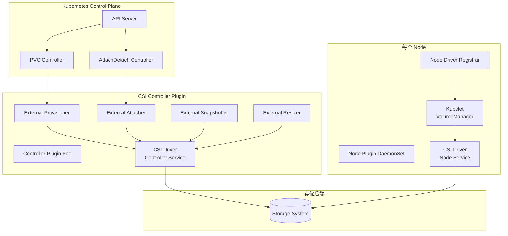

### 2.2 组件说明

| 组件 | 位置 | 职责 |
|------|------|------|
| **CSI Controller Plugin** | Deployment | 处理卷的创建、删除、附加、快照等控制面操作 |
| **CSI Node Plugin** | DaemonSet | 处理卷在节点上的挂载、卸载操作 |
| **External Provisioner** | Sidecar | 监听 PVC，调用 CreateVolume/DeleteVolume |
| **External Attacher** | Sidecar | 监听 VolumeAttachment，调用 ControllerPublishVolume |
| **External Snapshotter** | Sidecar | 处理快照相关操作 |
| **External Resizer** | Sidecar | 处理卷扩容操作 |
| **Node Driver Registrar** | Sidecar | 向 Kubelet 注册 CSI 驱动 |

---

## 3. CSI 三大服务接口

CSI 规范定义了三个核心 gRPC 服务：

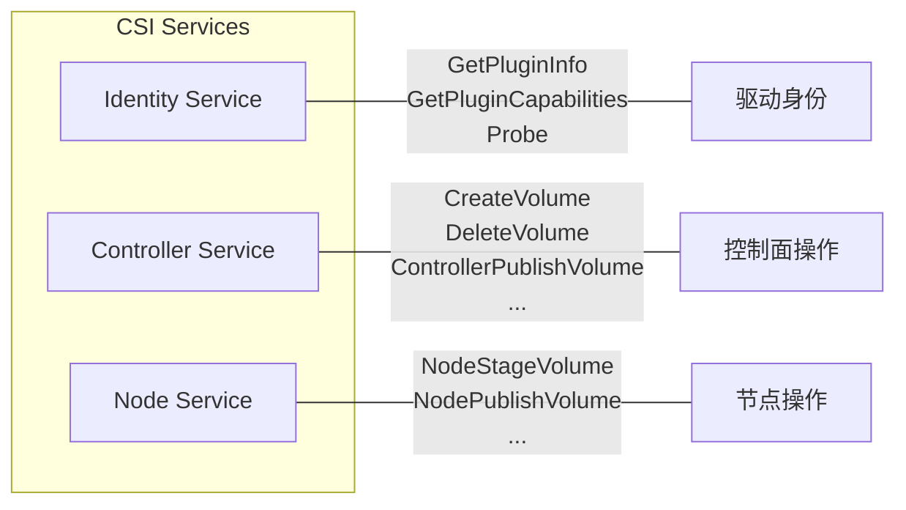

### 3.1 Identity Service

```protobuf
service Identity {
    // 返回驱动名称和版本
    rpc GetPluginInfo(GetPluginInfoRequest) returns (GetPluginInfoResponse) {}

    // 返回驱动支持的能力
    rpc GetPluginCapabilities(GetPluginCapabilitiesRequest) returns (GetPluginCapabilitiesResponse) {}

    // 健康检查
    rpc Probe(ProbeRequest) returns (ProbeResponse) {}
}
```

### 3.2 Controller Service

```protobuf
service Controller {
    // 创建卷
    rpc CreateVolume(CreateVolumeRequest) returns (CreateVolumeResponse) {}

    // 删除卷
    rpc DeleteVolume(DeleteVolumeRequest) returns (DeleteVolumeResponse) {}

    // 将卷附加到节点（控制面操作）
    rpc ControllerPublishVolume(ControllerPublishVolumeRequest) returns (ControllerPublishVolumeResponse) {}

    // 从节点分离卷
    rpc ControllerUnpublishVolume(ControllerUnpublishVolumeRequest) returns (ControllerUnpublishVolumeResponse) {}

    // 验证卷能力
    rpc ValidateVolumeCapabilities(ValidateVolumeCapabilitiesRequest) returns (ValidateVolumeCapabilitiesResponse) {}

    // 列出卷
    rpc ListVolumes(ListVolumesRequest) returns (ListVolumesResponse) {}

    // 获取存储容量
    rpc GetCapacity(GetCapacityRequest) returns (GetCapacityResponse) {}

    // 获取控制器能力
    rpc ControllerGetCapabilities(ControllerGetCapabilitiesRequest) returns (ControllerGetCapabilitiesResponse) {}

    // 创建快照
    rpc CreateSnapshot(CreateSnapshotRequest) returns (CreateSnapshotResponse) {}

    // 删除快照
    rpc DeleteSnapshot(DeleteSnapshotRequest) returns (DeleteSnapshotResponse) {}

    // 扩容卷
    rpc ControllerExpandVolume(ControllerExpandVolumeRequest) returns (ControllerExpandVolumeResponse) {}
}
```

### 3.3 Node Service

```protobuf
service Node {
    // 将卷挂载到全局目录（Stage）
    rpc NodeStageVolume(NodeStageVolumeRequest) returns (NodeStageVolumeResponse) {}

    // 从全局目录卸载卷
    rpc NodeUnstageVolume(NodeUnstageVolumeRequest) returns (NodeUnstageVolumeResponse) {}

    // 将卷挂载到 Pod 目录（Publish）
    rpc NodePublishVolume(NodePublishVolumeRequest) returns (NodePublishVolumeResponse) {}

    // 从 Pod 目录卸载卷
    rpc NodeUnpublishVolume(NodeUnpublishVolumeRequest) returns (NodeUnpublishVolumeResponse) {}

    // 获取卷统计信息
    rpc NodeGetVolumeStats(NodeGetVolumeStatsRequest) returns (NodeGetVolumeStatsResponse) {}

    // 节点上扩容卷
    rpc NodeExpandVolume(NodeExpandVolumeRequest) returns (NodeExpandVolumeResponse) {}

    // 获取节点能力
    rpc NodeGetCapabilities(NodeGetCapabilitiesRequest) returns (NodeGetCapabilitiesResponse) {}

    // 获取节点信息
    rpc NodeGetInfo(NodeGetInfoRequest) returns (NodeGetInfoResponse) {}
}
```

---

## 4. CSI 驱动开发

### 4.1 驱动架构

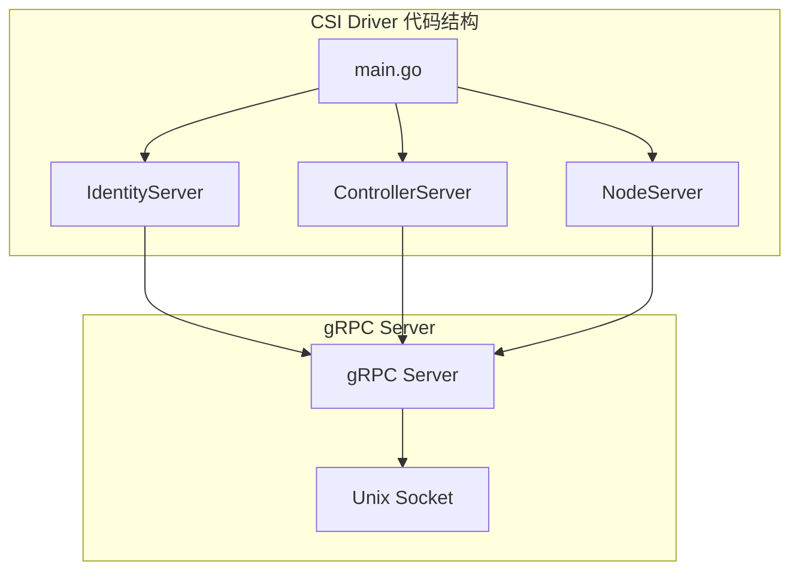

### 4.2 驱动示例代码

```go
// 驱动主入口
func main() {
    // 创建驱动实例
    driver := NewDriver(
        driverName,     // 如: "csi.example.com"
        nodeID,         // 节点标识
        endpoint,       // Unix socket 路径
    )

    // 启动 gRPC 服务
    driver.Run()
}

// Identity Server 实现
type IdentityServer struct {
    name    string
    version string
}

func (is *IdentityServer) GetPluginInfo(ctx context.Context, req *csi.GetPluginInfoRequest) (*csi.GetPluginInfoResponse, error) {
    return &csi.GetPluginInfoResponse{
        Name:          is.name,
        VendorVersion: is.version,
    }, nil
}

func (is *IdentityServer) GetPluginCapabilities(ctx context.Context, req *csi.GetPluginCapabilitiesRequest) (*csi.GetPluginCapabilitiesResponse, error) {
    return &csi.GetPluginCapabilitiesResponse{
        Capabilities: []*csi.PluginCapability{
            {
                Type: &csi.PluginCapability_Service_{
                    Service: &csi.PluginCapability_Service{
                        Type: csi.PluginCapability_Service_CONTROLLER_SERVICE,
                    },
                },
            },
        },
    }, nil
}

// Controller Server 实现
type ControllerServer struct {
    // 存储后端客户端
    client StorageClient
}

func (cs *ControllerServer) CreateVolume(ctx context.Context, req *csi.CreateVolumeRequest) (*csi.CreateVolumeResponse, error) {
    // 1. 验证请求参数
    if req.GetName() == "" {
        return nil, status.Error(codes.InvalidArgument, "Volume name required")
    }

    // 2. 调用存储后端创建卷
    vol, err := cs.client.CreateVolume(req.GetName(), req.GetCapacityRange().GetRequiredBytes())
    if err != nil {
        return nil, status.Error(codes.Internal, err.Error())
    }

    // 3. 返回卷信息
    return &csi.CreateVolumeResponse{
        Volume: &csi.Volume{
            VolumeId:      vol.ID,
            CapacityBytes: vol.Size,
            VolumeContext: map[string]string{
                "storage-pool": vol.Pool,
            },
        },
    }, nil
}

// Node Server 实现
type NodeServer struct {
    nodeID string
    mounter mount.Interface
}

func (ns *NodeServer) NodeStageVolume(ctx context.Context, req *csi.NodeStageVolumeRequest) (*csi.NodeStageVolumeResponse, error) {
    // 1. 获取设备路径
    devicePath := req.GetPublishContext()["devicePath"]
    stagingPath := req.GetStagingTargetPath()
    fsType := req.GetVolumeCapability().GetMount().GetFsType()

    // 2. 格式化设备（如果需要）
    if err := ns.formatDevice(devicePath, fsType); err != nil {
        return nil, err
    }

    // 3. 挂载到 staging 目录
    if err := ns.mounter.Mount(devicePath, stagingPath, fsType, nil); err != nil {
        return nil, err
    }

    return &csi.NodeStageVolumeResponse{}, nil
}

func (ns *NodeServer) NodePublishVolume(ctx context.Context, req *csi.NodePublishVolumeRequest) (*csi.NodePublishVolumeResponse, error) {
    stagingPath := req.GetStagingTargetPath()
    targetPath := req.GetTargetPath()

    // 使用 bind mount 将 staging 目录挂载到 Pod 目录
    mountOptions := []string{"bind"}
    if req.GetReadonly() {
        mountOptions = append(mountOptions, "ro")
    }

    if err := ns.mounter.Mount(stagingPath, targetPath, "", mountOptions); err != nil {
        return nil, err
    }

    return &csi.NodePublishVolumeResponse{}, nil
}
```

### 4.3 Sidecar 容器部署

```yaml
# CSI Controller Deployment
apiVersion: apps/v1
kind: Deployment
metadata:
  name: csi-controller
spec:
  replicas: 1
  template:
    spec:
      containers:
        # CSI 驱动容器
        - name: csi-driver
          image: example/csi-driver:v1.0
          args:
            - "--endpoint=unix:///csi/csi.sock"
            - "--nodeid=$(NODE_ID)"
          volumeMounts:
            - name: socket-dir
              mountPath: /csi

        # External Provisioner Sidecar
        - name: csi-provisioner
          image: registry.k8s.io/sig-storage/csi-provisioner:v5.0.1
          args:
            - "--csi-address=/csi/csi.sock"
            - "--feature-gates=Topology=true"
          volumeMounts:
            - name: socket-dir
              mountPath: /csi

        # External Attacher Sidecar
        - name: csi-attacher
          image: registry.k8s.io/sig-storage/csi-attacher:v4.6.1
          args:
            - "--csi-address=/csi/csi.sock"
          volumeMounts:
            - name: socket-dir
              mountPath: /csi

      volumes:
        - name: socket-dir
          emptyDir: {}

---
# CSI Node DaemonSet
apiVersion: apps/v1
kind: DaemonSet
metadata:
  name: csi-node
spec:
  template:
    spec:
      containers:
        # CSI 驱动容器
        - name: csi-driver
          image: example/csi-driver:v1.0
          args:
            - "--endpoint=unix:///csi/csi.sock"
            - "--nodeid=$(NODE_ID)"
          securityContext:
            privileged: true
          volumeMounts:
            - name: socket-dir
              mountPath: /csi
            - name: pods-mount-dir
              mountPath: /var/lib/kubelet/pods
              mountPropagation: Bidirectional
            - name: device-dir
              mountPath: /dev

        # Node Driver Registrar Sidecar
        - name: node-driver-registrar
          image: registry.k8s.io/sig-storage/csi-node-driver-registrar:v2.13.0
          args:
            - "--csi-address=/csi/csi.sock"
            - "--kubelet-registration-path=/var/lib/kubelet/plugins/csi.example.com/csi.sock"
          volumeMounts:
            - name: socket-dir
              mountPath: /csi
            - name: registration-dir
              mountPath: /registration

      volumes:
        - name: socket-dir
          hostPath:
            path: /var/lib/kubelet/plugins/csi.example.com
            type: DirectoryOrCreate
        - name: registration-dir
          hostPath:
            path: /var/lib/kubelet/plugins_registry
            type: Directory
        - name: pods-mount-dir
          hostPath:
            path: /var/lib/kubelet/pods
            type: Directory
        - name: device-dir
          hostPath:
            path: /dev
            type: Directory
```

---

## 5. Kubernetes CSI 集成

### 5.1 CSI 驱动注册流程

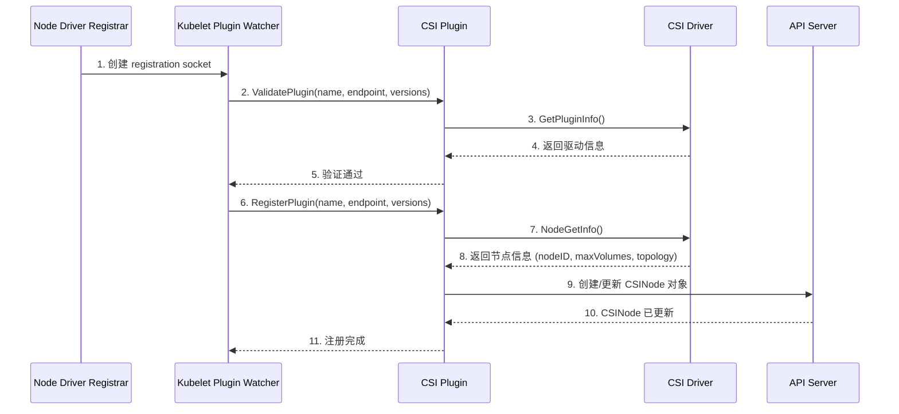

**关键代码路径 (`pkg/volume/csi/csi_plugin.go`):**

```go
// RegistrationHandler 处理 CSI 驱动注册
type RegistrationHandler struct {
    csiPlugin *csiPlugin
}

// RegisterPlugin 在驱动注册时调用
func (h *RegistrationHandler) RegisterPlugin(pluginName string, endpoint string, versions []string, pluginClientTimeout *time.Duration) error {
    // 1. 存储驱动信息
    csiDrivers.Set(pluginName, Driver{
        endpoint:                endpoint,
        highestSupportedVersion: highestSupportedVersion,
    })

    // 2. 获取节点信息
    csi, err := newCsiDriverClient(csiDriverName(pluginName))
    nodeID, maxVolumePerNode, accessibleTopology, err := csi.NodeGetInfo(ctx)

    // 3. 更新 CSINode 对象
    err = nim.InstallCSIDriver(pluginName, nodeID, maxVolumePerNode, accessibleTopology)

    return nil
}
```

### 5.2 核心控制器

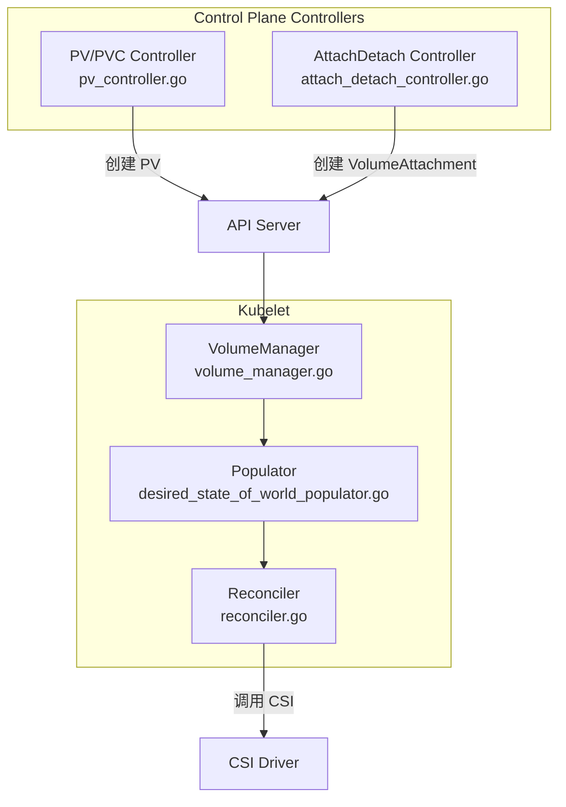

### 5.3 关键 CRD 资源

```yaml
# CSIDriver - 描述 CSI 驱动能力
apiVersion: storage.k8s.io/v1
kind: CSIDriver
metadata:
  name: csi.example.com
spec:
  attachRequired: true          # 是否需要 Attach 操作
  podInfoOnMount: true          # 是否传递 Pod 信息
  fsGroupPolicy: File           # FSGroup 策略
  volumeLifecycleModes:
    - Persistent                # 支持持久卷
    - Ephemeral                 # 支持临时卷
  tokenRequests:                # SA Token 请求
    - audience: "api"
  requiresRepublish: false      # 是否需要重新发布
  seLinuxMount: false           # SELinux 挂载支持

---
# CSINode - 描述节点上的 CSI 驱动
apiVersion: storage.k8s.io/v1
kind: CSINode
metadata:
  name: node-1
spec:
  drivers:
    - name: csi.example.com
      nodeID: node-1-id
      topologyKeys:
        - topology.kubernetes.io/zone
      allocatable:
        count: 100              # 最大卷数量

---
# VolumeAttachment - 表示卷附加状态
apiVersion: storage.k8s.io/v1
kind: VolumeAttachment
metadata:
  name: csi-xxx
spec:
  attacher: csi.example.com
  nodeName: node-1
  source:
    persistentVolumeName: pv-xxx
status:
  attached: true
  attachmentMetadata:
    devicePath: /dev/sdb
```

---

## 6. 完整挂载流程

### 6.1 端到端流程图

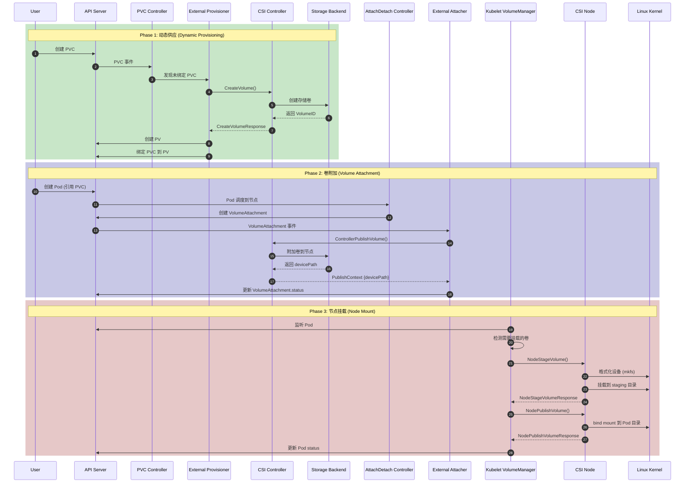

### 6.2 详细阶段解析

#### Phase 1: 动态供应

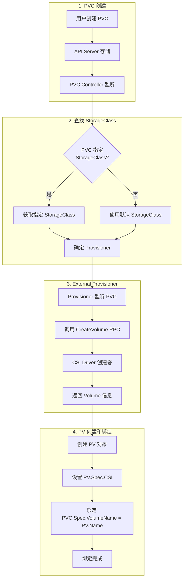

**关键代码 (`pkg/controller/volume/persistentvolume/pv_controller.go`):**

```go
func (ctrl *PersistentVolumeController) syncUnboundClaim(ctx context.Context, claim *v1.PersistentVolumeClaim) error {
    // 1. 查找匹配的 PV
    volume, err := ctrl.volumes.findBestMatchForClaim(claim, delayBinding)

    if volume == nil {
        // 2. 没有匹配的 PV，检查是否可以动态供应
        if ctrl.shouldProvision(claim) {
            // External Provisioner 会处理
            return nil
        }
    }

    // 3. 绑定 PV 和 PVC
    return ctrl.bind(ctx, volume, claim)
}
```

#### Phase 2: 卷附加

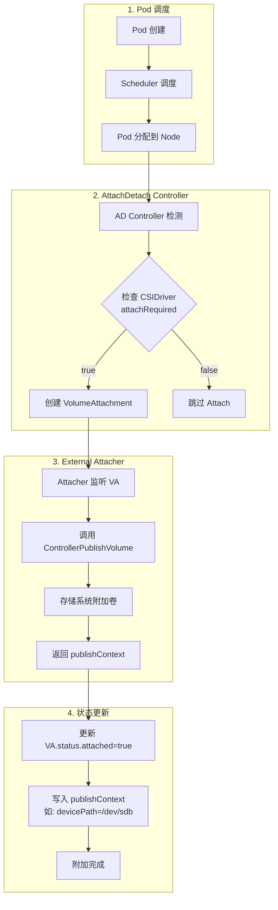

**关键代码 (`pkg/volume/csi/csi_attacher.go`):**

```go
func (c *csiAttacher) Attach(spec *volume.Spec, nodeName types.NodeName) (string, error) {
    // 1. 创建 VolumeAttachment 对象
    attachment := &storage.VolumeAttachment{
        ObjectMeta: metav1.ObjectMeta{
            Name: attachID,
        },
        Spec: storage.VolumeAttachmentSpec{
            Attacher: pvSrc.Driver,
            NodeName: string(nodeName),
            Source: storage.VolumeAttachmentSource{
                PersistentVolumeName: &pvName,
            },
        },
    }

    _, err := c.k8s.StorageV1().VolumeAttachments().Create(ctx, attachment, metav1.CreateOptions{})

    // 2. 等待 VolumeAttachment 完成
    return c.waitForVolumeAttachment(ctx, attachID, timeout)
}
```

#### Phase 3: 节点挂载

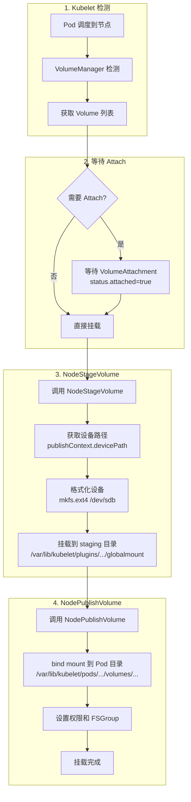

**关键代码 (`pkg/volume/csi/csi_mounter.go`):**

```go
func (c *csiMountMgr) SetUpAt(dir string, mounterArgs volume.MounterArgs) error {
    // 1. 获取 publishContext（包含设备路径）
    publishContext, err := c.getPublishContext()

    // 2. 调用 NodeStageVolume（如果支持）
    if stageUnstageSet {
        err = csi.NodeStageVolume(ctx,
            c.volumeID,
            publishContext,
            stagingTargetPath,
            fsType,
            accessMode,
            nodeStageSecrets,
            volumeContext,
            mountOptions,
            fsGroup,
        )
    }

    // 3. 调用 NodePublishVolume
    err = csi.NodePublishVolume(ctx,
        c.volumeID,
        c.readOnly,
        stagingTargetPath,
        dir,                    // Pod 挂载目录
        accessMode,
        publishContext,
        volumeContext,
        nodePublishSecrets,
        fsType,
        mountOptions,
        fsGroup,
    )

    return nil
}
```

### 6.3 挂载路径说明

```
/var/lib/kubelet/
├── plugins/
│   └── kubernetes.io~csi/
│       └── <driver-name>/
│           └── <volume-hash>/
│               └── globalmount/          # NodeStageVolume 目标
│                   └── <mounted-fs>      # 格式化后的文件系统
│
├── pods/
│   └── <pod-uid>/
│       └── volumes/
│           └── kubernetes.io~csi/
│               └── <volume-name>/
│                   └── mount/            # NodePublishVolume 目标
│                       └── <bind-mount>  # bind mount 到 globalmount
│
└── plugins_registry/                     # CSI 驱动注册目录
    └── <driver-name>-reg.sock           # 注册 socket
```

---

## 7. Linux 存储栈

### 7.1 存储层次架构

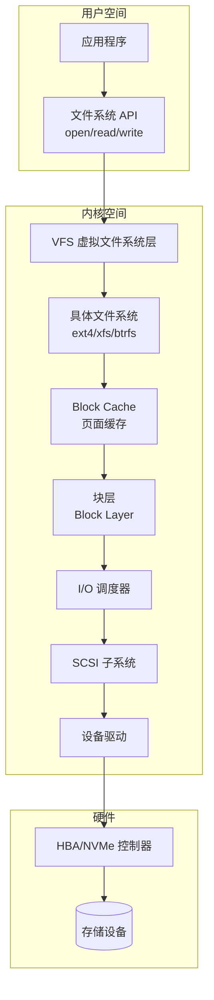

### 7.2 CSI 到 Linux 挂载流程

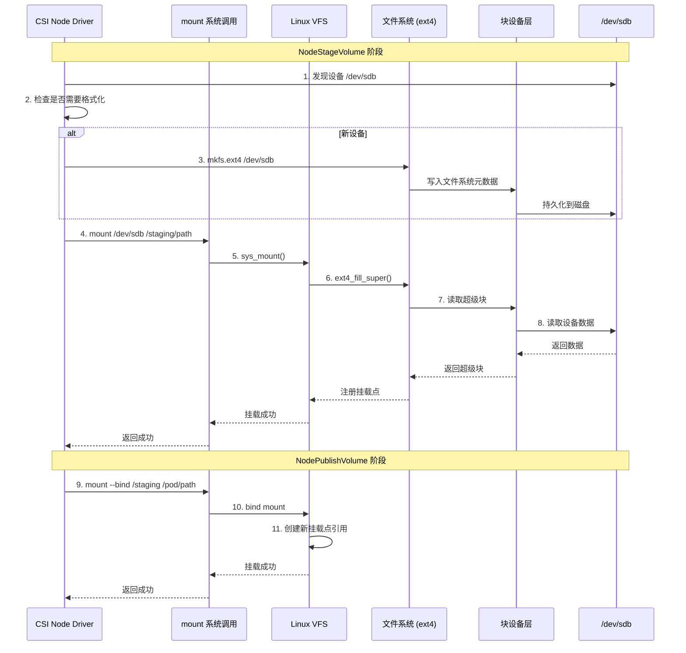

### 7.3 关键 Linux 命令

```bash
# 1. 查看块设备
lsblk
# NAME   MAJ:MIN RM   SIZE RO TYPE MOUNTPOINT
# sda      8:0    0   100G  0 disk
# └─sda1   8:1    0   100G  0 part /
# sdb      8:16   0    50G  0 disk /var/lib/kubelet/plugins/...

# 2. 格式化设备
mkfs.ext4 /dev/sdb

# 3. 挂载设备
mount /dev/sdb /var/lib/kubelet/plugins/kubernetes.io~csi/driver/vol-xxx/globalmount

# 4. Bind Mount
mount --bind /source /target

# 5. 查看挂载点
findmnt /var/lib/kubelet/pods/xxx/volumes/kubernetes.io~csi/pvc-xxx/mount
# TARGET                                                    SOURCE     FSTYPE OPTIONS
# /var/lib/kubelet/pods/.../mount                          /dev/sdb   ext4   rw,relatime

# 6. 查看挂载传播
cat /proc/self/mountinfo | grep kubelet
# 可以看到 shared, slave, private 等传播类型
```

### 7.4 挂载传播 (Mount Propagation)

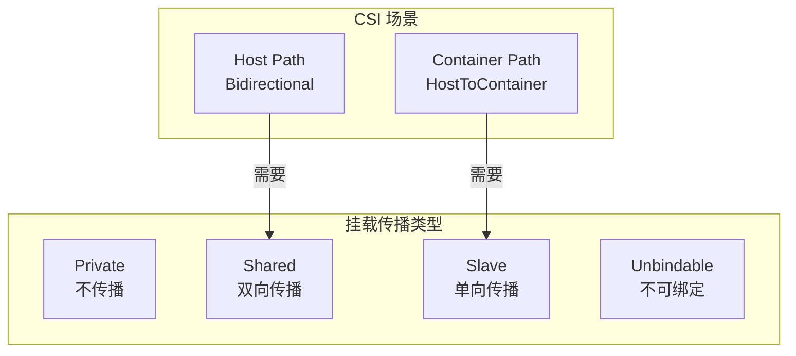

CSI Node 容器需要 `Bidirectional` 挂载传播，以便在容器内创建的挂载点对 Host 可见：

```yaml
volumeMounts:
  - name: pods-mount-dir
    mountPath: /var/lib/kubelet/pods
    mountPropagation: Bidirectional  # 关键配置
```

---

## 8. 关键代码路径

### 8.1 代码文件索引

| 模块 | 文件路径 | 功能 |
|------|----------|------|
| **CSI 插件** | `pkg/volume/csi/csi_plugin.go` | CSI 插件主入口，驱动注册 |
| | `pkg/volume/csi/csi_attacher.go` | 卷附加/分离逻辑 |
| | `pkg/volume/csi/csi_mounter.go` | 卷挂载/卸载逻辑 |
| | `pkg/volume/csi/csi_client.go` | CSI gRPC 客户端 |
| | `pkg/volume/csi/csi_drivers_store.go` | 驱动注册表 |
| **控制器** | `pkg/controller/volume/persistentvolume/pv_controller.go` | PV/PVC 控制器 |
| | `pkg/controller/volume/attachdetach/attach_detach_controller.go` | AttachDetach 控制器 |
| | `pkg/controller/volume/attachdetach/reconciler/reconciler.go` | 协调器 |
| **Kubelet** | `pkg/kubelet/volumemanager/volume_manager.go` | Kubelet 卷管理器 |
| | `pkg/kubelet/volumemanager/reconciler/reconciler.go` | Kubelet 协调器 |
| | `pkg/kubelet/volumemanager/populator/desired_state_of_world_populator.go` | 期望状态填充器 |
| **操作执行** | `pkg/volume/util/operationexecutor/operation_executor.go` | 操作执行器 |
| | `pkg/volume/util/operationexecutor/operation_generator.go` | 操作生成器 |
| **CSI Spec** | `vendor/github.com/container-storage-interface/spec/lib/go/csi/csi.pb.go` | CSI 协议定义 |

### 8.2 关键函数调用链

```
Pod 创建 → Kubelet
    │
    ▼
VolumeManager.Run()
    │
    ▼
Populator.Run() ──────────────────────► DesiredStateOfWorld.AddPodToVolume()
    │
    ▼
Reconciler.reconcile()
    │
    ├─► unmountVolumes()
    │
    ├─► mountOrAttachVolumes()
    │       │
    │       ▼
    │   waitForVolumeAttach() ────────► 等待 VolumeAttachment.status.attached=true
    │       │
    │       ▼
    │   OperationExecutor.MountVolume()
    │       │
    │       ▼
    │   OperationGenerator.GenerateMountVolumeFunc()
    │       │
    │       ├─► csiAttacher.MountDevice() ──► csiClient.NodeStageVolume()
    │       │
    │       └─► csiMountMgr.SetUpAt() ──────► csiClient.NodePublishVolume()
    │
    └─► unmountDetachDevices()
```

### 8.3 核心数据结构

```go
// CSI 客户端接口 (csi_client.go)
type csiClient interface {
    NodeGetInfo(ctx context.Context) (nodeID string, maxVolumePerNode int64, accessibleTopology map[string]string, err error)
    NodePublishVolume(ctx context.Context, volumeid string, readOnly bool, stagingTargetPath string, targetPath string, accessMode api.PersistentVolumeAccessMode, publishContext map[string]string, volumeContext map[string]string, secrets map[string]string, fsType string, mountOptions []string, fsGroup *int64) error
    NodeUnpublishVolume(ctx context.Context, volID string, targetPath string) error
    NodeStageVolume(ctx context.Context, volID string, publishVolumeInfo map[string]string, stagingTargetPath string, fsType string, accessMode api.PersistentVolumeAccessMode, secrets map[string]string, volumeContext map[string]string, mountOptions []string, fsGroup *int64) error
    NodeUnstageVolume(ctx context.Context, volID, stagingTargetPath string) error
    NodeSupportsStageUnstage(ctx context.Context) (bool, error)
    // ... 更多方法
}

// Volume Mounter (csi_mounter.go)
type csiMountMgr struct {
    csiClientGetter
    k8s                 kubernetes.Interface
    plugin              *csiPlugin
    driverName          csiDriverName
    volumeLifecycleMode storage.VolumeLifecycleMode
    volumeID            string
    specVolumeID        string
    readOnly            bool
    spec                *volume.Spec
    pod                 *api.Pod
    podUID              types.UID
    publishContext      map[string]string
    kubeVolHost         volume.KubeletVolumeHost
}

// Volume Attacher (csi_attacher.go)
type csiAttacher struct {
    plugin       *csiPlugin
    k8s          kubernetes.Interface
    watchTimeout time.Duration
    csiClient    csiClient
}
```

---

## 总结

CSI 通过标准化的 gRPC 接口，将存储系统与 Kubernetes 解耦。完整的挂载流程包括：

1. **动态供应**: PVC Controller + External Provisioner → CreateVolume
2. **卷附加**: AttachDetach Controller + External Attacher → ControllerPublishVolume
3. **节点挂载**: Kubelet VolumeManager → NodeStageVolume + NodePublishVolume
4. **Linux 挂载**: mkfs + mount + bind mount

理解这个流程对于开发 CSI 驱动、排查存储问题都至关重要。

---

## 参考资料

- [CSI Spec](https://github.com/container-storage-interface/spec)
- [Kubernetes CSI Developer Documentation](https://kubernetes-csi.github.io/docs/)
- [Kubernetes Source Code](https://github.com/kubernetes/kubernetes)
