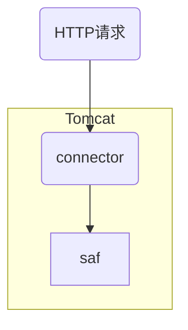

# HTTP请求过程

## 流程介绍

&emsp;Springboot启动时从Application文件开始的，启动时会启动内嵌的Tomcat容器，Tomcat容器开始监听指定的端口，并扫描指定范围的并且扫描给定范围内的configurations，beans，components，services，注册到 `applicationContext` 上下文中，默认是单例模式生成这些实例，并且解析 `静态配置文件的内容` 当作常量， 也一并加载到服务中。

&emsp;SpringMVC处理请求的核心类是：DispatcherServlet，所有的 Web 请求都需要通过它来处理，进行转发，匹配，数据处理后，并转由页面进行展现，它是 SpringMVC 最核心的部分。Tomcat会将所有的请求都交给 DispatcherServlet 的 doService 方法处理。

## Tomcat的处理流程

